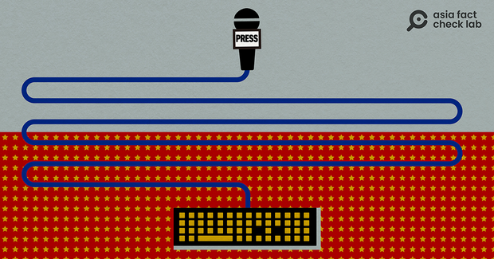
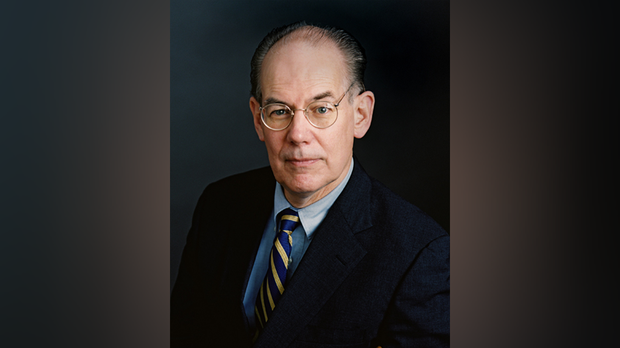
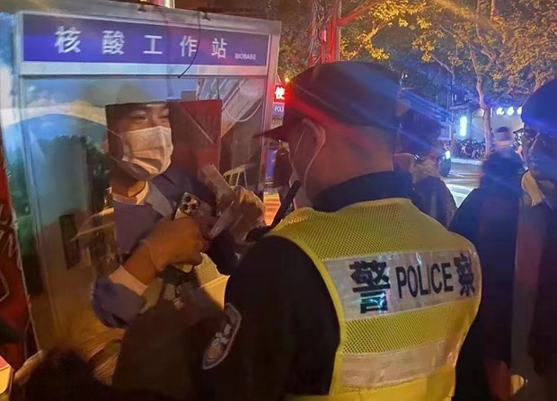
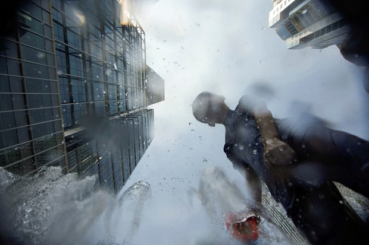
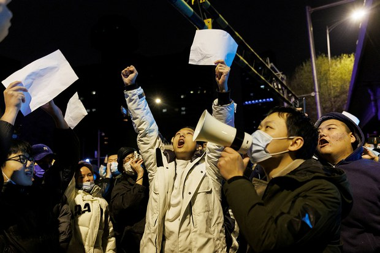
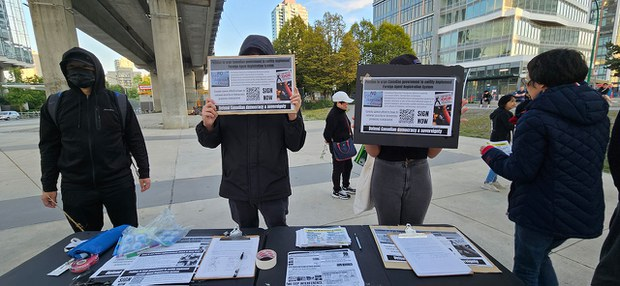
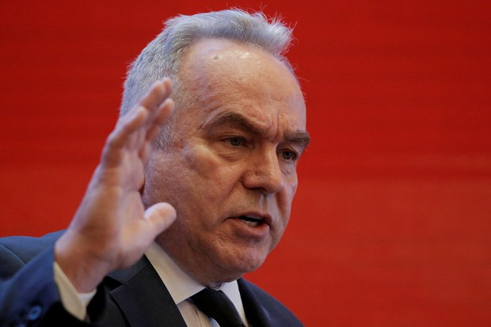
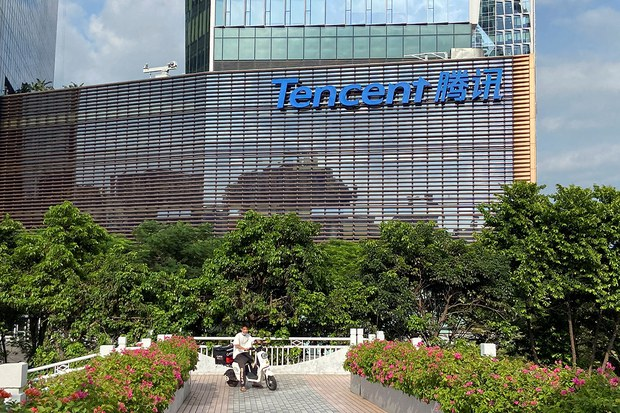
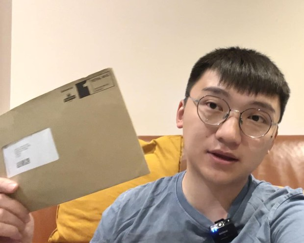
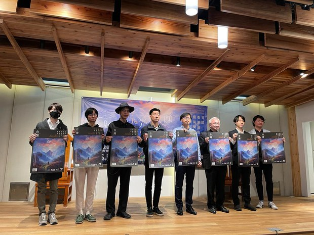

自由亚洲电台 北京时间 2023-12-08T06:22:36Z 1732888363907309619 ＃事实查核 @asiafactcheckcn| 媒体观察：“＃中国制造”的 ＃韩国假新闻网站
https://t.co/wH2dABjDkB https://t.co/eAG86tWGux   自由亚洲电台 北京时间 2023-12-08T06:37:38Z 1732892146976612428 评论 | 何清涟 @HeQinglian：中国为何对“＃中国威胁论”的提倡者敞开大门？
https://t.co/9SpLyaBmEU https://t.co/1cjWRv0zvW   自由亚洲电台 北京时间 2023-12-08T08:30:01Z 1732920432255537305 评论 | ＃余杰：＃上海万圣节 — 你的鬼蜮，我的人间
https://t.co/LNa19c5ZNo https://t.co/Qbbh3A8Pdo   自由亚洲电台 北京时间 2023-12-08T05:17:22Z 1732871948815020489 专栏 | ＃军事无禁区: ＃福建号 航母明后年服役－中国走向蓝水海军？
https://t.co/d5ClWd7YCZ https://t.co/6BWKaeGSFe   自由亚洲电台 北京时间 2023-12-08T05:39:25Z 1732877496478269724 专栏 | ＃绿色情报员：夺命气候（上）沸腾亚洲成了掘墓者
https://t.co/y8mk9glkNd https://t.co/agBd5LWxEb   自由亚洲电台 北京时间 2023-12-08T06:14:24Z 1732886303681941877 今年的12月7日，是中国官方实际放弃“#动态清零”政策一周年的日子。当局此前的三年封控措施，彻底改变了社会及民众的生活。而目前，新一波呼吸道传染疾病又正在中国爆发，多地儿童医院爆满，#新冠检测 重启、健康码复活。中国人的“#清零”梦魇真的结束了吗？

https://t.co/L552D6OnUF https://t.co/Wnvslxfkbq   自由亚洲电台 北京时间 2023-12-08T02:40:17Z 1732832416434430280 流亡加拿大的 ＃周庭 对媒体表示，即使在加拿大，她仍担心海外的 ＃中国秘密警察。有加拿大的港人说，周庭反映了多数参加过社会运动的海外港人心声，因为中国渗透太厉害，让许多人仍活在恐惧中。专家表示，这些“新港人”可能还未拿到加拿大身份，所以最容易成为受害者。

https://t.co/NXmsAJs8D6 https://t.co/l9lcSrnyN6   自由亚洲电台 北京时间 2023-12-08T04:06:07Z 1732854018790318483 12月7日，经美国总统拜登提名为副国务卿的白宫国安会印太事务协调员坎贝尔在国会接受提名听证。#坎贝尔 警告说，“有些国家”正在测试美国在印太地区的能力。

https://t.co/bxS4yc3GmP https://t.co/kpoH3mAPqw   自由亚洲电台 北京时间 2023-12-08T00:48:24Z 1732804259958431834 国际信用评级机构穆迪近日下调了中国、香港和澳门的主权信用评级后，又于日前下调了18家中资银行和企业的信用评级，包括中国的工、农、中、建四大银行，另外还有中国国家开发银行、中国农业发展银行、中国进出口银行和中国邮政储蓄银行。它们的评级被下调为负面。 https://t.co/qCAFbAxclS   自由亚洲电台 北京时间 2023-12-08T01:43:53Z 1732818224327352680 英国虽为港人开通了 ＃英国国民海外护照（ ＃BNO）签证计划，但仍有不少香港青年不符申请条件，而要在英国寻求 ＃政治庇护，部分人经历漫长审批程序后仍被拒绝，面临被递解出境。一批在英港人成立新项目，希望协助这些年轻人上诉，并期望英国当局能检视审批政策。

https://t.co/QET4hSqIY9 https://t.co/XQMZOOdM55   自由亚洲电台 北京时间 2023-12-08T00:06:02Z 1732793599224623428 香港民主女神团队和日本香港民主连盟，举办首届以香港抗争精神为主题的“＃香港自由艺术奖” ，并选择在台北作为首站的主办点。主办方希望，在香港人已经无法发声的情况下，离散港人能透过艺术创作，展示香港精神，连结台港日团结对抗中共极权。

https://t.co/Xm8AMmxMqi https://t.co/hCIBfqtbSo   