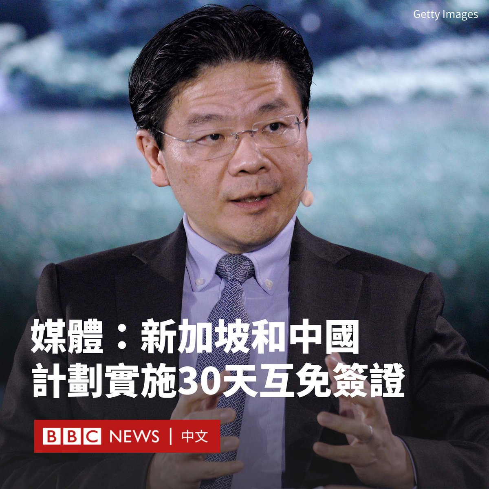
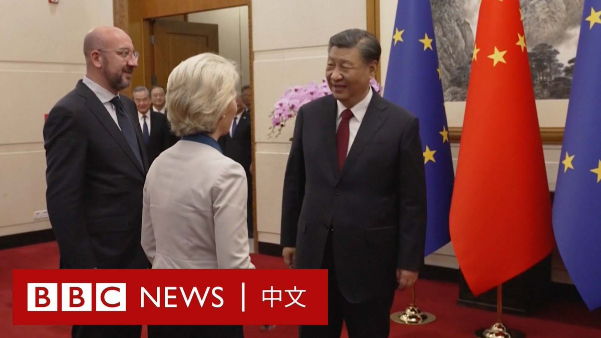

D英国广播公司BBC 北京时间 2023-12-07T19:46:06Z 1732728185039569250 意大利政府证实将退出中国的旗舰项目“一带一路 ”倡议，该国是唯一一个在2019年签署该倡议的七国集团（G7）国家。https://t.co/4kdO9W41JY   D英国广播公司BBC 北京时间 2023-12-07T14:28:15Z 1732648197468897699 据多家新加坡媒体报道，新加坡和中国计划推行30天互免签证安排，加强两国人员往来。

新加坡主要媒体《联合早报》、《海峡时报》（The Straits Times）和亚洲新闻台（CNA）引述正在访华的新加坡副总理兼财政部长黄循财报道了该消息。

新加坡和中国周四（12月7日）在天津召开“双边合作机制会议”。黄循财与中共中央政治局常委、国务院副总理丁薛祥会晤。

据报导，黄循财表示，在新加坡和中国航班不断增加的基础上，双方将通过30天互免签证安排，加强两国人员往来。

这意味着两国公民无需签证即可访问对方最多30天。目前，中国普通护照持有者必须申请签证才能进入新加坡，而新加坡人可以免签前往中国长达15天。

中国和新加坡政府尚未公开确认相互免签政策的细节，包括何时生效以及如何实施。

上个月，中国宣布对法国、德国、 意大利、荷兰、西班牙以及马来西亚试行免签，这是疫情后北京为提振旅游和国际贸易的最新举措。目前，大多数国家旅客仍需要签证才能进入中国。

马来西亚也在近期宣布，将给予中国和印度公民30天免签证入境。   D英国广播公司BBC 北京时间 2023-12-07T15:27:59Z 1732663226566148566 【现场画面】中国国家主席习近平在北京与欧洲理事会主席米歇尔（Charles Michel）、欧盟委员会主席冯德莱恩（Ursula von der Leyen）举行会晤。

这是欧盟与中国领导人四年来的首次面对面峰会。此次峰会是在北京和布鲁塞尔之间的地缘政治和经济紧张局势不断升级的背景下举行的。双方的贸易争端和俄乌战争成为重点议题。

“我们团结一致，致力于与中国建立稳定互利的关系，我们希望这种承诺和关系建立在透明、可预测和互惠的原则基础之上。”米歇尔对习近平说。

习近平则表示，双方要“不断增强政治互信、凝聚战略共识，夯实利益纽带，排除各种干扰”。   D英国广播公司BBC 北京时间 2023-12-07T13:33:30Z 1732634417401872784 曾担任美国驻玻利维亚大使的前外交官维克托·曼努埃尔·罗查（Victor Manuel Rocha）被控为古巴政府效力40多年。

现年73岁的罗查被指控自1981年以来，一直帮助古巴收集针对美国的情报。法庭文件显示，他称美国为“敌人”，并声称他的特工工作“巩固了革命”。

美国司法部称，经过一年多的卧底行动，罗查于上周五（12月1日）在迈阿密被捕。

美国司法部长梅里克·加兰（Merrick Garland）表示，此案是外国特工对美国政府进行的“影响最大、持续时间最长的渗透之一”。

“40多年来，维克托·曼努埃尔·罗查一直是古巴政府的特工，并在美国政府内寻找和获得职位，使他能够接触到非公开信息，并有能力影响美国的外交政策。”他说道。

罗查出生于哥伦比亚，在纽约长大，拥有耶鲁大学、哈佛大学和乔治城大学的学位。

据检察官称，他在1999年至2002年担任美国驻玻利维亚大使，并在包括国家安全委员会在内的多个政府部门任职长达25年。除玻利维亚外，他还赴阿根廷、洪都拉斯、墨西哥和多米尼加共和国任职。

周一公布的法庭文件称，从1981年至今，罗查曾多次前往古巴。这些文件没有公开关于罗查所涉嫌传递信息的细节。

起诉书称，2022年11月，一名联邦调查局（FBI）卧底特工通过WhatsApp联系了罗查，声称自己是古巴情报部门的代表。罗查据称同意与这名特工会面几次。他后来透露了其为古巴政府担任特工的经历。   D英国广播公司BBC 北京时间 2023-12-07T12:14:34Z 1732614552259330276 在塔玛拉12岁时，她被家人以9美元的价格卖给一名男人成婚。

据估计，全世界有五分之一的女孩在18岁之前结婚。即使是有禁止童婚法律的国家，这些法律有时也无法执行。在非洲南部的马拉维，童婚的情况根深蒂固。 https://t.co/qI2vSR742t   D英国广播公司BBC 北京时间 2023-12-07T09:43:40Z 1732576578444668928 在中国东北部的盘锦市，当地一条被冰雪覆盖的河流出现了少见的一幕，河面出现了类似人眼的图案。

这处“大地之眼”位于绕阳河，当地媒体报道说，它可能是在结冻时形成。 https://t.co/qrq9QXWlCx   