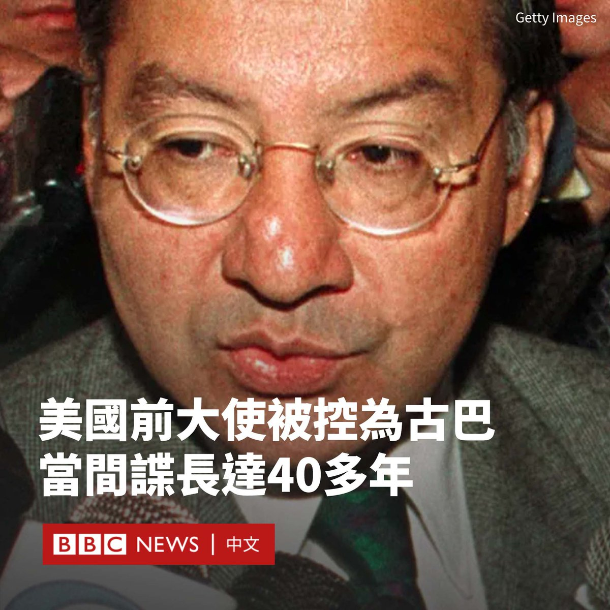
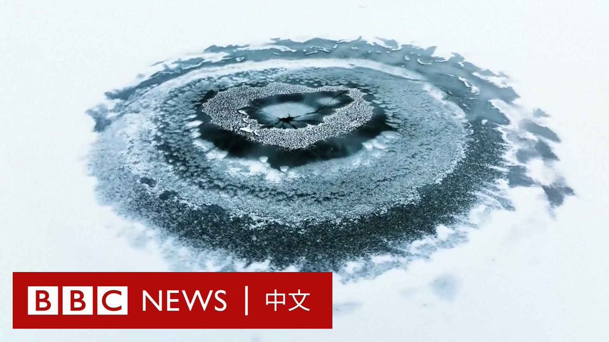

D英国广播公司BBC 北京时间 2023-12-07T13:33:30Z 1732634417401872784 曾担任美国驻玻利维亚大使的前外交官维克托·曼努埃尔·罗查（Victor Manuel Rocha）被控为古巴政府效力40多年。

现年73岁的罗查被指控自1981年以来，一直帮助古巴收集针对美国的情报。法庭文件显示，他称美国为“敌人”，并声称他的特工工作“巩固了革命”。

美国司法部称，经过一年多的卧底行动，罗查于上周五（12月1日）在迈阿密被捕。

美国司法部长梅里克·加兰（Merrick Garland）表示，此案是外国特工对美国政府进行的“影响最大、持续时间最长的渗透之一”。

“40多年来，维克托·曼努埃尔·罗查一直是古巴政府的特工，并在美国政府内寻找和获得职位，使他能够接触到非公开信息，并有能力影响美国的外交政策。”他说道。

罗查出生于哥伦比亚，在纽约长大，拥有耶鲁大学、哈佛大学和乔治城大学的学位。

据检察官称，他在1999年至2002年担任美国驻玻利维亚大使，并在包括国家安全委员会在内的多个政府部门任职长达25年。除玻利维亚外，他还赴阿根廷、洪都拉斯、墨西哥和多米尼加共和国任职。

周一公布的法庭文件称，从1981年至今，罗查曾多次前往古巴。这些文件没有公开关于罗查所涉嫌传递信息的细节。

起诉书称，2022年11月，一名联邦调查局（FBI）卧底特工通过WhatsApp联系了罗查，声称自己是古巴情报部门的代表。罗查据称同意与这名特工会面几次。他后来透露了其为古巴政府担任特工的经历。   D英国广播公司BBC 北京时间 2023-12-07T12:14:34Z 1732614552259330276 在塔玛拉12岁时，她被家人以9美元的价格卖给一名男人成婚。

据估计，全世界有五分之一的女孩在18岁之前结婚。即使是有禁止童婚法律的国家，这些法律有时也无法执行。在非洲南部的马拉维，童婚的情况根深蒂固。 https://t.co/qI2vSR742t   D英国广播公司BBC 北京时间 2023-12-07T09:43:40Z 1732576578444668928 在中国东北部的盘锦市，当地一条被冰雪覆盖的河流出现了少见的一幕，河面出现了类似人眼的图案。

这处“大地之眼”位于绕阳河，当地媒体报道说，它可能是在结冻时形成。 https://t.co/qrq9QXWlCx   