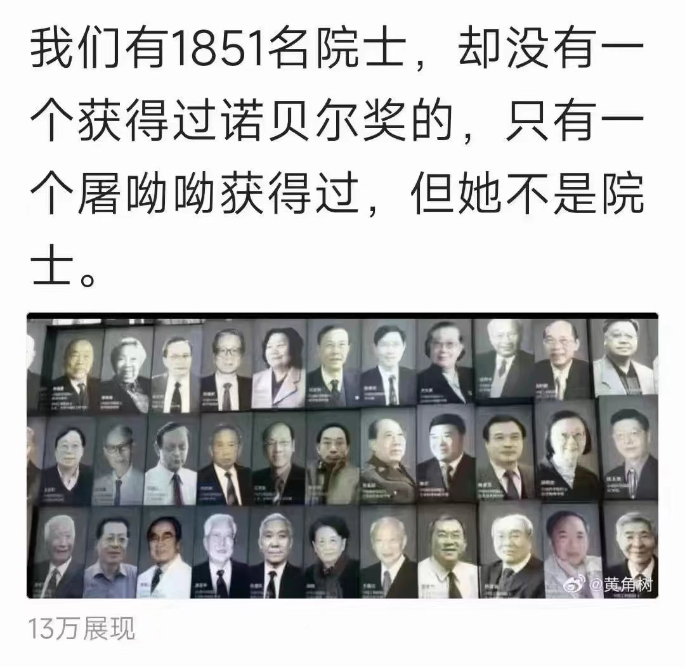
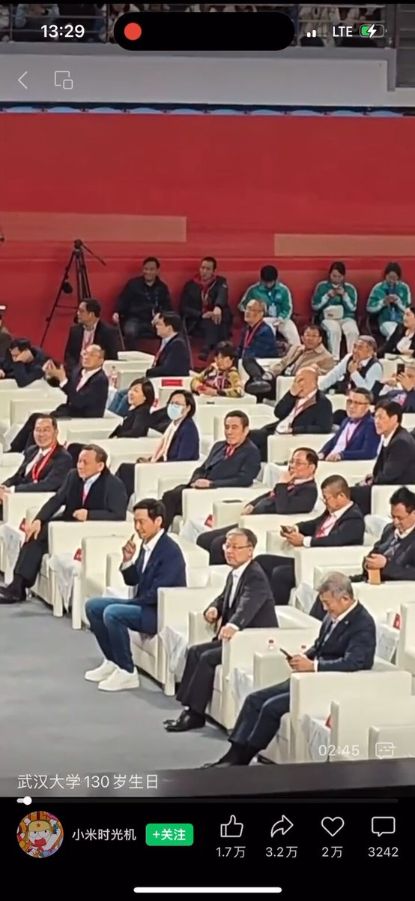
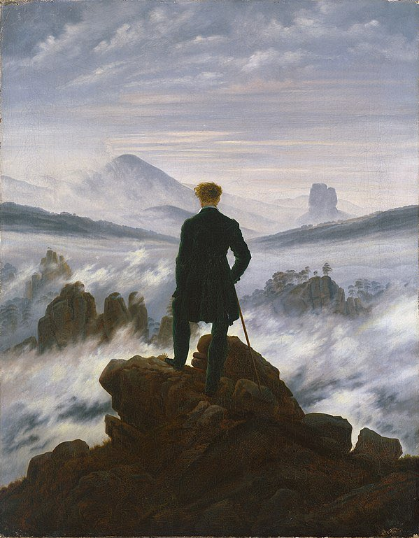
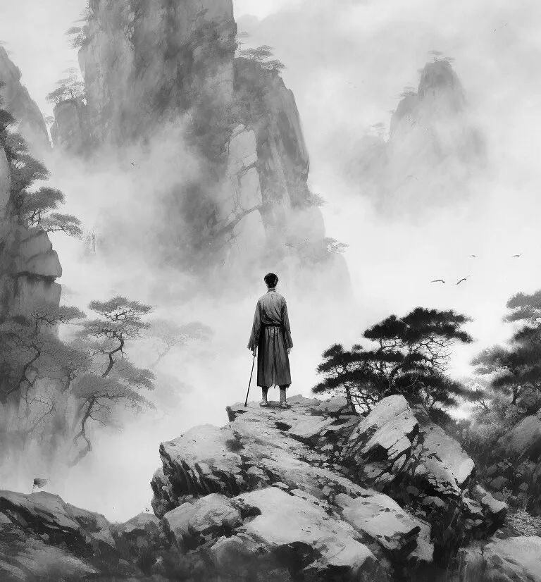
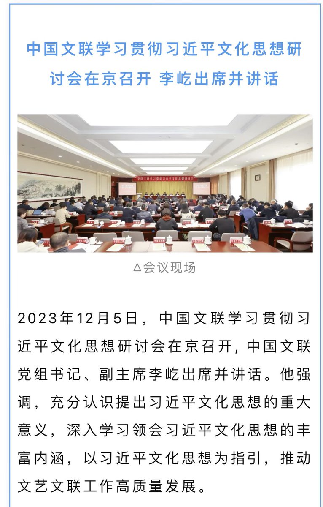
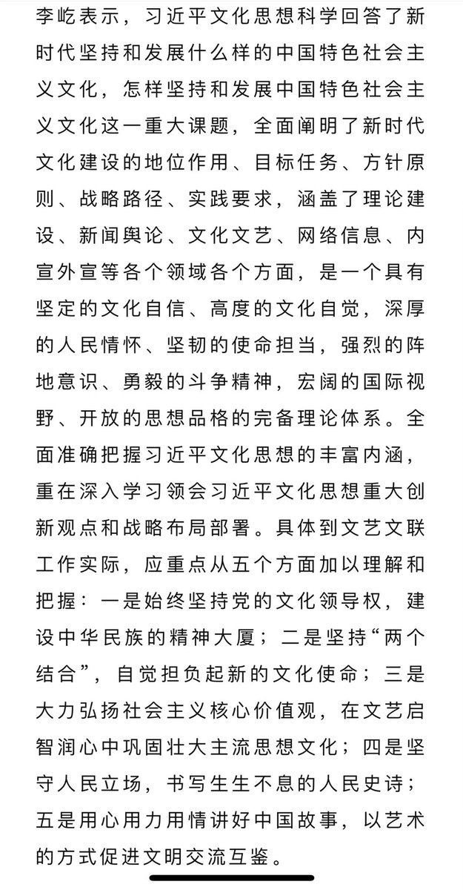
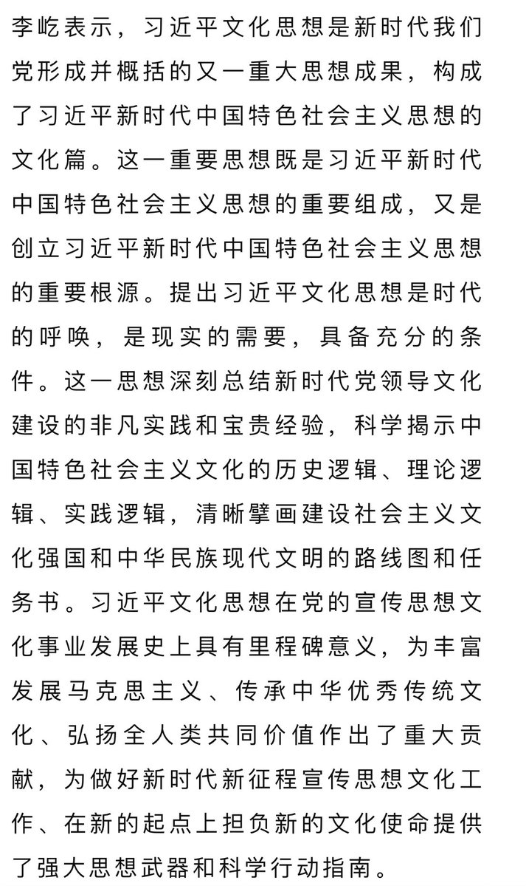
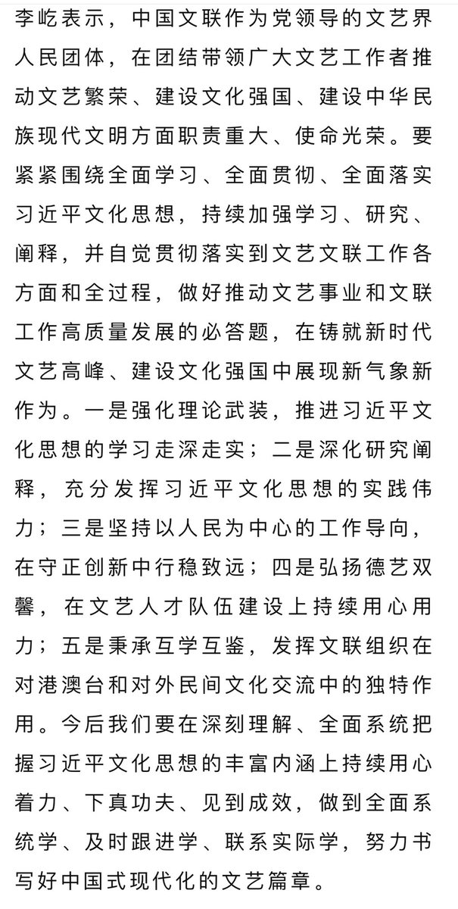

Petrichor 北京时间 2023-12-07T23:29:31Z 1732784411337208102 中国科教界有这么一帮人，他们几乎个个牛逼哄哄，装着做科研的样子。没有做院士时，个个作孙子样，对院士和官员吹牛拍马，点头哈腰。一旦做了院士，立马呈大爷状，拉山头，分经费，无所不懂，处处指点江山。哪里有利去哪，哪个大学给房子大、工资高，去哪。谁在捧这帮院士们？还不是哪些想做院士的校长、院长、所长和教授们，他们的主要精力用于搞关系，搞经费，让手下博士生和博士后给他们出数据写论文，数据即使作假了，他们也不知道。这样的国家不可能有真正的创新的，还不如废除院士制度好，为百姓省钱了。   Petrichor 北京时间 2023-12-07T23:39:16Z 1732786863155401095 “雷军一人PK比尔·盖茨、史蒂夫·乔布斯和埃隆·马斯克”。

武汉大学的人真能吹？

雷军有什么科技原创？山寨王而已。若论科技创新能力，雷军给上述三人提鞋都不配。 https://t.co/5RTq32ihUq   Petrichor 北京时间 2023-12-07T23:59:21Z 1732791917270716795 这两幅画，您更喜欢哪一幅？请给出原因。第一幅出自德国画家Caspar David Friedrich （创作于1818年），第二幅作者应该是中国人，具体是谁，我不知道，请知道的人提供信息。 https://t.co/Dd3YY62cj0   Petrichor 北京时间 2023-12-07T06:23:26Z 1732526188533342692 这样的文联的作家能创作出客观反映人民的需要、社会事实的文学或文艺作品？

他们的作品只会成为拍马溜须、经不起历史检验的垃圾。

一个集权国家里，不允许人民有独立思想，没有言论自由和出版自由，独裁者只需要歌功颂德的马屁文章，让他们生活在“被歌颂”的“伟光正”的虚幻中。 https://t.co/Vyi7LKDldf   Petrichor 北京时间 2023-12-07T02:45:56Z 1732471451549069335 “雷军一人PK比尔·盖茨、史蒂夫·乔布斯和埃隆·马斯克”。

武汉大学的人真能吹？

雷军有什么科技原创？山寨王而已。若论科技创新能力，雷军给上述三人提鞋都不配。   Petrichor 北京时间 2023-12-07T02:46:52Z 1732471684542734448 自从某人当权以来，中国大小战狼们把吹牛皮当成了爱国，谁谦虚低调谁批评一些中国不足就会被认为是不爱国甚至被骂成卖国贼，还有的人因为几句理性的言论而失去工作、被国安“请喝茶”、甚至遭非法拘禁。结果吹得地球人都知道“中国厉害了”，欧美人因为怕遭“肆意拘禁”，而不敢去中国经商、旅游和访学。人无远虑，必有近忧。要知道吹牛皮也是要上税的，今天中国被32国取消最惠国待遇，其实就是在上税，只不过上的是智商税。

中国被取消最惠国待遇，无形中要多交很多税，香港又被取消外交豁免权，这样一来可以说中国对外的大门完全被堵死了，往后中国的日子就更不好过了，国家的日子都不好过了，老百姓的日子能好过吗？最直接的影响就是各种罚款，各种涨价。现在年轻人，躺平，做“最后一代”。独裁者为了自己的权力的自私，对民族、国家、百姓伤害极大。可谓，庆父不死，鲁难未。   