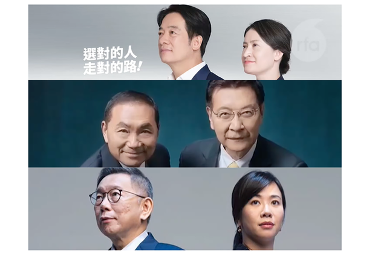
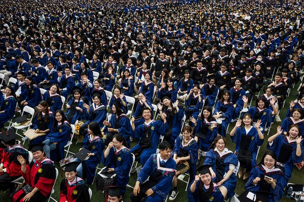

自由亚洲电台 北京时间 2023-12-07T00:50:01Z 1732442278537413006 【看看台湾副总统参选人的身家】
民进党副总统参选人 #萧美琴 在新北市有1笔土地及7笔建物，存款新台币1547.3万元、基金以及5张保单。
国民党副总统参选人 #赵少康 在台北、新北市共持有3笔土地及12笔建物、存款新台币近7974万元、股票总额约3342万元，另有房贷4710万元。
而台湾新光集团第三代的出身的民众党副总统参选人 #吴欣盈 在台湾、英国都有房产，以及有价证券总额台币3671.3万元，和珠宝、保单等。
https://t.co/ontiypDjEJ   自由亚洲电台 北京时间 2023-12-07T02:00:20Z 1732459976759931377 中国明年 #高校毕业生 人数，再创新高，同比增加21万，使 #中国青年就业问题，再度成为网民关注的焦点。教育部和人社部已出台26项举措，提早为明年逾千万新增劳动人口的就业问题进行部署，但在中国经济下行的情况下，这些做法能纾解困局吗？

https://t.co/DFo8k4Vbsg https://t.co/FqCHZPQSup   