自由亚洲电台 北京时间 2023-12-07T20:02:01Z 1732732190419493187 RT @Jeff23Wang: #新三潮【诚征受访者】这个冬天有点冷！中国经济萎靡不振，企业纷纷倒闭裁员，民众饭碗易碎。 在上海和深圳等大城市，已出现因找不到工作，而提前回家过年的返乡潮。

你是否也在回家的路上？你打算如何应对经济寒冬？过完年后你还会回到城市吗？… https…   自由亚洲电台 北京时间 2023-12-07T16:36:07Z 1732680375644893529 【中欧峰会北京登场】
【各自强调核心利益】
中国国家主席习近平周四在北京钓鱼台国宾馆会见欧洲理事会主席米歇尔和欧盟委员会主席冯德莱恩。双方都强调要维护各自的核心利益。欧盟官员会前表示，他们将把中国与俄罗斯的合作放在议程的首位。详细报道：https://t.co/lNuyjsDtnv
#中欧峰会 https://t.co/6tJCQpkWEx 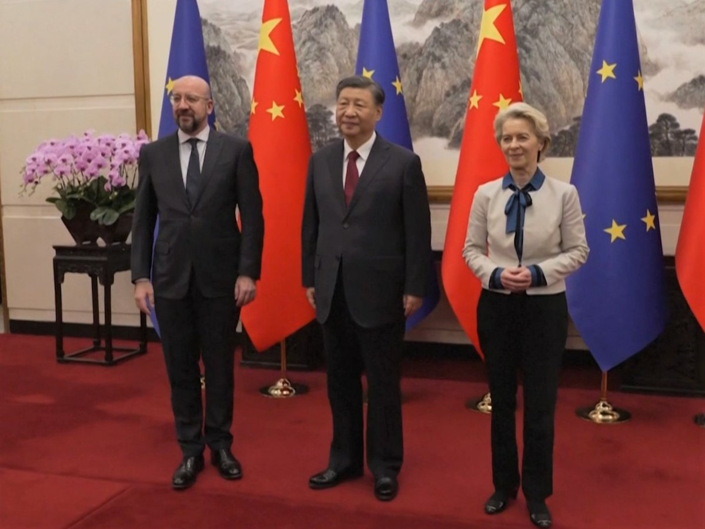  自由亚洲电台 北京时间 2023-12-07T18:20:30Z 1732706642742153313 【“#香港自由艺术奖”展 台北为首站】
【连结台港日对抗中共极权】
香港民主女神团队和日本香港民主连盟，举办首届以香港抗争精神为主题的“香港自由艺术奖” ，并选择在台北作为首站的主办点。主办方希望，在香港人已经无法发声的情况下，离散港人能透过艺术创作，展示香港精神，连结台港日团结对抗中共极权。
RFA粤语组 程皓楠摄   自由亚洲电台 北京时间 2023-12-07T15:35:09Z 1732665032331391197 【#中欧峰会 北京登场】
【习近平：共同努力保持中欧关系发展势头】
【冯德莱恩：讨论如何重新平衡中欧经济关系】
第24次中国欧盟领导人会晤7日在北京举行。中国国家主席习近平会见欧洲理事会主席米歇尔（Charles Michel）和欧盟委员会主席冯德莱恩（Ursula von der Leyen）。冯德莱恩说：“我们将讨论如何重新平衡我们的经济关系，中国是欧盟最重要的贸易伙伴，但我们仍必须处理双方之间明显的分歧和失衡问题。”米歇尔说：“我们一致致力于与中国建立稳定、互利的关系，我们希望这一承诺和关系，建立在透明、可预测和互惠原则的基础上。因此今天我们要宣传欧洲的价值观，包括人权和民主。当然我们也会维护我们的合法利益。” 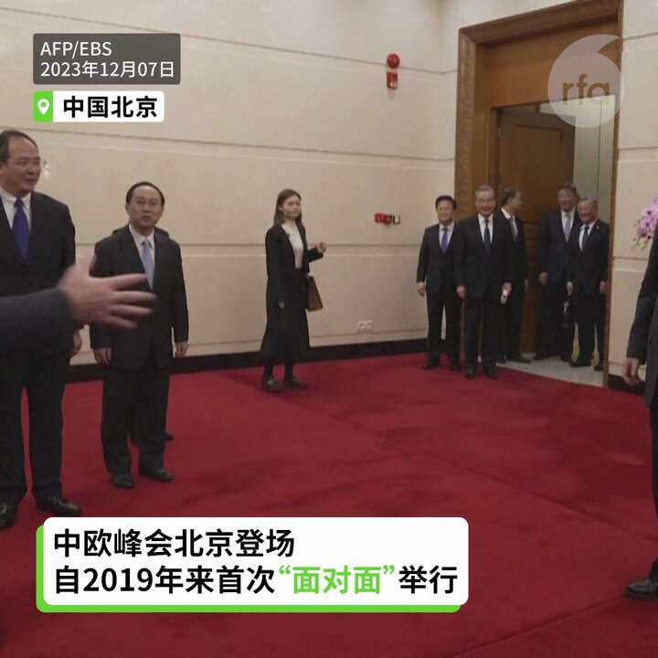  自由亚洲电台 北京时间 2023-12-07T13:26:22Z 1732632623913247026 【美国杀毒软件“趋势科技”研发中心撤离中国】
世界知名网络安全企业趋势科技公司位于中国南京的公司研发中心，一个月前开始陆续裁员，裁员人数约七十人，占全体员工总数14%。业内人士说，趋势科技撤离研发部门与中国《反间谍法》的威慑力有关联。详细报道：https://t.co/2HQzf57eby
#趋势科技
#反间谍法   自由亚洲电台 北京时间 2023-12-07T11:38:28Z 1732605467564581056 RT @RFA_Chinese: 欢迎收听和订阅【亚太报道】播客 https://t.co/MjLNSvVMqc
#大众汽车 没有发现 #新疆工厂 存在 #强迫劳动；台湾人用书法纪念166名自焚藏人；香港 #反送中 示威者疑被 #电视认罪；#中国高校毕业生人数再创新高；#台湾大…   自由亚洲电台 北京时间 2023-12-07T11:38:49Z 1732605554793541900 RT @RFA_Chinese: 【#中国取消动态清零一周年】
三年折腾，还有哪些瞬间让您此生难忘？旧日荒唐会不会卷土重来？ https://t.co/J6kyawLHWJ   自由亚洲电台 北京时间 2023-12-07T11:44:03Z 1732606873759519158 RT @RFA_Chinese: 【诚征受访者】中国经济萎靡不振，企业纷纷倒闭裁员，民众饭碗易碎，工作难找，这个冬天有点冷。
在上海和深圳等大城市，已出现因找不到工作，而提前回家过年的返乡潮。你是否也在回家的路上？你打算如何应对经济寒冬？过完年后你还会回到城市吗？欢迎分享或吐槽…   自由亚洲电台 北京时间 2023-12-07T06:47:11Z 1732532164401745953 #事实查核 @asiafactcheckcn | 报告显示《#国安法》让外商对香港法治更有信心？
https://t.co/7FHp5I4Ecq https://t.co/76J9IUSWGh 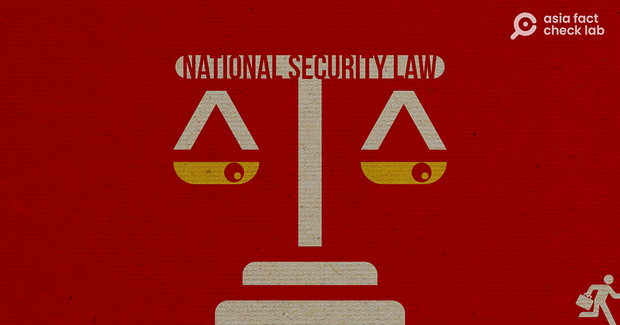  自由亚洲电台 北京时间 2023-12-07T07:12:06Z 1732538436442349969 #喜茶 新推出的“#佛喜茶”被指涉宗教元素，开卖不到一周就被官方约谈并下架。 以佛教元素为外包装的设计违反宗教法规吗？#您怎么看？
https://t.co/lpPWizVNLz https://t.co/uagutSafyT   自由亚洲电台 北京时间 2023-12-07T08:30:02Z 1732558045367226591 多年来，中国境内外藏人为了反抗中共统治和追求自由，先后有166人自焚。为了纪念他们，台湾非政府组织NGO工作者何宗勋，创作了一系列的书法作品，将在12月10日 #国际人权日 这天在台湾展出。他接受本台专访表示，他不主张自焚，但是一个民族为争取自由所作的牺牲不该被抹灭。

https://t.co/oXEfN0UsxW https://t.co/MmPVaHuhXi 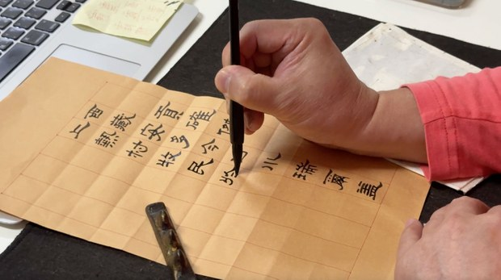  自由亚洲电台 北京时间 2023-12-07T10:00:09Z 1732580724950319451 专栏 | #中国透视: 2023年 #中国经济 困局
https://t.co/IP5yXD6DoQ https://t.co/C9DTa04Nvd 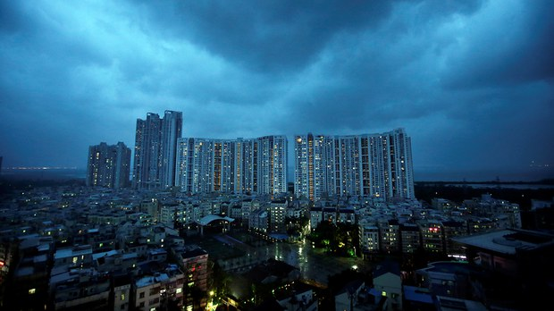  自由亚洲电台 北京时间 2023-12-07T10:30:02Z 1732588247250071863 专栏 | #纵横大历史：文革系列 第七十一讲　 恐怖的 #红八月（四）
https://t.co/owq31zTK9X https://t.co/wQlTnw31wh   自由亚洲电台 北京时间 2023-12-07T07:00:11Z 1732535434650190130 面对股东和人权组织的持续施压，时隔数月，德国汽车制造商 #大众汽车 周二终于公布了对其 #新疆 工厂人权状况的外部审计结果。该集团表示，其新疆工厂未发现存在 #强迫劳动 的迹象，然而招来多家国际人权机构批评，新疆问题专家郑国恩也公布最新证据进行了驳斥。
https://t.co/nL7fS1pZBQ https://t.co/xlfJ9u5aHH 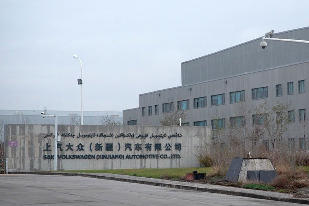  自由亚洲电台 北京时间 2023-12-07T07:13:36Z 1732538810448429228 【#中国取消动态清零一周年】
三年折腾，还有哪些瞬间让您此生难忘？旧日荒唐会不会卷土重来？ https://t.co/J6kyawLHWJ 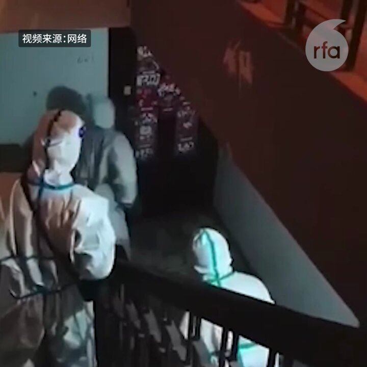  自由亚洲电台 北京时间 2023-12-07T07:30:01Z 1732542944492855571 #卡梅伦 出任 #英国外交大臣 即将满月之际，展开首个访美行程。他周三（6日）出发飞往华府，和美国国务卿 #布林肯（Antony Blinken）等美方官员，以及两党国会领袖会面。

https://t.co/gHMqNI9YBl https://t.co/aOB2zxLUW1 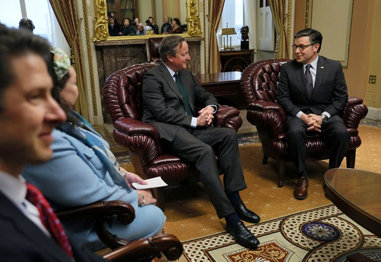  自由亚洲电台 北京时间 2023-12-07T08:00:12Z 1732550539635028163 欢迎收听和订阅【亚太报道】播客 https://t.co/MjLNSvVMqc
#大众汽车 没有发现 #新疆工厂 存在 #强迫劳动；台湾人用书法纪念166名自焚藏人；香港 #反送中 示威者疑被 #电视认罪；#中国高校毕业生人数再创新高；#台湾大选 副手抢走主角光芒。 https://t.co/1S8kDKTF08 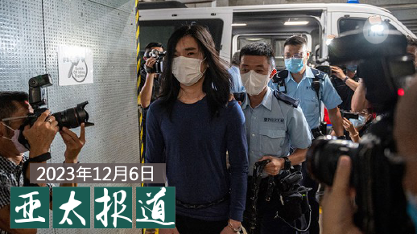  自由亚洲电台 北京时间 2023-12-07T09:00:08Z 1732565622150816020 据路透社6日报道，因为 #俄罗斯 试图规避 #英国 政府所施加的军事供应链制裁，伦敦当局将进一步制裁含中国企业在内46个实体，除了中国外，受制裁的团体及个人也来自土耳其、塞尔维亚、阿拉伯联合酋长国、和乌兹别克斯坦。 https://t.co/mTXbbaVoeN 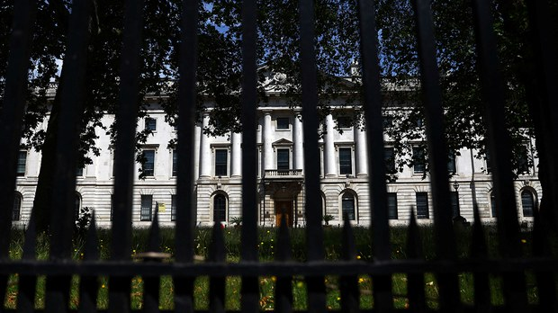  自由亚洲电台 北京时间 2023-12-07T05:32:04Z 1732513262493675726 RT @Jeff23Wang: #新三潮【诚征受访者】这个冬天有点冷！中国经济萎靡不振，企业纷纷倒闭裁员，民众饭碗易碎。 在上海和深圳等大城市，已出现因找不到工作，而提前回家过年的返乡潮。

你是否也在回家的路上？你打算如何应对经济寒冬？过完年后你还会回到城市吗？… https…   自由亚洲电台 北京时间 2023-12-07T05:53:33Z 1732518667848741051 专栏 | #网络博弈: "It's My Duty" — 献给 #白纸运动 和 #六四 的歌
https://t.co/SalKrukNpN https://t.co/pot82oK58a 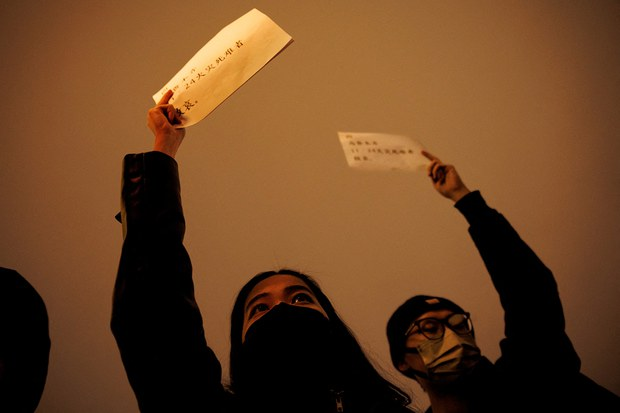  自由亚洲电台 北京时间 2023-12-07T06:02:04Z 1732520808625418726 中共中央的机关刊物《求是》杂志上周发表习近平有关 #加强耕地保护和盐碱地综合改造利用 的讲话内容，显示中国有意扩大耕地，加强农业生产的政策意愿。由于美中关系紧张，再加上俄乌战争造成国际粮价及出口大起大落，中国也开始朝非洲、东南亚及拉丁美洲多元化经营其农产品的进口需求。这是否根本改变了中国的 #粮食安全 政策？
https://t.co/IZeoDILiWl 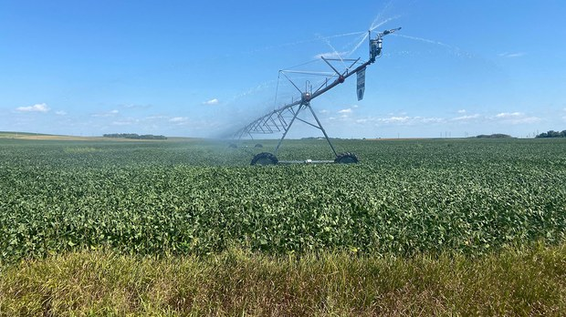  自由亚洲电台 北京时间 2023-12-07T02:30:02Z 1732467450221052352 近期，中国各地 #疫情 日趋严重。北京多家医院的 #儿科急诊室 要求前来就医的发热儿童，须接受 #核酸 检测并对患者进行分流处理。另外，中国教育部日前发出通知，要求加大对新冠感染及其它流行性疾病防控宣传。

https://t.co/wvMwaC9XzZ https://t.co/Mddt7h3j1f 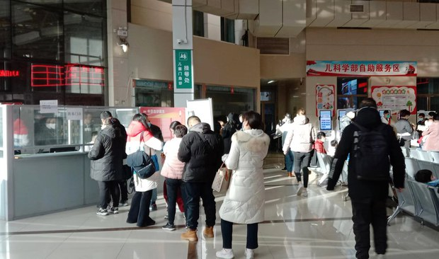  自由亚洲电台 北京时间 2023-12-07T03:00:25Z 1732475097964048453 美国防部长：“中华人民共和国是我们唯一有重塑国际秩序的意图、而且越来越有这种能力的对手”
美商务部长：“中国不是我们的朋友，我们必须睁大眼睛看清中国威胁的程度”
https://t.co/IKyQmWXkmQ https://t.co/N68IMSpfvg   自由亚洲电台 北京时间 2023-12-07T00:14:59Z 1732433464111305180 香港一名在2019年 #反送中 运动中被警察开枪击伤，其后被判刑的示威者，近日被警方安排接受媒体专访，表白心路历程。
神似这中国当局强迫嫌疑人上 #电视认罪 ？
和近 #周庭 宣布弃保潜逃有没有关系？

https://t.co/zGlB1erg0K https://t.co/lCyeANpjOs 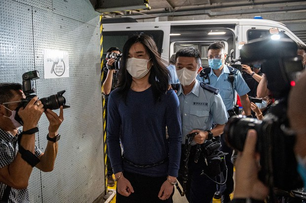  自由亚洲电台 北京时间 2023-12-07T00:43:23Z 1732440612123840717 曾被喻为“香港言论自由试金石”的香港“#国殇之柱” 前年被港府拆除后，至今仍被扣留在港。创作“国殇之柱”的丹麦艺术家高志活特别制作缩小版的“国殇之柱”，并首次在伦敦展出。
#高志活 接受本台专访时表示，当“国殇之柱”在世球“遍地开花”，中共将永远无法摆脱“六四”。
https://t.co/FXf15gW2z2 https://t.co/1WXlRSpA7B 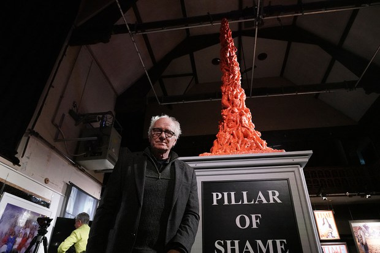  自由亚洲电台 北京时间 2023-12-07T00:50:01Z 1732442278537413006 【看看台湾副总统参选人的身家】
民进党副总统参选人 #萧美琴 在新北市有1笔土地及7笔建物，存款新台币1547.3万元、基金以及5张保单。
国民党副总统参选人 #赵少康 在台北、新北市共持有3笔土地及12笔建物、存款新台币近7974万元、股票总额约3342万元，另有房贷4710万元。
而台湾新光集团第三代的出身的民众党副总统参选人 #吴欣盈 在台湾、英国都有房产，以及有价证券总额台币3671.3万元，和珠宝、保单等。
https://t.co/ontiypDjEJ   自由亚洲电台 北京时间 2023-12-07T02:00:20Z 1732459976759931377 中国明年 #高校毕业生 人数，再创新高，同比增加21万，使 #中国青年就业问题，再度成为网民关注的焦点。教育部和人社部已出台26项举措，提早为明年逾千万新增劳动人口的就业问题进行部署，但在中国经济下行的情况下，这些做法能纾解困局吗？

https://t.co/DFo8k4Vbsg https://t.co/FqCHZPQSup   