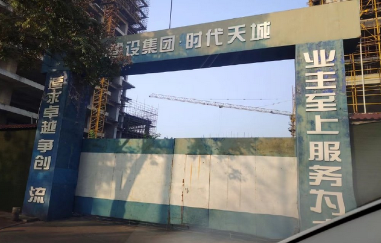
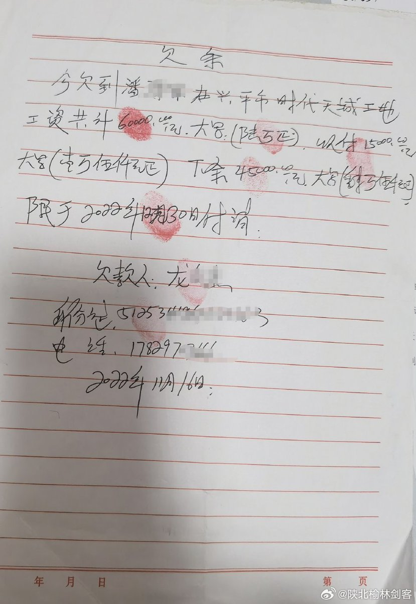
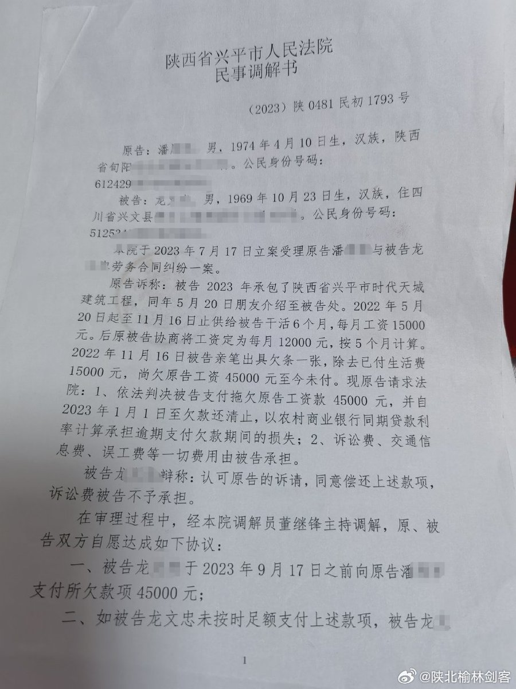
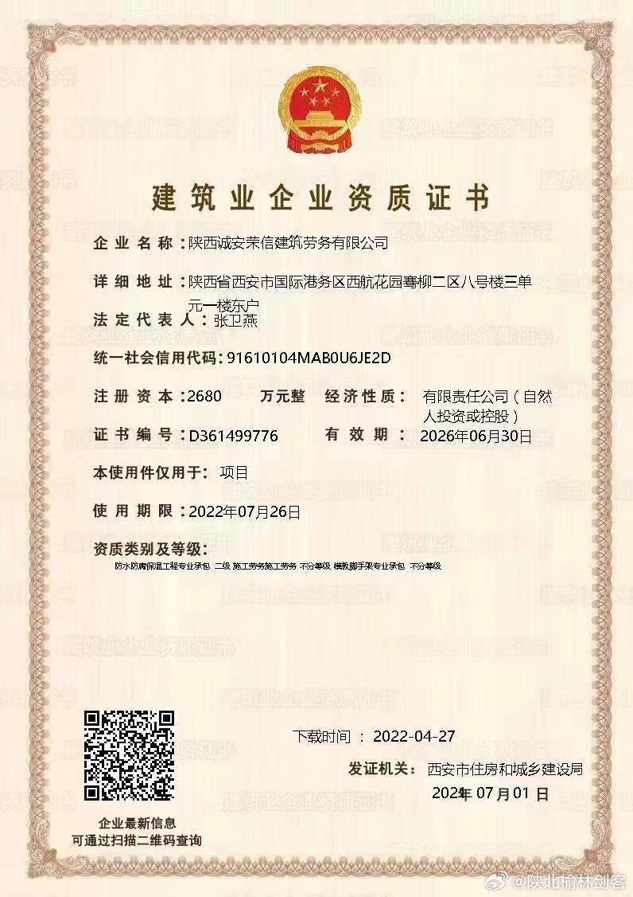

谁将十万横扫三江 北京时间 2023-12-07T10:24:43Z 1732586906494656941 12月6日 深圳市南山区中建一局拖欠农民工工资不给，政府部门，都去过多次，拖欠工资快一年了 https://t.co/l92EfJxCCF   谁将十万横扫三江 北京时间 2023-12-07T10:27:34Z 1732587627482894636 陕南农民工刘师傅和潘师傅等十多名工友，在陕西诚安荣信建筑劳务有限公司的组织下，于2022年6月份进入兴平时代天城项目干活，11月份放假。当初去干活口头协议工资按月支付，未签订劳动合同，但上班期间只发了一部分工资，放假后一项目负责人龙某某说是甲方还未付款，就分别给写了欠条，等钱下来了就会给支付工资。后来公司老板也联系不上了…
      2023年工友们多次讨薪未果后就到兴平劳动监察大队投诉举报，劳动监察大队工作人员说证据材料不够不予受理，建议尽快去法院起诉。后来工友们就去法院起诉，在法院调解下，龙某某承诺会在2023年9月17日前付清工资，但一直未履行承诺，工友们又向法院申请了强制执行，但至今也未拿到被拖欠的工资   