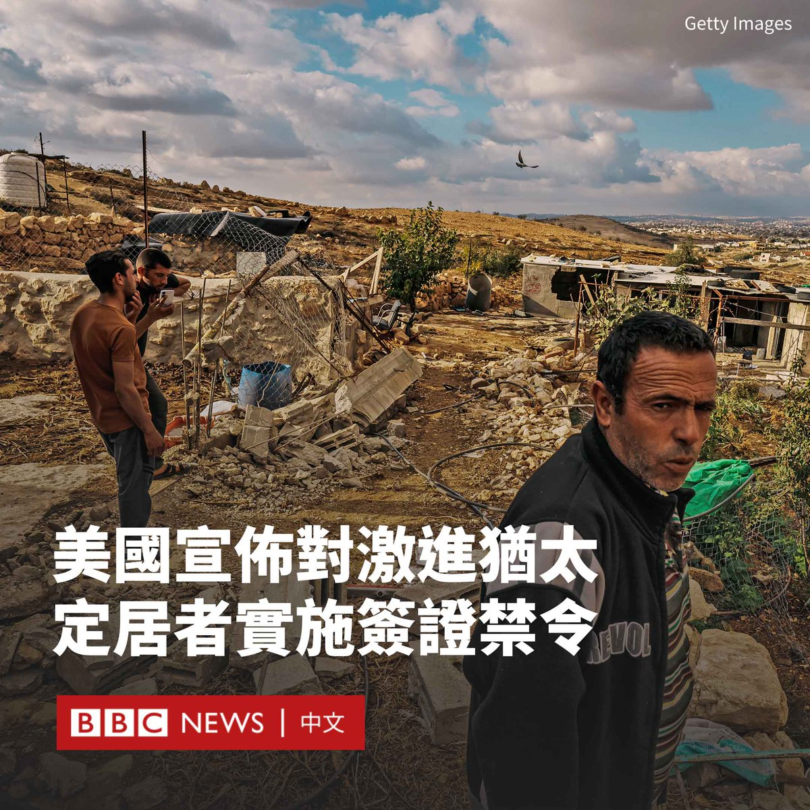
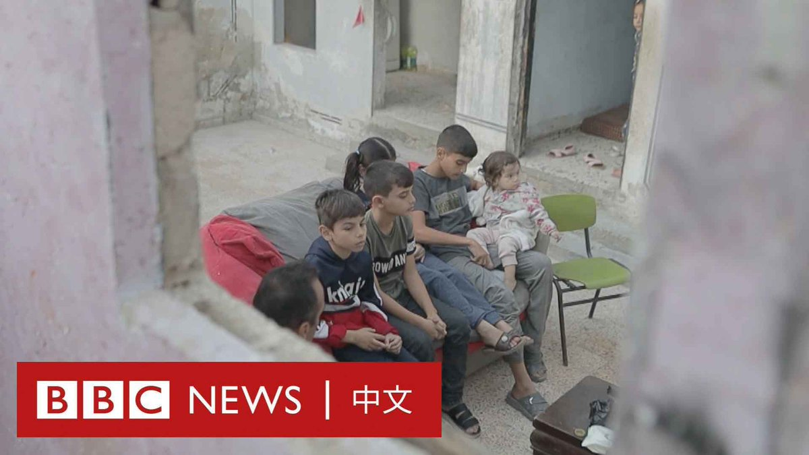

D英国广播公司BBC 北京时间 2023-12-06T19:00:24Z 1732354297956843648 BBC获得的证据显示，哈马斯在今年10月7日袭击以色列期间曾实施强奸、性暴力和肢解女性的暴行。https://t.co/gtWoAMYq4N   D英国广播公司BBC 北京时间 2023-12-06T20:00:44Z 1732369481157287945 华特·瓦兹（Walter Vaz）是一名居住在香港的法国健身教练。每周日，他都会在城市中心的公园，开设一堂专为外国帮佣设计的免费健身课。

调查显示，香港外佣群体的身心健康普遍逊于城市整体人口。对这些在港家庭佣工来说，华特的健身课堂既是她们对自我的挑战，也是她们舒缓压力、获取快乐的方式。 https://t.co/dyct675kVY   D英国广播公司BBC 北京时间 2023-12-06T14:41:17Z 1732289086420050347 美国国务卿布林肯（Antony Blinken）周二（12月5日）宣布，美国将对在约旦河西岸参与暴力活动的激进犹太定居者实施签证禁令。

布林肯在一份声明中说，新的签证限制针对的是“据信参与破坏西岸和平、安全或稳定的个人，包括实施暴力行为，或采取了其他不当限制平民获得基本服务和基本必需品的行动”。

“西岸的不稳定既伤害了以色列和巴勒斯坦人民，也威胁到以色列的国家安全利益。”布林肯在声明中说。

随着犹太人定居点的扩大，近几个月来西岸针对巴勒斯坦人的袭击事件激增。哈马斯10月7日袭击以色列后，袭击事件数量再次飙升。不过，这项新政策也将拒绝对以色列人实施暴力行为的巴勒斯坦人入境。

此前，美国总统拜登（Joe Biden）和其他高级官员敦促以色列采取行动，追究相关人员的责任。

美国国务院发言人马特·米勒（Matt Miller）周二表示，新政策预计将“影响数十人，并可能影响他们的家庭成员”。

他表示，名单上的以色列公民如果已持有美国签证，将被通知其签证已被吊销，如果没有则将在申请时被拒绝。

美国官员还表示，以色列已经采取了一些措施，包括对袭击者进行行政拘留。但华盛顿认为，应该对更多的定居者进行刑事起诉。   D英国广播公司BBC 北京时间 2023-12-06T17:41:05Z 1732334337222377962 美国一名YouTuber为了赚取影片观看量而故意坠毁飞机，并向美国调查人员撒谎，被判六个月监禁。

30岁的特雷弗·雅各布（Trevor Jacob）在社交媒体上发布了一段2021年12月飞机失事的影片，并暗示这是一次意外事故。他手持自拍杆从飞机上弹射出来，并通过降落伞降落。

在一项认罪协议中，雅各布表示这条影片是产品赞助协议的一部分。

雅各布是前奥运会单板滑雪选手，他本年较早时候承认一项破坏和蓄意妨碍联邦调查的重罪指控。

加州联邦检察官表示，雅各布“犯罪原因可能是为了在社交媒体和新闻报道上吸引关注，并获得经济利益”，检方指“这种‘玩命’行为是不能容忍的”。

雅各布在一份声明中表示，“这次经历让我深感惭愧”，并将判决描述为“正确的决定”。

2021年11月，雅各布在加州圣塔芭芭拉郡（Santa Barbara）的一个机场独自进行飞行，他在飞机上安装了摄像头，还自备一个降落伞和自拍杆。

检察官表示，他“并不打算飞到目的地，而是计划在飞行过程中跳机，并在下降和坠毁过程中用影片记录情况”。

飞机起飞35分钟后坠毁在洛斯帕德里斯国家森林（Los Padres National Forest），雅各布徒步前往事故现场并取回了录像，其后上传一条标题为“我坠毁了我的飞机”的影片到YouTube，这段影片在被删除前获得了近三百万次观看。

检察官说，一些观众对这次坠机表示怀疑，指雅各布已经穿着降落伞，但没有尝试安全降落飞机。   D英国广播公司BBC 北京时间 2023-12-06T15:51:55Z 1732306861209133155 哈马斯袭击以色列，随后以色列轰炸加沙并继而展开地面入侵行动，这一切似乎不太可能预示着终结以巴冲突的协议将达成。但是，“两国方案”的支持者认为，10月以来的暴力事件，反而奇迹般地推进了这个进程。https://t.co/fjtKSOi5me   D英国广播公司BBC 北京时间 2023-12-06T11:53:37Z 1732246892967501928 在中国债务水平引发的担忧加剧之际，穆迪投资者服务公司（Moody's Investors Service）周二（12月5日）将中国的信用评级展望从“稳定”下调至“负面”。

穆迪表示，中国政府将不得不为负债累累的地方政府和国有企业提供财政支持 ，而这“给中国的财政、经济和体制实力带来了广泛的下行风险”。

中国财政部同日晚些时候回应称，对穆迪的决定“感到失望”，中国经济“长期向好的基本面没有改变”。发言人表示，中国“地方政府违法违规无序举债的蔓延扩张态势得到初步遏制，地方政府债务处置工作取得积极成效”。

当局还在声明中称，房地产的低迷对地方一般公共预算和政府性基金预算的影响是“可控的、结构性的”。

由于中国经济在疫情后的复苏低于预期，房地产危机不断加深，北京试图通过更多财政刺激提振经济。

今年10月，中国政府宣布将增发1万亿元人民币国债，这使该国财政赤字率突破传统的3%红线，提高至3.8%左右。

据报道，20多个省份还发行了特殊再融资债券，用其置换隐性债务。中央政府在11月表示，高度重视防范化解地方政府隐性债务风险。

不过，穆迪维持中国长期主权信用评级为A1不变。上一次中国主权评级降级是在2017年，穆迪将其从Aa3下调至A1。

穆迪预计，中国经济明年及后年的增速将放缓至4%，2026年至2030年平均增长3.8%。人口结构疲弱等因素将导致中国经济增长到2030年放缓至3.5%。   D英国广播公司BBC 北京时间 2023-12-06T09:35:26Z 1732212117158477986 “我希望父母还活着。”

以哈冲突爆发后，许多加沙儿童的父母双亡，包括13岁的奥马尔。他的父母都在以色列的轰炸中丧生，只剩下他和五个兄弟姐妹。现在，他们都和叔叔住在一起，叔叔的家也因加沙遭到轰炸而变成了废墟。 https://t.co/pfRdRilrfz   