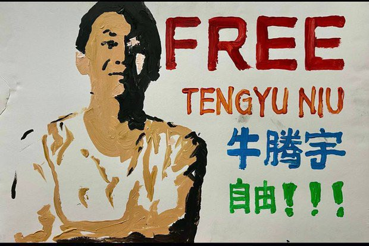

拆墙运动公号 北京时间 2023-12-06T14:59:15Z 1732293608550596641 RT @VOAChinese: 屋漏偏逢连夜雨，中国明年又有创纪录的一千多万高校毕业生需要就业  https://t.co/qTZupne3jm   拆墙运动公号 北京时间 2023-12-06T14:58:57Z 1732293534915436988 RT @RFA_Chinese: 【诚征受访者】中国经济萎靡不振，企业纷纷倒闭裁员，民众饭碗易碎，工作难找，这个冬天有点冷。
在上海和深圳等大城市，已出现因找不到工作，而提前回家过年的返乡潮。你是否也在回家的路上？你打算如何应对经济寒冬？过完年后你还会回到城市吗？欢迎分享或吐槽…   拆墙运动公号 北京时间 2023-12-06T15:06:15Z 1732295370305122572 #拆墙运动 关注 #尹旭安 ，请收集阻拦 #尹旭安 就医的 #作恶者 的照片、联系方式、姓名、身份信息。
把 #恶人 公布在 #恶人榜 上。   拆墙运动公号 北京时间 2023-12-06T14:47:07Z 1732290555135033362 释放牛腾宇的公开信
 尊敬的美国国会、美国政府以及相关职务人员：
    2019年5月至6月，“恶俗维基网站”用户在该网站上曝光了包括习近平女儿习明泽、姐夫邓家贵在内的习近平亲属的个人信息，其中包括化名及身份证号等信息。之后在中共高层的直接授权下，由中共国安部、公安部和广东省公安厅联合办理，“恶俗维基网站”管理人员24人被捕。其中“恶俗维基网站”网络维护员牛腾宇被广东省茂名市茂南区人民法院判处14年有期徒刑并处罚金人民币13万元（以寻衅滋事罪判8年罚5万元，以侵犯公民个人信息罪判5年罚4万元，以非法经营罪判2年罚4万元）。
    据牛腾宇家属以及其它可靠信息渠道反映，年仅19岁的牛腾宇被关押期间，受到惨无人道的酷刑。牛腾宇曾经被关进非法黑监狱，经历的酷刑包括：长时间吊打、无端地大剂量注射生理盐水、坐老虎凳、抽鞭子、火烧下体，多次因酷刑折磨至生命垂危送医院抢救。 牛腾宇母亲坚持为牛腾宇申诉的目前也被中共无情骚扰、迫害---住房被破坏，在住处附近不间断播放噪音，剥夺聘请律师辩护权，剥夺会见及通讯权等等。
根据牛腾宇母亲提供的信息，其于 2023年11月24日与牛腾宇视频会见时，发现牛腾宇精神出现障碍：视频通话中的牛腾宇无法认出自己的母亲，面容呆滞，大声喊叫，胡言乱语。
牛腾宇涉及的“恶俗维基网站案件”完全是政治主导的冤案。
恶俗维基是个记录中国互联网中人物和事件的讽刺性网站，相关内容多为注册会员自行上传。牛腾宇并非网站创始人，也非相关争议内容提供方及上传者，其作为网络技术人员对于其他用户上传有关习近平亲属的个人信息，既无主观故意也无共谋或者协助行为。牛腾宇对该项指控不应负任何法律或者道义上的责任。
依据《中华人民共和国刑法》，“寻衅滋事行为”主要包括“随意殴打他人，追逐、拦截、辱骂、恐吓他人，强拿硬要或者任意损毁、占用公私财物，在公共场所起哄闹事。”
部分海内外法律界专业人士认为，“恶俗维基网站”用户上传习近平家属个人信息的行为，不符合寻衅滋事罪的相关定义，不属于寻衅滋事罪。该案件即使按照寻衅滋事罪宣判，法定刑罚也在5年以下。
“侵犯公民个人信息罪”的构成是多次提供或者出售等情形，“恶俗维基网站”用户上传习近平家属个人信息的行为，也不符合该罪名。非法经营罪是指未经许可经营法律、行政法规规定的专营、专卖物品或者其他限制买卖的物品等，恶俗维基用户上传习近平家属个人信息的行为，不存在任何的牟利目的和行为，也不符合该罪名。
牛腾宇被指控的相关罪名完全不存在起诉书中的事实，不符合法律规定，判决结果异常峻苛，显然属于基于带着政治目的与高层官员个人仇恨的故意陷害。
中国共产党以及他们组建的政权历来以政治挂帅，罔顾法律正义，行政权力直接干预司法运作。被中共官员尤其是高层陷害的普通人，往往会受到极端伤害乃至伤害致死。
牛腾宇仅仅是一名网络技术人员，因为该网站用户上传内容惹怒中共高层，因而被陷害入狱，并遭受惨无人道的酷刑。目前牛腾宇在饱受酷刑和深陷绝望情绪中，精神已经崩溃，生命健康受到极大威胁。
我们在此呼吁关心中国人民的美国国会、政府及各界人士予以紧急关注，以适当方式与中共当局予以交涉，挽救牛腾宇年轻无辜的生命。
同时我们呼吁中共当局遵守国际人权条约以及本国法律，立即无罪释放牛腾宇，确保牛腾宇能够得到适当的医疗，确保牛腾宇的人权与公民权不被侵犯。
2023年12月5日
明天6號光傳媒王安娜女士會在國會向國會議員遞交請願信、
共同捍衛人權救救孩子牛騰宇！
联署人接龍：
1.王安娜
2.梁少華
3.界立建
4.雷晶
5.李德龍
6.劉安琪
7.李北省
8.張子雲
9.柳敏
10.楊智剛
11.李華章
12.黃建斌
13.吳少偉
14.李元喜
15.張颖伟
16.朱高峰
17.張勇
19.申育龍
20.廖容
21.王紅
22.葛坤
23. Robert
24.趙家平
25.王飛
26.李波
27.l劉棟玲
28.

（如果不公開姓名聯署信者可私信我匯總簽名递交國會議員）   拆墙运动公号 北京时间 2023-12-06T15:21:35Z 1732299231342346324 中共政府早已经威胁世界了   拆墙运动公号 北京时间 2023-12-06T11:00:16Z 1732233467050504404 RT @Ipkmedia: 【文摘】
华裔新人当选加拿大国会议员，中国帮忙了吗？

这位新人来到多伦多北部的一个区，宣布竞选加拿大国会议员。虽然没有什么人认识他，但一个重要的因素帮助弥补了其知名度不高的问题，那就是来自当地知名华裔人士的支持。… https://t.co/JsW…   拆墙运动公号 北京时间 2023-12-06T03:15:14Z 1732116437479662019 RT @Lydia981402: #恶人榜信息征集中心 关注和征集 迫害   #曹芷馨 作恶者的个人信息. #恶人榜
爆料：Liang20201219@gmail.com   拆墙运动公号 北京时间 2023-12-06T03:16:27Z 1732116745446412486 RT @RFA_Chinese: 山东省负责新北市、
广西省负责花莲县，
北市由上海对口，
安徽省负责基隆市，
北京台办锁定高雄，
武汉对应苗栗，
重庆专责彰化与南投。
＃点对点， 全台目前有超过上千名村里长被安排到中国接受统战招待，中国正以前所未见的旅游招待手法介入 ＃台湾选…   