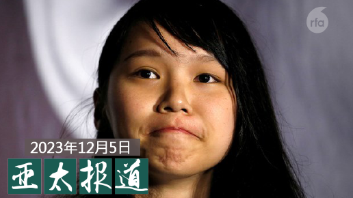
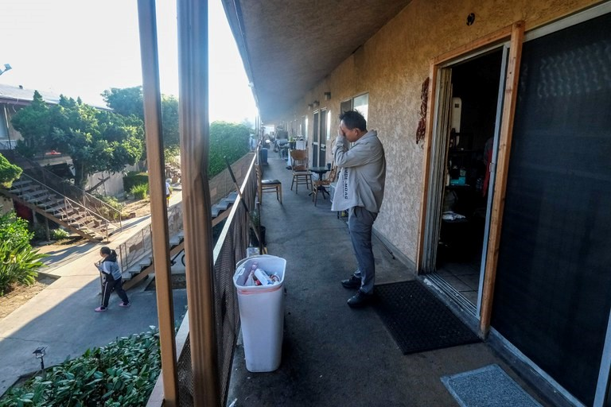
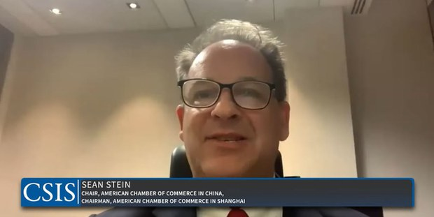
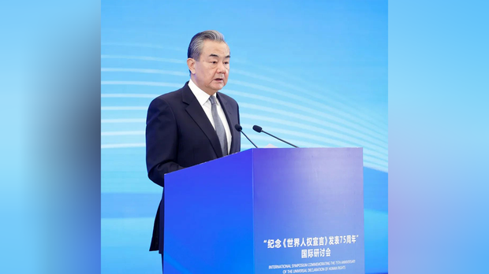
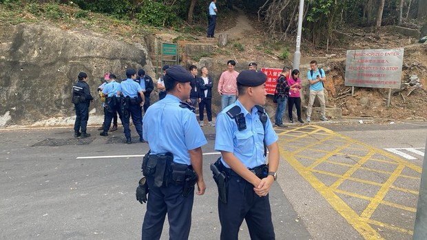
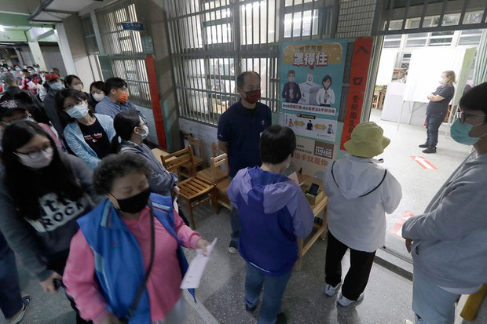

自由亚洲电台 北京时间 2023-12-06T11:31:45Z 1732241387960054098 RT @RFA_Chinese: 山东省负责新北市、
广西省负责花莲县，
北市由上海对口，
安徽省负责基隆市，
北京台办锁定高雄，
武汉对应苗栗，
重庆专责彰化与南投。
＃点对点， 全台目前有超过上千名村里长被安排到中国接受统战招待，中国正以前所未见的旅游招待手法介入 ＃台湾选…   自由亚洲电台 北京时间 2023-12-06T12:18:56Z 1732253264882585772 RT @RFA_Chinese: 欢迎收听和订阅播客【＃亚太报道】 https://t.co/MjLNSvVMqc
＃穆迪 下调 ＃中国信用评级展望；一名蒙古族男子遭狱警虐待、生命垂危；＃李家超 宣布对 ＃周庭 予以“终身追捕”；＃香港社民连 举办郊游遭警方调查；＃吴钊燮 抨击…   自由亚洲电台 北京时间 2023-12-06T12:21:44Z 1732253969919934497 RT @RFA_Chinese: 【告御状的女人】
11月习近平访美。曾多次拦截中国领导人车队告御状的 ＃马永田 决定再次以命相拼
自2001年公司房产被强拆，她上访23年分文未赔，早已放弃。但因她两度冲撞习近平座驾，中国政府将她丈夫和儿子扣为人质，无法出国和求职。
一人上访…   自由亚洲电台 北京时间 2023-12-06T12:21:52Z 1732254003738919122 【涉招待60人赴中国旅游支持特定总统候选人】
【台湾检方声押3人】
中国介入台湾选举案例又增加一件，根据台湾中央社6日报道，台湾新住民关怀总会理事长和干部、中华人民党主席、党员等5人涉招待60名台湾人赴中国旅游，支持特定总统参选人，其中周姓理事长、郭姓、颜姓干部讯后遭检方声押。详细报道：https://t.co/H3KWnl9SWO
#中国介选   自由亚洲电台 北京时间 2023-12-06T08:00:13Z 1732188155938554231 欢迎收听和订阅播客【＃亚太报道】 https://t.co/MjLNSvVMqc
＃穆迪 下调 ＃中国信用评级展望；一名蒙古族男子遭狱警虐待、生命垂危；＃李家超 宣布对 ＃周庭 予以“终身追捕”；＃香港社民连 举办郊游遭警方调查；＃吴钊燮 抨击中国试图影响 ＃台湾大选。 https://t.co/Nz3jjAaNMl   自由亚洲电台 北京时间 2023-12-06T08:57:01Z 1732202449719693328 RT @RFA_Chinese: 12月4日，《＃咬文嚼字》编辑部发布 ＃2023十大流行语。中国官方新华社表示，这个榜单既考虑热度又考虑价值，具有广泛代表性，备受公众认可。
这些流行语，您知道几个？您心目有2023流行语有哪些？ https://t.co/01yeF5DDxW   自由亚洲电台 北京时间 2023-12-06T09:15:56Z 1732207211932168526 RT @RFA_Chinese: 【诚征受访者】中国经济萎靡不振，企业纷纷倒闭裁员，民众饭碗易碎，工作难找，这个冬天有点冷。
在上海和深圳等大城市，已出现因找不到工作，而提前回家过年的返乡潮。你是否也在回家的路上？你打算如何应对经济寒冬？过完年后你还会回到城市吗？欢迎分享或吐槽…   自由亚洲电台 北京时间 2023-12-06T02:45:56Z 1732109065885712593 #调查报道 | "#润"潮中 年轻中国家庭试图在美国站稳脚跟
https://t.co/u8rVyRAUH0 https://t.co/iecgBKqyPV   自由亚洲电台 北京时间 2023-12-06T04:38:11Z 1732137310786072973 本周二，国际著名评级机构 #穆迪 将 #中国主权信用评级 展望从"稳定"调为"负面"，并警告中国地方政府的 #债务风险、 房地产行业危机等正在加深。有学者指出，此举将产生连锁反应，进一步阻碍中国的经济复苏。

https://t.co/76OA78LsPq https://t.co/GIQdm4flfr   自由亚洲电台 北京时间 2023-12-06T05:18:27Z 1732147447814860991 在 #新冠 封控政策解除后，#中国经济 持续疲软。而伴随地缘政治紧张，外资不敢进入，也成为中国整体经济形势难以回暖的原因之一。本周二，上海美国商会主席肖恩·斯坦（Sean Stein）在一场研讨会上，谈及了美国企业在中国运营的困境。
https://t.co/UQ0F55Yauw https://t.co/Ssq2muepVh   自由亚洲电台 北京时间 2023-12-06T05:46:05Z 1732154399429144745 #王毅 谈 #中国人权 事业”历史性成就”　
网友斥：你了解人权吗？
https://t.co/zdZLCfoy7D https://t.co/2hsl30f0iN   自由亚洲电台 北京时间 2023-12-06T05:53:02Z 1732156149343105251 据中国三大上市 #养猪企业 9月初发表的上半年业绩报告，这三大猪企亏损总额达104.51亿元人民币，而企业负债总额已达2700亿元人民币。报导指，市场目前整体趋势仍在下行中。预计, 猪价走跌已近21个月，为有统计以来亏损时间最长亏损周期。
https://t.co/uBDaBVPpBq https://t.co/fL4etX5feT   自由亚洲电台 北京时间 2023-12-06T01:07:26Z 1732084276420804920 【蒙古族青年狱中受虐 家人对外求助】
#内蒙古 锡林郭勒盟一蒙古族男子 #阿拉慕斯（汉语：阿拉木沙）涉参与斗殴，多年前被判刑15年。近期，阿拉慕斯的姑姑发视频揭发狱警虐待阿拉慕斯，每天只给一个馒头果腹，目前生命垂危。
https://t.co/hmW5SdGc0O https://t.co/ff5Y9TaDS9   自由亚洲电台 北京时间 2023-12-06T03:10:34Z 1732115263812710580 【诚征受访者】中国经济萎靡不振，企业纷纷倒闭裁员，民众饭碗易碎，工作难找，这个冬天有点冷。
在上海和深圳等大城市，已出现因找不到工作，而提前回家过年的返乡潮。你是否也在回家的路上？你打算如何应对经济寒冬？过完年后你还会回到城市吗？欢迎分享或吐槽，请在评论区留言，电邮fankui@rfa.org,  或在X平台联系记者王允 @Jeff23Wang 私聊，谢谢！  #新三潮   自由亚洲电台 北京时间 2023-12-06T04:13:22Z 1732131067874947179 香港特首 #李家超 5日狠批 #周庭 是弃保潜逃的逃犯：“逃犯出卖诚信，砌词找借口去欺骗同情，尝试自我制造光环，行为可耻。警方尝试宽大处理，这个良好意愿却换来瞒骗，相信最失望的是尝试宽大处理的人员。”
#您怎么看？
https://t.co/BpIlxbyhYE https://t.co/k9Nwiz51c3   自由亚洲电台 北京时间 2023-12-06T01:20:35Z 1732087586536251628 香港民主派政党 ＃社民连 在一场郊游活动期间，被警方截停调查，警方认为他们涉嫌违反《＃港版国安法》，滋扰他们两个小时才放行。警方后来改口说是要提醒道路安全。有评论认为，港府打压民主党派的手法变本加厉，比中国大陆当局有过之而无不及。

https://t.co/yDVUmRvzNA https://t.co/4U2rPypNHX   自由亚洲电台 北京时间 2023-12-06T01:51:31Z 1732095371478958109 山东省负责新北市、
广西省负责花莲县，
北市由上海对口，
安徽省负责基隆市，
北京台办锁定高雄，
武汉对应苗栗，
重庆专责彰化与南投。
＃点对点， 全台目前有超过上千名村里长被安排到中国接受统战招待，中国正以前所未见的旅游招待手法介入 ＃台湾选举。
https://t.co/BunvEXl2S9 https://t.co/OsqZCulylS   自由亚洲电台 北京时间 2023-12-06T02:21:51Z 1732103003463876950 12月4日，《＃咬文嚼字》编辑部发布 ＃2023十大流行语。中国官方新华社表示，这个榜单既考虑热度又考虑价值，具有广泛代表性，备受公众认可。
这些流行语，您知道几个？您心目有2023流行语有哪些？ https://t.co/01yeF5DDxW   自由亚洲电台 北京时间 2023-12-06T00:08:57Z 1732069556947128405 #吴钊燮：”在这次的 #台湾大选，中国再次企图用混合的手段，利用军事威胁、经济胁迫、虚假宣传和非法资金流等，试图影响台湾选举的结果，随着选举临近，干预愈演愈烈，在选前制造台湾社会的分裂和不信任，以破坏台湾的民主制度。我们不应该让专制的中国得逞和逍遥法外。”

https://t.co/fRfDJ76dOD https://t.co/aj33yTPdJ3   