谁将十万横扫三江 北京时间 2023-12-06T21:42:20Z 1732395046786457765 RT @cskun1989: 12月4日，许成钢教授破例在台湾发表尖锐的批评演讲，抨击习近平上台后重返极权体制，对“东升西降"作出误判。他指出在没有法制的社会里，法律规定的产权并不意味着对资产的控制权。“所谓改革派如今在大陆都不敢提司法独立，共产党讲得很清楚，就是党领导一切，党…   谁将十万横扫三江 北京时间 2023-12-06T21:52:34Z 1732397621535494219 本人孟凡一于2023年2月至6月在曹发涛、尹丛丛的公司里上班，最长工作14小时，被拖欠工资一万多元。不得已去劳动仲裁，被仲裁委百般刁难原预定八月份开庭，仲裁委以劳动关系不明确往后拖了一个月开庭，九月份开庭时对方公司人来了，已经有恃无恐了，店已经关了，账面上也没钱了。仲裁委还想再拖，在我方威胁找领导下，才勉强开庭。仲裁结果出示后，曹发涛、尹丛丛拒不支付，己方迫于无奈选择前往张店区人民法院强制执行，法院说给调解，约定每个月五号前分五期支付。对方支付一期之后，又失联了强制执行不了了。人已经逼到绝境了，所有的合法手段都已用完，现在寻求社会帮助。 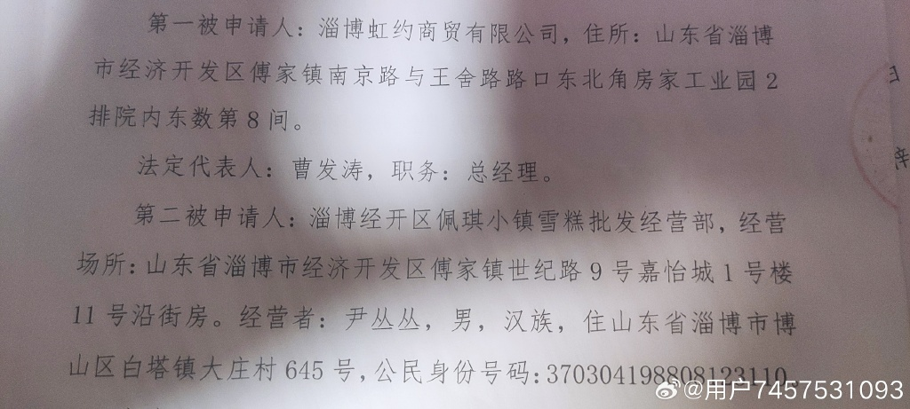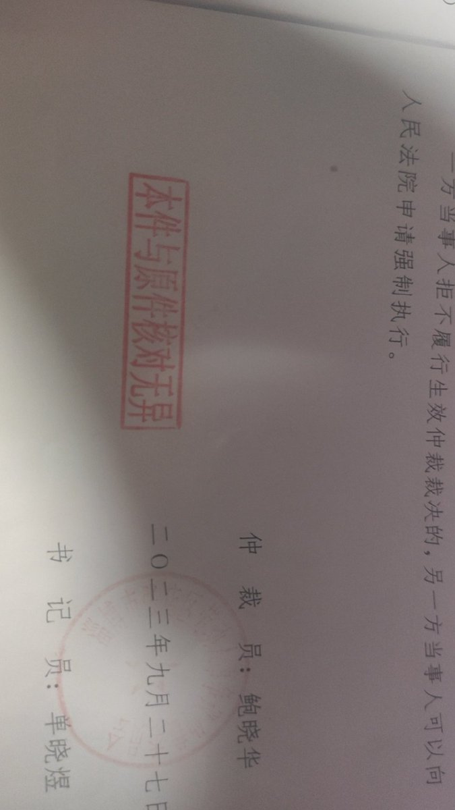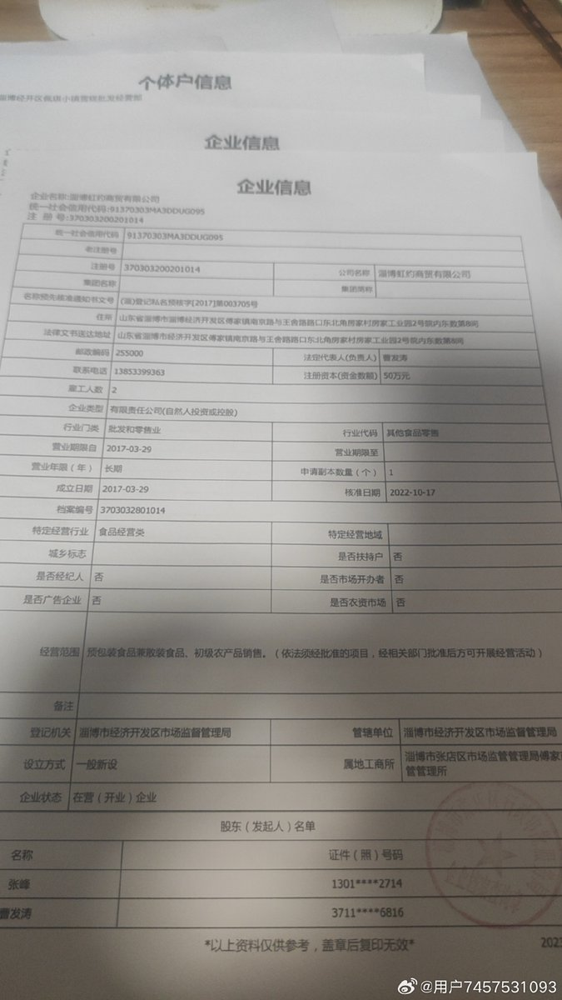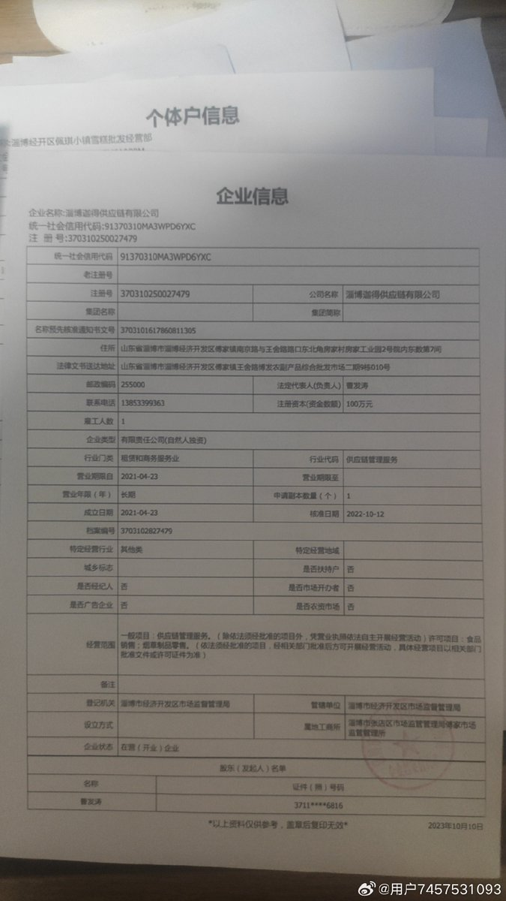  谁将十万横扫三江 北京时间 2023-12-06T21:52:52Z 1732397699922792844 内蒙古中路华辰会计师事务所呼伦贝尔分所孙德胜拖欠员工6个月社保，已经拖欠了1年半，拒不缴纳 https://t.co/l86qJWTWlW   谁将十万横扫三江 北京时间 2023-12-06T21:54:00Z 1732397982946119762 关于南京市农民工讨薪案（苏民初2018.6174号），建邺区法院法官卞文军枉法裁判，南京中院改判，江苏省高法亳无依据与逻辑胡作非为定案；南京市检察仇必林破绽百出，不负责任调查，存在权力勾结出尔反尔拒案；江苏省人民检察院渎职失职，不排除人情关系勾结踢皮球；最高检投诉举报信访窗口2次登记后，居然指使原告再走信访渠道、才有希望 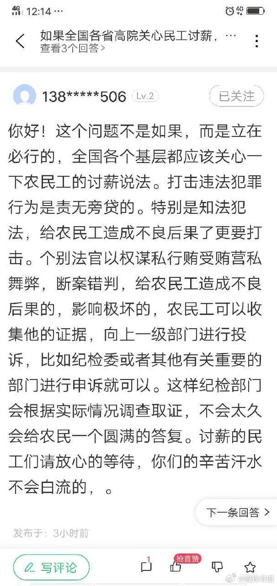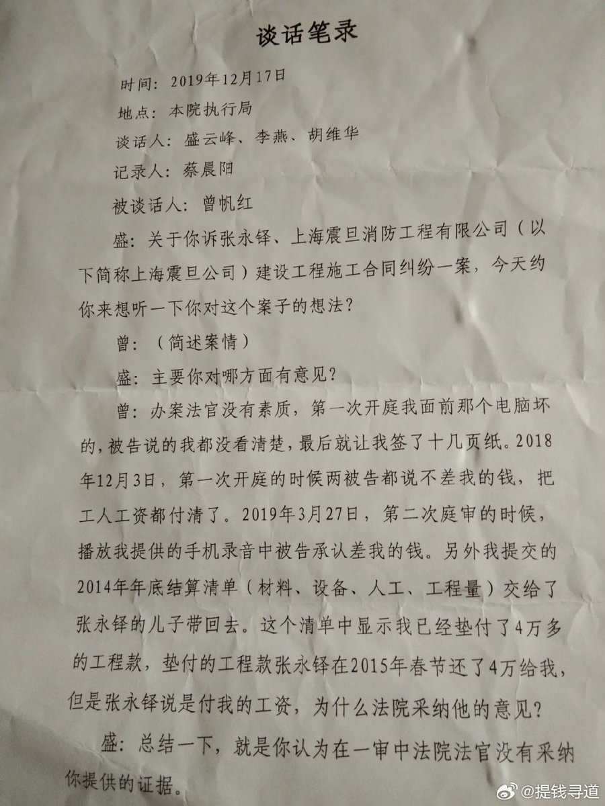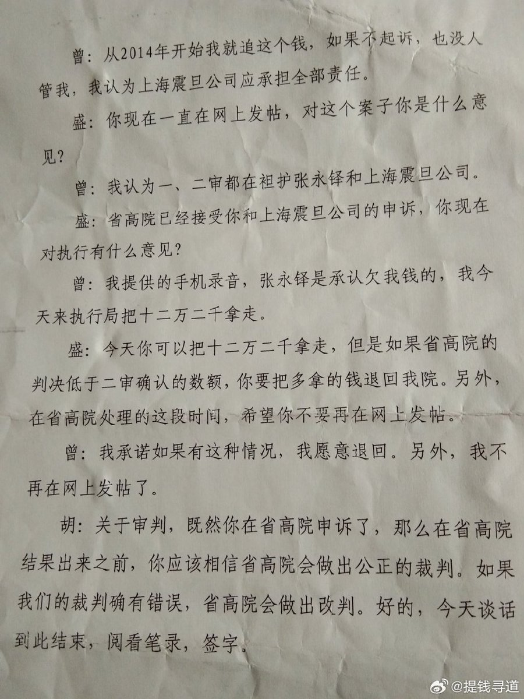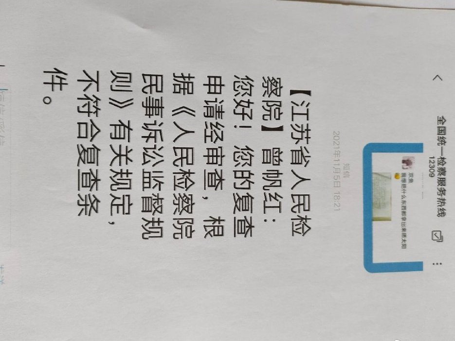  谁将十万横扫三江 北京时间 2023-12-06T21:54:53Z 1732398207890583665 在西安市经开区红色村125组改造项目（高红•贞观首府二期）DK-3标段干活的工友们反映，有108名农民工被拖欠工资198万元 https://t.co/KYLikvqMfF 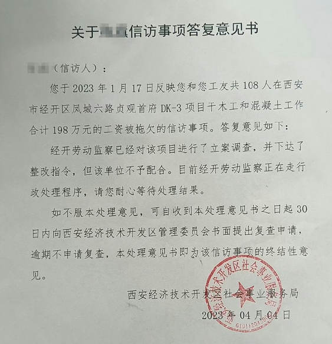  谁将十万横扫三江 北京时间 2023-12-06T21:59:05Z 1732399265430057383 RT @YesterdayBigcat: 「征地补偿被拖欠，辽宁失地农民围政府」辽宁省东戴河新区万家镇逾百失地农民，因政府拖欠征地补偿金近两年，周一（12月4日）再次发起维权行动，围堵了东戴河新区管委会，一度与警方发生对峙。随后的周二，村民又继续前往万家镇政府维权。由于当地政府…   谁将十万横扫三江 北京时间 2023-12-06T22:26:30Z 1732406163688620042 房奴东哥讲述自己故事引发关注，17年最高位时在燕郊买房，均价3.3万，还了6年房贷（利息还了60多万，本金20万）。现在房价大跌，加上自身失业，他诠释了房奴的真正含义 https://t.co/iXzYZDqPPE   谁将十万横扫三江 北京时间 2023-12-06T10:39:53Z 1732228337115004971 12月5日，四川某地银行，大妈30万元存款变理财保险，拿不出来了。地方开始自谋出路 https://t.co/i0EDIXKkpr   谁将十万横扫三江 北京时间 2023-12-06T10:49:23Z 1732230729835458678 又开始要核酸检测了，信不信由你 https://t.co/LvuwEpv5WZ 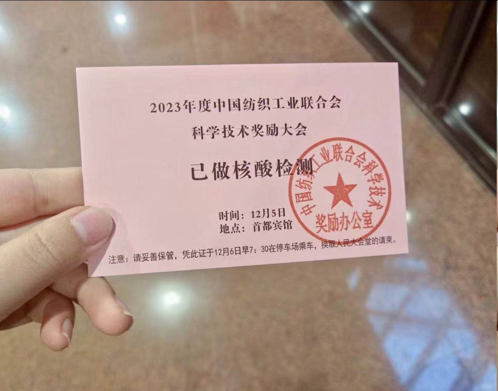  谁将十万横扫三江 北京时间 2023-12-06T10:14:59Z 1732222069788889449 RT @cskun1989: 多年来，很多人真诚地在问一个假问题，即文化大革命这场浩劫会不会卷土重来？很多人也貌似严肃地思考着一个荒诞的课题，即如何防止历史的悲剧重演？然而残酷的现实告诉我们，中国根本沒有从历史浩劫中走出来。早已淡出政坛的于幼军曾经直言：文革是一场由领导者错误发…   谁将十万横扫三江 北京时间 2023-12-06T10:19:11Z 1732223129756565731 广州市增城区3人因极端讨薪被刑事拘留，图为增城区委书记赵国生 https://t.co/irpQBISTUg   谁将十万横扫三江 北京时间 2023-12-06T10:20:57Z 1732223573841084754 中国民法典合同编通则司法解释：
恶意讨薪影响社会安定，所以劳动合同可以认定无效
恶意讨债影响社会稳定，所以债务合同可以作废 https://t.co/jikai9m1t0 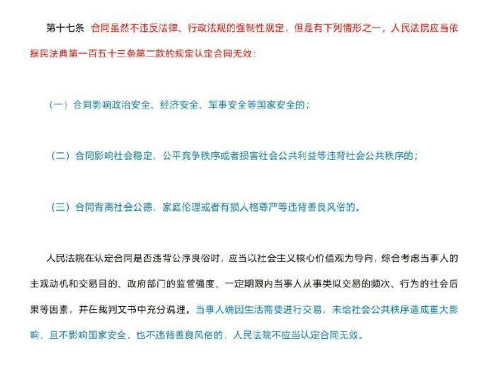  谁将十万横扫三江 北京时间 2023-12-06T10:26:47Z 1732225039913914613 RT @cskun1989: 我一直认为中共不应该把林毅夫培养成为经济学家，这纯粹是大材小用，没有发挥他天生的吹鼓手特长，如果把他提拔到政治局层面担任宣传部长，我相信9000万党员每天都会在睡梦中笑醒。林毅夫早在20多年前就预言按双轨渐进的方式改革，到2015年以购买力平价计算…   