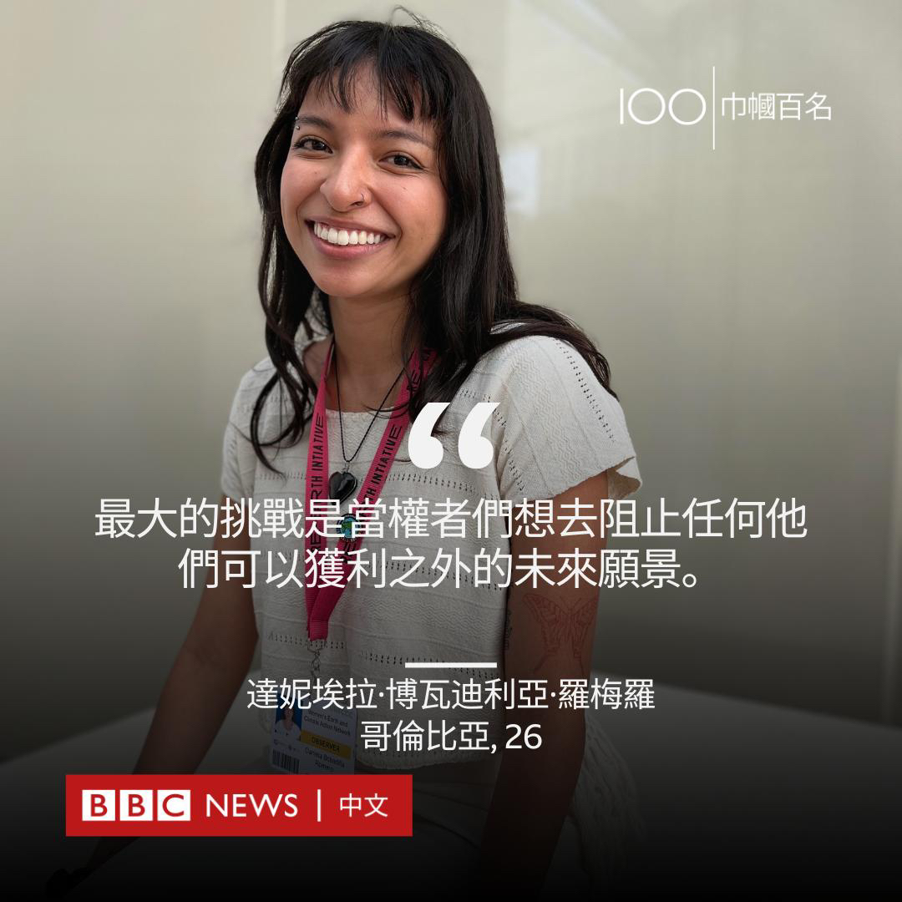
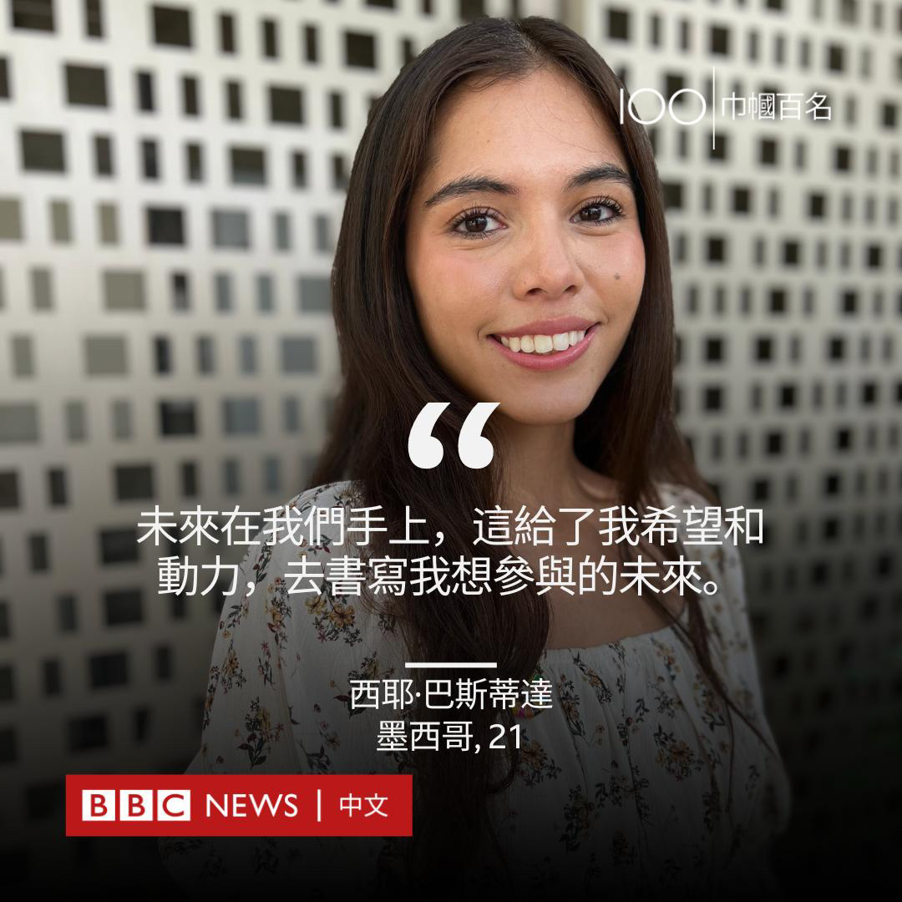
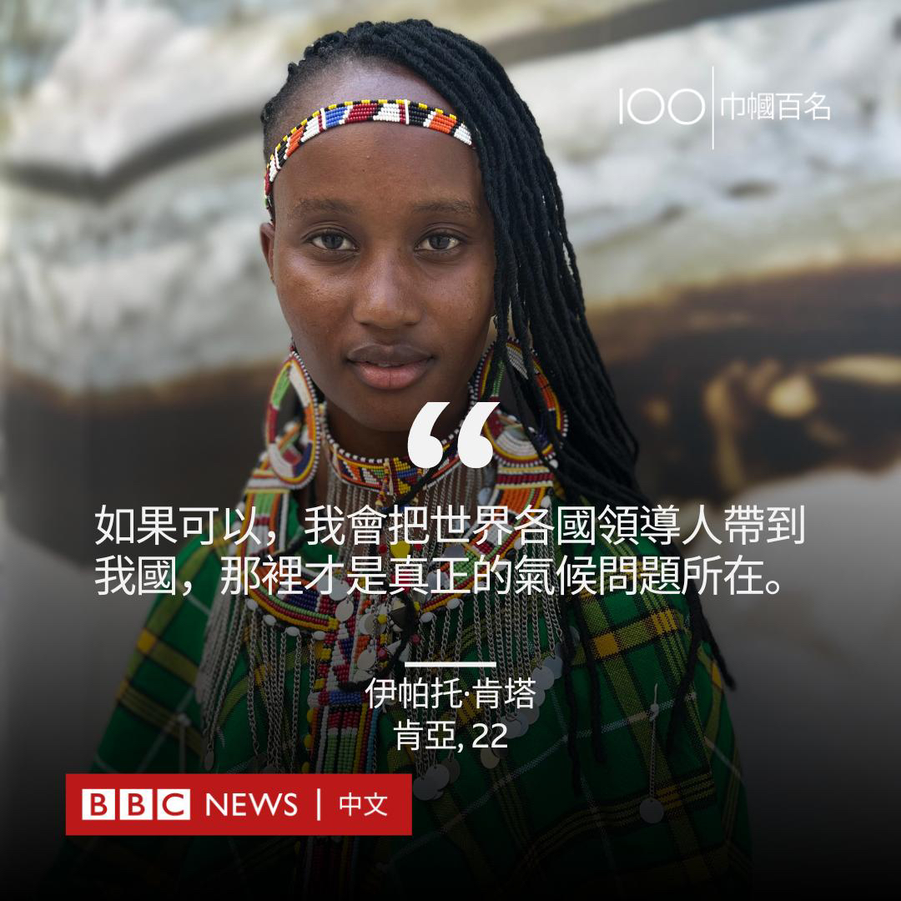
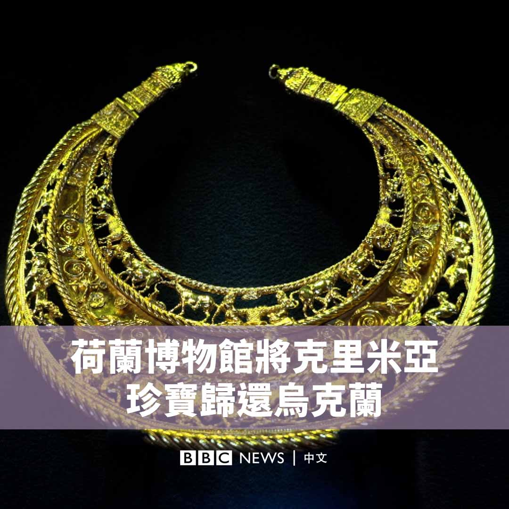

D英国广播公司BBC 北京时间 2023-12-05T17:13:53Z 1731965104076562496 救援人员在周末喷发的印尼马拉皮火山上又发现两具遗体，这使得死亡人数达到13人。

发布在网络上的画面显示，有一名幸存者在火山爆发后向母亲发送求救影片，她全身都被火山灰覆盖，脸被灼伤。 https://t.co/bR6Et9l33I   D英国广播公司BBC 北京时间 2023-12-05T15:10:27Z 1731934041790619942 巴黎人是否对自家举办的奥运会失去了兴趣？在经历了过去几周的一系列坏消息之后，这个问题似乎无法回避。https://t.co/SYhGKhrJnu   D英国广播公司BBC 北京时间 2023-12-05T13:34:26Z 1731909875037241474 联合国指出，气候变化给发展中国家女性的生计和健康构成了不成比例的威胁。但在第28届联合国气候变化大会（COP28）上，133位出席的全球领导人中只有15位是女性。

#BBC巾帼百名 将聚光灯对准了我们在COP28会议上遇到的一些年轻女性，听听她们对与自己息息相关的气候变化问题有什么看法。
#bbc100women https://t.co/xAPjr8wxbs   D英国广播公司BBC 北京时间 2023-12-05T11:51:11Z 1731883891659530251 COP28气候大会在产油国阿联酋登场，大会首日，与会各国代表就通过了关于“损失与损害”基金安排的决议。这次会议为什么重要，又将带来什么改变？https://t.co/FPGhmABtiM   D英国广播公司BBC 北京时间 2023-12-05T08:52:50Z 1731839009146720313 在2014年俄罗斯吞并乌克兰克里米亚半岛时，一批古代珍宝正被借给阿姆斯特丹的一家博物馆。它们的所有权随即引发漫长的法律拉锯战，乌克兰和俄罗斯都声称拥有这些文物。荷兰法院最终支持基辅。 https://t.co/6oj1HQYetX   