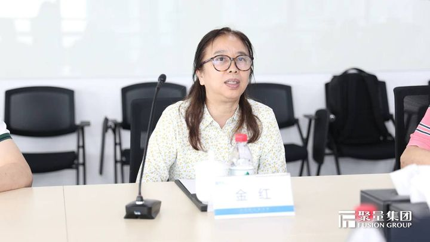

拆墙运动公号 北京时间 2023-12-05T23:06:33Z 1732053854647156771 【#2259专案组 互联网防火墙第023号嫌犯 #金红】 （更新）
   性别：女
民族：汉族
出生日期：1966年11月02日
身份证：110108196611029726
籍贯：北京市海淀区
手机/微信/QQ: 15030808320  
用户名：张亚菲
学历：对外贸易大学，学士学位，企业管理专业，
金红（恒安嘉新 CEO）
金红，董事长/公司主要创始人，对外经贸大学，学士学位，企业管理专业。高级工程师。
金红：1966 年生，中国国籍，无永久境外居留权，身份证号码
1101081966、、、、、、
国籍：中国国籍
职务：恆安嘉新(北京)有限公司董事长，法人
单位电话“010-62384566/62286708
地址：北京市海淀区北三环西路25号27号楼五层5001室
在： 恒安嘉新（北京）科技股份公司博泰雄森（北京）网络科技有限公司北京恒安嘉新安全技术有限公司国嘉网信（北京）安全技术有限公司恒安嘉新（上海）科技有限公司江西恒安嘉新安全技术有限公司 等6家公司担任高管

擅长互联网络加密和监控控制
#拆墙运动 #BanGFW #反人类犯罪 

恒安嘉新(北京)科技股份公司于2008年08月07日成立。法定代表人金红，公司经营范围包括：技术开发、技术服务、技术咨询、技术转让；计算机系统服务；销售计算机、软件及辅助设备、电子产品、机械设备、安全技术防范产品；电脑动画设计等。

联系人：张建顺
性别：男
身份证：411002196307261510

详细资料见: #BanGFW拆墙运动（建墙罪犯录）（#ban_great.wall）:https://t.co/gN41LWxL5P

 合作伙伴：#zhinawiki   拆墙运动公号 北京时间 2023-12-05T02:20:53Z 1731740371627974805 【#2259专案组 互联网防火墙第033号嫌犯 #王涛】(更新  )  
 性别：男汉,族 
 出生日期：1983年08月25日
身份证：140110198308250010
籍贯：山西省太原市晋源区
手机/微信/支付宝.QQ: 18636605598
学位：博士
国籍：中国
职务：中国软件测评中心网安中心副主任
单位地址：北京市海淀区紫竹院路66号
单位电话：010-8855993/9994/9999
主管单位
中华人民共和国工业和信息化部
中国电子信息产业发展研究院

擅长互联网络加密和监控控制
#拆墙运动 #BanGFW #反人类罪名

 王涛，男，汉族，全日制研究生学历，博士学位，毕业于北京理工大学计算机应用专业。组织评测中心对工信部、网信办、公安部等的网络安全技术支撑工作，主持工信部移动互联网APP产品安全漏洞专业库建设。

  详细资料见: #BanGFW拆墙运动（建墙罪犯录）（#ban_great.wall）:https://t.co/9Zh7mqZ3ve

合作伙伴：#zhinawiki   