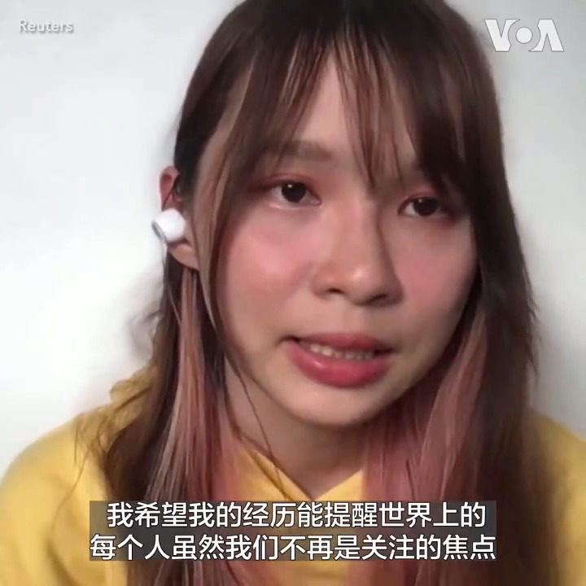

美国之音中文网 北京时间 2023-12-05T23:02:38Z 1732052867836489862 “我想要的就是自由地生活”，流亡加拿大的香港民主活动人士周庭告诉路透社说。周庭3日宣布她已到加拿大念书，不会依照香港警方的保释候查要求本月底返回香港报到。周庭还表示她希望以自己的经历提醒人们“不要遗忘香港在发生什么”。香港特首李家超5日称警方会全力追捕周庭。  
https://t.co/FiMAw8lmzT https://t.co/rV6q7gqlFZ   