自由亚洲电台 北京时间 2023-12-05T22:51:49Z 1732050145049788887 路透社报道，12月5日，穆迪评级公司发布报告，维持 #中国主权信用评级 不变，但将评级展望由“稳定”调整为“负面”。
穆迪在公告中表示，评级展望下调旨在反映越来越多的证据显示政府和公共部门将需要为地方和国有企业提供更多金融支持，这为中国的财政和经济状况带来下滑风险。
https://t.co/RHxZapwOnq https://t.co/eWN7OFJ0GV 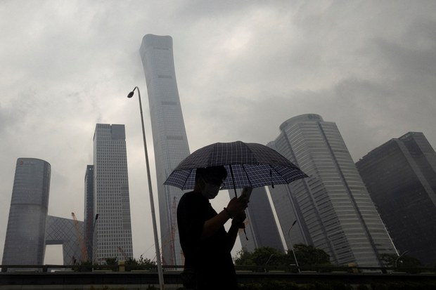  自由亚洲电台 北京时间 2023-12-05T18:41:15Z 1731987089628319993 【中国经济制裁牌失灵】
【立陶宛称北京2年经济制裁結束】
立陶宛因坚持以“台湾”为名设代表处，遭中国经贸制裁2年并未屈服，引发欧洲声援。德国媒体报道，立陶宛外长近日证实，中国解除大部份对立陶宛的经济施压，证明小国也有力量。过去北京动辄对不同意见国家祭出经济制裁手段，是否已失灵？或为取得欧洲市场软化战狼姿态？详细报道：https://t.co/dBZbskoXYg
#立陶宛 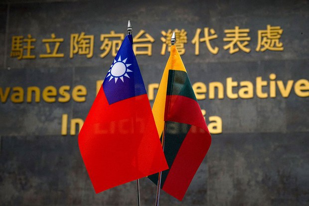  自由亚洲电台 北京时间 2023-12-05T15:18:24Z 1731936041102106835 【蒙古族青年狱中受虐 家人对外求助】
#内蒙古 锡林郭勒盟一蒙古族男子 #阿拉慕斯（汉语：阿拉木沙）涉参与斗殴，多年前被判刑15年。近期，阿拉慕斯的姑姑发视频揭发狱警虐待阿拉慕斯，每天只给一个馒头果腹，目前生命垂危。
https://t.co/hmW5SdFEbg
（图：维权网） https://t.co/sm2iVxjJB7 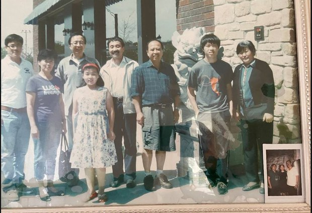  自由亚洲电台 北京时间 2023-12-05T09:30:02Z 1731848369369432237 专栏 | #夜话中南海： 六年前的央行行长接班人 #易纲 为何会落选十九届中央委员？
https://t.co/5PGvfWxen6 https://t.co/sH7xcM0h9a 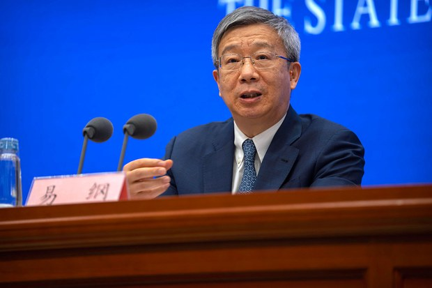  自由亚洲电台 北京时间 2023-12-05T06:45:40Z 1731807007592837592 #中欧峰会 即将召开，面对中国日益活跃的 #电动车 产业，欧盟无疑将与中方商讨如何保障欧洲厂商的公平竞争环境。那么，这场峰会又应当如何关注中国的人权问题呢？
https://t.co/4u44go8fOh https://t.co/z5l2zleRuG 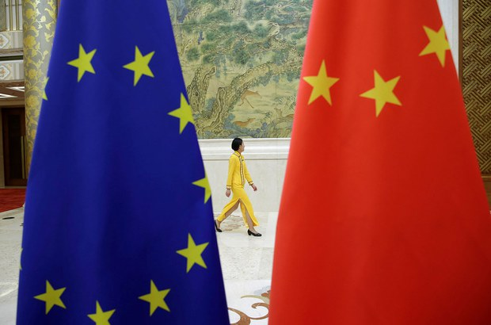  自由亚洲电台 北京时间 2023-12-05T07:48:55Z 1731822922262798578 近期，广东、福建、四川、湖北以及陕西等省份部分地区的 #健康码 再次上线。在上海，有入境者披露被要求做 #核酸检测。另外, 12月1日，中国三家生物公司 #新冠疫苗 产品被纳入"紧急使用"名单。

https://t.co/oXs8pjzgvz https://t.co/IlOZ9oxbij 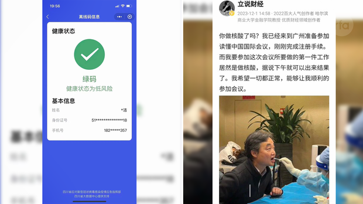  自由亚洲电台 北京时间 2023-12-05T09:00:56Z 1731841049780453496 欢迎收听和订阅播客【＃亚太报道】 https://t.co/MjLNSvVMqc
原“香港众志”成员 #周庭 宣布流亡加拿大；国际组织呼吁 #中欧峰会 关注人权；中国多地恢复 #健康码 及检测 #核酸；“#恶俗维基案”主犯 #牛腾宇 出现精神异常；习近平的改革承诺能奏效吗？ https://t.co/GP5JYEjX6R 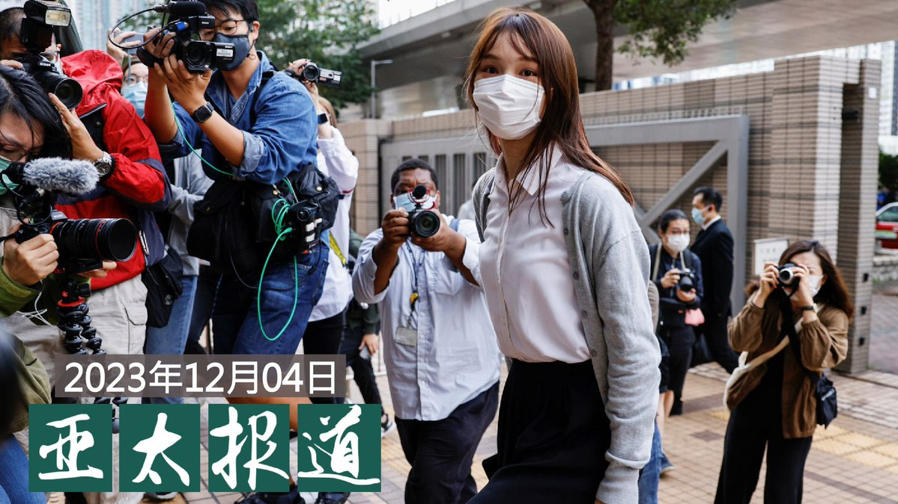  自由亚洲电台 北京时间 2023-12-05T09:08:04Z 1731842842350502219 #事实查核 @asiafactcheckcn
｜#高通芯片 会将用户信息传给美国"有关部门"？
https://t.co/GTvhssT6Xm https://t.co/jqSD4RBUWR   自由亚洲电台 北京时间 2023-12-05T03:21:33Z 1731755638756368689 是谁举报了 #王吉贤？
https://t.co/K5Zkdkam3i https://t.co/bg2ca3Xlr9 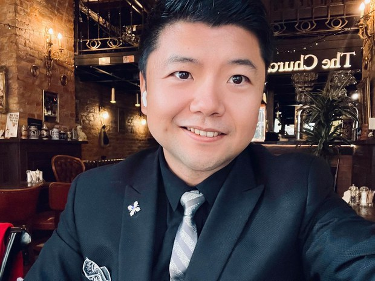  自由亚洲电台 北京时间 2023-12-05T04:40:41Z 1731775552720433283 #欧中峰会 将于北京登场，这是四年来双方领导人首次面对面对谈。然而摆在双方面前的，除了长期以来的人权问题，还有愈见紧张的经贸和地缘政治问题，这也使外界关注这次会议，会否再一次成为"聋人对话"。

https://t.co/wsbykHd0bm https://t.co/sQs0h6Z3Xu 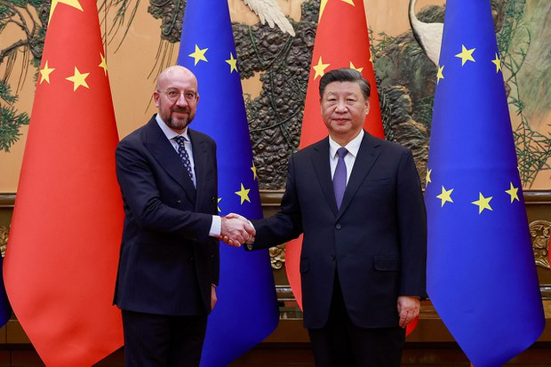  自由亚洲电台 北京时间 2023-12-05T06:02:39Z 1731796182803079287 英国《金融时报》上周六援引中国地方法院的相关数据显示，2023年，多达854万中国民众因为无力偿还贷款，而被列入 #失信黑名单。这些民众的年龄大多在18至59岁之间，比例占中国劳动人口的1%。

https://t.co/OtRhVEc9dq https://t.co/B6I6wmdYJf   自由亚洲电台 北京时间 2023-12-05T01:19:52Z 1731725014897205436 有香港"民主女神"称号的前香港众志核心成员 #周庭 在社交网站发文表示，考虑到香港的形势以及自身安全、生理及心理健康，决定弃保流亡，可能一辈子不回香港。周庭说，她在八月出国前, 被迫配合香港国安赴深圳，还要写悔过书等才能取回护照到加拿大留学。

https://t.co/QMB54kMrTg https://t.co/BfglvmUj37 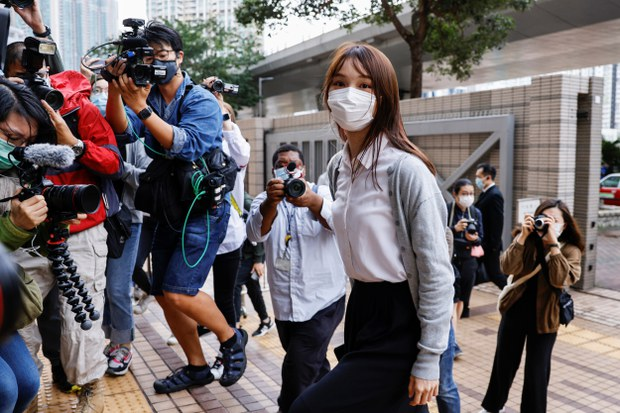  自由亚洲电台 北京时间 2023-12-05T02:36:39Z 1731744339905372357 加拿大魁北克省蒙特利尔市的两个华人服务中心，被怀疑是中国设在 #加拿大 的警察站，今年稍早遭到加拿大警方调查. 如今两个中心将向皇家骑警和检察总长提出诉讼索赔。警方表示，其应对措施已经制止了非法活动。有国会议员敦促尽快出台 #外国代理人 登记立法。

https://t.co/04eeG8ZyCN https://t.co/XPueGbqbgY 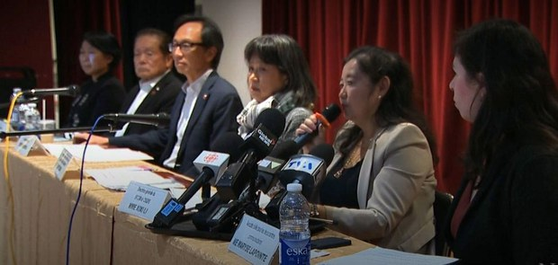  自由亚洲电台 北京时间 2023-12-05T03:45:46Z 1731761734074180000 中共领导人 #习近平 近日在上海重提“改革开放”，引发外界关注。知名学者郑永年则向北京谏言，破解美国和西方“围堵中国”的最好武器，是“单边开放”。他还透露，习近平上海之行后，当局将推出新的开放政策。那么，中国会重走“#改开”之路吗？
https://t.co/Q5m1jsDePS https://t.co/lA0nHbkots 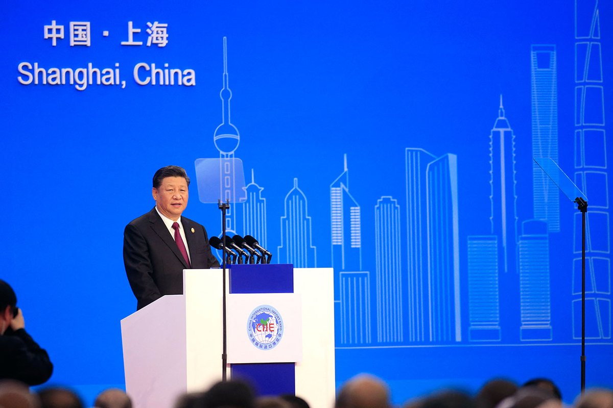  自由亚洲电台 北京时间 2023-12-05T00:48:11Z 1731717044662608093 12月4日，美国斯坦福大学中国经济研究中心教授 #许成钢 在台湾发表演说。他认为，中共领导人习近平上台后重返极权体制，因而对所谓的"东升西降"作出误判。

https://t.co/36t6ugC17t https://t.co/tyRScEhbyd 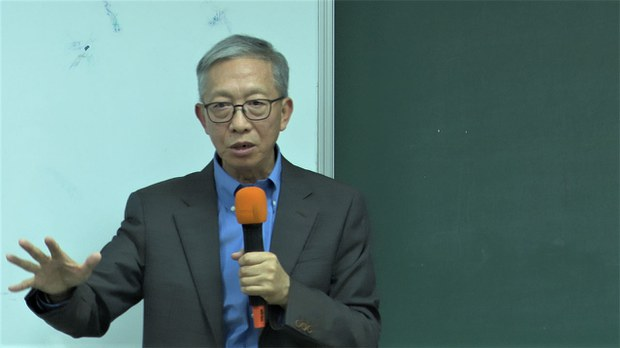  自由亚洲电台 北京时间 2023-12-05T01:57:07Z 1731734389523111977 因涉及习近平家属资料泄露而被重判十四年的 #恶俗维基案 主犯 #牛腾宇 出现精神异常，备受外界关注。当局坚持是因心理压力过大所导致。广东肇庆四会监狱否认对牛腾宇下毒。家属计划向当局提出允许牛腾宇保外就医。

https://t.co/xkE9Cuna2P https://t.co/m8oVE1xscP 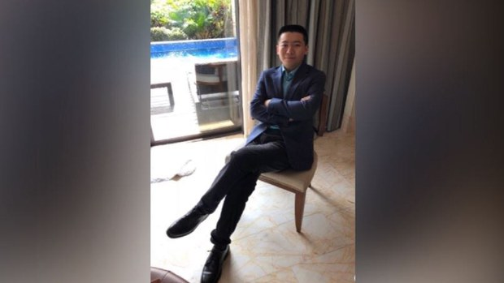  