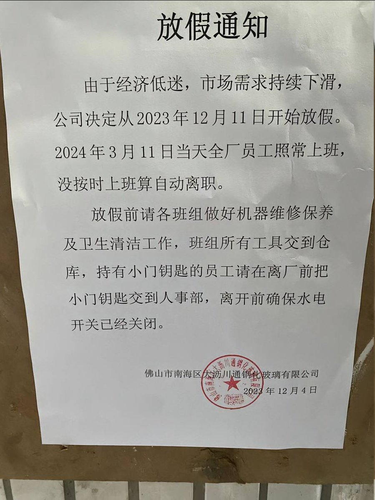
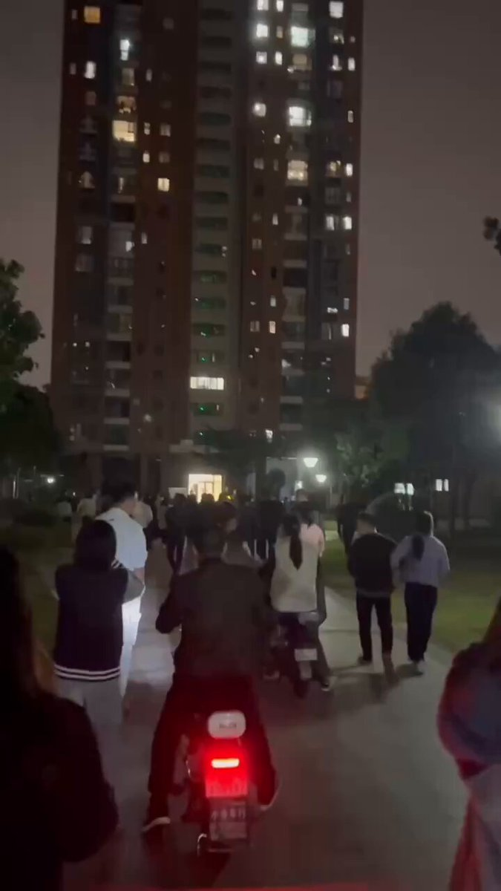

谁将十万横扫三江 北京时间 2023-12-05T21:44:54Z 1732033307419029935 广东湛江，环卫工人讨薪 https://t.co/0ltKnQy49E   谁将十万横扫三江 北京时间 2023-12-05T21:45:57Z 1732033568891957382 佛山一工厂从4日起放三个月假 https://t.co/JX6zWhMkpA   谁将十万横扫三江 北京时间 2023-12-05T21:54:13Z 1732035652638924840 RT @jakobsonradical: 近日，广西一城管持刀爆粗口殴打摊贩，还向摊贩索赔5000元。摊贩在找到视频证据后已经重新报案。 https://t.co/8MRtL7yM9o   谁将十万横扫三江 北京时间 2023-12-05T22:19:05Z 1732041909378670887 12月4日深圳，深铁瑞城（国企）拖欠农民工工资 https://t.co/keZGV9YFDK   谁将十万横扫三江 北京时间 2023-12-05T22:26:12Z 1732043701550235658 12月4日东莞，达鑫江滨新城小区，物业随意涨价超过40%，闹了一年多了，业主投诉政府被忽悠，业主集体抗议，要投票换物业 https://t.co/xSi2R5knLy   谁将十万横扫三江 北京时间 2023-12-05T22:30:32Z 1732044791586918774 12月4日湖南岳阳，数博环球工业园，拖欠农民工工资，上个月28号开始讨薪，上演跳楼数次，仍无结果 https://t.co/XLHTnxHvUb   谁将十万横扫三江 北京时间 2023-12-05T22:30:48Z 1732044855709503725 河北省石家庄市赞皇县政府入户抢劫，到农民家里拉走老人一吨煤炭，中国政府干得好啊 https://t.co/oZfb8QZXbW   谁将十万横扫三江 北京时间 2023-12-05T22:42:37Z 1732047830116888954 12月4日上海绿容违建湿垃圾站迫害居民儿童，上海普陀绿容联合开发商欺骗周边业主，违法建设湿垃圾站，倒走流程，迫害居民健康。市民在普陀区政府门口抗议 https://t.co/plvBxYujNF   谁将十万横扫三江 北京时间 2023-12-05T12:36:21Z 1731895258928283676 RT @DungeonsLayman: https://t.co/MypPTwjb42分享一篇清华大学魏杰教授关于当下宏观经济讲座墙内已经屏蔽/?utm_source=share&amp;utm_medium=web2x&amp;context=3   谁将十万横扫三江 北京时间 2023-12-05T10:20:56Z 1731861179289776245 国资委旗下五矿二十三冶建设公司拖欠工资 https://t.co/uoekbZIun9   谁将十万横扫三江 北京时间 2023-12-05T10:23:50Z 1731861910625395071 RT @CDTChinese: 一次，谈到文革抄家，我的在美国长大、已读大学二年年级的外孙女问我：“为什么同意他们抄家？为什么不反抗？”我愣在那半天不知怎么回答——“同意”二字叫我犯难，“反抗”二字叫我羞愧。 https://t.co/bJhnb0PrjL   