A李老师不是你老师 北京时间 2023-12-04T19:03:32Z 1731630311241404716 12月4日，人民日报用习近平第三任期宣誓视频来宣传国家宪法日。 https://t.co/vQk3oIp5Mk   A李老师不是你老师 北京时间 2023-12-04T19:34:28Z 1731638093780852835 12月4日8时30分，上海。
交警在南泉北路张杨路口执勤时，发现一名外卖小哥存在交通违法行为。
民警在查处过程中，外卖小哥自行离开现场。约半小时后返回现场，表示不愿接受处罚，并持一把西餐刀将民警手部轻微划伤。
随后民警在周围群众的帮助下迅速将其控制。 https://t.co/E14uPII9iX   A李老师不是你老师 北京时间 2023-12-04T19:40:41Z 1731639659120271651 2023年6月26日，黑龙江鸡西市。
一三岁女童因肺炎在鸡西鸡矿医院治疗时，疑似因医生药物使用不当死亡。  
据孩子母亲描述，6月26日，孩子在医院突发寒颤和高烧。于是大夫便给孩子使用了地西泮和苯巴比妥这两种药物，随后孩子便陷入深度昏迷。经医生抢救无效后死亡。  医疗事故发生后，家属要求查看事发时的监控，但院方表示监控丢失。
由于医院始终不提供补充材料，导致事发后距今五个月鉴定中心无法受理。  
12月3日，悲痛欲绝的家属在事发医院门口，抱着孩子的遗照维权。   A李老师不是你老师 北京时间 2023-12-04T20:15:53Z 1731648516957569529 12月1日，在上海宝龙集团讨薪的农民工们已经露宿了一个月，几名警察用蓝色的围布将讨薪工人们遮挡住 https://t.co/XpyiZ5T24M 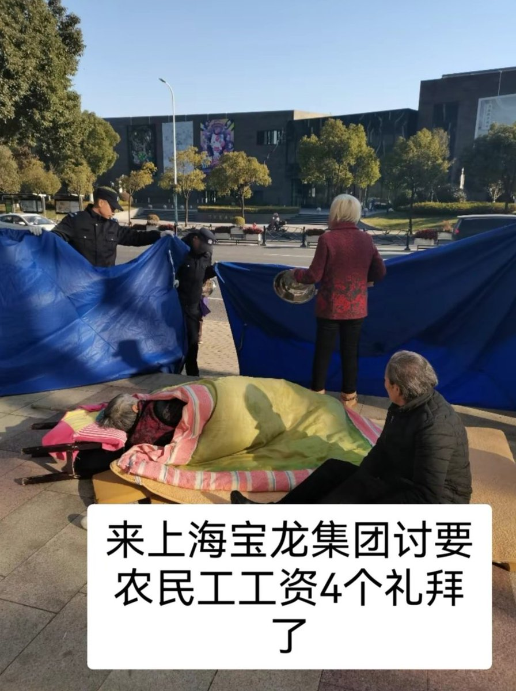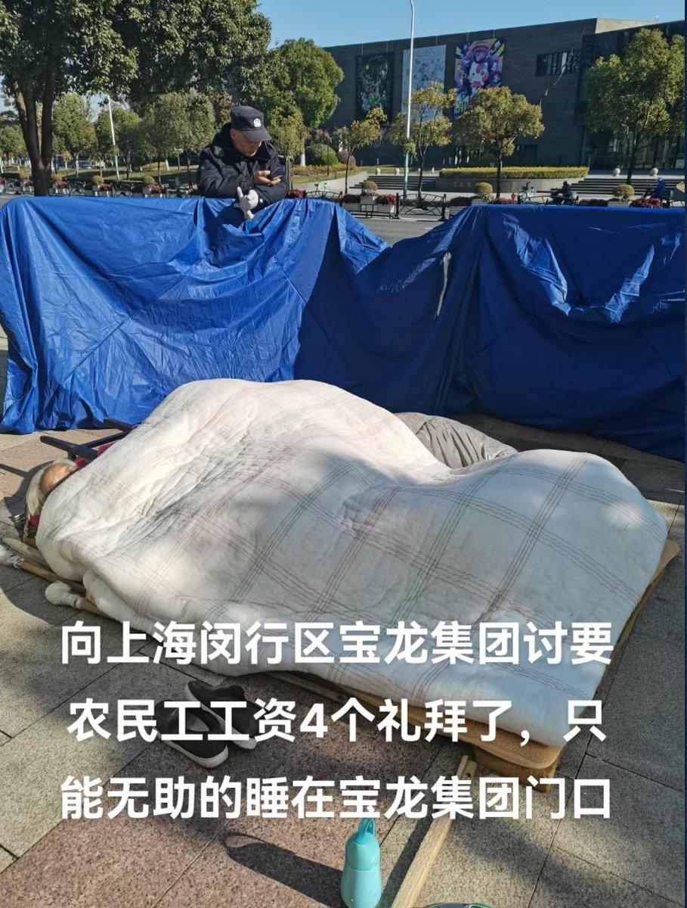  A李老师不是你老师 北京时间 2023-12-04T20:19:34Z 1731649444561420392 “教书是老师的主业还是副业？”  
12月2日媒体报道，28岁的金贝贝在南方一所中学任教四年。日常工作里，除了教学任务外，她常常陷入填写各种材料和表格、检查、评估、验收、比赛的循环中，导致“好好上课成了奢望”同为教师的何雪夕深有同感，她觉得自己被大量非教学任务“压得喘不过来气”  
何雪夕作为班主任，她承担管理班级的责任，学校为了“看见”管理内容，会安排教师们填写各种表格。包括每日缺勤记录表、每日、每周、每月每学期的安全记录表、班主任工作手册，行为规范课堂记录表、等等，表格一多，何雪夕免不了造假。 
 2021年，国家中小学生心里健康教育课题组在针对教师心里健康的一次检测结果显示:69%的教师感到压力大、焦虑情绪偏高、只想安静的做个老师。 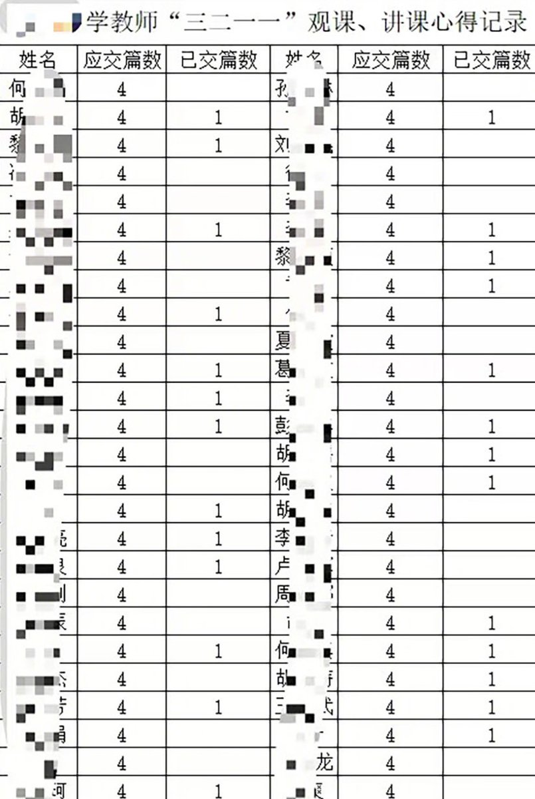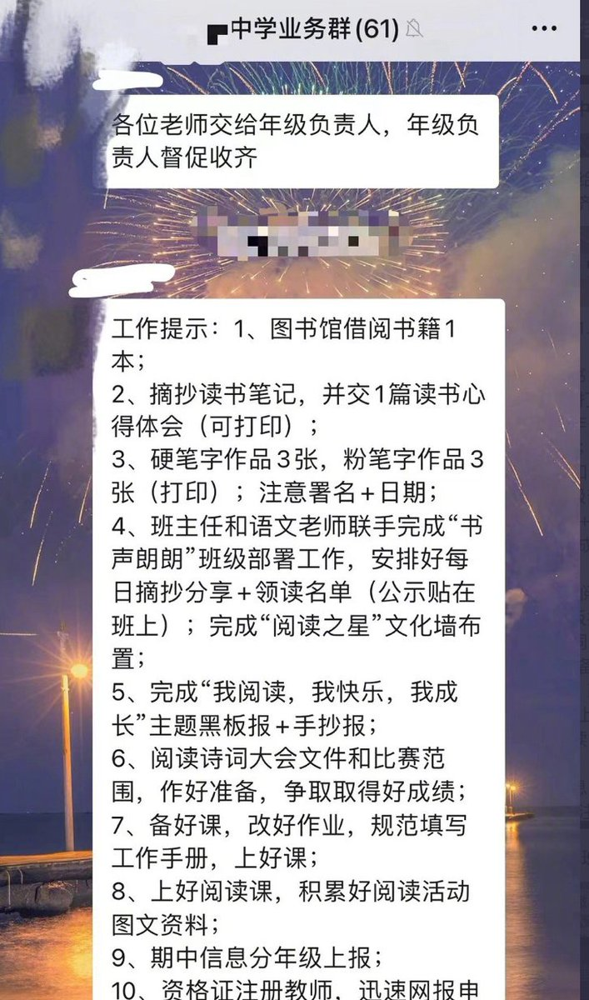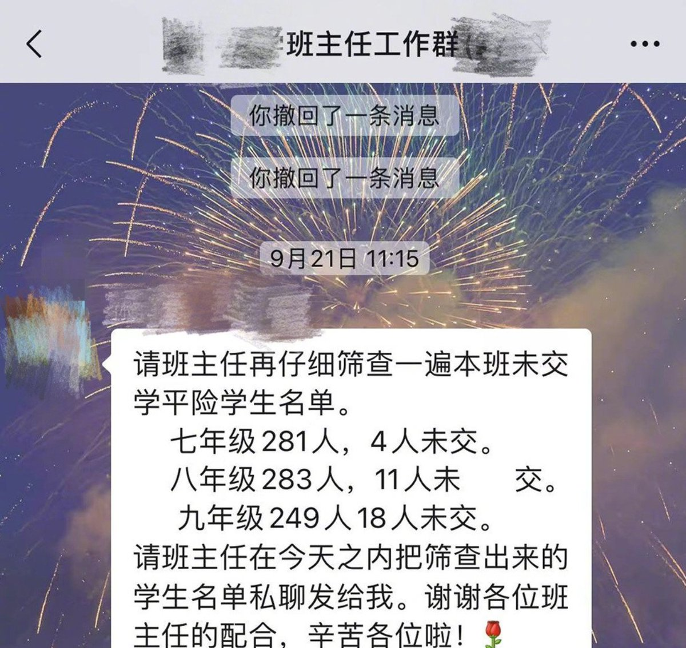  A李老师不是你老师 北京时间 2023-12-04T16:15:55Z 1731588127129534472 网友投稿
近日，有学生在江苏扬州江海职业技术学院二食堂麻酱盆中发现老鼠
校方回应属实，目前各部门介入调查。
12月3日，学生删除了该视频。 https://t.co/64RapooMiu   A李老师不是你老师 北京时间 2023-12-04T03:47:43Z 1731399837961064686 近日，北京规模最大的中学——人大附中朝阳分校的初中学生们因学业压力过大等问题，在微博公开抗争发长文控诉校长。
文中称，每天安排12节课，七点十分就要到校，晚上九点才能回家，中间吃饭时间过短，没有自习时间，完全是“填鸭教育”等。
目前后续家长反馈称，学校家长会已经通知了，改8点上学，取消分层走班，晚自习自愿学习，不考试不讲课。 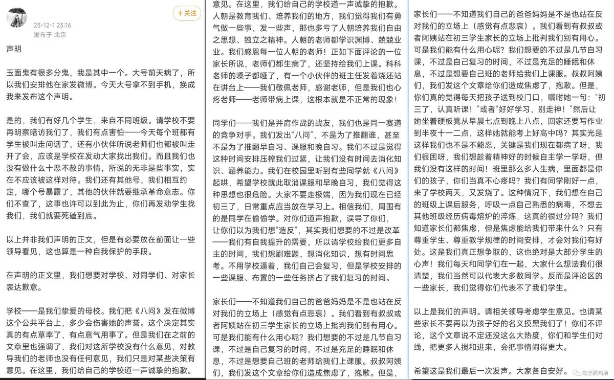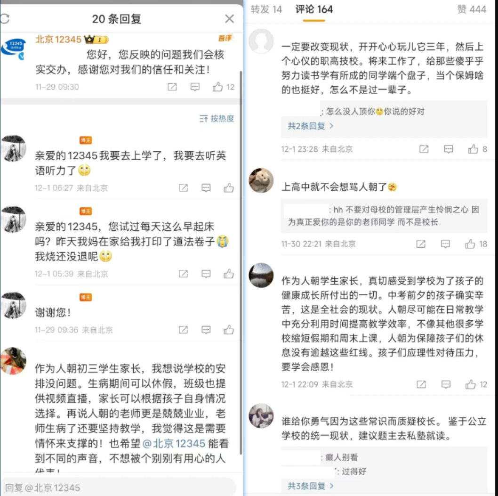  A李老师不是你老师 北京时间 2023-12-04T00:37:20Z 1731351926585831688 周婷讲述自己被国安人员要求参观深圳改革开放展览馆和腾讯总部，并写感谢信，以换取自己的护照和出国留学的机会
现在，考虑到自己的安全和香港日益恶化的法律环境，她决定永远不再回香港   A李老师不是你老师 北京时间 2023-12-04T00:04:52Z 1731343753007243775 后续，网传机场早前追查并要求删除相关图片和朋友圈 https://t.co/me6Mp0cO41 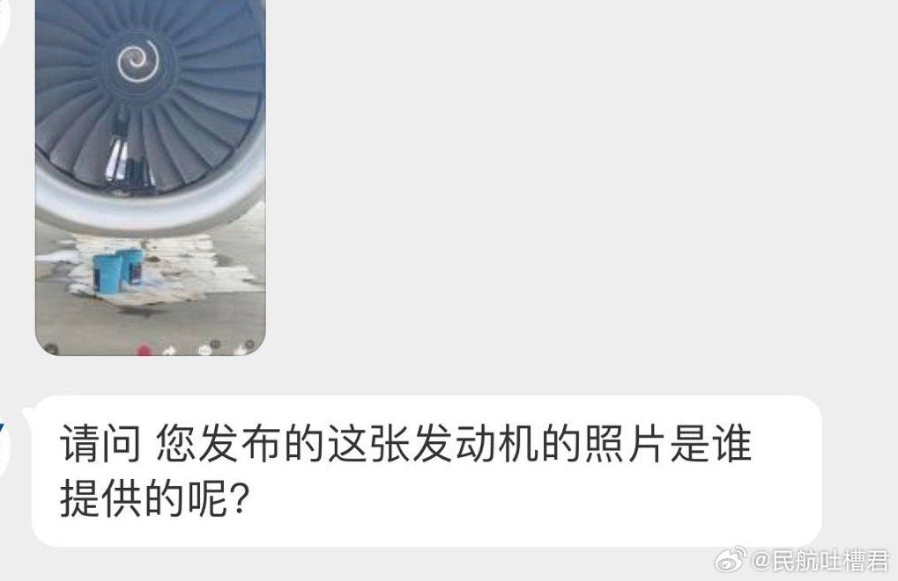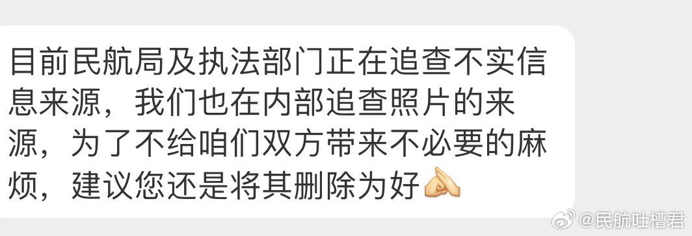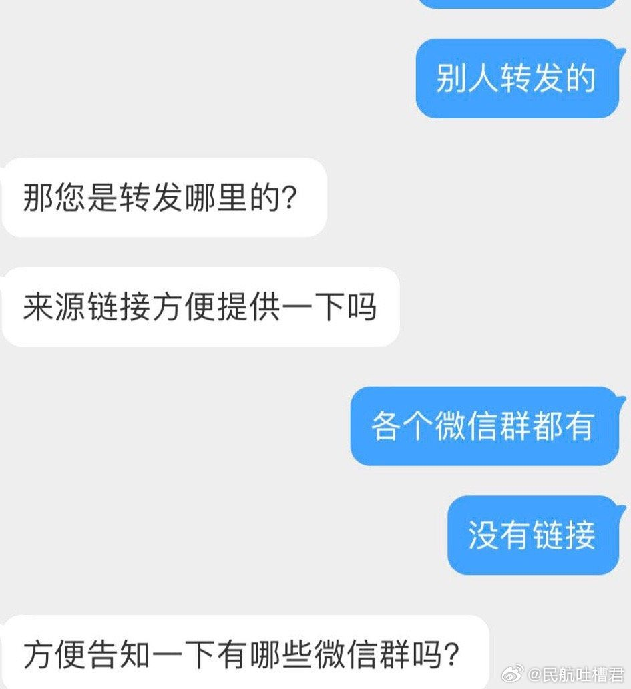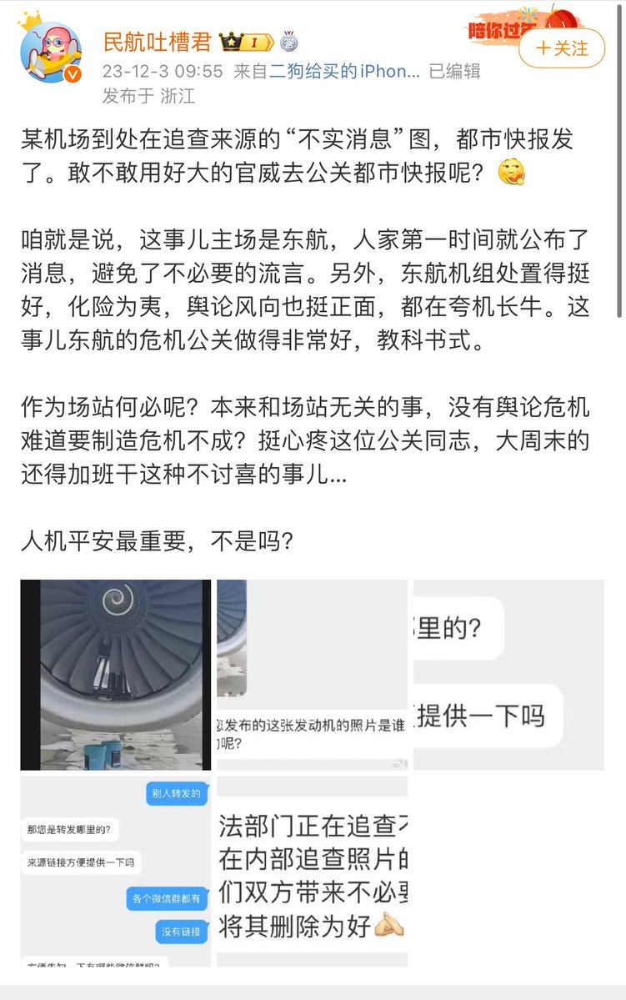  