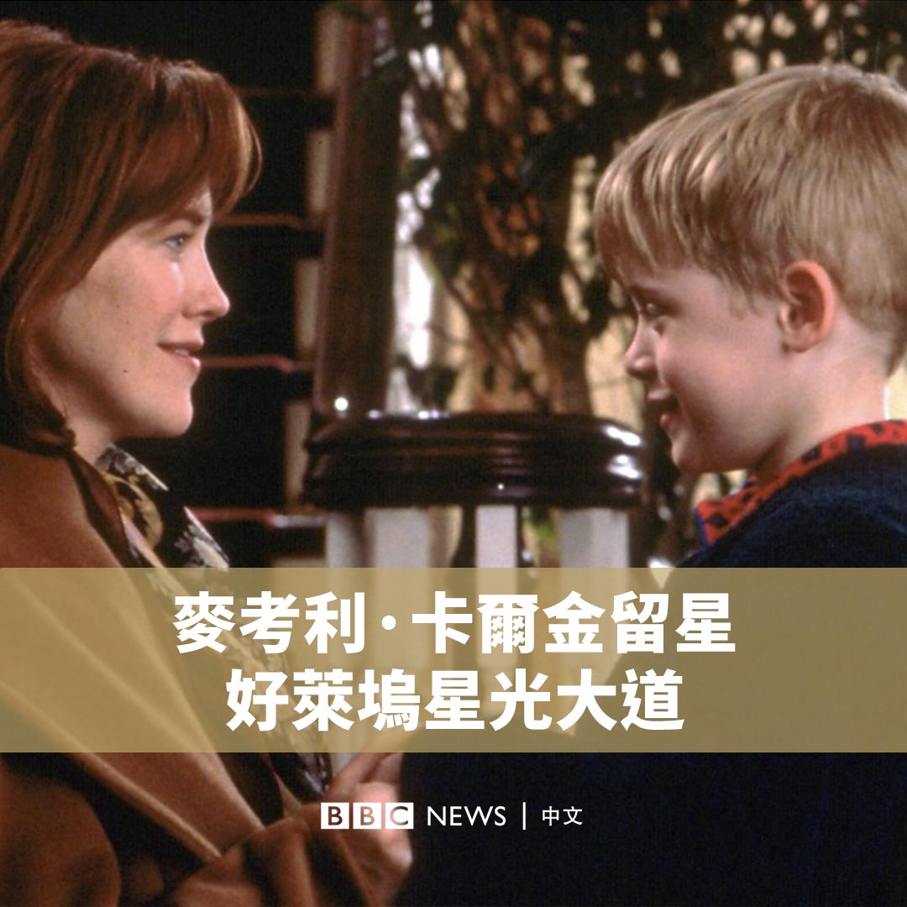
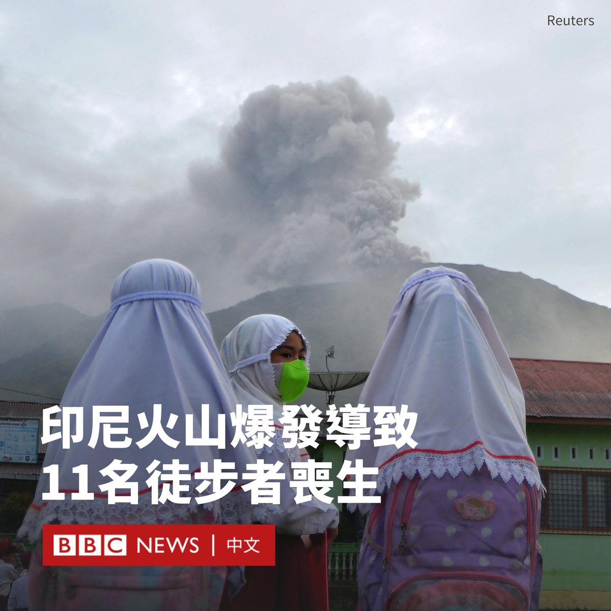

D英国广播公司BBC 北京时间 2023-12-04T12:24:07Z 1731529790665199658 曾以电影《小鬼当家》（Home Alone）成为全球最红童星之一的麦考利·卡尔金（Macaulay Culkin），终于在43岁时留星好莱坞星光大道，其是这个地标自1961年建成以来的第2765颗星。 https://t.co/nNVncbp9qK   D英国广播公司BBC 北京时间 2023-12-04T13:57:35Z 1731553314209419575 在印度尼西亚马拉皮（Marapi）火山上周末喷发后，救援人员称，在火山口附近发现了11名登山者的遗体。

有三人在周一（12月4日）获救，但由于仍存在小规模火山爆发，对另外12名失踪人员的搜救工作已经暂停。

火山爆发时，该地区有75名徒步旅行者，但大多数人都已安全撤离。

马拉皮火山是印尼127座活火山之一，其于周日（12月3日）爆发，喷出的火山灰高达3千米。

当局已实施第二高的警戒级别，并禁止居民进入火山口3公里范围内。

巴东搜救署（Padang Search and Rescue Agency）负责人阿卜杜勒·马利克（Abdul Malik）表示，有三名获救者在火山口附近被发现，他们“身体虚弱，有一些烧伤”。

周一早些时候，约有49名登山者从该地区撤离，其中许多人也被烧伤。

有画面显示，当火山喷发时，巨大的火山灰云笼罩天空，村镇和道路都被火山灰覆盖。

马拉皮火山高2891米，位于苏门答腊岛最西部。   D英国广播公司BBC 北京时间 2023-12-04T01:27:26Z 1731364532902367401 目前因牵涉壹传媒创办人黎智英“勾结境外势力危害国家安全”案件，正保释候查的香港民主派活动人士周庭，在社交媒体上宣布自己已在加拿大多伦多升学，预计不会依令于本月返港向警察报到，即“弃保潜逃”。

周庭12月3日在其27岁生日之际透过社交媒体作出此宣布。她称：“经过深思熟虑，包括考虑到香港的形势、自身安全、我的生理和心理健康，我决定，不回去报到了，也大概一辈子不会回去了。”

周庭2020年8月10日因黎智英案被香港国安警察拘捕，同年12月2日因“煽惑他人参与未经批准集结”等罪名被判监10个月，2021年6月12日获释后即回复保释候查状态，须向国安警察交出护照，并定期报到。

中国香港警察暂未就周庭的言论发表回应。

在2020年被判刑前不久，周庭被列入当届BBC巾帼百名（BBC 100 Women）名单。 她是黄之锋等人所创办的学生议政团体学民思潮，以及后来香港众志党的主要成员，有“学民女神”等称号。 由于她日语流利，曾到日本参与谈论香港政局的活动与媒体节目，在日本有一定的知名度。

周庭称在获得多伦多方面院校有条件取录后向香港国安警察提出离境申请，被国安警察要求签署“悔过书”，承认后悔参与昔日的民主派政治活动，“也不会与相关的人士，包括学民和众志的成员联络”。 今年7月，国安警察要求她在国安警察陪同下前往中国大陆，“回到香港，我再次被国安要求写下‘感谢警方安排，使我能了解祖国的伟大发展’的信件”。 至9月中，国安警察批准其离境申请。

周庭写道：“我不想再被迫做不想做的事情，也不想再被迫到中国大陆了。这样下去，即使我人安全，身体和心灵也会崩溃。”

她又称：“来到加拿大安顿下来后，我才慢慢开始思考12月的事，在得出答案前，我还买了12月回港的机票。所以如果有人要说我处心积虑欺骗国安，那绝对是错误的陈述。”

相关内容：
周庭获选BBC巾帼百名：一位香港年轻示威者的恐惧与希望 https://t.co/0LyL2fmGBR   