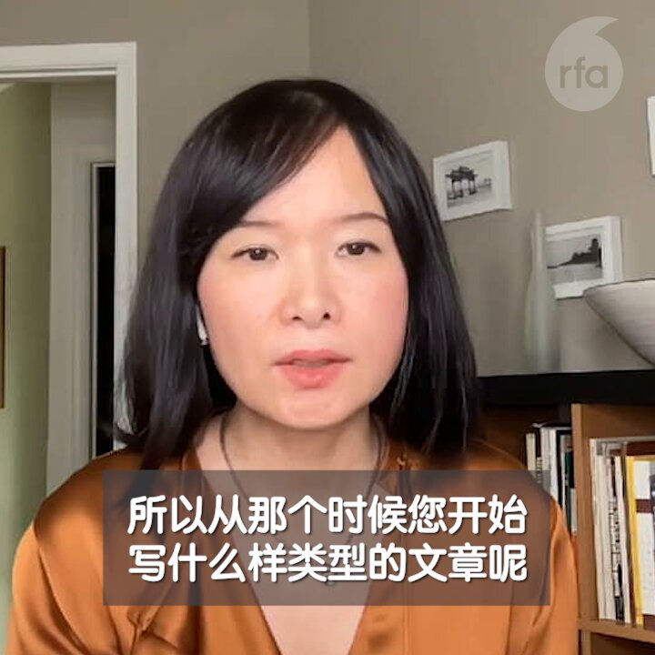
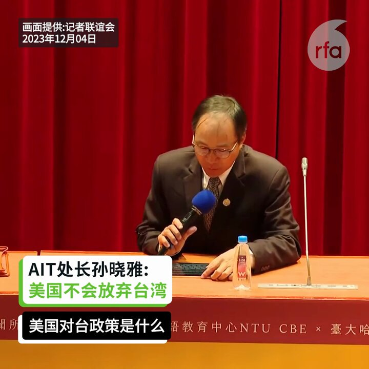
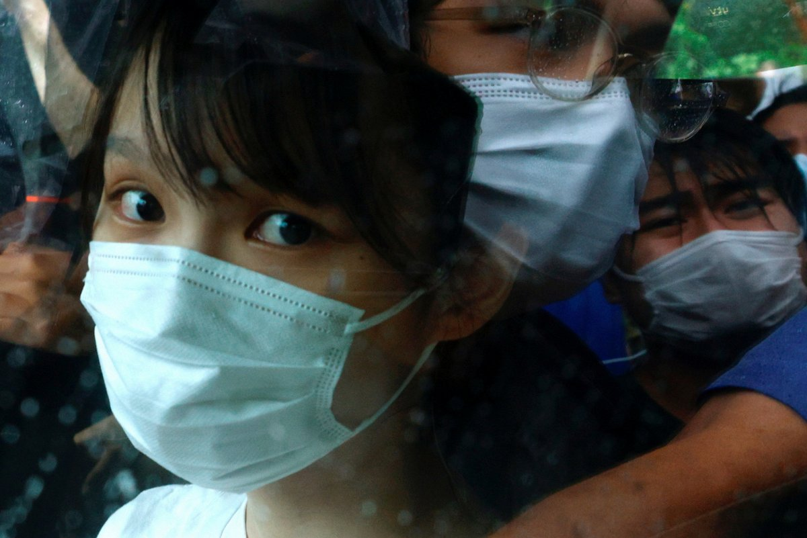
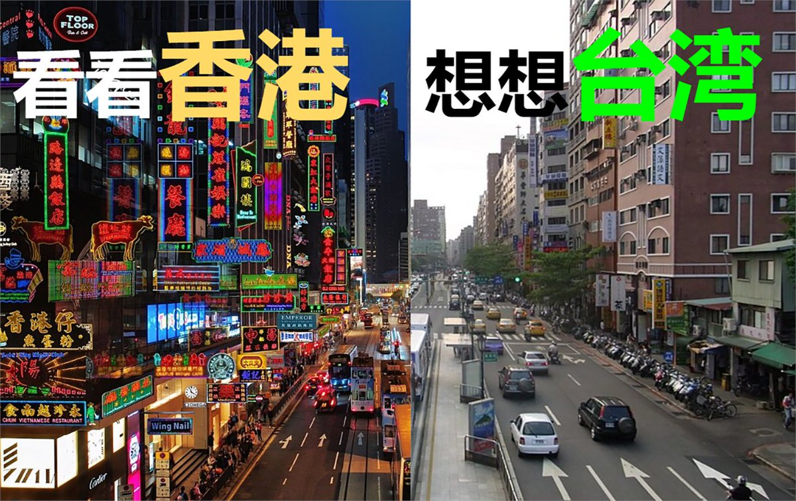

自由亚洲电台 北京时间 2023-12-04T22:00:01Z 1731674721748717826 【“#二大爷”#邓海燕：了解中共黑历史 才知道自己被骗那么久！】
前刑警“二大爷”邓海燕在中国政府体制内工作十七年，却因为在网路上发表文章把自己写成了 #反贼。刑警生涯让他印象最深刻的是什么？多次被请喝茶抄家的他，对想翻墙上网的大陆民众有何建议？https://t.co/gmW3GTVsc5 https://t.co/f0Dbsz3JfZ   自由亚洲电台 北京时间 2023-12-04T19:21:24Z 1731634807216771127 【AIT处长孙晓雅: 美国不会放弃台湾】
美国是否会基于对中国利益而抛弃台湾？美国在台协会（AIT）处长孙晓雅4日明确表示：“答案是否定的”。她说想不出美国有任何其他政策，能像对台政策一样，获得如此多跨党派、跨部门的强力支持，且又深受美国人民欢迎。#AIT #孙晓雅 https://t.co/sTSSVqvj8K   自由亚洲电台 北京时间 2023-12-04T11:35:21Z 1731517520174264509 【周庭决定不返港】
【港警吁勿走“不归路”】
在加拿大读书的原“香港众志”副秘书长周庭，因涉国安案件，保释至12月，她12月3日公开表示决定不回香港向警方报到。香港明报报道，港警呼吁她不要走上不归路，背负“逃犯”之名。https://t.co/f5MPYbiX7c #周庭 #香港國安法 https://t.co/ZCv2SQSWFS   自由亚洲电台 北京时间 2023-12-04T00:31:01Z 1731350334985973921 https://t.co/kFiacOxxut   自由亚洲电台 北京时间 2023-12-04T09:26:38Z 1731485128768065982 https://t.co/I5dAyGNrC4   自由亚洲电台 北京时间 2023-12-04T05:46:41Z 1731429775653110116 【雷蒙多：“中国不是我们的朋友”】美国商务部长 #雷蒙多 在加州 #西米谷 年度国防论坛上点名北京是美国“有史以来面临的最大威胁”。
详情：https://t.co/fBNtGQZPWX   自由亚洲电台 北京时间 2023-12-04T06:48:29Z 1731445328891490450 内蒙古基督徒 #王洪兰 等10人因补贴销售南京正规出版的《圣经》，于2021年被 #呼和浩特回民 区公安分局以涉嫌“非法经营罪”抓捕，9人被刑拘，近日公审。
详阅：https://t.co/bZTCPRPW77   自由亚洲电台 北京时间 2023-12-04T07:25:10Z 1731454558168137961 一架从上海飞香港的东方航空航班在飞行过程中，电源网络中断，并在空中剧烈抖动，因而备降厦门做检查。落地后可见左侧发动机部分叶片断裂。
详阅： https://t.co/rMe8ctWgkL   自由亚洲电台 北京时间 2023-12-04T07:59:54Z 1731463298883699083 美国在台协会处长 #孙晓雅 表示，美国相信，台湾并无迫在眉睫的武力入侵威胁，但重申不会改变美国向 #台湾 销售防御性武器的承诺。
详阅：https://t.co/IwWg4kJATT   自由亚洲电台 北京时间 2023-12-04T02:48:44Z 1731384993471980011 【蔡英文呼吁选民: “看看香港、想想台湾”】
台湾 #蔡英文 在台北立委联合竞总成立大会上表示，没有人要战争，大家都要和平，但 #台湾 “不要香港式和平，要有尊严的和平，经济才能稳健发展”。
详阅：https://t.co/V0RlT28YDM https://t.co/tsdSCnzAPA   自由亚洲电台 北京时间 2023-12-04T03:26:24Z 1731394472255098982 【厦门最大家庭教会 12月6日法院受询】具有百年家庭教会传统的 #巡司顶教会 2019年被取缔，不仅罚款25000元，更被警察围困长达30天。其后不断更换的聚会地点都被公安冲击。#希伯夫妇 法院败诉后再上诉，维持原判。
详阅：https://t.co/1ByTB9dOCr   自由亚洲电台 北京时间 2023-12-04T04:34:24Z 1731411584054870212 【英国视中国、哈马斯、俄罗斯为世界危险因素】
在加州 #AUKUS 英美澳防长会议上，英国防大臣 #沙普斯 说：“在现今这更危险的世界里，俄罗斯发动乌战，哈玛斯在中东肆虐，中国在印太破坏航行自由。我们从未像现在这样需要更多创新和开创精神。”
详阅：https://t.co/GXgOf5T1u8   自由亚洲电台 北京时间 2023-12-04T05:14:23Z 1731421647209365890 【周庭: "大概一辈子不会回去了"】正在加拿大求学的原“香港众志”副秘书长 #周庭 宣布，考虑到 #香港 形势、自身安全和心理健康，决定不回港报到。
详阅：https://t.co/nYBKsvpIeT   自由亚洲电台 北京时间 2023-12-04T06:16:33Z 1731437289543249944 四名西藏日喀则克玛乡 #拉东寺 僧人因“为达赖喇嘛祈愿”遭拘捕3个多月后，当局至今仍未向家人告知关押地点。
详阅：https://t.co/K8xROA96LZ   自由亚洲电台 北京时间 2023-12-04T04:00:45Z 1731403114622615743 【萧美琴谈全球共识: 维持现状是最大公约数】民进党副总统参选人 #萧美琴 表示，没有台独路径图，#台湾 主权属于全体台湾人民，台湾人要更有自信。又期盼保持韧性，为更健全的 #民主 社会打拼。
详阅：https://t.co/VcS1eVK4Yf   自由亚洲电台 北京时间 2023-12-04T01:01:59Z 1731358128271241304 【习近平: 中白友谊牢不可破, 是真朋友好伙伴】
白俄罗斯总统 #卢卡申科 周日启程前往北京，与中国领导人 #习近平 会谈, 议程包括贸易、经济、投资和国际合作问题。卢卡申科是俄罗斯总统 #普京 的“亲密盟友”。
详阅： https://t.co/wOo3DKuUCJ   自由亚洲电台 北京时间 2023-12-04T02:10:19Z 1731375326205292784 【疫苗受害儿童家长被判四年监禁】
2016年贾小玉两个半月大的儿子，因接种脊灰 #疫苗 导致左下肢瘫痪，#肌肉萎缩，关节变形；且患上自闭症，不能与人沟通。#贾小玉 上访，被顺平县警方连续3次拘留。
详情：https://t.co/OrpjzTppz6   