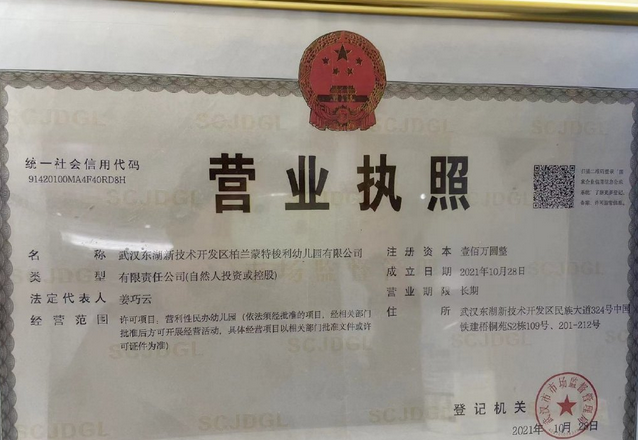
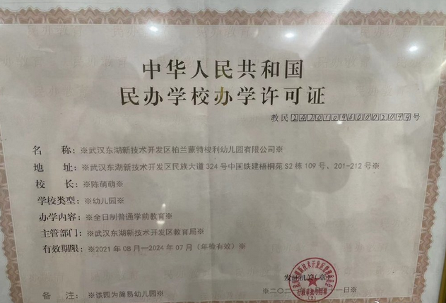

谁将十万横扫三江 北京时间 2023-12-04T09:27:25Z 1731485326265483729 转网友：我是一个最卑微最低层的农民工，自己干活的工资倒处低三下四的找人要工资。找劳务公司要，劳务公司说上面没给他发钱他没钱发。找总包，总包根本不理，找甲方，甲方说按合同已付总包了。找劳动监察给调解说发工资，结果还是不给发。最后劳动监察立案，2023年5月16号立的案到现在也没有结果。再找劳动监察他说让找法院，现在全社会都说帮农民工讨薪，可到底谁能帮到我们。
本人于2021年4月至2022年7月，在西安市国际港务区绿地丝路全球贸易港住宅一期项目，从事装修材料搬运工作，从七月工程完工以来分包单位以各种理由拖欠工资。
中间由建设单位和劳动监察部门，前后三次协调支付工资，分包单位一直以总包单位未付款为由，拖着不给我们付工资。
实属无奈借此平台，望有关部门领导能给我们农民工主持公道。能让我们尽快拿到工资。
建设单位：西安陆港置地有限公司
总包单位：上海博湾建设集团有限公司
分包单位：陕西聚格环保科技有限公司   谁将十万横扫三江 北京时间 2023-12-04T09:30:14Z 1731486033899106364 武汉东湖新技术开发区柏兰蒙特梭利幼儿园倒闭拖欠100多万工资，教师讨薪突发心梗

2023年11月，幼儿园发生多次停电事件，小孩在学校期间没有饭吃，后学校停课，近百名在园幼儿无学可上。家长教师维权，过程中有老师病倒被120抬走，园方拒不负责。
诉求：
1.请求教育局，监督幼儿园，退该家长和老师的学费和工资。
2.幼儿园直接倒闭不退款，东湖高新区是否有监管不力之责   谁将十万横扫三江 北京时间 2023-12-04T09:48:27Z 1731490619728806375 RT @Zuki_chiyuki: 声明：本包蜜没有开盒本领，本包蜜只会到处收集信息，以下是本包蜜针对Corrine老师收集的相关信息，如有不正确之处恰恰说明本包蜜没有恶意开盒。

Corrine，女，30多岁，原中学语文教师，现在润到了马来西亚，手上至少但不限于以下16个账号…   谁将十万横扫三江 北京时间 2023-12-04T09:57:01Z 1731492771671024095 RT @Pandazhq: 这两天《经济观察报》报道了一件事，《安徽一患者家属查出三甲医院超收
10万医疗费 调查显示超收21万》，引起无数人的愤慨，文章发布刚两个小时就有超过34000条的评论。

根据当事人的自述，情况大概是这样的：… https://t.co/yviXEq…   