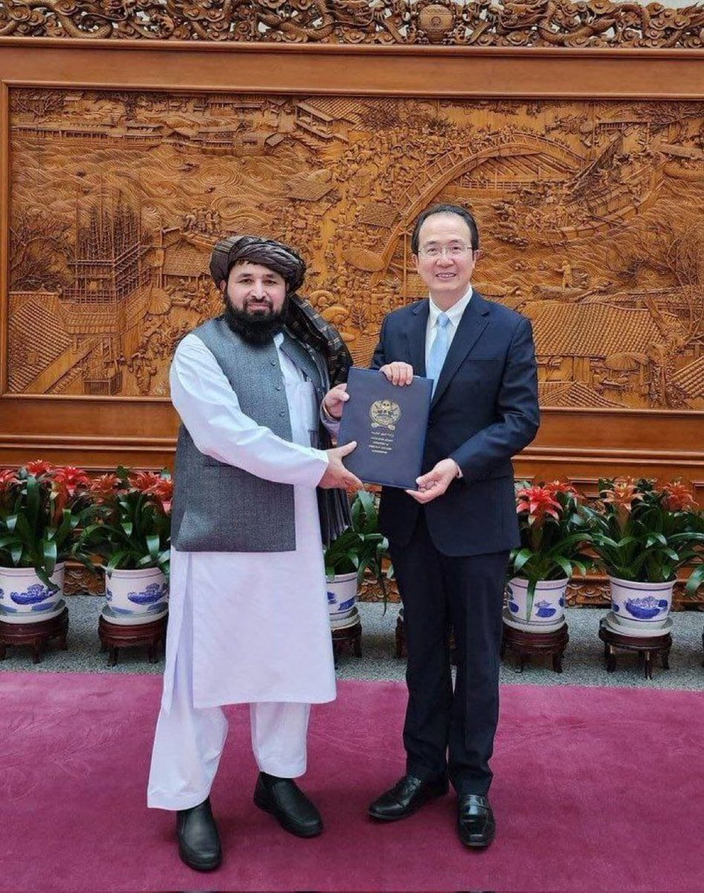

拆墙运动公号 北京时间 2023-12-03T01:18:06Z 1730999797169995991 两个无耻极端政府的国   拆墙运动公号 北京时间 2023-12-03T01:20:31Z 1731000404702363820 #拆墙运动 关注中国在押政治犯 #王立恒   拆墙运动公号 北京时间 2023-12-03T01:26:40Z 1731001953608511835 #拆墙运动 关注被中共广西南宁关押迫害的 #覃永沛  律师   拆墙运动公号 北京时间 2023-12-03T01:29:11Z 1731002584373055767 RT @Lydia981402: #恶人榜信息征集中心 关注和征集 迫害   #尹旭安 作恶者的个人信息. #恶人榜
爆料：Liang20201219@gmail.com   拆墙运动公号 北京时间 2023-12-03T02:03:04Z 1731011111812567488 RT @__Inty__: 阿富汗塔利班称中国是第一个接受其大使的国家。 https://t.co/HStfqMxg4P   拆墙运动公号 北京时间 2023-12-03T02:12:59Z 1731013606748082244 RT @xuanyuanwenfei: 撞开围墙，需要力气，更需要勇气。力气常有，而勇气不常有。先行者，应被铭记。 https://t.co/bkeeUZ42ya   拆墙运动公号 北京时间 2023-12-03T02:16:58Z 1731014608654045424 RT @RFA_Chinese: 【方向指明 | 宇宙第一】塔利班政权宣布，中国正式接受 #阿富汗 驻北京大使。此举使中国成为 #塔利班 2021年复辟，首个接受阿富汗大使的国家。
详阅： https://t.co/2RUR9yJF27   