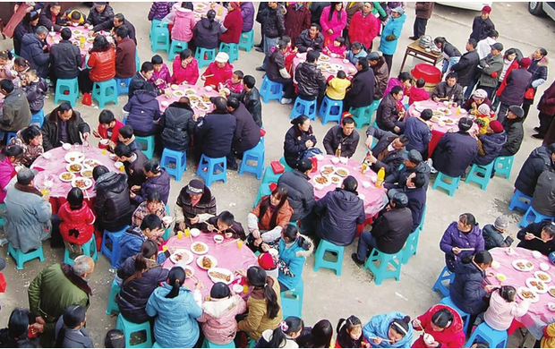
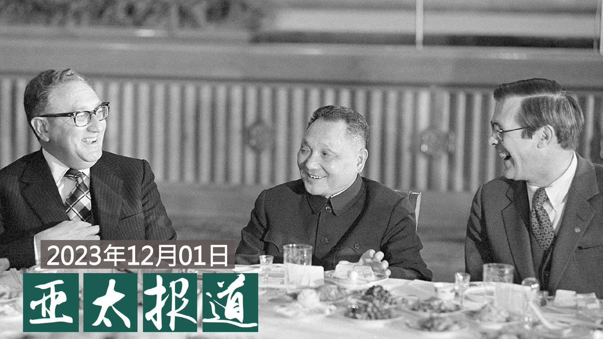
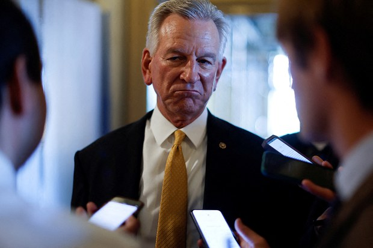
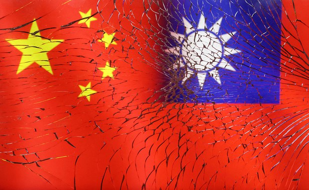
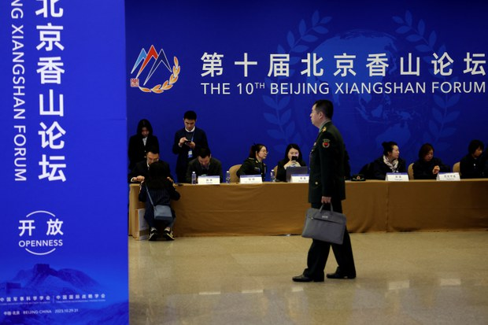
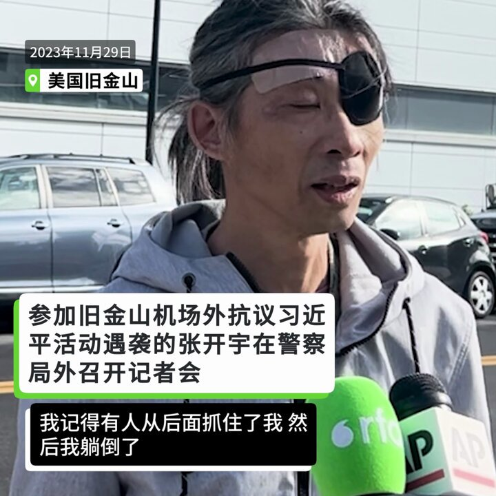
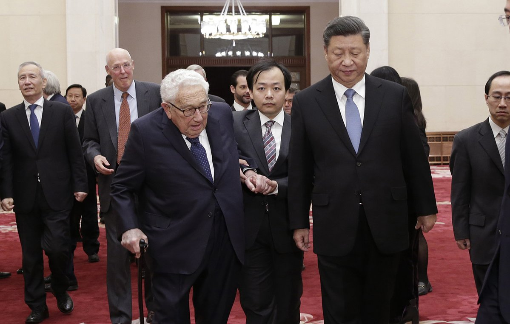
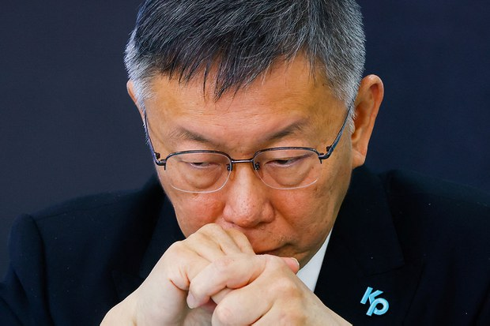

自由亚洲电台 北京时间 2023-12-02T08:00:51Z 1730738763645735351 评论 | #程晓农：经济困境的来源--债毁中国(上篇)
https://t.co/WK8SPdILEr https://t.co/Fg1OHU4IrY   自由亚洲电台 北京时间 2023-12-02T08:03:04Z 1730739322050248892 评论 | #余杰："有粟且不得食"的时代来临了
https://t.co/Yw3e4OwSc3 https://t.co/Eq4iV7tJx3   自由亚洲电台 北京时间 2023-12-02T08:56:16Z 1730752711455592908 欢迎收听和订阅播客【＃亚太报道】 https://t.co/MjLNSvVMqc
《#南华早报》 记者疑似在北京失联；北京路牌标志取消英文；中国发布 #制造业PMI指数； 陕西、贵州被点名 #统计造假；#基辛格去世 对 #美中关系 有何启示？ https://t.co/252FEyfP9i   自由亚洲电台 北京时间 2023-12-02T08:59:38Z 1730753555441811566 美五位参议员致信 拜登　促立即暂停美中间旅行以防疾病传播
https://t.co/yfS9CIhbcr https://t.co/D57imo0mG5   自由亚洲电台 北京时间 2023-12-02T09:00:01Z 1730753652468723722 评论 | 胡平 @HuPing1：写在 #基辛格 离世之际
https://t.co/Q5WIflVv2f https://t.co/9ZVMDr85Fn   自由亚洲电台 北京时间 2023-12-02T05:13:21Z 1730696612576661571 美国著名的《外交事务》杂志11月30日刊登了由三位知名美中台问题专家葛来仪（Bonnie Glaser）、白洁曦（Jessica Weiss）和柯庆生（Thomas Christensen）联合署名的文章《台湾和威慑的真正来源》，副标题是《为何美国应安抚，而不只是威胁中国》。
https://t.co/0V7ezu8qGv https://t.co/ko1dgXZ6Zy   自由亚洲电台 北京时间 2023-12-02T06:14:18Z 1730711950378799484 【专访"#白纸运动"亲历者 黄国安：酷刑让我觉得自己瞎了】
年薪三十万的南方电网工程师、项目管理工程师，享受着优渥的生活，万万没想到有一天会挨饿，挨打，被冻结银行帐户...
#冲封行动
https://t.co/HQxLcRf0Jb https://t.co/TAZAK7bmlX   自由亚洲电台 北京时间 2023-12-02T00:42:25Z 1730628426304827486 所谓的"#三中全会"向来是北京当局决定未来五年政经走向的标志性会议。然而，近期结束的中共中央政治局会议却没有公布任何相关信息。那么，三中全会为何迟迟不开呢？
https://t.co/DM6nrEbUJj https://t.co/88c4S1JLeH   自由亚洲电台 北京时间 2023-12-02T03:01:38Z 1730663465252253925 有香港记者赴京采访后失联。日本媒体日前引述消息说，香港《#南华早报》的资深军事记者 #陈敏莉 今年十月到中国采访香山论坛后至今失联。报社证实，陈敏莉身在北京，正在休假处理私事。此事件使采访中国的记者风险问题再度引起各界关注。

https://t.co/Lq78RaP3pb https://t.co/Jcoovjoatd   自由亚洲电台 北京时间 2023-12-02T03:51:44Z 1730676073212637559 【遇袭12天后，张开宇到警察局讨说法】
11月17日参加旧金山机场外抗议习近平活动的张开宇，于29日来到南旧金山警察局敦促警方调查他遇袭的案件，并在警察局外召开记者会。警方表示，他们会认真对待这起袭击案。（孙诚采访拍摄） https://t.co/4qOSLUjrgC   自由亚洲电台 北京时间 2023-12-02T03:57:33Z 1730677534164197384 林培瑞表示，中国民众尊称 #基辛格 为“#中国人民的好朋友”并不贴切，事实上，他应该是“中国领导人的好朋友”：“基辛格为中共领导人带来好处，他帮助共产党巩固权力并变得富裕。……习近平说基辛格是中国的老朋友，这其实是错的，基辛格应该是‘共产党最高领导的好朋友’才对。”
https://t.co/AOno8RoCdb https://t.co/INGly1rLQE   自由亚洲电台 北京时间 2023-12-02T01:07:25Z 1730634721338532277 十年前，#柯文哲 卸下三十年医师白袍，素人从政。从加护病房到政坛，历任两届台北市长，自组政党挑战总统大位，柯文哲的胜选机率几何，又面临哪些内外考验？

https://t.co/k5BVoRxKzE https://t.co/xrEymVAwpy   自由亚洲电台 北京时间 2023-12-02T01:29:20Z 1730640237053849834 RT @asiafactcheckcn: 你好！我们是亚洲事实查核实验室，很开心与你相遇。 https://t.co/PR6nIV9Adp   自由亚洲电台 北京时间 2023-12-02T01:44:12Z 1730643976317735028 RT @asiafactcheckcn: "不会说中文"？"与美国官员有私情"？亲中网红这样说 #萧美琴👇

https://t.co/MBqi0Da7Lu   自由亚洲电台 北京时间 2023-12-02T02:22:55Z 1730653721921810889 据英国《卫报》（The Guardian）12月1日报道，一名消费者在英国品牌Regatta的外套内衬里，发现一张疑似中国囚犯的证件。（网页截图）
#强迫劳动 #监狱奴工
https://t.co/drxxURXKd0 https://t.co/c2OtSiu22b   自由亚洲电台 北京时间 2023-12-02T00:10:55Z 1730620501016396019 12月1日，中国媒体财新网公布11月份“#财新中国制造业PMI”（#采购经理指数）为50.7，比上个月上升1.2个百分点。然而，中国国家统计局此前公布的11月份制造业PMI为49.4，掉回荣枯线以下。 https://t.co/wl5BW11mGv

(截图自中国国家统计局) https://t.co/EFr0HZhCdR   