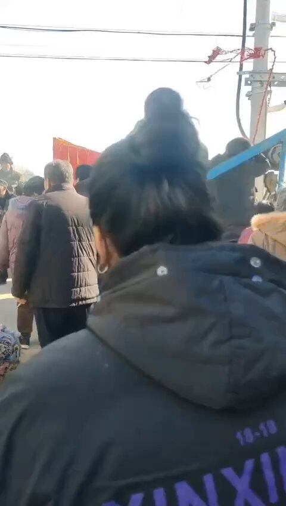

谁将十万横扫三江 北京时间 2023-12-02T14:05:06Z 1730830428767125879 12月1日，河北定州，配阴婚

维基百科：冥婚或起源于殷商，并流传于周代。冥婚自古被认为是陋俗，《周礼·地官》记载：“禁迁葬者与嫁殇者。”

所谓“迁葬与嫁殇”就是指冥婚，《周礼》已明确禁止冥婚，但此风气始终没有杜绝，一直延续至民国初期

河北省定县（定州）有“结阴亲”之俗，1976年中国河北发生唐山大地震之后，该地的“鬼婚”仪式就相当盛行

上海大学教授黄景春调查显示，除港澳台以及海外华人外，在中国大陆至少有18个省市地区存在阴婚现象

过往舆情：

2021年，女主播“罗小猫猫子”的遗体被火化后，经营寿衣店的张某伙同殡仪馆火化工邵某、殡葬车司机雷某某，将骨灰盗走卖给他人配阴婚。

澎湃新闻报道《那个女人被配阴婚了》一文中提到阴婚是中国农村的封建陋俗，近年来有复苏之势，在河北、山西、陕西、山东等地农村仍然流行。方村多位村干部和村民都听说过此事，他们也认可这种传统。
“一女三吃”。
第一次是方洋洋出嫁，他们把智力缺陷、无法表达自主意识的方洋洋卖了，换彩礼；第二次，方洋洋被打死，赔偿款给了她的亲戚们；第三次，方洋洋的骨灰被卖掉，配阴婚。

从2000年1月到2017年7月，中国裁判文书网上的1038起拐卖案件里，拐卖妇女的金额多在1万上下，这是活人的价格。

而杀死一名女子卖去配阴婚，动辄10万起步，这是死人的价格。

吴起县人民政府办公室在官网发布文章称，2016年3月，犯罪嫌疑人马某通过他人介绍认识了庆阳市西峰区驿马镇村民孙某，以给其智障女儿“介绍对象”为由，将其女儿刘某骗出，先后对其注射了四支强力镇定剂，致刘某药物中毒而死亡。然后马某雇佣犯罪嫌疑人杨某驾驶自己的甘M江淮牌商务车从甘肃宁县屈家村一废弃土窑洞内将刘某尸体拉运至榆林市，经邱某介绍卖给当地村民“配阴婚”，从中马某获利35000元，邱某获利5000元。

2013年7月23日,曾经轰动延安的杀人卖尸案主犯王海荣伏法。为了给他人逝去的儿子配阴婚,王海荣与同伙将一名孕妇杀害后,以2.2万元的价格将尸体卖至陕西省延安市延川县配阴婚。   谁将十万横扫三江 北京时间 2023-12-02T14:16:29Z 1730833295414620542 RT @xiaojingcanxue: 余华采访
记者：你出版《许三观卖血记》，一两年后媒体就爆出了艾滋村事件，你是怎么做到这么有预见性的？
余华：这帮人在我爸单位卖了50年了，我就是把他写出来，哪来什么预见性。半个世纪了大家视而不见，没人写才是奇怪的。 https://t.c…   谁将十万横扫三江 北京时间 2023-12-02T08:25:03Z 1730744855855604044 RT @whyyoutouzhele: 11月30日，石家庄精英中学的一位深受同学们爱戴的老师疑似因劳累过度去世，引发了学生们的集体悼念悲愤以及对“衡水模式”的批判：“教育”早就成了产业，这里不是学校，而是工厂。学生们是产品，老师是工人，只是为了给工厂主挣利润而已。 https…   