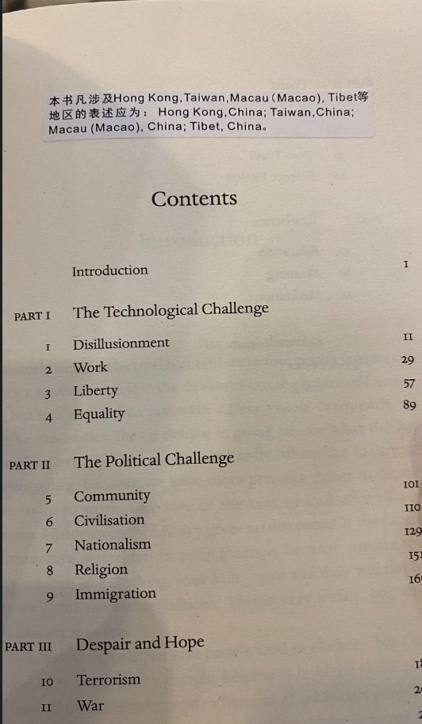
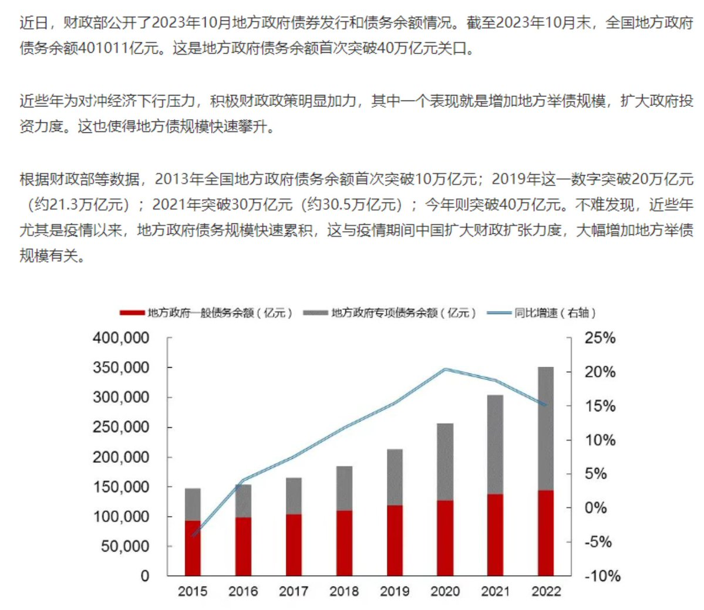
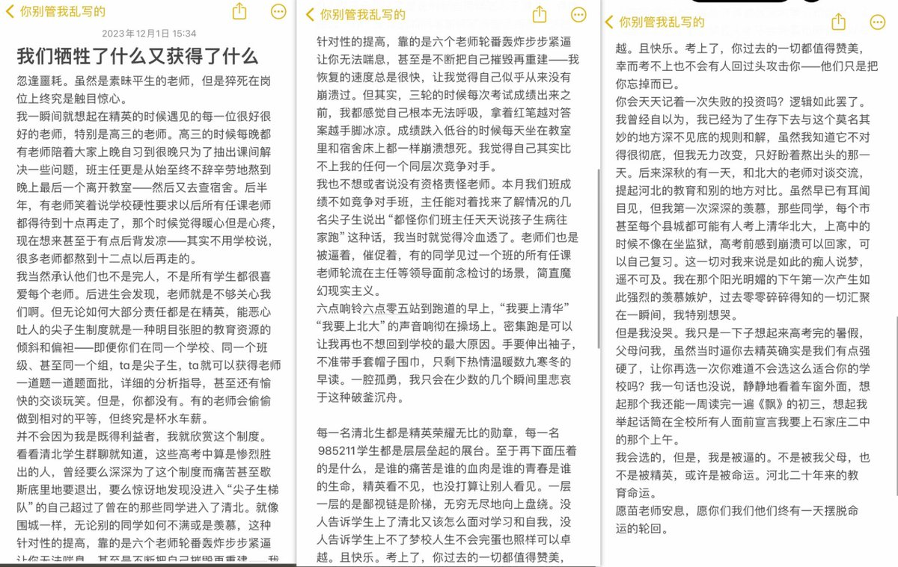
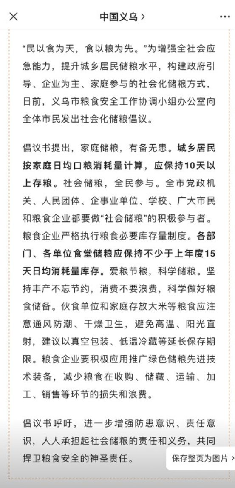

A李老师不是你老师 北京时间 2023-12-01T22:54:28Z 1730601263195119734 网友投稿
上海外文书店随手一翻 https://t.co/31PVPxEQgx   A李老师不是你老师 北京时间 2023-12-01T23:14:34Z 1730606320292659211 11月30日，内蒙古通辽，男子发现洗浴中心换衣间里安有摄像头。
店家回应是治安装的。对此警方表示，有管理规定，必要时分性别查看。 https://t.co/M02NVKf2te   A李老师不是你老师 北京时间 2023-12-01T19:40:18Z 1730552398991573289 近日，财政部公开了2023年10月地方政府债卷发行和债务余额情况。截至2023年10月末全国地方政府债务余额401011亿元，首次突破40万亿元关口。
 近些年为对冲经济下行压力，积极财政政策明显加力。其中一个表现是增加地方举债规模扩大政府投资力度，这也使得地方债卷规模快速攀升。
2013年全国地方政府债务余额首次突破10万亿元、2019年突破20万亿元、2021年突破30万亿元，今年则突破40万亿元。   A李老师不是你老师 北京时间 2023-12-01T19:51:29Z 1730555210781602148 12月1日，吉林长春。一批老人因企业养老金问题，在长春铁路办事处拉横幅维权无果后，又来到当地人力资源社会保障厅维权。 https://t.co/x2oXp4OXoz   A李老师不是你老师 北京时间 2023-12-01T20:07:47Z 1730559313490440346 12月1日，河北秦皇岛。
昌黎天成府延期交房，大量的业主聚集在一起拉横幅维权，并齐声喊道：我们要交房！ https://t.co/Gs31WZWbKt   A李老师不是你老师 北京时间 2023-12-01T21:18:54Z 1730577210472276149 RT @Lslymlwxc: 前几天看李老师发，还不太相信有光明正大的拐卖强奸。但稍微搜索了一下发现这种事情不少
而且抢亲不仅仅是网评员肉喇叭们所说的风俗而已

小红书的事情发生在贵州榕江县，榕江县北面毗邻剑河县，剑河县委员会宣传部负责一个剑河发布的公众号，在这个公众号中我找到…   A李老师不是你老师 北京时间 2023-12-01T22:16:16Z 1730591649762295832 11月30日，石家庄精英中学的一位深受同学们爱戴的老师疑似因劳累过度去世，引发了学生们的集体悼念悲愤以及对“衡水模式”的批判：“教育”早就成了产业，这里不是学校，而是工厂。学生们是产品，老师是工人，只是为了给工厂主挣利润而已。 https://t.co/sKHTORx9Jn   A李老师不是你老师 北京时间 2023-12-01T19:23:59Z 1730548292537172017 国有建筑施工企业的一线财务工作人员投稿 https://t.co/zQ0yX9iAyb   A李老师不是你老师 北京时间 2023-12-01T19:29:46Z 1730549747939758428 义乌发布倡议书：城乡居民应保存10天以上粮食。 https://t.co/Sdb87R39x8   A李老师不是你老师 北京时间 2023-12-01T19:38:13Z 1730551872371544151 2019年的12月1日，武汉市发现首例不明原因肺炎患者。引发了网友们对疫情和亲人的记忆 https://t.co/arC51p6gxU   A李老师不是你老师 北京时间 2023-12-01T19:39:21Z 1730552159719113110 12月1日上午，广东汕头，市民反映龙湖区一路段多车相撞，并发生侧翻。
10时许，当地交警部门工作人员称，事发路段交通已恢复，现场仍在处置中。 https://t.co/rGh663nopb   A李老师不是你老师 北京时间 2023-12-01T19:47:56Z 1730554320314118590 11月30日，广东。一网友发现自己购买的麦片，罐身上的贴纸写着原产地为中国台湾，但撕掉贴纸后，原产地一栏显示为台湾。 https://t.co/cysMUwuXNg   A李老师不是你老师 北京时间 2023-12-01T19:48:41Z 1730554506264322159 11月30日，四川省内江市。新华维港城楼盘烂尾，业主们在售楼部维权讨说法。 https://t.co/NdVQgkIZXc   A李老师不是你老师 北京时间 2023-12-01T19:50:06Z 1730554862952219087 11月30日，齐齐哈尔市。
华鹤集团拖欠上百名员工养老金十几年，工人们来到当地税务局维权，却被告之处理不了。 https://t.co/ml42syBqED   A李老师不是你老师 北京时间 2023-12-01T19:50:32Z 1730554975355289796 12月1日，河北，轩昂环卫公司拖欠环卫工工资长达一年多，工人们聚集在一起拉横幅维权。 https://t.co/zxJoRTWJan   A李老师不是你老师 北京时间 2023-12-01T20:00:54Z 1730557581687423286 11月27日，山东省菏泽市。
大量被辞退的民代教师们第八次来到当地教育局维权，要求政府提高和解决养老保障问题。
“民代教师”是指在乡镇民办学校代课的老师。他们在自己的岗位上勤勤恳恳工作了几十年，将自己宝贵的青春年华奉献给了中国的教育事业，为农村扫盲做出了巨大的贡献。
而如今，他们的养老问题却始终得不到保障。   A李老师不是你老师 北京时间 2023-12-01T20:08:10Z 1730559411788116126 网友投稿
上周，山东省青岛市一地铁口 https://t.co/XPefM0wKxu   A李老师不是你老师 北京时间 2023-12-01T20:33:35Z 1730565805790642408 “血槽姐”后续：
12月1日，记者以一位异地急需用血者家属的身份致电上海卫健委，请求协调异地献血。被上海卫健委以”需在当地申请“为由拒绝。
记者质疑此前“血槽姐”是否有这样的救助通道
对方表示不清楚。 https://t.co/sP1qqhn9g9   