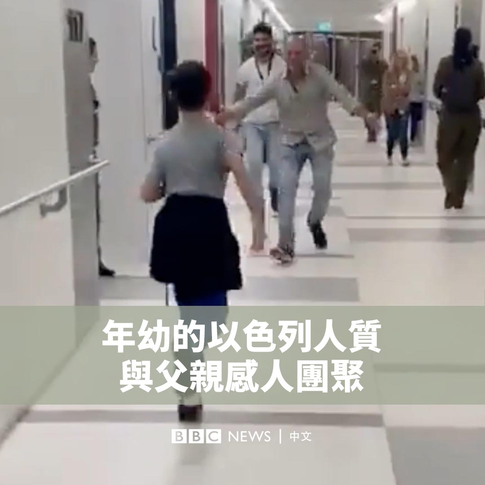

D英国广播公司BBC 北京时间 2023-12-01T11:03:04Z 1730422232801775797 在民众党与国民党携手参与台湾大选的“蓝白合”破局后，民众党总统参选人柯文哲隔日便宣布其副手为该党现任立委吴欣盈，随即引发台湾政商界关注。出身家族企业的她能否助力柯文哲的选战？https://t.co/fb0O0zs5cV   D英国广播公司BBC 北京时间 2023-12-01T09:18:29Z 1730395914815283286 随着以色列与哈马斯休战协议的执行，有越来越多在50天前遭绑架的人质获释。9岁的奥哈德·穆德（Ohad Munder）是获释的人质之一，他在一家儿童医疗中心的走廊跑向父亲。 https://t.co/ywRmGtNc3i   