自由亚洲电台 北京时间 2023-12-01T23:52:21Z 1730615827408269754 #北京道路中英标牌换中文 官方说是为了提升"整体城市形象"，给市民归属感。
#您怎么看？
https://t.co/wE8dB8225Y https://t.co/nigaujpeSe 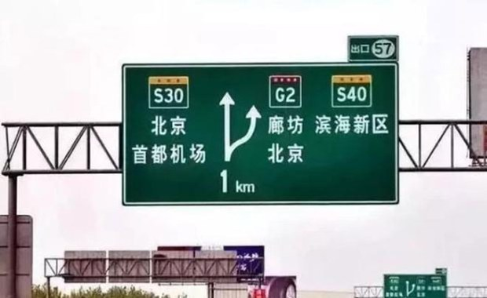  自由亚洲电台 北京时间 2023-12-01T18:55:22Z 1730541088992383342 【《南华早报》赴京采访记者传失联】
【报社声明记者在北京休假】
又传出在中国采访的记者失联。日媒引述消息说，《#南华早报》香港资深的军事记者 #陈敏莉，10月到北京采访 #香山论坛 后至今失联，报社对本台记者证实，陈敏莉人在北京，正在休假处理私事。此事件使采访中国的记者风险问题，再度引起各界关注。详细报道：https://t.co/VOATSYW7gI 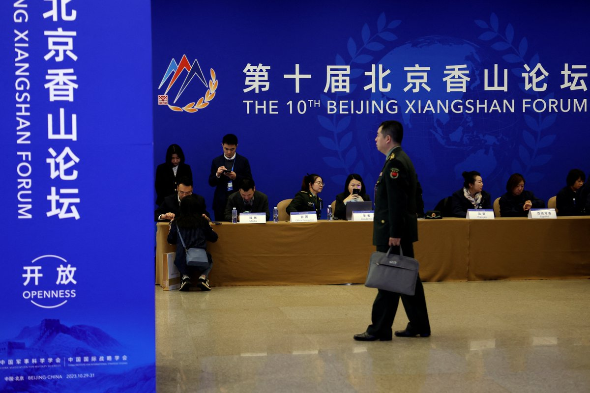  自由亚洲电台 北京时间 2023-12-01T10:09:58Z 1730408871020106210 RT @RFA_Chinese: 评论 | #胡平：写在 #基辛格 离世之际 https://t.co/HDHECyYKOu 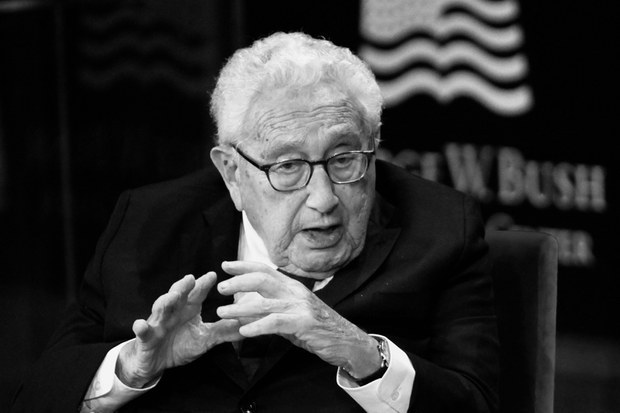  自由亚洲电台 北京时间 2023-12-01T10:10:07Z 1730408905560269166 RT @RFA_Chinese: 欢迎收听和订阅播客【#亚太报道】 https://t.co/MjLNSvVMqc
“中国人民的老朋友” #基辛格 去世；#三中全会 为何迟迟不开？；#西藏 阿里献血事件引发热议；#湖南衡阳 拍卖“政务数据”被叫停；#蔡英文 警告中国“此时不是犯…   自由亚洲电台 北京时间 2023-12-01T04:36:33Z 1730324962987348257 评论 | #程晓农：经济困境的来源：债毁中国(上篇) https://t.co/WK8SPdILEr https://t.co/kuXzO5QXv3 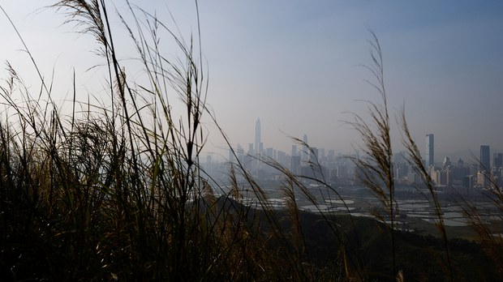  自由亚洲电台 北京时间 2023-12-01T06:22:46Z 1730351691906904500 专题 | #中国透视：#白纸运动 的多重变奏 https://t.co/B9QH7WLKhr https://t.co/Duw5EfVfNc   自由亚洲电台 北京时间 2023-12-01T07:42:25Z 1730371734891802805 评论 | #胡平：写在 #基辛格 离世之际 https://t.co/HDHECyYKOu   自由亚洲电台 北京时间 2023-12-01T08:19:30Z 1730381069948436934 RT @RFA_Chinese: 【回顾传奇外交家基辛格百岁人生】
【唯一与毛邓江胡习打过交道的美国人】… https://t.co/XyjN7b58AF   自由亚洲电台 北京时间 2023-12-01T05:02:32Z 1730331501022355625 欢迎收听和订阅播客【#亚太报道】 https://t.co/MjLNSvVMqc
“中国人民的老朋友” #基辛格 去世；#三中全会 为何迟迟不开？；#西藏 阿里献血事件引发热议；#湖南衡阳 拍卖“政务数据”被叫停；#蔡英文 警告中国“此时不是犯台时机” #美中关系  #血槽姐 #阿里全体公务员为一女子献血 #女子父亲包机转院 https://t.co/YeMI2tT6xl 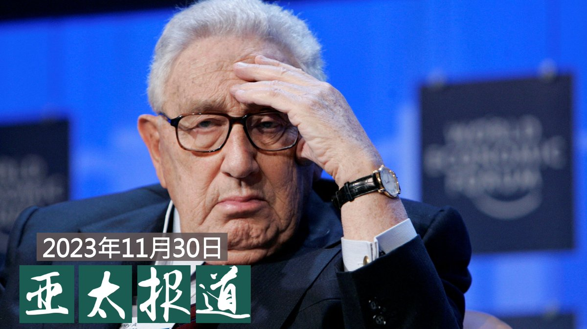  自由亚洲电台 北京时间 2023-12-01T02:49:50Z 1730298104887570589 美国前国务卿亨利·基辛格 11月29日 #逝世，享年一百岁。各国领导人纷纷就此作出反应，赞扬他对全球事务的深远影响。美国现任国务卿 #布林肯 当天则发表声明，表彰  #基辛格 对于国家的热爱。https://t.co/5bpPNM6Ixe https://t.co/gsd0bHLNQH   自由亚洲电台 北京时间 2023-12-01T03:08:01Z 1730302680621576508 专栏 | #军事无禁区：#拿破仑－时势造英雄，英雄造时势 https://t.co/DuUW6eLYTH https://t.co/m1WREpMqKP   自由亚洲电台 北京时间 2023-12-01T04:11:53Z 1730318754868076881 在旧金山 #APEC会议 期间参与 #抗议习近平集会 并于11月17日在旧金山机场外遇袭的中国异议人士 #张开宇 11月29日前往南旧金山警察局敦促警方立案调查。张开宇召开记者会讲述了他遇袭的经过及对袭击事件的感受。https://t.co/2g0wH7gMrq https://t.co/gdrtz99AQL 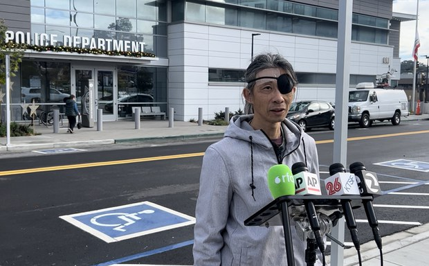  自由亚洲电台 北京时间 2023-12-01T04:13:04Z 1730319051476619320 所谓的"#三中全会" 向来是 #北京 当局决定未来五年政经走向的标志性会议。然而，近期结束的中共中央政治局会议却没有公布任何相关信息。
那么，三中全会为何迟迟不开呢？https://t.co/DM6nrEcsyR https://t.co/L6sVxMD3Vh   自由亚洲电台 北京时间 2023-12-01T04:14:26Z 1730319398177812684 综合路透社及台媒Newtalk等报道，由于最近 #中国 的 #呼吸道疾病 爆发，#台湾 的卫生福利部疾病管制署周四（30日）敦促老年人、幼儿和免疫力差的民众，非必要不要前往中国大陆，以免就医不易延误病情。不过，一些专家表示，此举对于管理公共卫生风险无效。https://t.co/fkWGAdlLgr https://t.co/WFNrFFkMbe 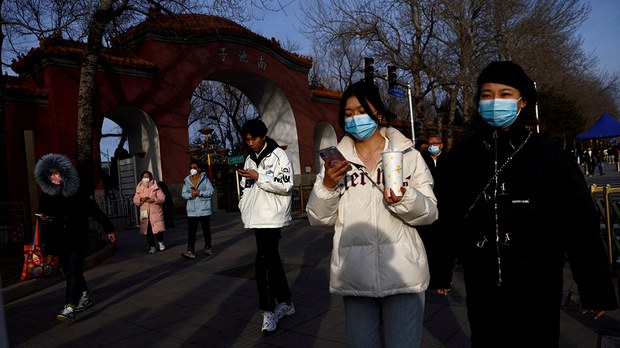  自由亚洲电台 北京时间 2023-12-01T04:15:15Z 1730319600540377122 评论 | #唯色：《杀劫》2023年最新修订版与前两版有何不同？(九) https://t.co/Up2UXh0c8b https://t.co/KmZZMKUC3V 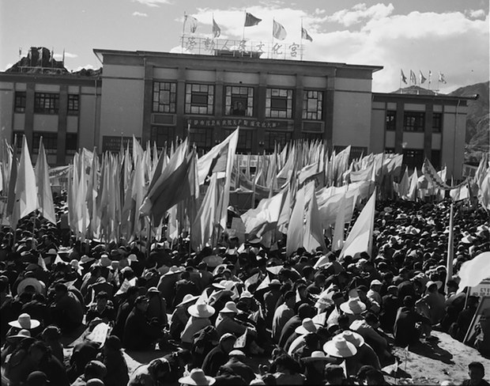  自由亚洲电台 北京时间 2023-12-01T01:17:01Z 1730274748788306289 一名 #上海女子自驾 在 #西藏阿里 发生车祸，获上海卫健委和西藏阿里地区部门协助，并获阿里地区 #公务人员献血 的事件，连日成为微博热爆话题。家属通过媒体试图澄清网民的质疑，却越描越黑。此事件也反映出中国社会存在的多种内部矛盾现象。https://t.co/5Q939RspG1 https://t.co/BSyf0Igunc 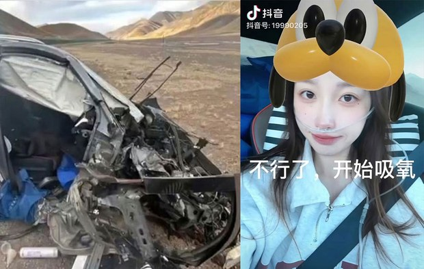  自由亚洲电台 北京时间 2023-12-01T01:18:06Z 1730275019270529269 评论 | #何清涟: 阿根廷新总统会改变对华关系么？https://t.co/x9XHtsvvZu https://t.co/nqZa7fUaxq   自由亚洲电台 北京时间 2023-12-01T01:18:44Z 1730275179870482543 评论 | #魏京生：旧金山会议后 #中国 国内 #经济 进一步衰退 https://t.co/OYzV9F1obD https://t.co/Udet4C1JgA 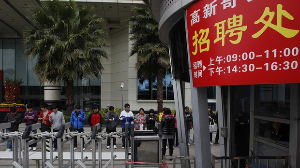  自由亚洲电台 北京时间 2023-12-01T00:15:00Z 1730259142710112401 台湾的总统 #蔡英文 日前接受美国《纽约时报》专访表示，中国领导层正面临内部难题，现在也许不是考虑大规模犯台的时机。此外，美国乔治华盛顿大学教授沈大伟也指出，中国当前正面对三大挑战。https://t.co/ezlRSAmFat https://t.co/BXn6Hxdocc 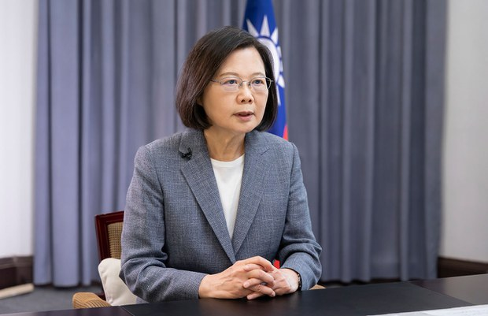  