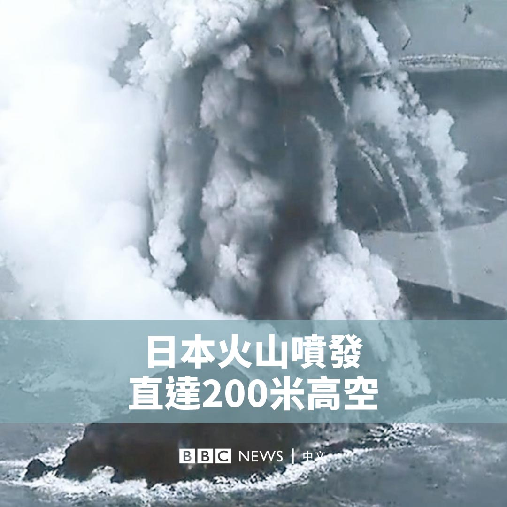

D英国广播公司BBC 北京时间 2023-11-30T20:37:47Z 1730204474692833519 距离东京约970公里的日本新岛上周发生火山喷发。🌋

日本海岸警卫队捕捉到了喷发的瞬间，显示火山灰一度直达200米的高空。 https://t.co/puKOu2kWC8   D英国广播公司BBC 北京时间 2023-11-30T19:02:30Z 1730180496464674860 有人称他为“老朋友”，有人认为他是“战争犯”……在数十年的政治生涯中，亨利·基辛格在美国外交政策上扮演了关键、有时却具有争议的角色。https://t.co/HBogncH5zH   D英国广播公司BBC 北京时间 2023-11-30T16:49:22Z 1730146992922521701 基辛格（Henry Kissinger）被认为是二战后权力最大的美国国务卿，他重塑了美国的外交政策，并改变了全球的地缘政治格局。

他有时被称赞为一个以美国利益为重的现实派外交家，在各大国之间穿梭捭阖，但他也被指应为一些海外暴行负有责任，甚至被批评是“战争犯”。

本片带你回顾这位百岁老人的一生。 https://t.co/lsvtF9aySD   D英国广播公司BBC 北京时间 2023-11-30T15:41:40Z 1730129957379092832 即将举行的第28届联合国气候变化大会预计将会通过“损失与损害”基金的运作，但是对于作为重大经济体的中国和印度在基金中应该是付钱还是拿钱，发达国家与发展中国家的意见难以一致。https://t.co/iAh9FmwMRX   D英国广播公司BBC 北京时间 2023-11-30T13:19:42Z 1730094229949722943 美国前国务卿基辛格（Henry Kissinger）去世，享年100岁。

基辛格曾对美国的外交政策产生深远影响。他缓和了与苏联和中国的关系，但在支持颠覆智利左翼政府的政变以及轰炸柬埔寨等问题上争议不断。

他在去年曾接受BBC专访，探讨他目睹的历史事件和时代剧变，以及美国与中国、俄罗斯外交背后的故事。

▶️观看影片：https://t.co/vxWl7QSV6i   D英国广播公司BBC 北京时间 2023-11-30T11:37:50Z 1730068594455908763 艾米丽·汉德（Emily Hand）是上周末从加萨获释的数十名人质之一。这名九岁的爱尔兰裔以色列女孩最初被认为遭哈马斯杀害，她如今已与父亲团聚。许多以色列家属正焦急地等待未来几天有更多人质获释。 https://t.co/EySqIsv9p9   D英国广播公司BBC 北京时间 2023-11-30T09:34:53Z 1730037651666080250 BBC的一项分析显示，加沙的多个巴勒斯坦武装组织自2020年起共同参与军事化训练，并在10月7日与哈马斯一起参与了对以色列的致命袭击。

这些演习在光天化日之下进行，有时距隔离墙仅数百米。他们演练了劫持人质、袭击营地和突破以色列防线，画面还被发布在社交媒体上。https://t.co/FsxXGVN6VS   D英国广播公司BBC 北京时间 2023-11-30T10:04:55Z 1730045208862093488 【最新消息】美国前国务卿亨利·基辛格（Henry Kissinger）在家中去世，享年100岁。 https://t.co/itcpVKZ900   