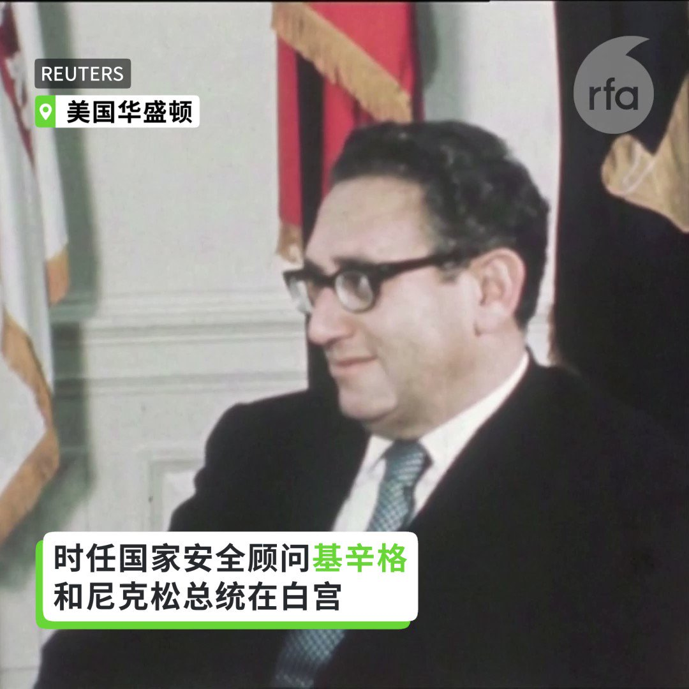
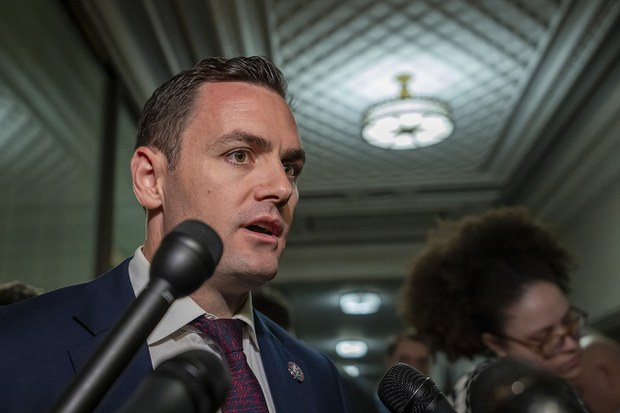
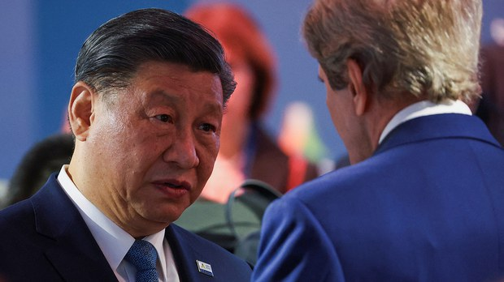
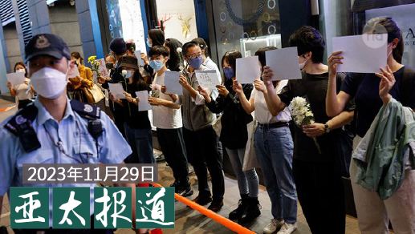
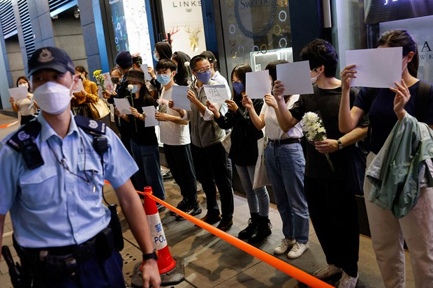
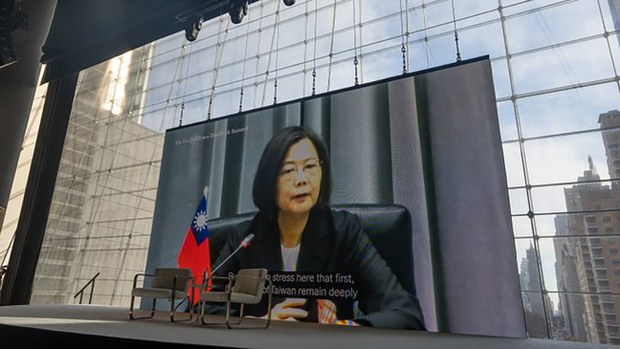
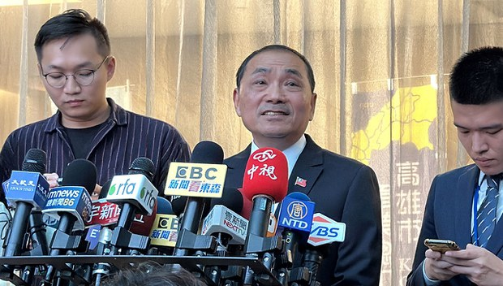
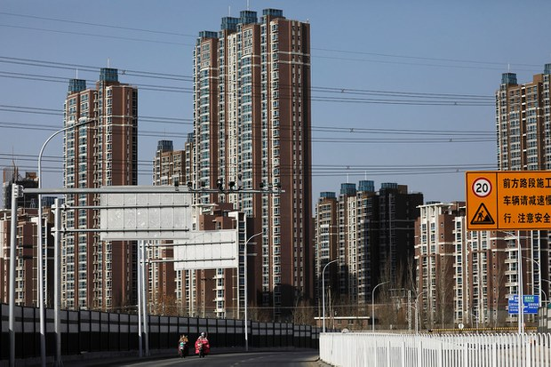

自由亚洲电台 北京时间 2023-11-30T23:32:00Z 1730248319375388894 RT @RFA_Chinese: 【回顾传奇外交家基辛格百岁人生】
【唯一与毛邓江胡习打过交道的美国人】… https://t.co/XyjN7b58AF   自由亚洲电台 北京时间 2023-11-30T23:41:43Z 1730250764608851970 #中国 外交部官网30日发布了《中国关于解决 #巴以冲突 的立场文件》，其中强调联合国安理会在巴以问题上的作用，并提出5项建议 https://t.co/Iu7NkbhPkH https://t.co/UHvfkrFV2H   自由亚洲电台 北京时间 2023-11-30T18:30:04Z 1730172333976133773 【尼克松与基辛格】
1972年2月22日，时任美国总统尼克松和国家安全顾问基辛格在北京观看《红色娘子军》演出中场休息时喝茶。此图由尼克松总统图书馆提供、路透社发布。#尼克松 #基辛格 https://t.co/1wiUsGM9MH   自由亚洲电台 北京时间 2023-11-30T14:56:57Z 1730118702069379385 【公开拍卖大数据信息】
【衡阳拍卖“政务数据”叫停】
衡阳市政府原定公开拍卖该市政务数据资源和智慧城市特许经营权，即通过大数据采集到的各类信息。拍卖起价为人民币18亿元，此举引来网民批评。随后当局宣布暂停该交易活动。详细报道：https://t.co/0j7gfoNTrO https://t.co/4Z5YoXtUEx   自由亚洲电台 北京时间 2023-11-30T16:46:07Z 1730146174391538110 【回顾传奇外交家基辛格百岁人生】
【唯一与毛邓江胡习打过交道的美国人】
回顾基辛格的百岁人生，“中国”是关键词。基辛格曾说他访问过中国上百次，并说中国已成为他生命中非常重要的一部分。几十年来，基辛格一直是中国最重要的代言人。中国政府在他身上花费了巨资。基辛格也是唯一一位与从毛泽东到习近平每一位中国领导人打过交道的美国人。基辛格在中美关系中扮演重要的角色，也受到高度争议。
#基辛格   自由亚洲电台 北京时间 2023-11-30T17:24:56Z 1730155946004152360 【尼克松与基辛格】
1972年2月20日，时任美国总统尼克松和国家安全顾问基辛格搭乘空军一号飞往北京。此图由尼克松总统图书馆提供、路透社发布。#尼克松 #基辛格 https://t.co/GrCoFmMF4k   自由亚洲电台 北京时间 2023-11-30T15:42:37Z 1730130195842245055 【“#中国人民的老朋友” #基辛格 逝世】
【冷战红利化身 曾受中国大量资助】
美国前国务卿基辛格11月29日在美国的家中逝世，享年100岁。学者评价，基辛格生前受到中国大量资助，亦是冷战红利的化身。详细报道：https://t.co/fwSDsjR3tD https://t.co/KPvbVMj91O   自由亚洲电台 北京时间 2023-11-30T11:14:55Z 1730062825908039689 【美国前国务卿基辛格去世 享年100岁】
基辛格咨询公司于纽约时间11月29日晚发布声明称，当地时间11月29日，美国前国务卿亨利·基辛格在康涅狄格州的家中去世，享年100岁。
基辛格是中美关系的见证人，在担任总统国家安全事务助理期间，于1971年7月9日秘密访华，为中美建立外交奠定了良好基础。1972年2月，基辛格陪同尼克松总统访华，中美相互隔绝的局面终于打破。中美两国之后于1979年1月1日正式建交。
基辛格是与中国打了40多年交道的“中国通”，被誉为“中国人民的老朋友”。他曾表示，第一次访问中国后，他此后已有100多次踏上这片土地。
路透社报道，基辛格今年5月27日度过他一百岁生日，在他的百岁生日之后一直很活跃，参加白宫的会议，出版一本关于领导风格的书，并在参议院委员会就朝鲜构成的核威胁作证。2023年7月，他突然访问北京，会见中国国家主席习近平。https://t.co/LGpEWMbc3l
#基辛格
#中国人民的老朋友   自由亚洲电台 北京时间 2023-11-30T12:01:37Z 1730074578624581745 在"#白纸运动"一周年之际，美国国会议员与多个人权组织纷纷公开表达支持，并敦促中共当局无条件释放被捕的活动人士。美国国会众议员 #加拉格尔 还公开表示，中国人民和所有人一样，应该享有自由。 

https://t.co/O0k4rYX8hs https://t.co/i9PmaQlmmS   自由亚洲电台 北京时间 2023-11-30T09:58:13Z 1730043522462752842 【美国前国务卿基辛格去世 享年100岁】
基辛格咨询公司于纽约时间11月29日晚发布声明称，当地时间11月29日，美国前国务卿亨利·基辛格在康涅狄格州的家中去世，享年100岁。#基辛格 https://t.co/g7vIIaU4Bi   自由亚洲电台 北京时间 2023-11-30T06:30:02Z 1729991133324001633 评论 | 魏京生　@WEI_JINGSHENG：＃习近平 的旧金山之行能解决经济困境吗？
https://t.co/lTTTAAbvL8 https://t.co/W4ugTrzDhD   自由亚洲电台 北京时间 2023-11-30T08:00:14Z 1730013832033325168 欢迎收听和订阅播客【＃亚太报道】 https://t.co/MjLNSvVMqc
山西斥资近千万建“＃防止返贫”监测系统 ；学生　＃边输液边写作业 引爆舆论批评；报告揭中国培养 ＃洋网红 为其政策背书；11月楼市同环比均下降；＃侯友宜 主张 ＃开放陆生就业 挨批 https://t.co/fcRWyXzEpQ   自由亚洲电台 北京时间 2023-11-30T04:56:33Z 1729967606285881527 【#香港： 一个人的悼念】
11月26日傍晚，一名黑衣男子在铜锣湾崇光百货门外，举起 #白纸 站了大约半个小时。有路人表达支持，也有相信是便衣警员的人监视，该名男子要离开时受到查问
https://t.co/SdwizX6sK5
图片是2022年11月28日，香港市民举白纸悼念乌鲁木齐大火死难者（路透社） https://t.co/G9RwVOZW9P   自由亚洲电台 北京时间 2023-11-30T05:15:38Z 1729972408441065968 据英国广播公司（BBC）本周三报道，北京的法院在本周一裁定，用 #人工智能 制作出的图片属于作品范畴，受著作权法的保护。由于这是中国法院第一次就 #AI生成图 的著作权做出裁决，因此审判结果引发外界高度关注。
https://t.co/U6B1kCl4Vd https://t.co/dX945hLSDh   自由亚洲电台 北京时间 2023-11-30T05:43:43Z 1729979475226706184 ＃蔡英文：中国面临诸多内政问题　短期内不会攻台
您同意吗？
https://t.co/g6WFFShgcr https://t.co/CaWQoWDMUY   自由亚洲电台 北京时间 2023-11-30T06:00:08Z 1729983610420428934 专栏 | ＃纵横大历史：文革系列 第七十讲　恐怖的 ＃红八月（三）
https://t.co/9SHvlPS5dE https://t.co/frgCJSZz2h   自由亚洲电台 北京时间 2023-11-30T06:00:27Z 1729983686878109908 RT @RFA_Chinese: 中国美食播主 #王刚 11月27日在网上发布了一条公开道歉视频，表示他以后不会再制作 #蛋炒饭。
而王刚为什么要为蛋炒饭道歉? 
又为何做出这样的决定呢？
https://t.co/6nqsFEWzIX https://t.co/C4dSnzC…   自由亚洲电台 北京时间 2023-11-30T02:50:58Z 1729936002511442022 国民党总统候选人 #侯友宜 近日表示，若当选总统会 #开放中国大陆学生来台就业，在台湾炸开了锅。
上海最低工资二千多人民币，不到新台币一万两千元，台湾明年一月起基本月薪调涨至27,470元台币，
中国官方6月公布青年失业率已突破21%。
如果开放陆生就业，台湾青年顶得住吗？
https://t.co/SZN2K85lFK https://t.co/UnFNmyYw3g   自由亚洲电台 北京时间 2023-11-30T02:54:01Z 1729936772543787418 萎靡不振的 #中国房地产 行业仍然没有看到隧道尽头的亮光。据中国指数研究院(中指研究院)调查，今年十一月中国楼市成交量整体同比和环比均下降，其中二线城市整体环比下降近两成。

https://t.co/roEsDrfPH2 https://t.co/pzvkihYIm0   自由亚洲电台 北京时间 2023-11-30T03:29:05Z 1729945594230415364 澳大利亚战略政策研究所24日发表一份调查报告《照中共歌单唱歌——外国影响者在中国宣传体系中的作用》。报告作者从中国主要视频流媒体平台，如哔哩哔哩、抖音、西瓜等，收集了120多名拥有活跃账户的 #洋网红 名单，进行研究。
这是报告封面图，您看这个指挥是不是有点眼熟？
https://t.co/2BBWdRL574 https://t.co/KAs05vt8c8   自由亚洲电台 北京时间 2023-11-30T04:04:14Z 1729954440868962384 加拿大《#印太战略》公布届满一年，加拿大外交，国防等多个部会向国会报告实施成效及未来目标。尽管俄乌战争和哈马斯-以色列战争成为国际地缘政治焦点，但仍无损加拿大布局印太地区的雄心。渥太华认为，中国仍是具破坏性的国家，影响了 #加拿大 和印太其他国家的利益往来。

https://t.co/1ykcabJbtY https://t.co/FX8qtKb1ac   自由亚洲电台 北京时间 2023-11-30T00:47:08Z 1729904839088574766 中国爆发多重 #流感，许多儿童染病，医院儿科人满为患，互联网上流传着"#边输液边写作业"的 #内卷 画面，数度冲上热搜话题。中国"首都教育"微信公众号发文，呼吁一切应以孩子身体为重，学生患病期间作业一律不做硬性要求。

https://t.co/61c4NQOay2 https://t.co/nshhdJITlN   自由亚洲电台 北京时间 2023-11-30T02:22:36Z 1729928864678449527 #山西乡村振兴局 花费859万元采购 #防止返贫监测信息项目。
网民留言：惊掉下巴！
用App来检测返不返贫，真是敢想敢干！
https://t.co/N6GpO0ekOp https://t.co/sEbbzBXruC   