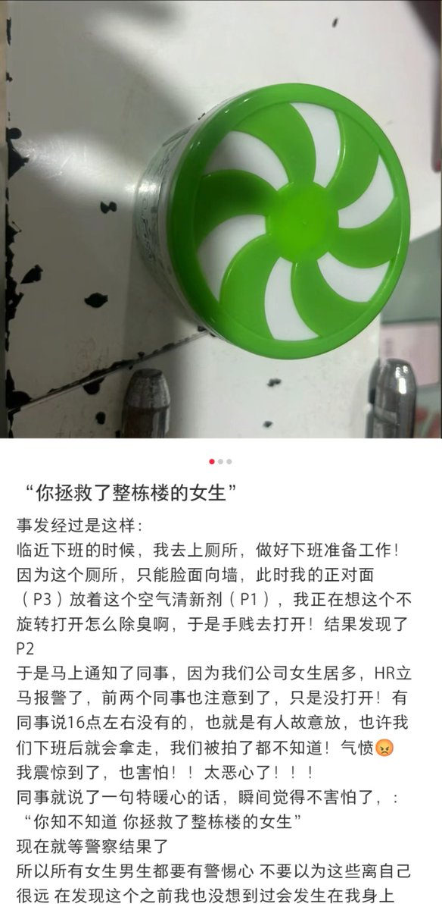
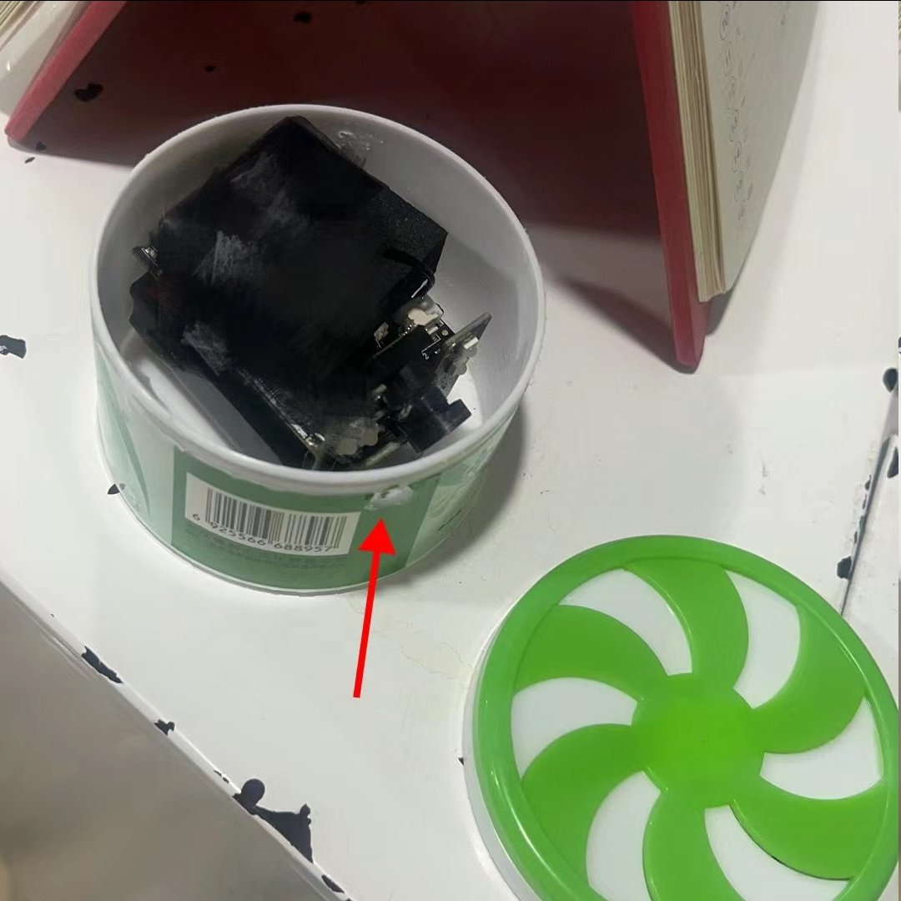
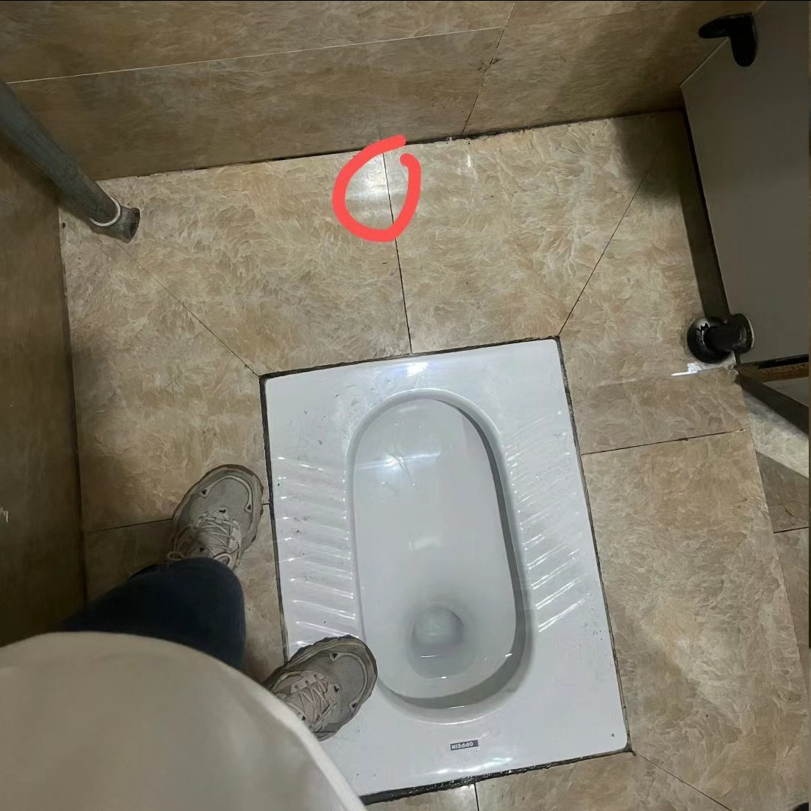
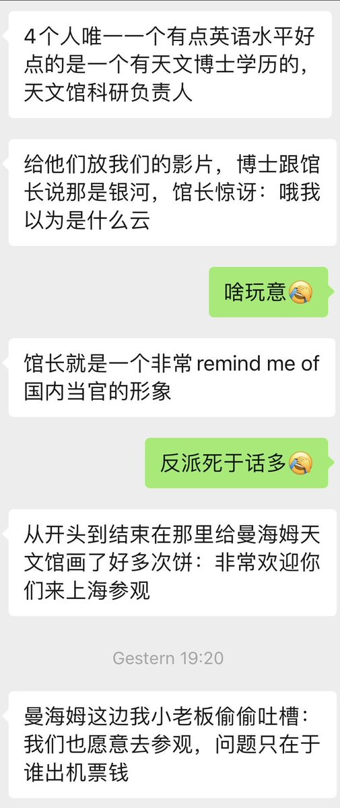
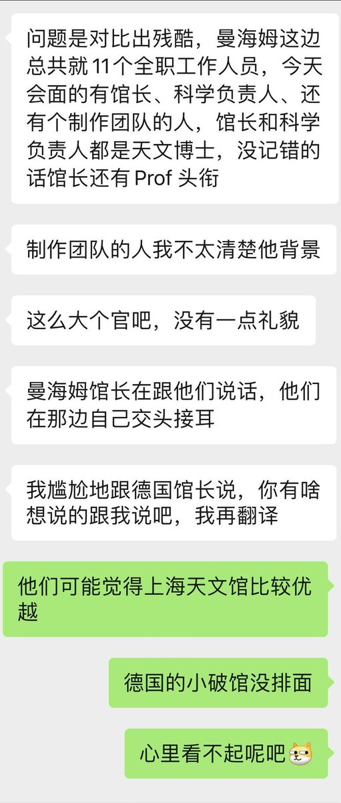
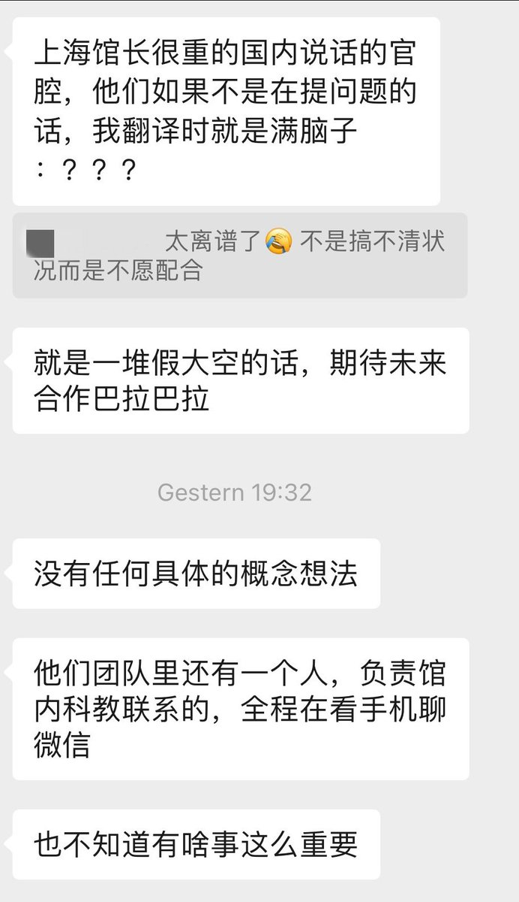

谁将十万横扫三江 北京时间 2023-11-30T20:01:06Z 1730195245781107013 RT @ling332699: 你了解了吗？🤔
这博主好像是学工程的，后来又参加司法考试拿了律师资格证。 https://t.co/QGfZNcR5n2   谁将十万横扫三江 北京时间 2023-11-30T20:02:25Z 1730195575298310437 RT @whyyoutouzhele: 11月30日，江苏扬州，宝亿鞋厂工人们集体罢工维权。
运营17年的宝亿鞋厂在29日宣布将于年底关停国内工厂，将工厂迁移至印尼。
但是宝亿鞋厂在公告中只提到发放补偿金，并没有详细说明补偿明细。此举引发了工人们的强烈不满。 https://t…   谁将十万横扫三江 北京时间 2023-11-30T20:05:28Z 1730196343141089704 在洗手间发现了伪装成空气清新剂的摄像头

“你拯救了整栋楼的女生” https://t.co/qK9yi70KCX   谁将十万横扫三江 北京时间 2023-11-30T20:21:47Z 1730200449234751579 信访办暴力拖拽上访者

昨天在石家庄站看到几个壮汉架着一个年轻女性的胳膊往火车外拖，女子拿脚勾着车厢连接处，两个壮汉一人拖胳膊一人拖腿，把女子的羽绒服都抢走了。
另有两个壮汉进车厢拖和女子同行的老爷爷。我先以为是抓逃犯，直到列车员说请文明执法，列车长说不要耽误开车，那几个壮汉才作罢。火车开了，女子对列车长说谢谢你们啊。
车开了，老爷爷说他和被拖拽的女子是父女，听其他乘客介绍:女子的小孩今年五岁，爬上了市场上没锁的四层平台，摔下来成了植物人。他们起诉市场监管部门和商铺，德阳中院只判了赔五万，他们不服上诉到四川高院，高院打回重审，但中院维持原判。父女俩不服，要去北京上访，于是德阳信访办的人在车站等着他们，要把他们抬回去不让他们上访。
“护理费都没赔，小孩成了植物人就赔五万。法律面前人人平等，我们是正常上访，他们就这样!”老人说。
听完事情经过，我连连说太不要脸了。列车员轻轻地说:“不要脸的事情多了去了。”
列车员补充:信访办如果不拦着，中国每天上访的人成千上万。这种事情他见多了，以前信访办的人是打上访户，现在文明了，不打，直接把人抬下去。
一保定下车的乘客说:没有钱没有权，老百姓谁都惹不起，老实躲着最安全。
似乎是应证没有钱没有权老百姓维权寸步难行的观点，我碰到了两个重庆来的上访奶奶。
她们出资成立的采石场被有政府关系的人侵占了，门锁了，不让她们进。她们这一趟是先去北京信访办再去纪委举报。
老奶奶说她的电话被监听，到了北京，重庆信访办的人会来接她陪她去上访。
中途重庆信访办的人给她打电话问她今天的行程，老奶奶一一回答。
她说重庆的律师她找遍了，没有人愿意接怕得罪当官的，开庭她只能接受法律援助的律师，可是法援律师被对方收买了，她败诉了。
老奶奶说这个案子她打了20年，从五十岁打到七十岁，也不是为了钱，就是为了公理。
保定乘客听完全程，说这父女俩到北京上访没啥用，了不起从赔五万判成赔十万，在北京上访的生活费比德阳贵多了，赔的钱在北京花不了几天就花完了。
另一保定下车的乘客说法律没啥用，都是保护当官的有钱的。   谁将十万横扫三江 北京时间 2023-11-30T10:45:30Z 1730055424647545116 RT @cskun1989: 易中天先生耗时数年心血撰写的24卷本巨著《易中天中华史》被下架，下架原因显然不是出版社给出的说辞，中国书籍出版属于于意识形态的范畴，主管部门众多，审查标准随时改变，即使是已经出版发行多年的历史书籍，也不知道哪个章节甚至哪句话触犯禁区。《易中天中华史…   谁将十万横扫三江 北京时间 2023-11-30T13:23:28Z 1730095178130899290 一个在曼海姆天文馆做兼职的同学疯狂吐槽最近来参观的上海天文馆（副）馆长及其团队，完全就是没文化且素质低下的草包官僚 https://t.co/slRKKVPVAc   谁将十万横扫三江 北京时间 2023-11-30T13:23:57Z 1730095297760759983 上周四的一项法院裁决，将在俄性少数群体贴上了“极端分子”标签，这个标签预示着逮捕。司法部随后公布了100多个“极端分子”名单，活动人士表示“从未遭遇如此严苛和真实的威胁”。2013年，俄签署了“反同宣传法”，去年12月进一步扩大“宣传法”内容；今年早些时候，禁止跨性别接受性别确认护理、文件上的法定性别更改、领养以及合法结婚等权利。   谁将十万横扫三江 北京时间 2023-11-30T11:07:03Z 1730060845349327049 RT @hellojixian: 谢谢冬哥 明天我会告诉你一切真象 我是被会说俄语的中国人举报到乌克兰国家安全局的 因为我之前发布的视频 举报我涉嫌间谍活动 意图破坏乌克兰国家主权 这是比杀人还重的罪名 举报者有信心把我消失在监狱里 具体的明天和您说吧   