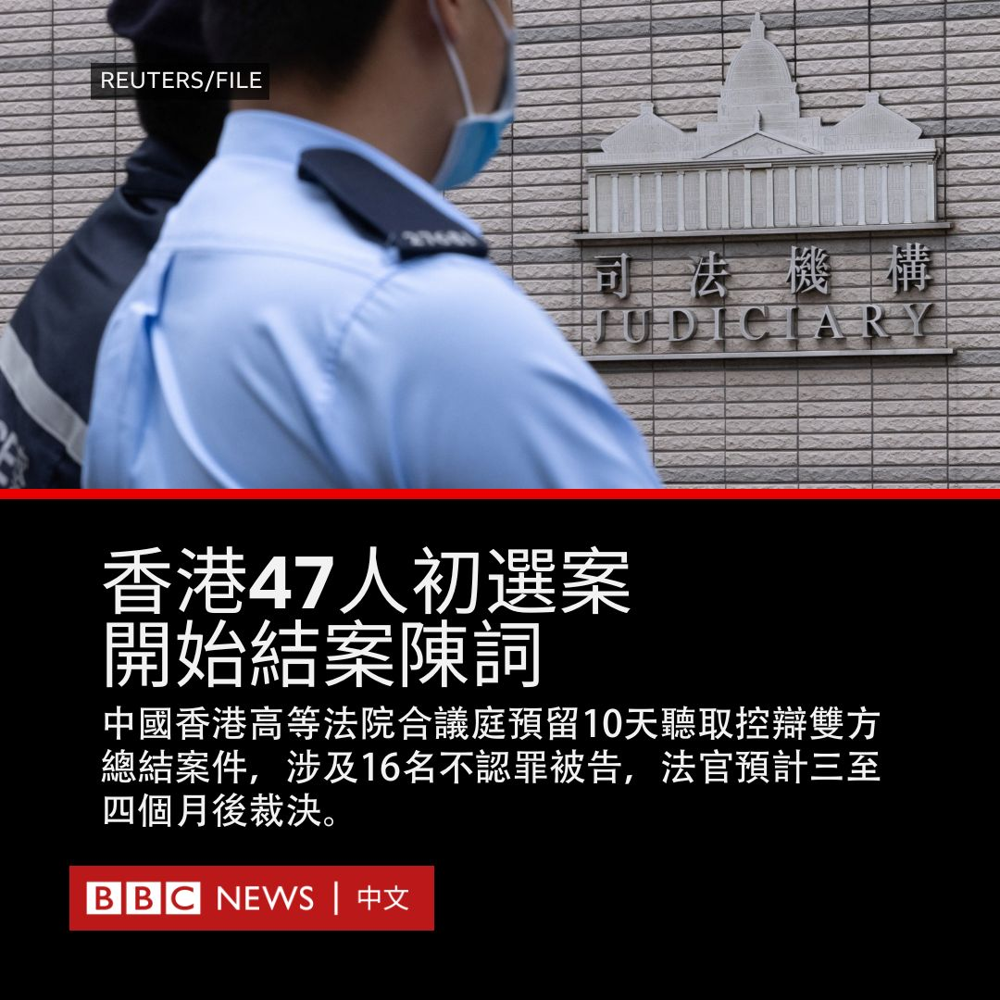
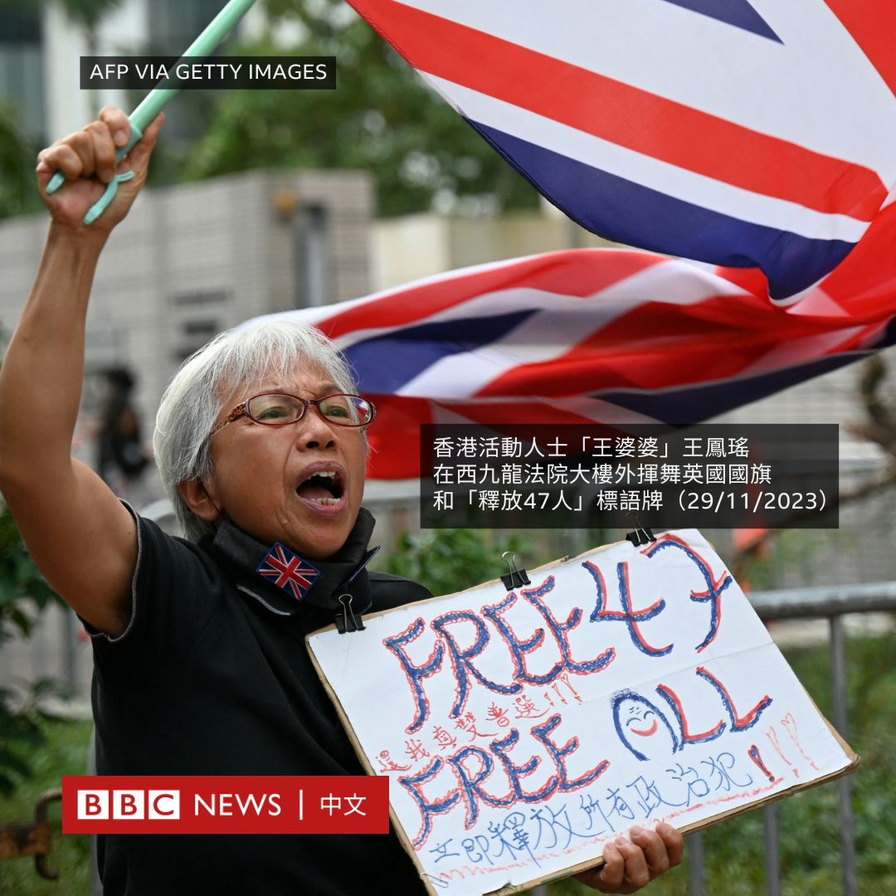
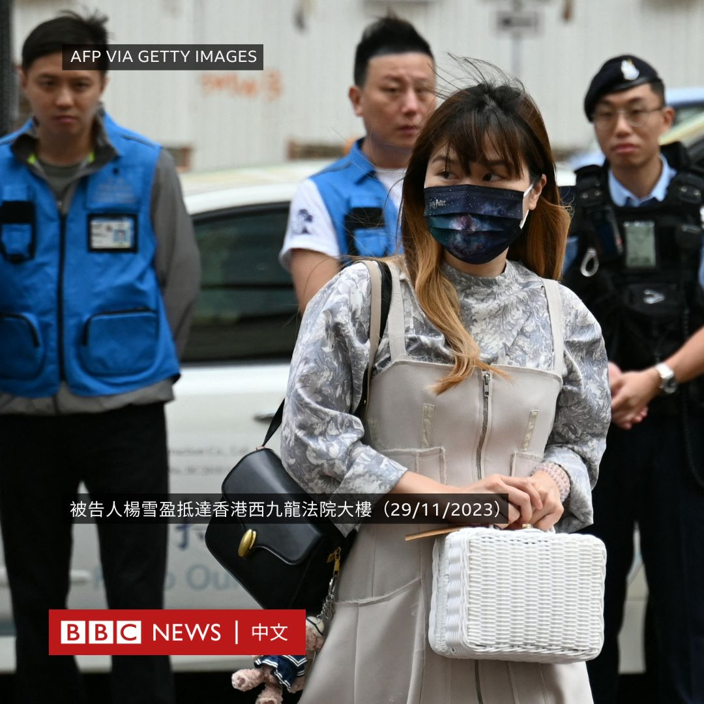
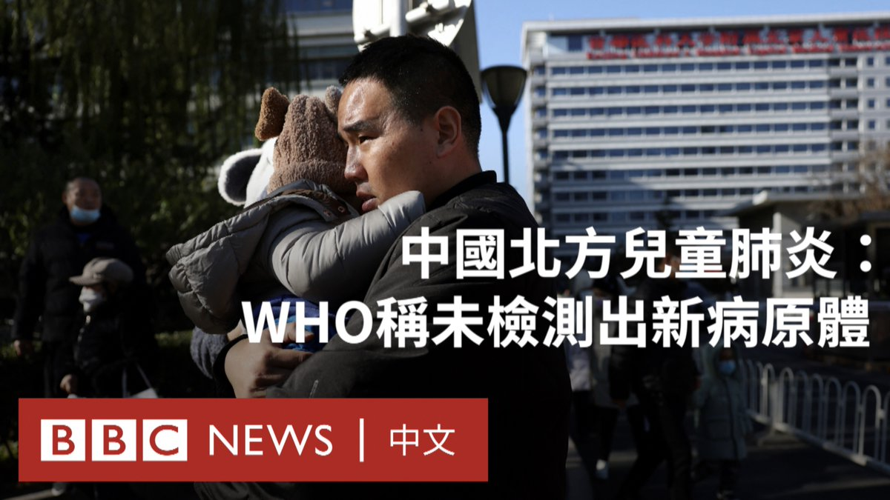
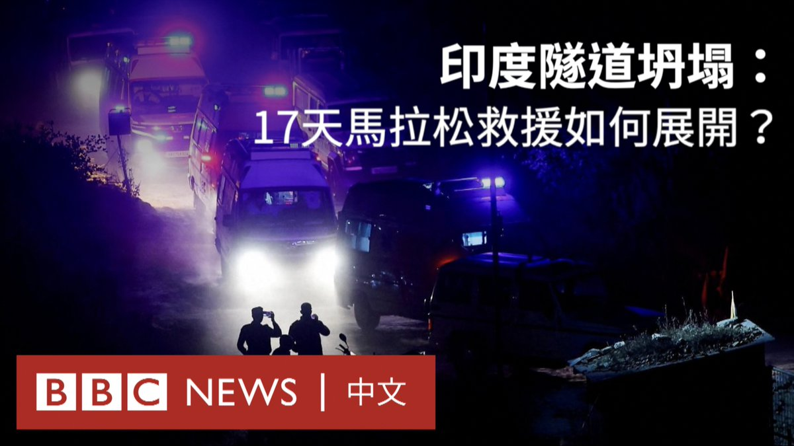
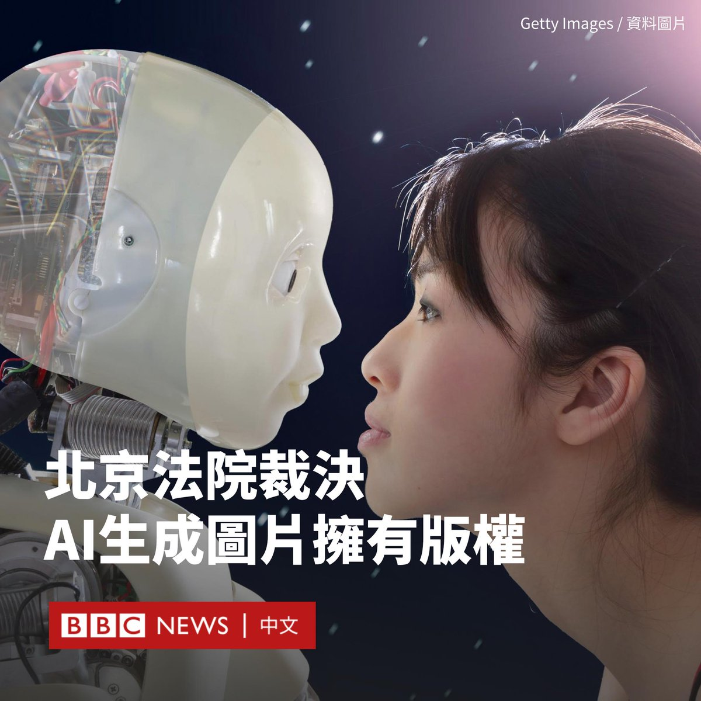
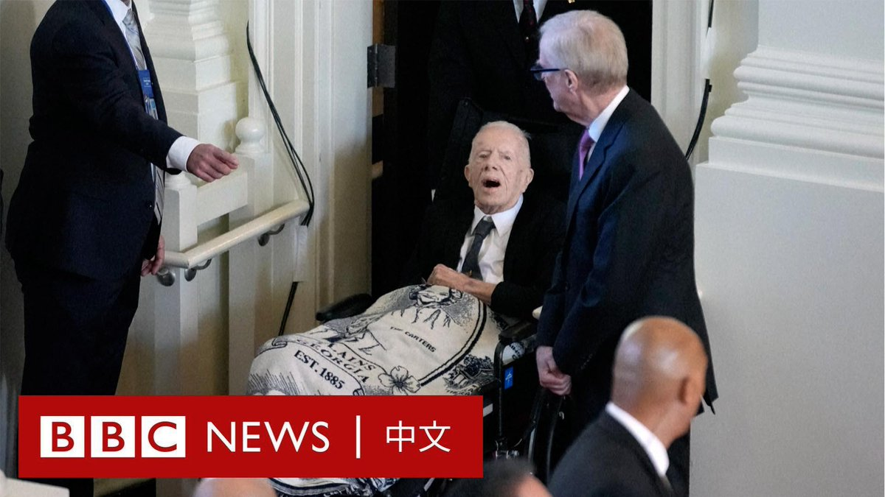

D英国广播公司BBC 北京时间 2023-11-29T21:04:52Z 1729848904525693395 经过四个月休庭后，香港民主派47人初选案周三（11月29日）再次开庭，进入结案陈词程序。法官在开庭后表示，他们预计需时三至四个月作出判决。

该案件在2023年2月开审，直到8月休庭。据香港媒体报导，香港高等法院合议庭预留了10天时间听取控辩双方总结案件。

这47名民主派政治人物与活动人士——其中包括了2020年7月这场非正式初选的主办方、参选人和工作人员——面对一项《香港国安法》下的“串谋颠覆国家政权”罪。31人认罪，16人不认罪。

不少被告人自2021年1月被捕至今已被收押超过两年，结案陈词后何时宣判仍待合议庭宣布。若被裁定有罪，被告人将面对最高无期徒刑。

由于涉案人数众多，聆讯继续移师面积较大的西九龙裁判法院举行。据报导，有约30人排队旁听，多名警员在法院大楼周边站岗。

代表检方的香港特区律政司副刑事检控专员在陈词中称，不应狭义解释《香港国安法》定义，应把采取“其他非法手段”实行控罪所指行为也视为使用“武力手段”，并据此裁定被告人有罪。

检方之前指控被告人试图一旦当选立法会议员后“无差别”否决政府财政预算案，从而迫使特区行政长官辞职。辩方主张被告人只是计划在当选后行使作为议员的宪制权力。   D英国广播公司BBC 北京时间 2023-11-29T18:23:11Z 1729808215263887492 在北京，一所儿童医院的候诊区人满为患。中国正在努力应对呼吸道疾病的激增，在北京、辽宁等北部地区儿童感染病例尤其多。

上周，世界卫生组织曾要求中国提供更多信息。该机构表示，中国已向其分享相关数据且“未检测到任何异常或新兴病原体”。 https://t.co/iojt8NQfbb   D英国广播公司BBC 北京时间 2023-11-29T19:32:05Z 1729825556194316604 周二（11月28日），印度救援人员成功打通最后阶段隧道，救出41名被困北阿坎德邦坍塌隧道长达17天的工人。

当获救工人从被推入废墟的管道中走出来时，他们受到了掌声和传统金盏花花环的迎接。

一起看看这场历时400多个小时，意外频出的救援行动是如何展开的。 https://t.co/GbqynlFyUT   D英国广播公司BBC 北京时间 2023-11-29T16:36:36Z 1729781393369305444 AI（人工智能）生成的图片有版权吗？北京一家法院近日作出裁决，认定AI绘画图片应当被认定为作品，受到著作权法保护。

据中国官方媒体报道，这是中国法院首次就因AI生成图片而引发的著作权纠纷作出判决。

据《光明日报》报道，今年2月，该案原告李先生通过一款开源软件生成了AI图片，将其发布在社交媒体“小红书”上。

原告指，在几天后，被告人刘女士在未获得许可的情况下将该图片用于另一个社交网站百家号的帖子中，发布时还截去了原帖的水印。李先生要求这名女士道歉并赔偿。

北京互联网法院周一（11月27日）作出民事判决，认定原告享有涉案图片的著作权，要求被告向原告赔礼道歉，并赔偿人民币500元（70美元）。

据报导，法院认为，尽管该图片是使用AI工具生成，但原告进行了一定的智力投入，例如选择模型、提示词和设置相关参数等。

“涉案图片是基于原告的智力投入直接产生，且体现出了原告的个性化表达，故原告是涉案图片的作者。”判决书写道。

随着AI技术迅速发展，AI生成的图像席卷了全球互联网。在中国和其他国家都有电子商务卖家尝试通过AI工具绘制产品图。

但是，围绕AI产生的新的法律争议已堆积如山。今年8月，美国哥伦比亚特区联邦地方法院裁定，在没有任何人工输入的情况下由AI创作的艺术品不能享有版权。   D英国广播公司BBC 北京时间 2023-11-29T14:45:13Z 1729753360675582449 99岁高龄的美国前总统吉米·卡特（Jimmy Carter）出席了已故妻子罗萨琳·卡特（Rosalynn Carter）的追悼会，坐在轮椅上送她最后一程。

这位前第一夫人11月19日逝世，享年96岁。卡特夫妇结婚超过77年，两人早前都决定在家中接受临终关怀。

多名美国前第一夫人，包括梅拉尼娅·特朗普（Melania Trump）、米歇尔·奥巴马（Michelle Obama）、劳拉·布什（Laura Bush）和希拉里·克林顿（Hillary Clinton）均出席了葬礼。   D英国广播公司BBC 北京时间 2023-11-29T12:52:08Z 1729724904759517338 在发布了一条“蛋炒饭”教学影片后，拥有千万粉丝的中国网红厨师王刚身陷“侮辱英烈”风波，他被指影射中共前领导人毛泽东长子毛岸英之死。王刚随后发布视频致歉。https://t.co/suVvQLZGoQ   D英国广播公司BBC 北京时间 2023-11-29T10:24:56Z 1729687860184285263 随着以色列与哈马斯的战斗持续，网络上的舆论之争同样激烈。社交媒体TikTok与X成为了主战场。https://t.co/QBluDJY9Hs   