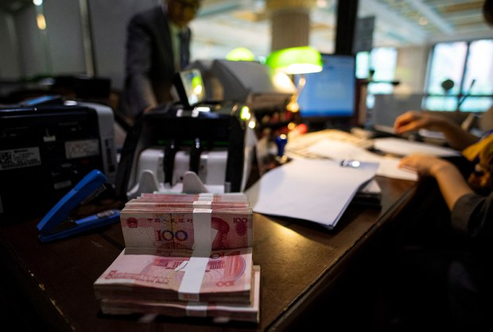
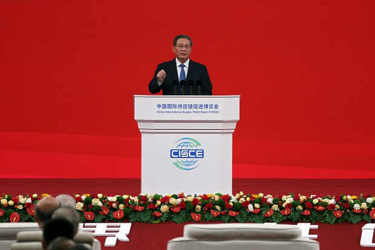
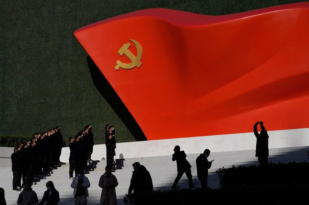
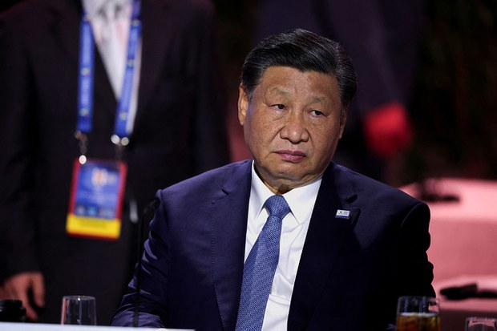
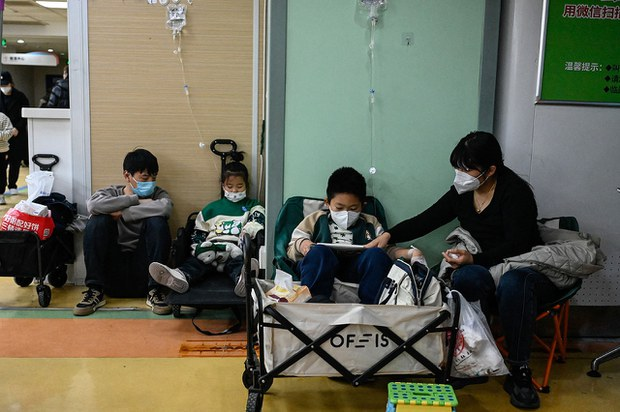
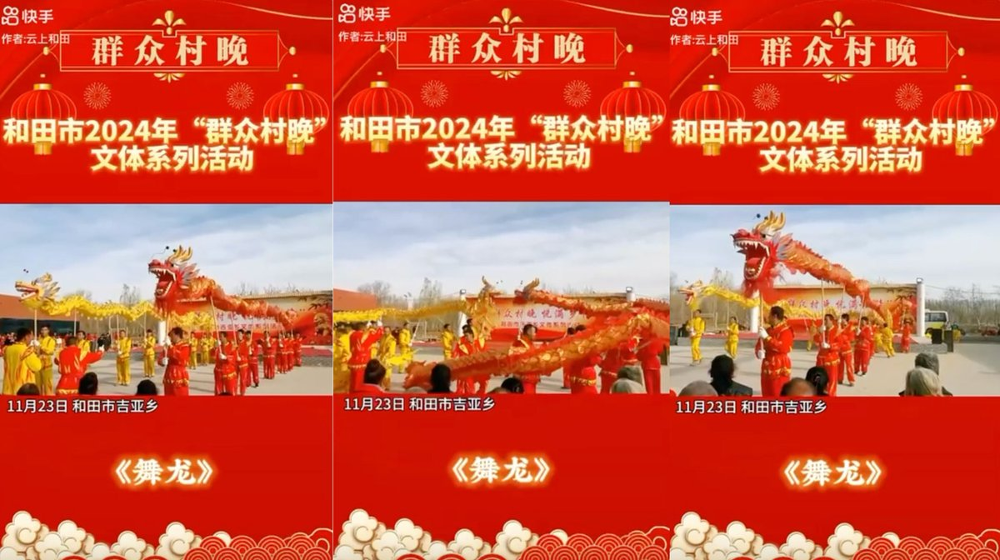
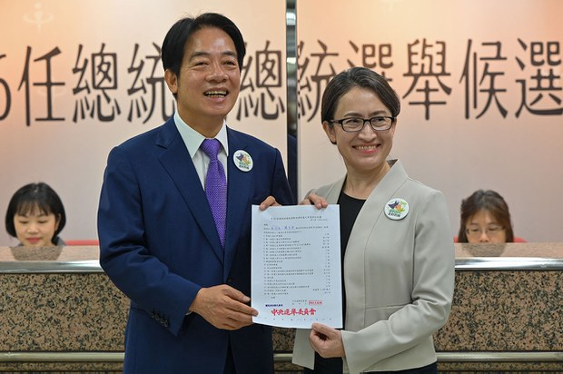

自由亚洲电台 北京时间 2023-11-29T15:00:40Z 1729757251160711521 【山西斥资近千万建“防止返贫”监测系统】
【网民：惊掉下巴】
近日，山西省乡村振兴局的一则招标结果公告显示，将耗费859万元建立监测App系统，以监控已经“脱贫”的民众是否返贫。对此，网民哗然，大呼惊掉下巴。详细报道：https://t.co/Nlkdr9vl7f   自由亚洲电台 北京时间 2023-11-29T15:02:29Z 1729757706901184965 【山西斥资近千万建“防止返贫”监测系统】
【网民：惊掉下巴】
近日，山西省乡村振兴局的一则招标结果公告显示，将耗费859万元建立监测App系统，以监控已经“脱贫”的民众是否返贫。对此，网民哗然，大呼惊掉下巴。详细报道：https://t.co/Nlkdr9vl7f https://t.co/pb6BcuGLYS   自由亚洲电台 北京时间 2023-11-29T05:05:55Z 1729607576395055153 #中国经济 面临房市疲软等金融危机之际，有消息人士披露，北京证券交易所已禁止上市公司的大股东抛售股票。但 #北交所 随后否认了这一说法。https://t.co/1aC3O0J1qI https://t.co/pBm7dJPGje   自由亚洲电台 北京时间 2023-11-29T05:16:37Z 1729610268530106861 中国美食播主 #王刚 11月27日在网上发布了一条公开道歉视频，表示他以后不会再制作 #蛋炒饭。
而王刚为什么要为蛋炒饭道歉? 
又为何做出这样的决定呢？
https://t.co/6nqsFEWzIX https://t.co/C4dSnzCi0t   自由亚洲电台 北京时间 2023-11-29T05:45:26Z 1729617522859901163 美国《纽约时报》28日发文指，在新冠防范措施结束后，富裕的中国人今年已将数千亿美元转移出境。他们用存款购买海外的公寓、股票和保险，或把钱存入利率高于中国的美欧银行账户，目的就是寻求一个可以保值的投资方案。 #中国民间资金外流  https://t.co/kCFmT42Ox3 https://t.co/FpoF3xiD5a   自由亚洲电台 北京时间 2023-11-29T03:27:53Z 1729582906664952183 中国国务院总理 #李强 28日出席在北京举行的首届 #中国国际供应链促进博览会 时表示，中国反对保护主义和各种形式的“脱钩断链”，并希望加强与所有国家的供应链。这番讲话正值美国总统拜登宣布采取新措施，以加强 #美国 的 #供应链 并确保关键部门安全之际。https://t.co/Ssf0vqJXn4 https://t.co/c5kf6j5pqL   自由亚洲电台 北京时间 2023-11-29T05:07:24Z 1729607948035612686 随着美中两国间全方位的竞争日趋升级，双方在科技与经济等领域的角力尤其引发舆论关注。外界注意到，自从北京当局解除了为期三年的新冠封控政策后，#中国经济 在2023年迟迟未见复苏迹象。对此，美国智库学者针对美中两国的经济前景进行了剖析。https://t.co/Se1sBy7g7w https://t.co/G4eUpzSWxH   自由亚洲电台 北京时间 2023-11-29T05:18:25Z 1729610720466305241 欢迎收听和订阅播客【#亚太报道】 https://t.co/MjLNSvVMqc
#中国经济 出现“三潮”合流；#呼吸道传染病 与 #新冠 变异；#习近平 要求加强涉外法制建设；中国“#抓特务”运动升级；网红厨师 #王刚 为“#蛋炒饭”道歉 #毛岸英 #毛二世 https://t.co/DPMgyush5h   自由亚洲电台 北京时间 2023-11-29T05:46:21Z 1729617750954491944 评论 | #傅申奇：中共的《恐惧综合征》 https://t.co/sWSMz0FHq9 https://t.co/mwzTW6rRjC   自由亚洲电台 北京时间 2023-11-29T05:47:00Z 1729617915547357249 #聚焦维吾尔 | #伊利夏提：再读爱尔兰作家伏尼契《#牛虻》小说随感 https://t.co/PsKHhmxxTB https://t.co/cOrp4mynu1   自由亚洲电台 北京时间 2023-11-29T01:45:28Z 1729557132197192197 #台湾 #大选 前，有关中国组织台湾人士赴对岸旅游，暗示支持某位候选人，甚至文宣指明"贯彻 #习近平 指示、解决台湾问题"的消息引发舆论关注。本周二，高雄地检署以涉嫌违反相关法律为由传唤二十二人到案。https://t.co/jiz8H8Hj58 https://t.co/FrDkV6qVLJ   自由亚洲电台 北京时间 2023-11-29T02:52:47Z 1729574074387751359 中国国家主席 #习近平 日前提出，为应对外部风险挑战，要加强涉外法制建设。那么，什么是所谓的" #外部风险"呢？https://t.co/ZARHg4AnSO https://t.co/4OwotYquuL   自由亚洲电台 北京时间 2023-11-29T03:39:46Z 1729585897186988263 近期，#中国 各地 #呼吸道疾病 的 #传染 状况日趋严重，引发世界卫生组织关注。外界担忧，经历新冠疫情后的中国进入第一个冬季，此时爆发的呼吸道疾病是否为 #病毒 变异呢？https://t.co/Pi3XNr9wqD https://t.co/2bEw6hWWJv   自由亚洲电台 北京时间 2023-11-29T00:02:29Z 1729531213680202085 中国领导人 #习近平 据报赴 #上海 访问，将参访上海期货交易所及科技公司。而在此之前，中国官方再度发布支持 #民营经济 的措施，这也是当局近期第四次推出相关政策。 https://t.co/OqlpYSDaGM   自由亚洲电台 北京时间 2023-11-29T01:41:20Z 1729556092601196656 近日，#新疆 各地陆续启动“群众村晚”活动，其中维吾尔妇女身穿汉族民俗服装，打腰鼓、跳扇子舞等现象，引发舆论关注。世维会发言人表示，习近平在新疆推动的“文化润疆”政策，是对维吾尔人进行 #文化灭绝 的 #政治运动。https://t.co/fQMvNKEbXs https://t.co/bdxutRGwgM   自由亚洲电台 北京时间 2023-11-29T02:03:23Z 1729561642030293363 为强化防御以 #反制中国 的主权声索，#菲律宾 武装部队总参谋长布劳纳（Romeo Brawner）日前表示，明年可能联合美国及澳大利亚等盟友，在“西菲律宾海”（即南海）进行多边巡逻。https://t.co/cgZr3BkFvZ https://t.co/182ktsxeKU   自由亚洲电台 北京时间 2023-11-29T02:04:15Z 1729561858150195520 #评论 | #王丹：蓝白破，民进党也不会躺着赢--台湾大选观察之一 https://t.co/HterF9rMhr https://t.co/dMQbYWP7RH   自由亚洲电台 北京时间 2023-11-29T00:01:16Z 1729530908301230478 港府一直强调，香港经历社会运动和疫情后依旧是国际金融中心，但跨国企业对香港 #资讯安全 环境的戒心明显加强。英国媒体报道，至少两家国际会计师事务所要求访港的雇员避免使用日常工作电话，而改用一次性的"#抛弃式手机"。#黑客 https://t.co/K8QAzRHjpt   自由亚洲电台 北京时间 2023-11-29T00:03:32Z 1729531480739827727 评论 | #陈破空：习近平留给世界更大的疑问 https://t.co/geBBJ6dTYw   