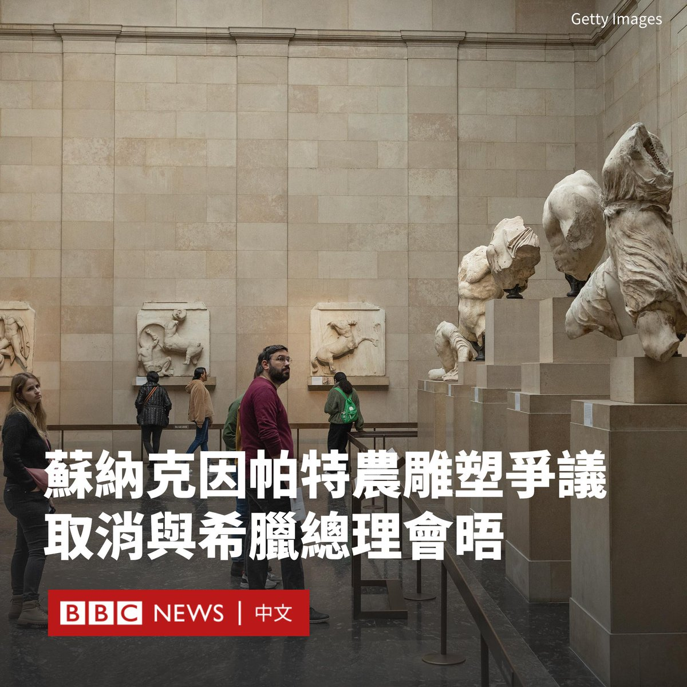

D英国广播公司BBC 北京时间 2023-11-28T16:51:23Z 1729422723590627564 英国和希腊政府就埃尔金大理石雕（Elgin Marbles）再次爆发外交争端。

希腊总理米佐塔基斯（Kyriakos Mitsotakis）原定在伦敦会见英国首相苏纳克（Rishi Sunak），但唐宁街10号在最后一刻取消了会晤。

米佐塔基斯对记者说，他对会晤的突然取消“深感失望”。他拒绝与副首相进行替代性会晤。

在该事件发生前一天，米佐塔基斯对BBC说，英国政府应该归还埃尔金大理石雕，因为把一部分文物放在伦敦而剩下的放在雅典，就像把《蒙娜丽莎》切成两半。

两人的会晤原定于周二（11月28日）午餐时间举行。BBC获悉，会议原定持续45分钟。消息人士表示，米佐塔基斯对英国政府的行为感到“困惑”和“恼火”。

一名保守党高级消息人士称：“会晤前关于埃尔金大理石雕的评论使得这次会晤不可能继续。”

这组石雕由古希腊雕塑家菲狄亚斯（Phidias）创作，有2500多年历史，原位于帕特农神庙。

19世纪初，英国外交官埃尔金伯爵托马斯·布鲁斯（Thomas Bruce）将这些浮雕从奥斯曼帝国统治下的希腊运往英国，它们于1816年被英国政府买下，并被放置在大英博物馆。   D英国广播公司BBC 北京时间 2023-11-28T14:49:54Z 1729392151321297014 据中国官方媒体报道，有超过300万人报名参与中国一年一度的国家公务员考试，创下历史纪录。

由于中国私营部门不景气，青年失业率处于历史高点，创纪录的报考数字突显了稳定的工作在年轻人中越来越有吸引力。

据中国中央电视台报道，中央机关及其直属机构录用公务员公共科目笔试于周日（11月26日）在全国237个城市同时举行。

据报道，由于每年平均有30%左右的考生报名后未参加考试，实际参加考试人数达到225万人。

今年，该国中央机关及其直属机构共有近4万个职位空缺，这意味着平均每个职位都有57名候选人参与角逐。

据报道，竞争最激烈的职位是中国国家统计局宁夏调查总队的一个职位，报录比达到惊人的3572:1。

据中国新闻网报道，在大学毕业后试图攻读硕士学位的人数也有所下降。中国教育科学研究院研究员储朝晖认为，就业的严峻形势是主要因素。

“对于很多本科毕业生来说，如果现在能找到一个就业岗位的，肯定更倾向于尽快就业，相比考研究生来说更现实一些。”他说道。   D英国广播公司BBC 北京时间 2023-11-28T13:05:03Z 1729365768041840761 商业大亨马斯克（Elon Musk）周一（11月27日）现身以色列，他与以色列总理内塔尼亚胡（Benjamin Netanyahu）一起访问了上个月遭哈马斯屠杀的卡法阿扎（Kfar Aza）基布兹。

两人还在X（旧称推特）上进行了简短的直播对话，期间马斯克赞同了内塔尼亚胡的观点，即获得和平与安全的唯一途径是“摧毁哈马斯”。

在此行中，马斯克还与以色列就卫星互联网服务星链（Starlink）在加沙的使用达成协议。

在马斯克访问之际，他本人与X平台都深陷反犹主义风波。苹果、迪士尼、IBM和康卡斯特（Comcast）暂停在X上投放广告。   D英国广播公司BBC 北京时间 2023-11-28T11:13:00Z 1729337568683340105 10月7日，哈马斯对以色列发动大规模袭击，以色列随后对哈马斯所在的加沙地带展开持续报复性轰炸。双方的冲突随即成为自俄罗斯入侵乌克兰以来，另一场牵动全世界神经的战争。

随着美国等西方大国迅速对以色列表示支持，中国显示了其不同的立场，从一开始拒绝谴责哈马斯的袭击，到后来更加明显地批评以色列。

中国为什么会采取这种态度？北京在愈演愈烈的以哈冲突中有着怎样的考量？BBC中文与多名专家一起探讨。

▶️观看影片：https://t.co/Cb1QjXStpv   D英国广播公司BBC 北京时间 2023-11-28T08:55:17Z 1729302911799140453 你可能从未听说过“满洲花椰菜”（Gobi Manchurian），但它与很多类似的菜肴正在征服很多美国人的味蕾。

这些菜肴并不是中餐，而是“印式中餐”，是辛辣的印度菜和中国菜合璧的版本。是什么让印度移民的这种家常菜悄然走红呢？https://t.co/uosvIScY2q   