自由亚洲电台 北京时间 2023-11-28T23:20:08Z 1729520559397179648 #中国 #国家安全部 本周一公布一起渗透窃密案，指国内一网络技术人员遭境外间谍情报机关利用，涉嫌向内地多家国防军工单位的高新科技企业，发动网络攻击窃密活动。 https://t.co/F36XrTv0hl   自由亚洲电台 北京时间 2023-11-28T18:20:53Z 1729445247707746654 【30年之后 #台股 指数再次超越 #港股】
台湾股市加权指数28日收在17,341.25点，大涨203.83点（或1.19%）最高触及17,360.38点；港股恒生指数则是开高走低，下午开盘后，最低跌至17303.82点，与台股一度“黄金交叉”，也让台股 #加权指数 在睽违30年之后，又重新领先港股 #恒生指数。
https://t.co/QwNeucWFpF
（路透资料照） 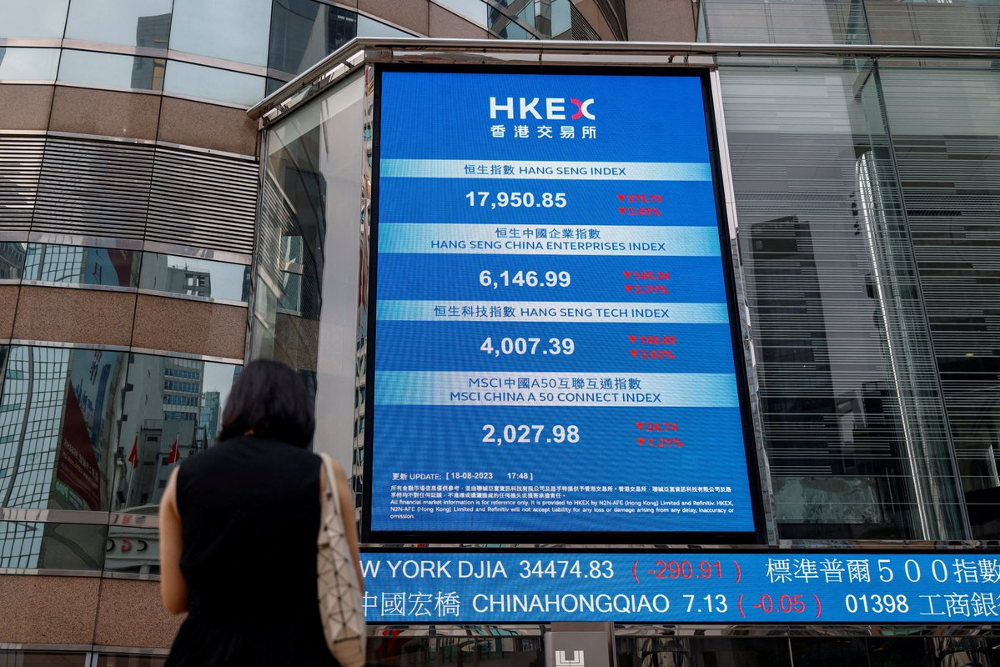  自由亚洲电台 北京时间 2023-11-28T16:17:38Z 1729414232024969465 【倒闭裁员失业 春节返乡潮提前】 
【“三潮”合流 民众生活难上加难】
中国企业 #裁员，导致大量民众今年 #提前返乡 过年。上海业内人士对本台说，在上海找工作相当艰难，许多离职者不会再回上海。抖音母公司“#字节跳动”也证实将关闭游戏业务“#朝夕光年”或裁千人。另外，近二十家大型互联网科技企业传出裁员。倒闭、裁员、失业成为困扰中国的“新三潮”。
https://t.co/shW4QXv8ab   自由亚洲电台 北京时间 2023-11-28T11:15:39Z 1729338234537164825 RT @RFA_Chinese: 【保卫白纸运动集体记忆 | 青年集会华盛顿】
一群中国抗议人士在寒夜中聚集华盛顿，点亮烛光，纪念一年前由 #乌鲁木齐 大火而触发的白纸革命；在后疫情时代传承 #白纸运动 精神，将议题扩大至性别平权和女权主义。组织者表示，尽管大多数被捕的 #汉族…   自由亚洲电台 北京时间 2023-11-28T11:19:15Z 1729339141949919389 来自北京的姜辉，母亲在 #马航MH370 上。他对本台表示：“我到现在为止一分钱都没拿到。 家属没有得到一分钱的援助。这不仅从精神上、金钱上都给家属带来很大负担和折磨。很多家属需要卖房才能去治病。有些家属只好签署和解才能拿到一点赔偿，才能继续生活跟治病。”
https://t.co/H8It975aUX https://t.co/K2oAHbZVGC 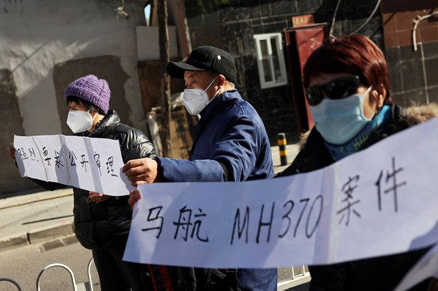  自由亚洲电台 北京时间 2023-11-28T09:56:20Z 1729318274423304489 中国国家统计局27日发布全国规模以上工业企业利润最新统计数据。其中，全国1至10月，规模以上工业企业利润同比增长7.8%，减幅收窄；10月份，实现利润同比增长2.7%，连续3个月正成长，不过相对8、9月的17.2%和11.9%增速，成长急剧放缓。
此外，1至10月份的规模以上工业企业中，国有控股企业利润同比下降9.9%，股份制企业利润同比下降7.0%，外商及港澳台商投资企业利润同比下降10.2%，私营企业利润同比下降1.9%。
另据中国《第一财经》27日报导，财信研究院副院长伍超明表示，未来房地产恢复仍具有较大不确定性，加上民企等投资信心有待提振，预计本轮企业盈利修复或仍面临一些波折，修复高度不宜过度高估。   自由亚洲电台 北京时间 2023-11-28T04:51:45Z 1729241623178162222 在美国南加州的 #洛杉矶，约百名来自中国的异议人士及在美香港人于11月26日下午在当地中领馆外举行集会，纪念 #白纸运动一周年，并表达对中国当局的抗议。
https://t.co/n7MKXQqPDt https://t.co/LoTf1KFeNI 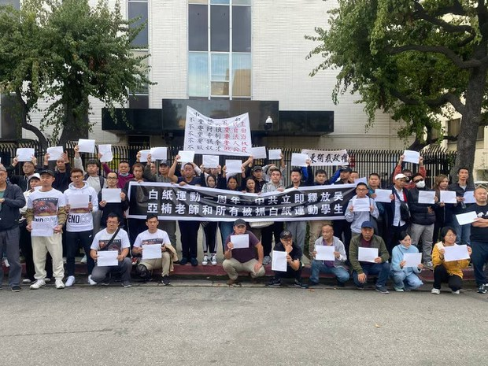  自由亚洲电台 北京时间 2023-11-28T06:57:49Z 1729273347740229841 专栏 | #夜话中南海：曾经被盛传是央行行长接班人的 #朱鹤新 为何只接掌了外管局？
https://t.co/PMVcDJQ6EL https://t.co/E8MtQEreOz 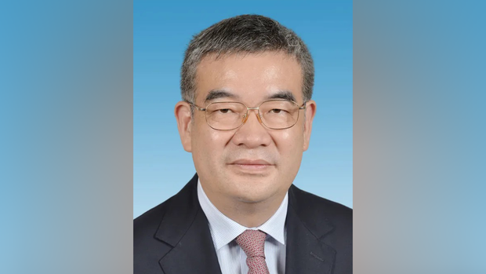  自由亚洲电台 北京时间 2023-11-28T08:34:35Z 1729297701274296354 欢迎收听和订阅播客【＃亚太报道】 https://t.co/MjLNSvVMqc
(2023-11-29)
中国 #网络审查 力度升级；美英等地纪念“#白纸运动”周年；#金马奖 影片《#石门》在中国遭屏蔽；#马航MH370 索赔案在京开庭；香港前议员 #许智峯 被当局申请破产。 https://t.co/Ukbb7OfrzP 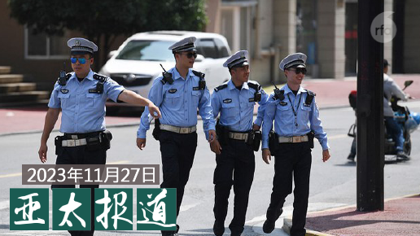  自由亚洲电台 北京时间 2023-11-28T02:49:41Z 1729210905605627971 #考研 热度退却的同时，#考公务员“上岸”成为近年来中国年轻人的热门且仅有的出路。这样的集体选择说明了什么？
https://t.co/6DEACzMIy8 https://t.co/2o29NW5lDW 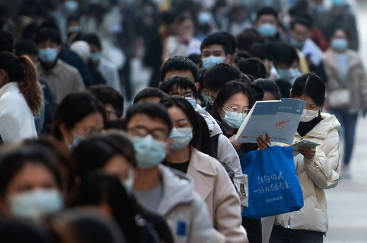  自由亚洲电台 北京时间 2023-11-28T04:50:09Z 1729241220168536400 本周四，《#联合国气候变化框架公约》缔约方会议将在阿拉伯联合酋长国召开。外界关注，美中这两个全球最大的 #温室气体 排放国能否在本届峰会克服分歧，在气候变迁问题上取得共识？
https://t.co/KMXPHVpaSp https://t.co/okGqhufyTD 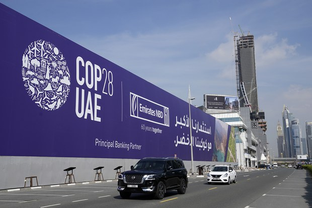  自由亚洲电台 北京时间 2023-11-28T05:51:04Z 1729256549955326278 本台英语组11月26日发表评论文章，关注中国、#老挝、#越南 等  #亚洲共产政权 的统治模式正在出现变化。
文章作者大卫·赫特（David Hutt）是中欧亚洲研究所(Central European Institute of Asian Studies) 研究员及《外交学者》杂志（The Diplomat）的东南亚专栏作家。
https://t.co/XGaqdvbi8t https://t.co/YHCrpOehQG 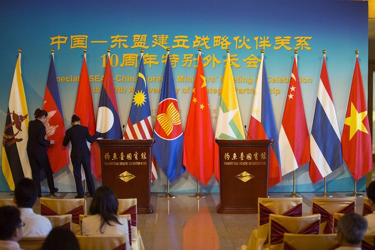  自由亚洲电台 北京时间 2023-11-28T05:58:36Z 1729258446741200904 #事实查核｜因援乌而国防资金短缺  #立陶宛 将征收雨水税？
https://t.co/eEOpkmCHOl https://t.co/jcTm8Vz8WU   自由亚洲电台 北京时间 2023-11-28T01:05:17Z 1729184632443445456 在台湾近日举办的 #第60届金马奖 颁奖典礼上，湖南女导演黄骥与日本夫婿联合执导、日本出品的《石门》，环绕取卵、代孕、盗卖出生证明等议题，勇夺最佳剧情片大奖。但该片随后却在中国遭到屏蔽。

https://t.co/pRB1ZwW6ja https://t.co/Tmm04SjQs4   自由亚洲电台 北京时间 2023-11-28T03:49:31Z 1729225961567347134 #白纸运动一周年 之际，虽然中国国内未见再有抗议活动，网上言论也被严密审查，然而全球多地都有不同形式的活动。在伦敦，去年新成立的华人组织“#中国反贼”@China_Deviants 联合多个团体举办艺术展，展出他们早前从网络征集的艺术品，并在欧洲各大城市巡回。
https://t.co/jb5KaDVnYJ https://t.co/eqwUbFHIaH 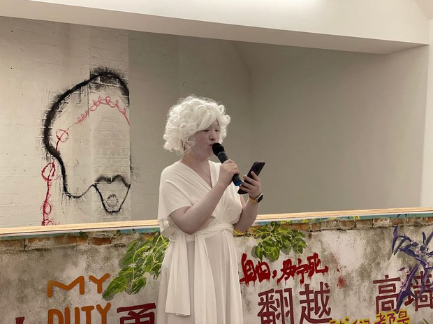  自由亚洲电台 北京时间 2023-11-28T00:32:06Z 1729176281466708203 #李克强 去世一个月，"#白纸运动"一周年，都在11月27日。
官方监控的 #网络敏感词 再次增加。有些你都想不到，比如 #依法治国、#坚强核心 等都成了"敏感词"。 
有网民将怒火发泄到 #马化腾 身上。

https://t.co/RPc3s1DX6s https://t.co/BLMOR9hBLq 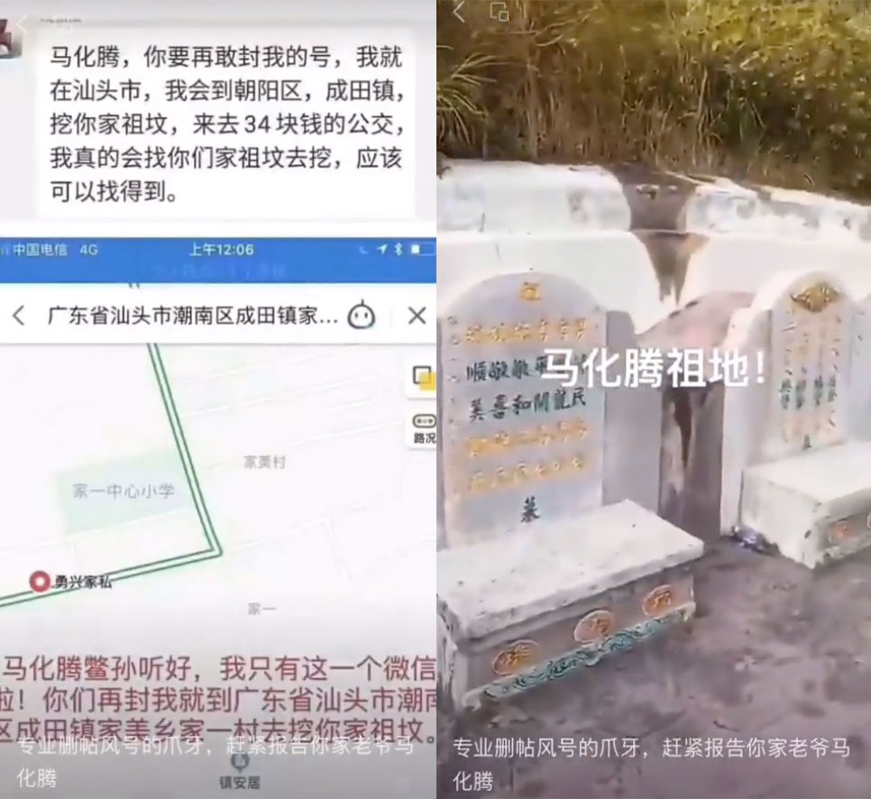  自由亚洲电台 北京时间 2023-11-28T01:42:44Z 1729194056260219231 被港府以《国安法》名义悬红百万通缉的流亡香港议员 #许智峯 2019年向港警提出多宗私人诉讼，但因在港资产被港府冻结，不能支付诉讼费，被港府申请破产。他批评这是对他施加 #跨境镇压，试图借破产破坏名誉和影响其在澳大利亚的律师执业。

https://t.co/pUSfTM4ugu https://t.co/OWHp72FWXy 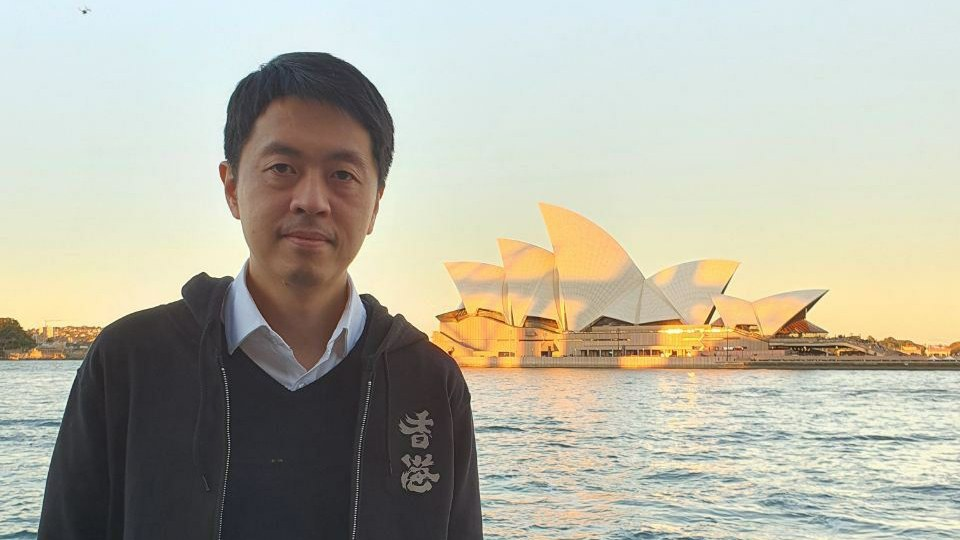  自由亚洲电台 北京时间 2023-11-28T01:50:08Z 1729195919378436238 据中国官媒新华社报道，中共中央政治局周一（27日）召开会议，审议《关于进一步推动长江经济带高质量发展若干政策措施的意见》及《中国共产党领导外事工作条例》。中共中央总书记习近平主持会议。
 不过，报导没有提及外界普遍关注的 #20届三中全会 召开的消息。
 https://t.co/375WizDSTk https://t.co/LRBPjIyjHV 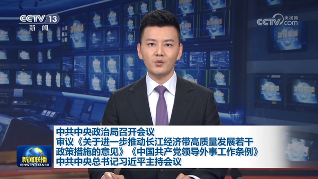  