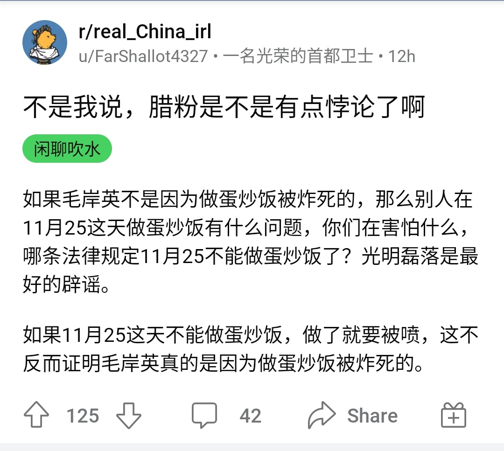
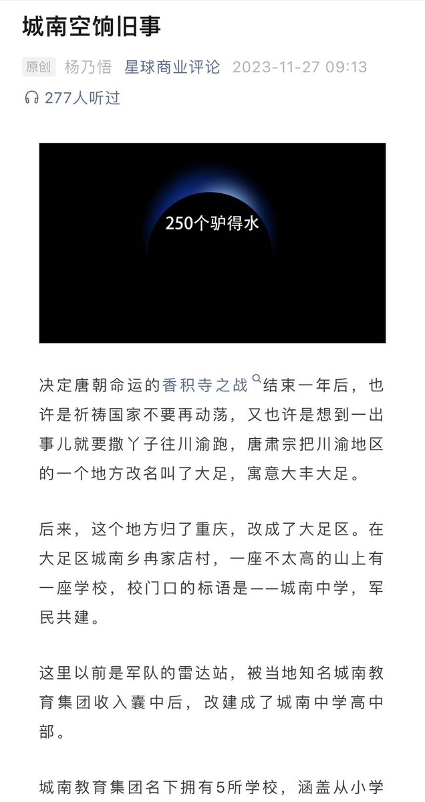
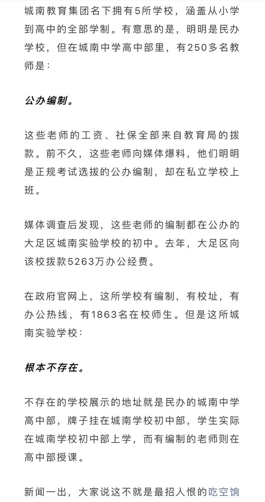
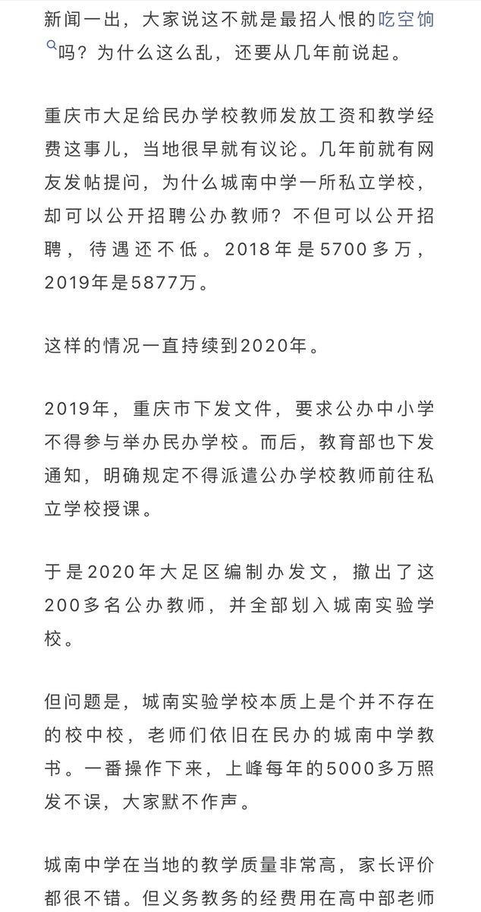
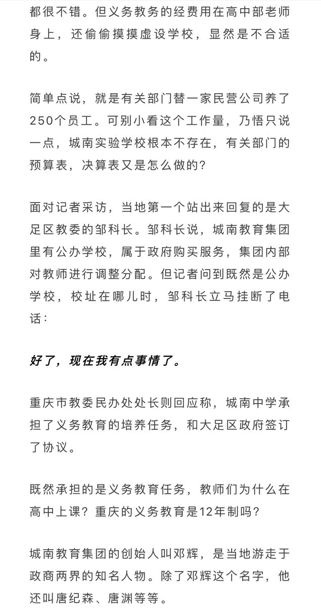
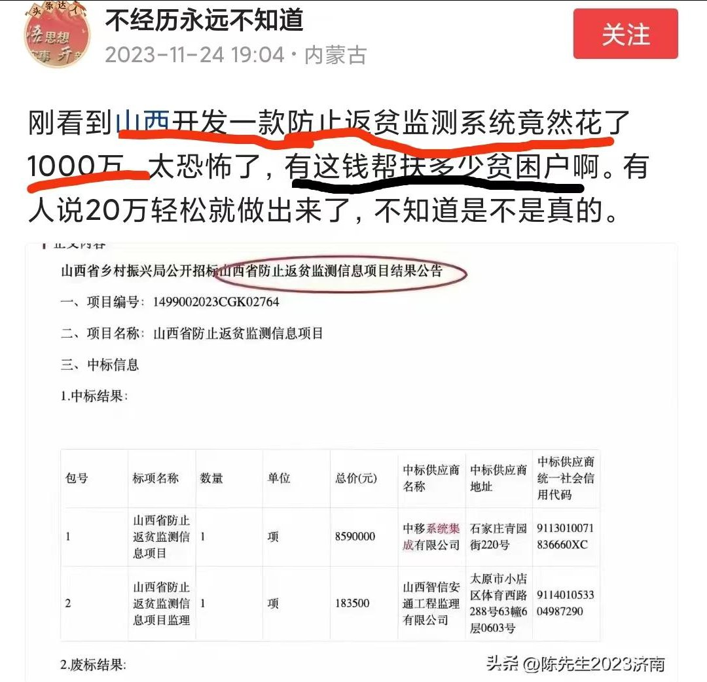
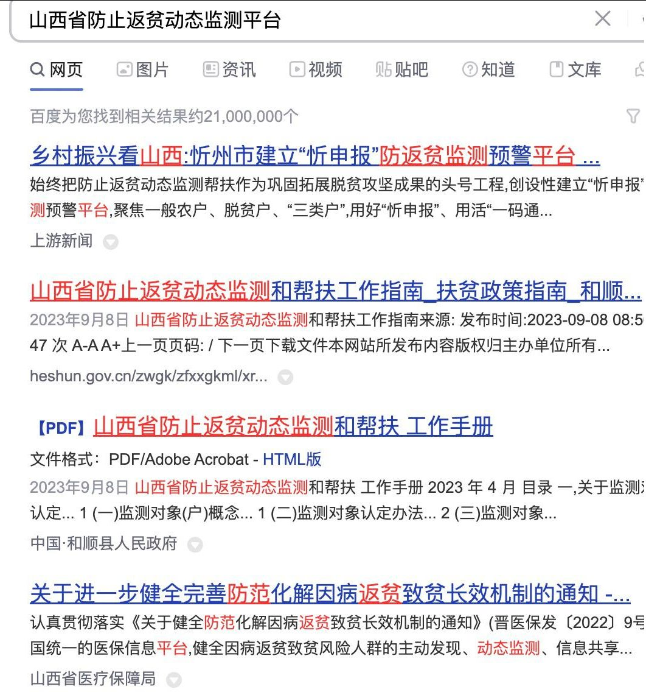

谁将十万横扫三江 北京时间 2023-11-28T22:32:28Z 1729508561951056196 RT @whyyoutouzhele: 11月26日，河南村镇银行储户们再次前往河南南阳拉横幅抗议，要求归还自己的存款。
随后他们被全部逮捕。
河南村镇银行的储户们在所有人都长期被严密监控的情况下依然展现着他们异常强大的行动力。而距离他们的存款被冻结也已经接近600天。 htt…   谁将十万横扫三江 北京时间 2023-11-28T22:53:05Z 1729513751546605863 RT @whyyoutouzhele: 11月27日，广东深圳。
上百号农民工来到深圳龙光集团讨到工资，结果工人们不但没能拿到工资，反而遭到大量警察的驱赶。
28日清晨，龙光集团大厦周围已被封锁，工人们已无法进入。 https://t.co/Q59Kmz1Kiw   谁将十万横扫三江 北京时间 2023-11-28T18:06:53Z 1729441723837997094 RT @leigedebaba: 用热河省这个词就是果粉🤣
66666 https://t.co/ar3u9nzAeR   谁将十万横扫三江 北京时间 2023-11-28T14:11:08Z 1729382396590793130 RT @HenryPYQ: 在一个社会，当人们效忠的是某一个人，那么事实上人们就失去了自由。因为这构成一种人身依附关系，是不平等的，是无条件服从的，是被其人主宰人生命运的。

人们效忠的理应是公理，是法则，是契约，是一种文明的价值观。这其实也就是古代人、古代社会和现代人、现代社…   谁将十万横扫三江 北京时间 2023-11-28T10:55:41Z 1729333209580843144 RT @jakobsonradical: 怎么你们总是在恶意讲逻辑？ https://t.co/kDEpRjzEJ3   谁将十万横扫三江 北京时间 2023-11-28T11:15:12Z 1729338121148584325 网友投稿：中国网民又发动智慧找到了一名反动派

此人2020年毛岸英诞辰发蛋炒饭
2021年毛岸英忌日发炒饭
2022年在毛岸英忌日发腊味炒饭
2023年11月发了烧烤，红烧肉，烤羊排，煎蛋等，严重伤害了中国人民感情 https://t.co/2hjJ3LvJOX   谁将十万横扫三江 北京时间 2023-11-28T06:48:11Z 1729270925261156435 RT @Pandazhq: 民办学校吃起空饷来，也这么理直气壮。 https://t.co/82BVW9Twhs   谁将十万横扫三江 北京时间 2023-11-28T06:42:39Z 1729269531686895633 RT @caijingshujuku: 辜朝明：日本大衰退，对中国的警告和启示！（收藏)

非常感谢您邀请我参加这个非常重要的活动。正如我所介绍的那样，我是在1984年从纽约联邦储备银行调到日本的。这个时期非常重要，因为那时日本开始进入泡沫时期。…   谁将十万横扫三江 北京时间 2023-11-28T07:09:44Z 1729276349674926224 宁愿返贫系统花一千万也不肯把钱发了👍 https://t.co/aVZCHjNVGV   