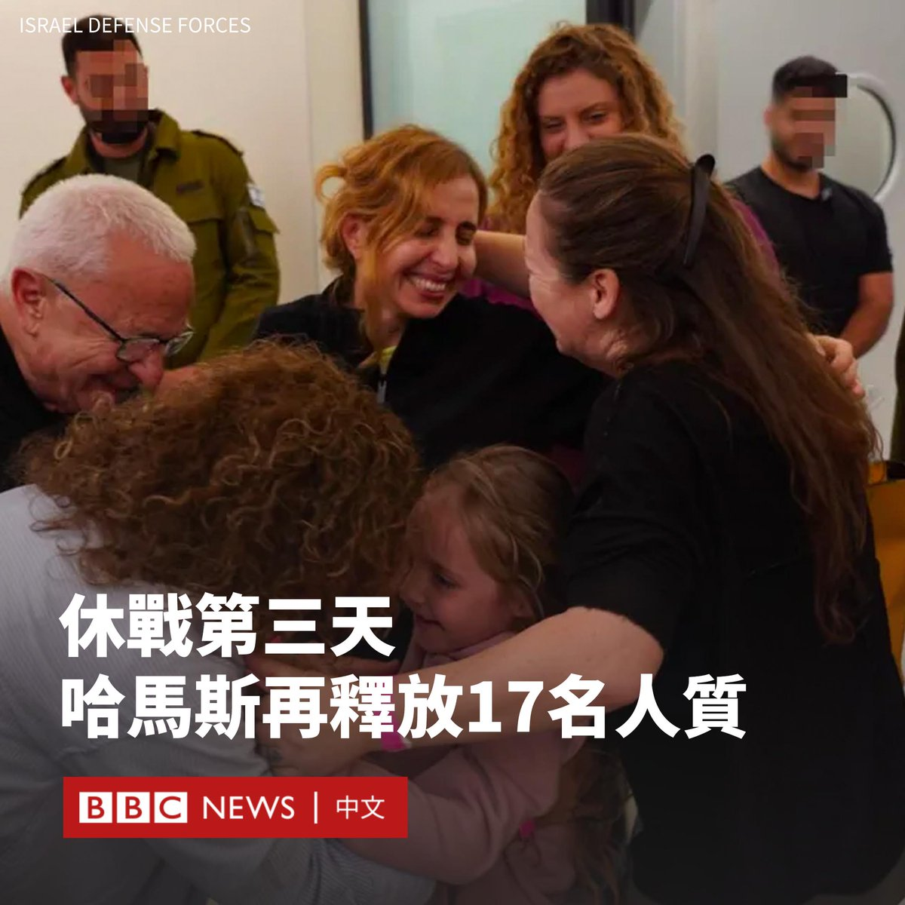

D英国广播公司BBC 北京时间 2023-11-27T14:18:37Z 1729021893439897811 在以色列与哈马斯达成为期四天的临时休战协议后，哈马斯在第三天再释放了17名人质。

17人中包括14名以色列人，3名外国人。其中，四岁的女童阿维盖尔·伊丹（Avigail Idan）拥有以色列和美国双重国籍。

美国总统拜登指“她所经历的一切是难以想象的”，包括目睹了父母在哈马斯的袭击中遇害。

以色列监狱管理局表示，作为交换，以色列已释放39名巴勒斯坦囚犯。

根据双方的协议，哈马斯将在四天内分批释放扣押的50名人质，而以色列将释放监狱中关押的150名巴勒斯坦囚犯。

目前，已有40名人质根据以色列和哈马斯达成的协议被释放。获释的巴勒斯坦人总数达到117人。

此外，根据哈马斯与埃及之间的另一项协议，哈马斯还释放了17名泰国人和一名菲律宾人。

哈马斯表示，他们希望延长休战，并增加释放人质的数量。

以色列总理内塔尼亚胡（Benjamin Netanyahu）表示，最初的协议可以延长，但停火期结束后，以色列将全力恢复在加沙的行动。

哈马斯武装分子10月7日突袭以色列南部，杀害了1200人，约240人被扣为人质。

以色列其后对加沙发动密集的空中和地面攻击，哈马斯主导的加沙卫生部称已有14,000多人死亡。   D英国广播公司BBC 北京时间 2023-11-27T12:00:12Z 1728987059929419971 台湾总统大选将于2024年1月举行，各党派参选人名单已尘埃落定。谁更有胜算？两岸议题是否影响投票意向？BBC中文在台北街头了解市民们的看法。https://t.co/uuYnGtFUWV   D英国广播公司BBC 北京时间 2023-11-27T09:19:02Z 1728946498468257830 货车司机是一个鲜见女性的职业。在墨西哥，许多女性驾驶员除了面临职场上同事的骚扰，更暴露于暴力犯罪的危险之中。
 
克拉拉是家庭暴力的幸存者，她在离开丈夫后辗转加入货运业。她希望成为一名驾驶教练，为女性驾驶货车打开一扇窗。 https://t.co/XaDIVBfeFD   