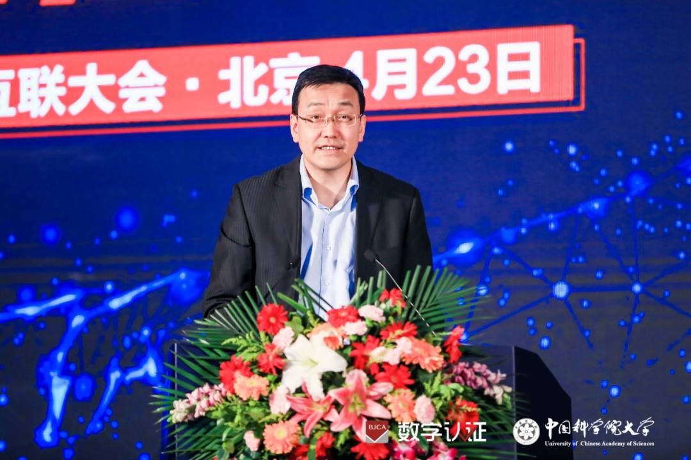
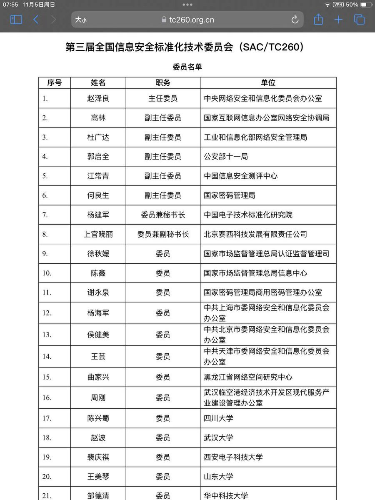

拆墙运动公号 北京时间 2023-11-27T18:16:16Z 1729081698413912444 【 #2259专案组 互联网防火墙第105号嫌犯 #高林】
  性别：男，汉族，
出生日期：1973年7月出生
籍贯：内蒙古包头
学历：工学博士
入党时间：2005年11月
职务：国家互联网信息办公室网络安全协调局副主任委员

高林，男，汉族，1973年7月出生，内蒙古包头人，1999年4月参加工作，2005年11加入中国共产党，工学博士，中华人民共和国工业和信息化部信息化和软件服务业司副司长。 现任鞍山市委常委、副市长，市政府党组成员。

擅长互联网络加密和监控控制
#拆墙运动 #BanGFW #反人类犯罪

负责专业范围为信息安全信息技术标准化研究, 电子信息、标准化, 网络安全。

擅长专业为10年以上IT项目工作经验及半年海外工作经验两年博士后工作经历，研究方向为复杂系统建模与优化，系统辨识，调度，软计算，智能算法，MRPII / REP，标准化已发表的论文二十余篇，参与多项软件方面的国家标准、行业标准和国家军用标准的制定。曾负责标准化政策与策略的研究。, 电子信息、标准化, 网络安全标准化。

 详细资料见: #BanGFW拆墙运动（建墙罪犯录）（#ban_great.wall）:https://t.co/2jgaDGAPJy   