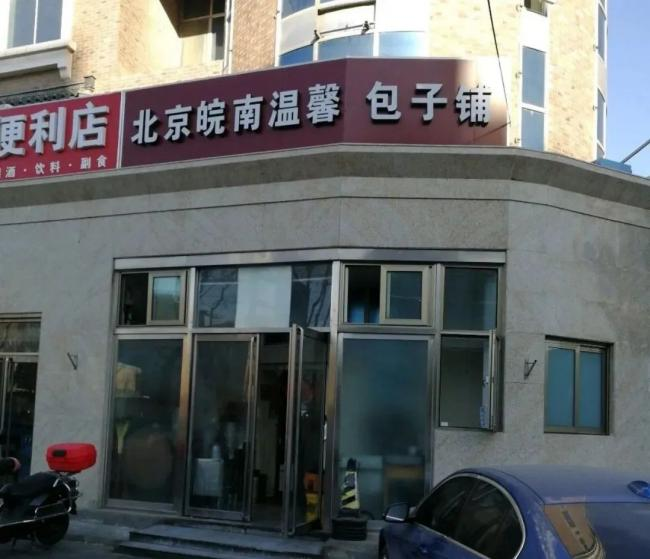

自由亚洲电台 北京时间 2023-11-27T16:33:09Z 1729055749857529908 【#财政紧张 基层靠 #罚款 收入】
【老人摆摊卖菜被罚五万元】
北京一家包子铺出售豆腐脑，被处以1.5万元罚款，河南一老人摆摊卖出12元茼蒿菜，被罚款5.5万元，而湖北一医院院长卖出数十个婴儿出生证，则罚款10万元。近日各地为财政开源滥收费、罚款的案例层出不穷。
https://t.co/itu6XNPtHT https://t.co/4q9gqn7kvJ   自由亚洲电台 北京时间 2023-11-27T10:48:08Z 1728968921393557688 中国访韩国游客人数月均14.4万人次，远不及2017年至2019月均达到41.6万人次水平（期间因“#萨德”反导系统，中方叫停赴韩团体游）。
详阅：https://t.co/BHFXSLHnHj   自由亚洲电台 北京时间 2023-11-27T12:12:53Z 1728990251908227503 国海军核动力航母“#卡尔·文森”号以及宙斯盾驱逐舰“#斯特雷特”号和“#基德”号、韩国海军宙斯盾驱逐舰“#世宗大王”号、日本海上自卫队驱逐舰“#雾雨”号当天在韩国济州道东南方向的公海，实施三国海上联合演习。
详阅：https://t.co/YnVdyxZgzA   自由亚洲电台 北京时间 2023-11-27T08:47:44Z 1728938624237105639 RT @RFA_Chinese: 11月27日中国抗议视频集锦 https://t.co/eftJuO5OgW   自由亚洲电台 北京时间 2023-11-27T05:29:52Z 1728888826809159806 蔡英文总统表示，来年大选很重要，台湾要大声告诉全世界，“我们要自由，我们要民主和平，也要 #台湾 安全”。呼吁民众一起支持赖清德、萧美琴，继续“走对的路、选对的人，台湾才会赢”。
详阅：https://t.co/33u0Wyyrwm   自由亚洲电台 北京时间 2023-11-27T02:26:23Z 1728842653180326156 遭当局以“寻衅滋事罪”判刑4年半的湖北民主人士尹旭安上周三刑满获释，但因仍遭监管不能出门就医。#尹旭安 曾因用微信转发《湖北大冶市驻京维稳人员名单》，被警方以涉嫌“泄露国家机密罪”刑拘；
详阅：https://t.co/rw8w0UWWNK   自由亚洲电台 北京时间 2023-11-27T00:51:46Z 1728818841562808581 意大利国会 #友台协会 致信国际刑警组织(#INTERPOL)，支持台湾参与并出席即将于11月28日在 #奥地利 维也纳举行的第91届国际刑警组织大会。
详阅：https://t.co/dOzOVIyiSQ   