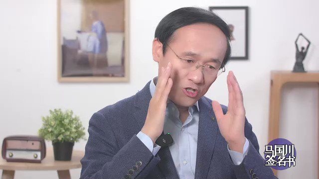
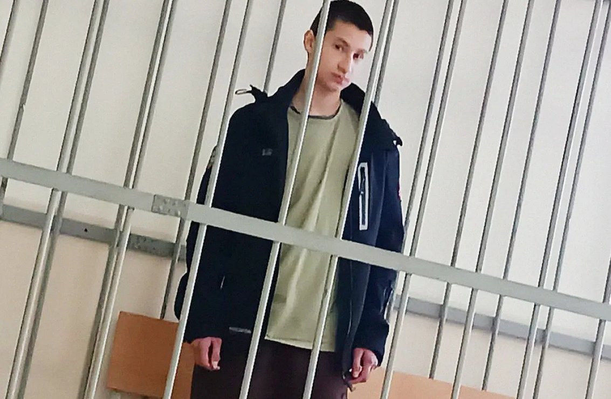
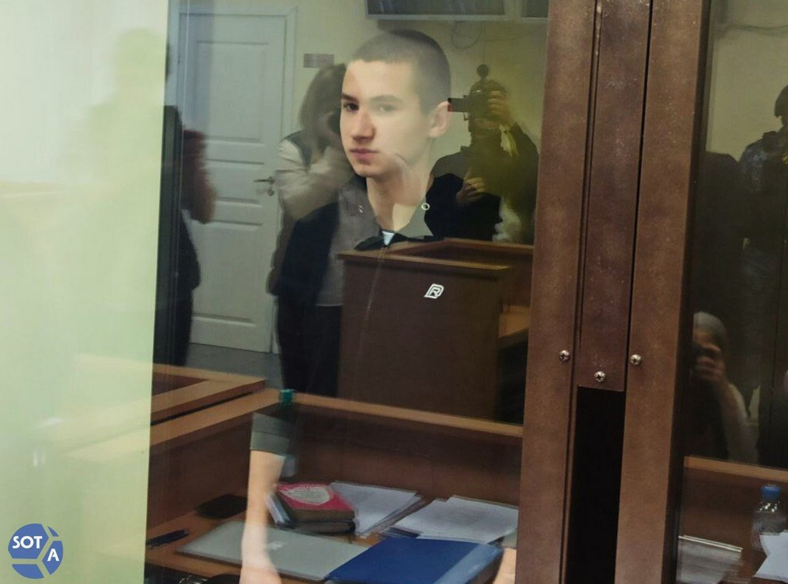
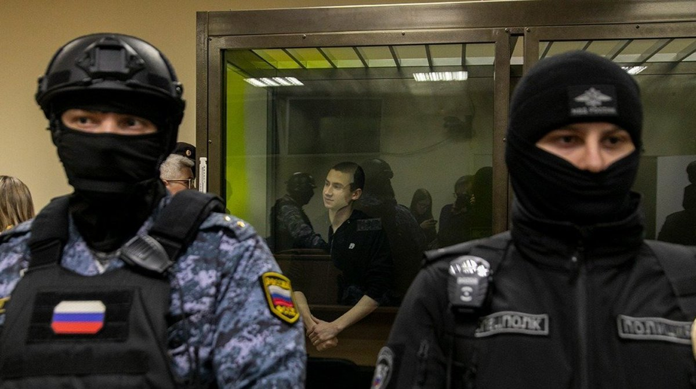
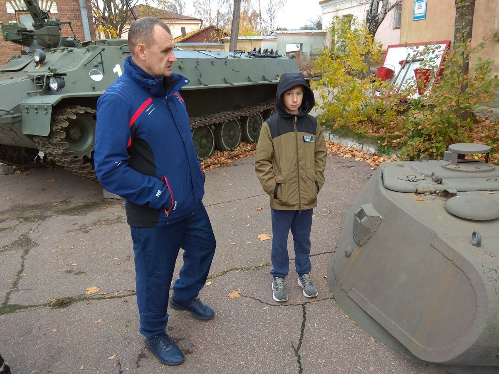

谁将十万横扫三江 北京时间 2023-11-27T19:35:03Z 1729101526910857614 RT @RED_TEA_Flag: 马列毛大群一些人怎么那么脑残，在六四镇压上支持邓小平的行为，难绷了，说什么保住了“共产党”名号，我不认为权威资产阶级民主国家比自由资产阶级民主国家进步。   谁将十万横扫三江 北京时间 2023-11-27T18:16:18Z 1729081706727264278 有什么样的政府，就有什么样的人民。

网友评论：一瞬间想说很多话，可是想到单位有规定不能网上乱发言只能沉默了，只能希望明天会更好 https://t.co/bS7JEDwMP9   谁将十万横扫三江 北京时间 2023-11-27T10:58:56Z 1728971641676529725 俄罗斯圣彼得堡，17岁的少年伊戈尔·巴拉泽金（Егора Балазейкина）因叔叔德米特里在乌克兰死亡而向征兵站投掷了一个没有点燃的燃烧瓶，被法庭以恐怖主义罪判处6年监禁，以下是他在法庭的陈述：

妈妈刚刚为我求情。我听到了她的请求。她说的都是完全正确的，唯一有一点我不同意。我在这里不是来寻求原谅的。我没有什么可以为自己辩护，也没有人可以为我辩护，我是为自己的灵魂辩护，我接受的是良心的审判。当然，这这个法庭上有人指责我，但我也不想指责任何人。你们要知道，我们将在死后为自己的所作所为付出代价，六年、八年——都无所谓，那里没有时间。

当我还在家里，还有着所谓的自由的时候，很多人都和我说应该忍耐，等待一切好起来。对我们所有俄罗斯人来说，一切都会好起来的。受过教育的人这么说，没受过教育的人这么说，正直的人、有良知的人、有荣誉感的人都这么对我说，很多人都对我这么说过 <...> 我的父母只有一间老破小的房子。我想弄明白马里乌波尔被摧毁和我们家的小房子之间能有什么关系，他们向我解释说：时间会过去，我们会解决这个问题，一切都会好起来<...>

如果乌克兰能和俄罗斯公民的福祉扯上关系，那就这样吧。假设我和父母会住进新房子，三层小别墅。如果我知道建造它的“地基”是什么。对于我个人来说——这样还做可以接受吗？你们可以去翻新城市，去建造体育中心，但当这一切的代价是生命时，还能接受吗？ <...>

2月24日是我生命中最重要的日子，比我的生日更重要。我知道我可能要被判6年，我也知道自己为什么坐牢，我确实有罪——因为我一开始对战争漠不关心，冷漠就代表着支持，而我当时是那么冷漠……在看守所里，人们对待我的态度也有好有坏，但对我来说，就算是负面的态度，也比漠不关心要强。

我想说说我的家人。如果我知道2月24日那天，我最亲密的人会遭遇什么，我肯定不会无动于衷。我会走到父母跟前，告诉他们：“我们一家人都要在一起，没有人能够把我们分开。” ，但是战争爆发半年后，妈妈告诉我:"我们要去埋葬德米特里。"

我不想多说我叔叔的事情，他是一个真正的军官，但现代俄罗斯没有他的位置。在突击队里却有他的位置，在炮灰里却有他的位置<...>

我想对我的父母再说几句话。当你们不理解我时，我的心都碎了。我和你们一起安葬了德米特里，我爱他，然后我就离开你们去了征兵中心。

你们可能会让人觉得你们是在逼我就范，但了解我的人都知道，我是如何与你们抗争，以证明一个人不一定是个食人魔，而是一个人。现在我想说。我为你感到骄傲 [转向妈妈] 因为你能忍受那样的事，还能帮助我，支持我，我不知道自己能不能做到

我将用列夫·托尔斯泰来结束我的讲话，由于某种原因，他在我的国家被遗忘了，甚至不是遗忘，而是现在根本不需要他，因为他是和平主义者。

“继续战争的唯一理由是战争已经开始。”

如果你爱我并尊重我，我请求你们做一件事。不是为了我，不是为了其他人——而是为了你自己。当你独自一人时，请你扪心自问，这个问题是：“你还需要这场战争吗？”

在法庭上伊戈尔还谈到了他的狱友们，这位少年因为扔了个玻璃瓶目前和杀人犯、强J犯等重刑犯关押在一个看守所，他说“所有罪犯首先是人，然后是杀人犯和强J犯。他们身上纹有纳粹标志，但他们也是人。你无法想象在5号审前看守所里有多少人是这样的。他们因抢劫、谋杀而受审，但不是因为纳粹标志而受审。当局不会因此逮捕他们，无论我进入哪个牢房，里面肯定会有纳粹符号。我想知道，一个满是纳粹标志的国家是如何去和另一个国家的纳粹作战的。”

伊戈尔患有自身免疫性肝炎，在监狱中他被诊断为二期肝纤维化，而这个疾病的终极就是肝硬化，他的母亲很担忧他的病情，在与母亲的简短私人谈话中，伊戈尔解释了他的行为：“如果我没有这样做，我可能会上吊自杀。因为看到有多少人正在死去，我的灵魂如此沉重，我无法行走。”

图4为伊戈尔小时候和叔叔德米特里在一起https://t.co/xw5T9kLwEj   谁将十万横扫三江 北京时间 2023-11-27T10:38:06Z 1728966397798314183 还有之前一张流传很广的聊天记录截图
自称做过审查工作的人解释现在#微信 审查的概况

「我介绍一下吧，以前做过这方面的工作，不是微信或腾讯员工。不一定准确但大同小异

首先，最土的是人工审核，纯人看。这个已淘汰不讲了

第二代是语义识别＋人工审核。就是发现关键字触发进审，人工审核干死。
但是这个有个问题就是语义识别没问题，但是对抗语义识别的方式有不少。比如发图片，图片里还打杠杠啥的。或者用拼音，谐音来代替。各种方法群友也用了不少了

于是演化出第三代，语义识别（音视频识别）＋策略＋人工
策略比较复杂，举几个例子
比如连续出现几张紧跟党走的图，这个触发条件就触发审核，审核这几个图上面的二十条内容。或者语义识别连续多少句机器都不懂，那就触发人工审核看这些句子
召回和准确都能提高到95％以上

这么说吧，我举个，以前有个视频vlog，在角落里出现了某独的旗帜，一闪而过的那种，街上走着的那种vlog。机器给揪出来，人没看出来，后来反复看才给抓到。成为一个badcase给审核同学反复学习

方言应该是没有任何问题，不是特别确定。但大概率没问题

稍微大一点的都有网警办公室，会直接传达要求
每日更新关键字，分级管理2000年的国务院令292号第十五条互联网上网服务营业服务场所管理条例三章十四条
绝对有法可依
如何定义一些违法活动是这些立法机关的权力
如果我们或你（不服）可以提起行政复议，搞不踮可以行政诉讼
应该有人这么干过
现在都应该已经包吃包住了

不要抱任何任何任何幻想，拼音＋文字＋火星文这种只能更快触发审核条件。让你在待审信息中排的更靠前
看别的群里说点不大的事，后面一堆人跟跟党走的gif我就着急
这不是没事往枪口上撞么
自己非要顶着策略冲，人工审核的小同学如果漏审了是要扣工资的，你说人抓不抓

审核系统老高级了。你审核1000条，我审核1000条，但其实中间是有500咱俩重复的。就看咱俩之间有啥差异，这叫二审差」   谁将十万横扫三江 北京时间 2023-11-27T11:36:11Z 1728981014880674236 RT @sopmilt: 加国小留干过什么实事？第一个号靠拉帮结派搞群体认同炒作起来了也就模仿李颖接个投稿美名其曰“帮工人维权”。

真在国内帮工人维权的人士步履维艰，被扣各种罪名坐监狱，出狱后也被监视、限制。具体案例有2014年的“玫瑰团队”，2015年被抓捕的律师，2018…   谁将十万横扫三江 北京时间 2023-11-27T09:58:14Z 1728956363043475509 RT @whyyoutouzhele: 11月26日，中国石油大学的一名教师在群里公开发文，称中国石油大学克拉玛依校区克扣援建教师工资 https://t.co/nHABQoPf3I   谁将十万横扫三江 北京时间 2023-11-27T10:08:36Z 1728958972580020718 RT @whyyoutouzhele: “全过程民主”
在一则关于“人大代表”的视频下方
六万网友集体声明：
本人从未授权或投票他人代表自己
从未授权或委托任何人代表本人参与任何形式的投票 https://t.co/5n1tN0qaWu   谁将十万横扫三江 北京时间 2023-11-27T10:12:21Z 1728959917544157421 RT @platosaying: 《乌鲁木齐中路》一周年回顾纪录片 ：

我是导演plato，2022年11月我在上海亲历了11月26日晚上的抗议活动，影片除了当天个人拍摄的内容外，集合了抗议前后标志性的视频素材，试图完整呈现人们走上街头抗议的心路历程。
大家请多多转发，视频可…   