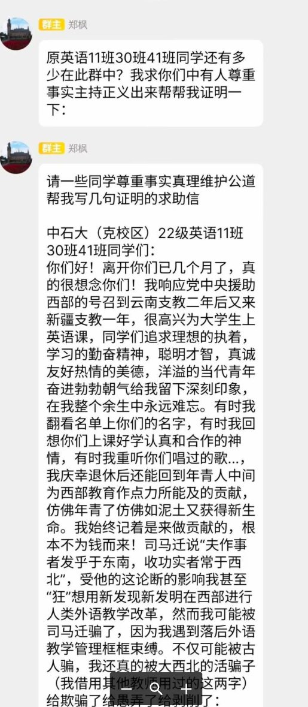
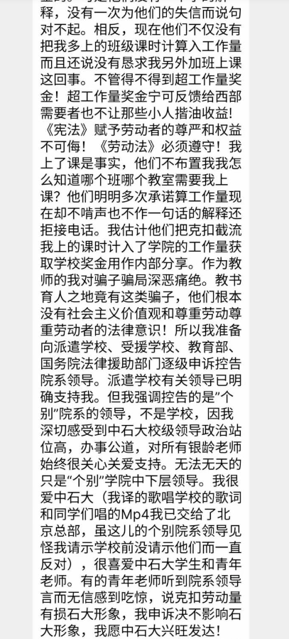
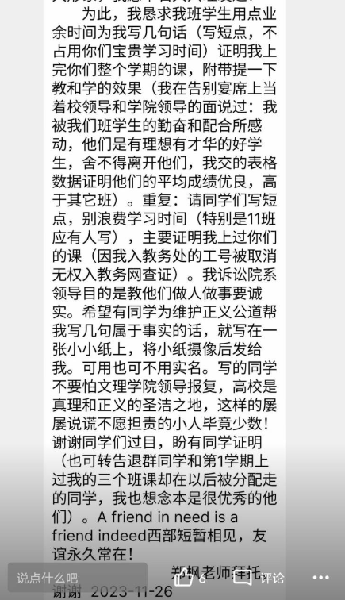

谁将十万横扫三江 北京时间 2023-11-27T10:38:06Z 1728966397798314183 还有之前一张流传很广的聊天记录截图
自称做过审查工作的人解释现在#微信 审查的概况

「我介绍一下吧，以前做过这方面的工作，不是微信或腾讯员工。不一定准确但大同小异

首先，最土的是人工审核，纯人看。这个已淘汰不讲了

第二代是语义识别＋人工审核。就是发现关键字触发进审，人工审核干死。
但是这个有个问题就是语义识别没问题，但是对抗语义识别的方式有不少。比如发图片，图片里还打杠杠啥的。或者用拼音，谐音来代替。各种方法群友也用了不少了

于是演化出第三代，语义识别（音视频识别）＋策略＋人工
策略比较复杂，举几个例子
比如连续出现几张紧跟党走的图，这个触发条件就触发审核，审核这几个图上面的二十条内容。或者语义识别连续多少句机器都不懂，那就触发人工审核看这些句子
召回和准确都能提高到95％以上

这么说吧，我举个，以前有个视频vlog，在角落里出现了某独的旗帜，一闪而过的那种，街上走着的那种vlog。机器给揪出来，人没看出来，后来反复看才给抓到。成为一个badcase给审核同学反复学习

方言应该是没有任何问题，不是特别确定。但大概率没问题

稍微大一点的都有网警办公室，会直接传达要求
每日更新关键字，分级管理2000年的国务院令292号第十五条互联网上网服务营业服务场所管理条例三章十四条
绝对有法可依
如何定义一些违法活动是这些立法机关的权力
如果我们或你（不服）可以提起行政复议，搞不踮可以行政诉讼
应该有人这么干过
现在都应该已经包吃包住了

不要抱任何任何任何幻想，拼音＋文字＋火星文这种只能更快触发审核条件。让你在待审信息中排的更靠前
看别的群里说点不大的事，后面一堆人跟跟党走的gif我就着急
这不是没事往枪口上撞么
自己非要顶着策略冲，人工审核的小同学如果漏审了是要扣工资的，你说人抓不抓

审核系统老高级了。你审核1000条，我审核1000条，但其实中间是有500咱俩重复的。就看咱俩之间有啥差异，这叫二审差」   谁将十万横扫三江 北京时间 2023-11-27T11:36:11Z 1728981014880674236 RT @sopmilt: 加国小留干过什么实事？第一个号靠拉帮结派搞群体认同炒作起来了也就模仿李颖接个投稿美名其曰“帮工人维权”。

真在国内帮工人维权的人士步履维艰，被扣各种罪名坐监狱，出狱后也被监视、限制。具体案例有2014年的“玫瑰团队”，2015年被抓捕的律师，2018…   谁将十万横扫三江 北京时间 2023-11-27T09:58:14Z 1728956363043475509 RT @whyyoutouzhele: 11月26日，中国石油大学的一名教师在群里公开发文，称中国石油大学克拉玛依校区克扣援建教师工资 https://t.co/nHABQoPf3I   谁将十万横扫三江 北京时间 2023-11-27T10:08:36Z 1728958972580020718 RT @whyyoutouzhele: “全过程民主”
在一则关于“人大代表”的视频下方
六万网友集体声明：
本人从未授权或投票他人代表自己
从未授权或委托任何人代表本人参与任何形式的投票 https://t.co/5n1tN0qaWu   谁将十万横扫三江 北京时间 2023-11-27T10:12:21Z 1728959917544157421 RT @platosaying: 《乌鲁木齐中路》一周年回顾纪录片 ：

我是导演plato，2022年11月我在上海亲历了11月26日晚上的抗议活动，影片除了当天个人拍摄的内容外，集合了抗议前后标志性的视频素材，试图完整呈现人们走上街头抗议的心路历程。
大家请多多转发，视频可…   