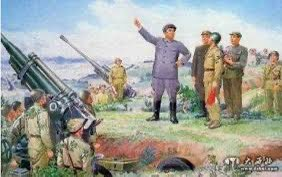

Ivy未央 北京时间 2023-11-26T14:12:27Z 1728657952611955037 转）朝鲜中学历史教科书上的朝鲜战争：美帝国主义出动400万军队悍然侵略朝鲜，被英勇的人民军击败，不得不主动提出停战谈判。人民军仅靠4门大炮和一个中队就顶住了美军5万多兵力、300艘军舰和1000架飞机的进攻长达3天。当然，没有中国啥事，一句不提志愿军。粉红知道后惊讶吗？ https://t.co/RyisMYImUl   