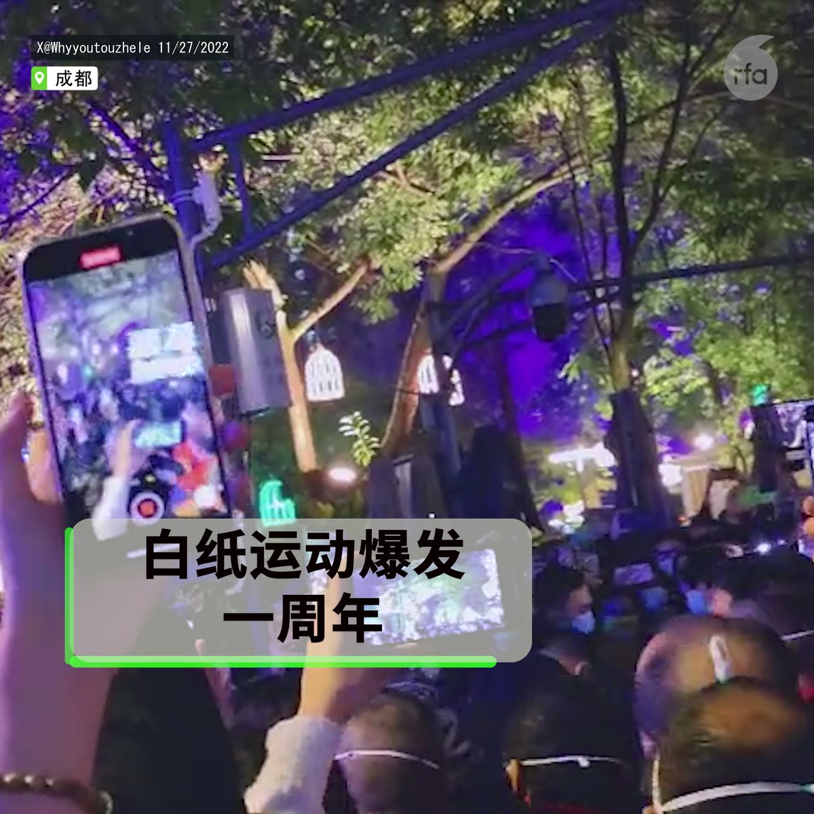

自由亚洲电台 北京时间 2023-11-26T10:41:38Z 1728604900450238464 【白纸运动一周年 | 国内沉寂国外延承】
呼吁解封，要求言论自由的 #白纸运动 转眼已然一年。过去12个月，疫情下的中国社会形态巨变， 不少青年人产生政治觉醒。然而周年日之际，却只见国际社会纪念：在英国，“#中国反贼”团体办展览，讲述运动经过；在美国，“#纽约民主墙”组织自制标牌，重现去年示威场景。
（摄影：吕熙、石头、Gnydemocracywall）   自由亚洲电台 北京时间 2023-11-26T06:22:58Z 1728539801769422926 【《华尔街日报》: 习近平仍有夺取台湾野心】
拜习会被美中双方描述为向前迈出的一步，但习近平在 #加州 警告拜登停止向台湾提供军援，不要介入有利于民进党的选举。《#华尔街日报》社论呼吁 #拜登 总统加快武装台湾。
详阅：https://t.co/G8Vm510fRa   自由亚洲电台 北京时间 2023-11-26T06:24:58Z 1728540307849982295 RT @RFA_Chinese: 【#汪浩：#民进党 不会“躺着选” 对手为共产党】
【#蓝白合 破局 廖达琪：台湾民主要学习面对面“讲真话”】
【周台竹：厌倦蓝绿两极 年轻人高知识者选择民众党】
本期 #亚洲很想聊 节目完整视频： https://t.co/Uv6L12jC6…   自由亚洲电台 北京时间 2023-11-26T06:25:38Z 1728540474989023272 RT @RFA_Chinese: 第60届 #金马奖 落下帷幕，影后由12岁台湾少女林品彤以《小晓》拿下，也打破了金马最年轻影后纪录。首度入围的 #台湾演员 吴慷仁则以《富都青年》夺得金马影帝。
详阅：https://t.co/ihGvIwk00g   自由亚洲电台 北京时间 2023-11-26T05:51:30Z 1728531886111146192 第60届 #金马奖 落下帷幕，影后由12岁台湾少女林品彤以《小晓》拿下，也打破了金马最年轻影后纪录。首度入围的 #台湾演员 吴慷仁则以《富都青年》夺得金马影帝。
详阅：https://t.co/ihGvIwk00g   自由亚洲电台 北京时间 2023-11-26T02:45:23Z 1728485045466472789 【新公民运动许志永 | 撰文《中国向何处去？》】
"真正的上诉，不是面向卑微的山东高院，而是面向人民，面向历史...... 最可贵的是勇气，包括说真话的勇气，捍卫自由的勇气，不怕坐牢的勇气，走上街头的勇气"。
详阅：https://t.co/IbzpRBBLJG   自由亚洲电台 北京时间 2023-11-26T00:55:56Z 1728457501727772981 农村家庭教会传道人 #常昊 被控“寻衅滋事”，羁押至今已超过7个月，但仍坚持不认罪。目前已被起诉至镇雄县人民法院。警察还拿走了他家的近百本《圣经》和几乎全部 #信仰书籍。
详阅：https://t.co/XXfUV5oH1N   自由亚洲电台 北京时间 2023-11-26T01:45:19Z 1728469931702804807 朝阳警方近期对“中植系”财富公司立案侦查。中植集团在11月22日发布公开信向投资者致歉，称集团严重资不抵债，负债高达 640 亿美元。
详阅：https://t.co/uQhwyiY4j6   