自由亚洲电台 北京时间 2023-11-25T11:43:27Z 1728258066163147066 RT @RFA_Chinese: “#白纸运动”一周年之际，虽然中国国内还未见有抗议活动，但全球多地这几天都有不同形式的活动，纪念这场近年罕见的抗争。在伦敦，去年新成立的华人组织“#中国反贼”@China_Deviants 联合多个团体举办艺术展，展出他们早前从网络征集的艺术品…   自由亚洲电台 北京时间 2023-11-25T11:43:52Z 1728258172828426673 RT @RFA_Chinese: 欢迎收听和订阅播客【＃亚太报道】 https://t.co/MjLNSvVMqc
#台湾大选，#蓝白破局; #许志永，#丁家喜，#邹幸彤 获人权奖’； 河南无法兑现 #三孩补贴; TCL旗下 #摩星半导体公司 解散; “#白纸运动”一周年。 h…   自由亚洲电台 北京时间 2023-11-25T06:25:22Z 1728178018323997126 多家中国门户网站11月24日转载中国驻缅甸大使馆发布的通知，要求在 #果敢 老街地区的中方人员尽快转移撤离。

中方使馆的这份通知显示：当前，缅甸北部果敢老街地区冲突持续，在当地滞留的中方人员安全风险高企。中国驻缅甸使领馆提醒在老街地区的中方人员尽快转移撤离，远离冲突地带。

缅甸北部近期爆发地方武装与军政府之间的军事冲突，邻近中国边境的果敢地区紧张局势日趋升级。中国外交部外交部亚洲司司长刘劲松本周二会见缅甸驻华大使丁貌瑞，中国驻缅甸大使陈海也在周四与缅甸外长丹穗举行了会晤。但根据中国外交部新闻稿，双方会谈内容均只有“就共同关心的问题交换意见“。

据缅甸当地媒体报道，果敢老街自11月15日已经断水断电，且物价飞升，食物短缺。而武装组织缅甸民族民主同盟军上周也发布通告，要求仍滞留在老街的中国籍人士尽快回国，以免造成不必要伤亡。   自由亚洲电台 北京时间 2023-11-25T06:32:32Z 1728179822848070069 台湾民调：近八成民众认为“#台湾和中国不属于同一个国家”
https://t.co/7o7Zr9vaus https://t.co/hmzNwyf8Gh 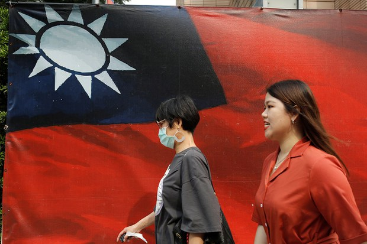  自由亚洲电台 北京时间 2023-11-25T08:00:06Z 1728201859478048955 欢迎收听和订阅播客【＃亚太报道】 https://t.co/MjLNSvVMqc
#台湾大选，#蓝白破局; #许志永，#丁家喜，#邹幸彤 获人权奖’； 河南无法兑现 #三孩补贴; TCL旗下 #摩星半导体公司 解散; “#白纸运动”一周年。 https://t.co/7eopLPvYZc 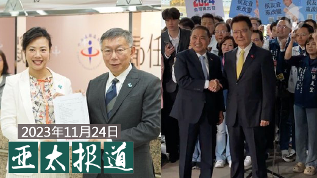  自由亚洲电台 北京时间 2023-11-25T08:44:48Z 1728213109557412190 RT @RFA_Chinese: 台湾民调：近八成民众认为“#台湾和中国不属于同一个国家”
https://t.co/7o7Zr9vaus https://t.co/hmzNwyf8Gh   自由亚洲电台 北京时间 2023-11-25T09:06:40Z 1728218610139885742 https://t.co/9JBQgDRP3a 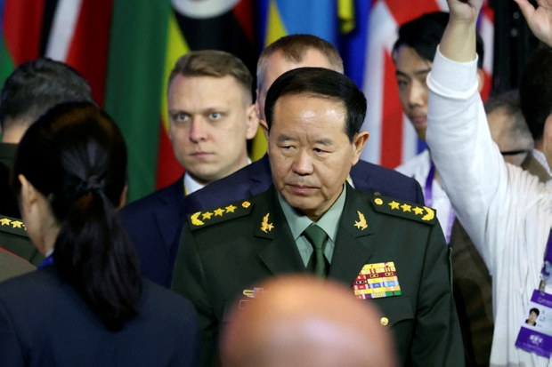  自由亚洲电台 北京时间 2023-11-25T08:44:11Z 1728212953667915948 RT @RFA_Chinese: 【#汪浩：#民进党 不会“躺着选” 对手为共产党】
【#蓝白合 破局 廖达琪：台湾民主要学习面对面“讲真话”】
【周台竹：厌倦蓝绿两极 年轻人高知识者选择民众党】
本期 #亚洲很想聊 节目完整视频： https://t.co/Uv6L12jC6…   自由亚洲电台 北京时间 2023-11-25T09:05:44Z 1728218378765324550 专栏 | #夜话中南海：如果 #刘振立 接防长，谁会是军委联合参谋部的新任参谋长？
https://t.co/znoiqzEe1x https://t.co/t65TIligyI   自由亚洲电台 北京时间 2023-11-25T09:10:39Z 1728219615812358618 “#白纸运动”一周年之际，虽然中国国内还未见有抗议活动，但全球多地这几天都有不同形式的活动，纪念这场近年罕见的抗争。在伦敦，去年新成立的华人组织“#中国反贼”@China_Deviants 联合多个团体举办艺术展，展出他们早前从网络征集的艺术品。
https://t.co/zloscwVeNj https://t.co/DVUNck22FV 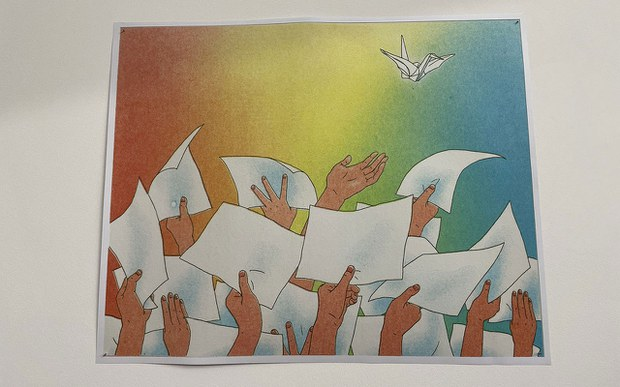  自由亚洲电台 北京时间 2023-11-25T05:24:50Z 1728162785664860345 中国外交部发言人毛宁本周五在例行记者会上宣布，12月1日至2024年11月30日期间，中方对法国、德国、意大利、荷兰、西班牙、马来西亚6个国家持普通护照人员试行 #单方面免签 政策。

https://t.co/rXZUqHZmt5 https://t.co/1mUzGqWll2 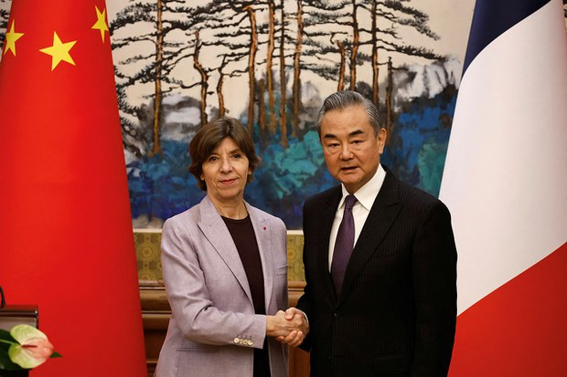  自由亚洲电台 北京时间 2023-11-25T06:16:57Z 1728175902779994272 路透社11月24日引述知情人士披露，美国芯片企业 #英伟达（Nvidia）已通知中方客户，该企业为遵守美国出口规则而设计的新型 #人工智能芯片 将被推迟到明年第一季度发货。

消息人士表示，被推迟出口的芯片为H20，这也是英伟达为遵守美国新出口限制措施而为中国市场设计的三款芯片中功能最强的一款。此举可能使英伟达在与中国本土企业华为进行市场竞争中，面临更加复杂的局面。

报道指出，由于美国收紧对中国的高科技芯片出口限制，英伟达被禁止向中国市场提供先进的A800和A800 AI 芯片。而英伟达希望借助提供量身定做的芯片产品，保持该企业在中国市场的份额。

消息人士表示，除H20芯片将被推迟出口外，另两款芯片中的L20将按原计划发送，但目前还无法披露有关L2芯片的交货信息。   自由亚洲电台 北京时间 2023-11-25T03:30:02Z 1728133893965115531 据维权网11月24日发布的消息，“#恶俗维基案”当事人 #牛腾宇 的母亲当天上午在辖区派出所视频会见时，发现牛腾宇居然不认识母亲，大喊一些听不懂的话，所问非所答，出现了精神障碍。
https://t.co/MQXFhHsApt https://t.co/qrTwsXkrNn 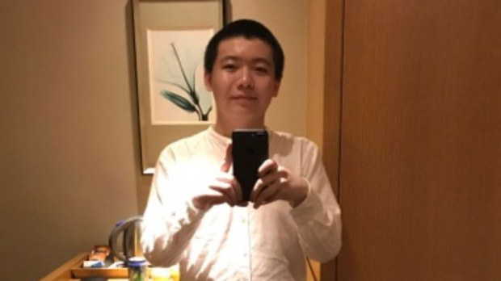  自由亚洲电台 北京时间 2023-11-25T03:30:16Z 1728133956019843520 #白纸运动一周年 之际，仍有很多年轻的抗议者下落不明或被关押。还算幸运的当属小沛(Pei)了，日前他抵达加拿大申请难民身份。他接受记者专访时提到，去年11月底被抓进看守所后，不时遭到国保监控骚扰，多次被抓进看守所。他受不了身心煎熬，只能离开家人，逃离中国。
https://t.co/YGdWHlClkQ https://t.co/eUpwgbN79N 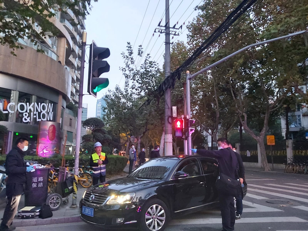  自由亚洲电台 北京时间 2023-11-25T04:00:14Z 1728141496308887929 路透社11月24日引述台湾的国防部消息，一艘 #澳大利亚军舰 于周四进入 #台湾海峡 由北向南航行。但台湾军方没有透露这艘军舰的名称，仅表示对此全程掌握周边海域、空域动态，状况正常。

https://t.co/uptz8c7Oqf https://t.co/rMhu104zcb   自由亚洲电台 北京时间 2023-11-25T00:52:08Z 1728094157242265745 台湾大选 #蓝白合 破局，台湾民众党主席 #柯文哲、中国国国民党籍总统参选人 #侯友宜 另找副手各自搭档，赶在24号截止日完成登记。另外，鸿海创办人 #郭台铭宣布退选。#台湾2024总统大选 三组参选人已经敲定。

https://t.co/ROsjDLxO5H https://t.co/vidOg9Yvmr 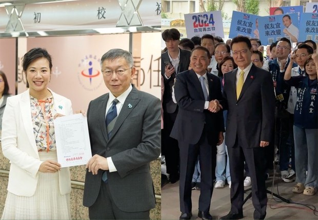  自由亚洲电台 北京时间 2023-11-25T01:55:33Z 1728110118817132821 台湾的总统选举在鸿海创办人 #郭台铭退选 后，确定由三组人马角逐。过去曾在2000年出现三组人选，最后由民进党的 #陈水扁 当选，完成首次政党轮替。然而，从台湾总统直接民选以来，从未有无党籍或第三势力当选，这次有可能打破蓝绿两党政治板块格局吗？
https://t.co/v7XLphJNNQ https://t.co/rGCpl9r6xz 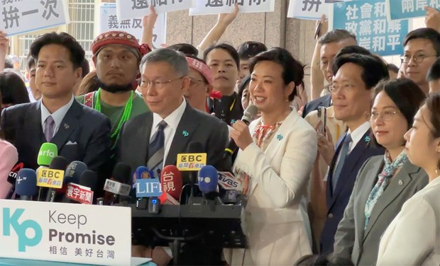  自由亚洲电台 北京时间 2023-11-25T02:14:55Z 1728114992254500957 悲喜交集，#新公民运动 发起人 #许志永 和维权律师 #丁家喜 与被羁押的香港律师 #邹幸彤 获欧洲律师协会委员会颁发年度人权奖，肯定他们在捍卫人权工作的坚持和勇气。
与此同时，许、丁二人的上诉被中国法院驳回，维持14年和12年的有期徒刑。

https://t.co/VJNxLeczUM https://t.co/qZHMlgTgKe 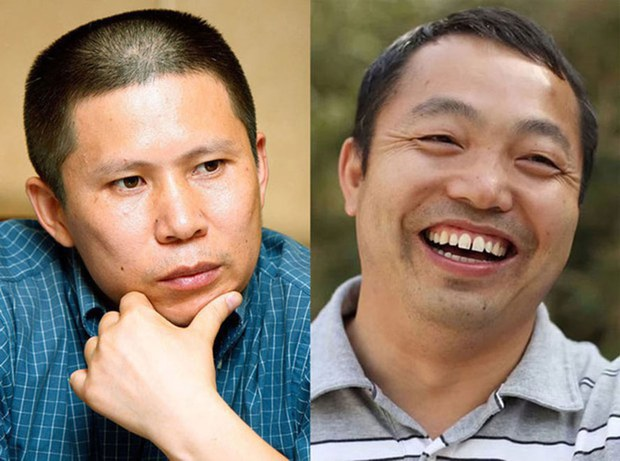  自由亚洲电台 北京时间 2023-11-25T00:17:04Z 1728085335748522210 “#白纸运动”随着封控结束而落幕，然而反抗力量却在海外生根发芽。本台驻伦敦记者吕熙过去一年一直追踪英国华人组织“#中国反贼”@China_Deviants
，这个在“白纸运动”期间诞生的组织，如何承接上一代“老民运人士”，成为海外反抗运动的新势力？
https://t.co/t80Sfaab0D https://t.co/htmrd3kCax 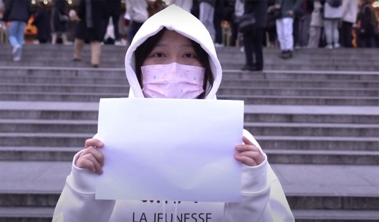  