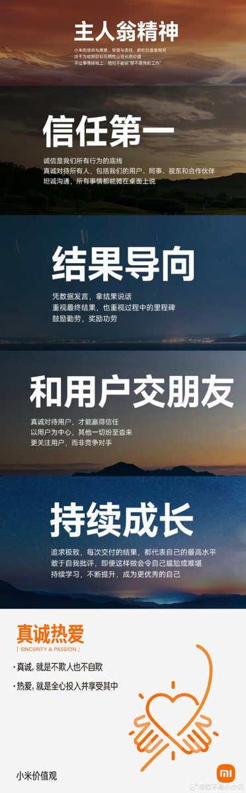
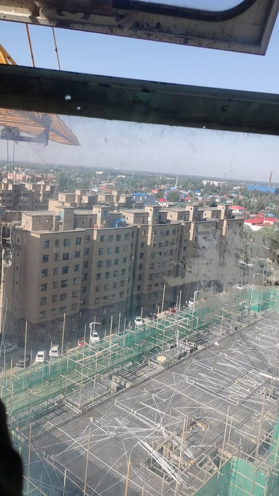

谁将十万横扫三江 北京时间 2023-11-25T13:55:06Z 1728291199642190066 RT @YesterdayBigcat: 「重庆建筑工人继续堵高速，原定通车典礼泡汤」周五（11月24日），重庆市巫镇高速建筑工人的堵路行动还在继续，高速路的入口被数辆工程车堵死，原定当天举行的通车典礼被迫延期。因为工资被拖欠，巫镇高速的建筑工人于前一日发起讨薪行动，将位于重庆…   谁将十万横扫三江 北京时间 2023-11-25T09:51:52Z 1728229987386638738 锐评一下今天小米社区发版这事儿。

我觉得根源很简单：
1、没有运营流程，发版公告仅仅是在同步开发组消息，没有预计到可能出现的舆情；
2、发出之后毫不care舆情，想靠删帖禁言封号了事，却没意料到把一个可以解决在社区的小事放大到了微博公众平台，之后甚至出圈；
3、不真诚热爱，没有站在用户的角度考虑，没有同理心；
4、只想做打工人，不为事情负责，出事小米背锅。

首先，为什么会出现这个情况呢，我从他们内部的逻辑来讲讲哈（可能看起来有点像洗地，但你只有读懂这个逻辑才能往下看）：内部在适配同一批机型的时候（包括12S系列、12系列、K50系列都是同一批），适配过程中一定会出现很多不可预见的问题，然后其中的某一些机型就先做好了，这是很正常的情况。然后工程师（理工直男）就觉得做好了我就发出来吧，于是就出现了今天的情况。

好，这是研发那边的逻辑，非常的理工直男对吧，但其实是有逻辑的。

但社区干了个啥事儿呢——丝毫不提这事儿的任何逻辑、就改了一下公告，然后开始装大爷、不管用户反馈了。再之后呢，看到用户发帖骂街小丑，开始删帖封号禁言。再再之后呢，开始学着粉圈在社区控评。

不解决问题而是捂嘴，这是非常严重的一件事情。

试想一下：如果你作为一个12S   Ultra的普通用户，你看完发布会或者通过各种渠道觉得澎湃OS很牛逼，然后在一个月前看到了小米社区有员工装逼内部版澎湃OS，你是什么感受？之后，你好不容易清空了所有数据刷到开发版（因为你想用澎湃OS但正式版打死不适配），社区推送了第一批开发版，同为8+有K60标准版没有12SU，你又是什么感受？再之后，你看到了第二批开发版，发现连他妈骁龙8都推送了但就是不推送你8+的12SU，你又又是什么感受？再再之后，你发现同一批机型还有8+的定位更低的K50U，就是没有12SU，当年真金白银支持高端旗舰现在居然不如红米，你又又又是什么感受？再再再之后，你在社区很气愤的和大家一起发小丑帖，发现小米社区居然把你删帖封号禁言了，你又双叒叕是什么感受？

我愿称之为高端机用户逐渐崩溃的心路历程。

再试想一下，你这个时候作为小米的公关（比如小胖），你想维护小米品牌的高端形象，但突然尼玛自己人这么给自己捅刀子，你又是什么感受？（半夜睡得好好的突然看到用户舆情爆表，然后发现就是版本推送的一个小问题没处理好，但引起了极大的负面舆情，最后还得你去擦屁股.jpg）

用户心态分析完了，我们接着来分析一下这个事儿存在的几个严重的问题：

1、没有运营流程，发版公告仅仅是在同步开发组消息，没有预计到可能出现的舆情。
“用户运营”，看上去很简单，就是让用户活跃、增加用户粘性，促进消费者下一代接着买自家产品嘛。实际上并不好做，如果你作为负责人但抱着打工人心态，想甩锅不敢担责，那你最后可能什么都运营不好。
这里又要说到曾经的MIUI论坛了。曾经的MIUI论坛，在用户运营方面做得很好：运营制度合理；开发组活跃，与用户积极沟通；内测制度合理；该吊胃口吊胃口，该公告公告；出现用户舆情时检测很及时，该立正挨打道歉马上道歉，不把问题捅大到公众平台。
而现在的小米社区呢？还不论之前的一批逆天故事，只拿今天这事儿来说：运营只是同步了开发给的一批机型，完全没有意识到可能会出现的舆情风险，更没有同步公关部，就只是修改了一下帖子。那您这运营的活儿是不是也太简单了？连会不会出现舆情风险都不考虑吗？那你直接换个大学生实习生，哦不，初中生来做，有什么区别？
所以，起码在今天这个逆天发版公告上，社区完全没有运营流程，发版公告仅仅是在同步开发组消息，没有预计到可能出现的舆情。

2、发出之后毫不care舆情，想靠删帖禁言封号了事，却没意料到把一个可以解决在社区的小事放大到了微博公众平台，之后甚至出圈。
其实发出之后就有一堆用户在社区骂街（刷那个小丑图）了，也有一些用户在试图通过讲道理来尝试让官方了解用户心态、尝试说服。但小米社区运营（也就是用户看来的官方）毫不care这些用户舆情，觉得这些用户都是极端用户，在宣泄情绪，想在社区内删帖封号禁言把这事儿了结了。但用户怎么会如此善罢甘休？（阅读«如果你作为一个12S   Ultra的普通用户»这一段，你就能get到用户的愤怒了）于是愤怒的用户们，把事情发上了酷安，捅上了微博，之后不少大v看见了，转发了，这破事儿成功出圈。
所以，如果像MIUI论坛一样，该吊胃口吊胃口，该解释解释，该认错认错，该挨打立正就挨打立正，用户不会如此反感；而想靠捂嘴一事了之，最后事情一定会被闹大，甚至影响品牌形象。
这都是花真金白银支持小米的高端用户啊！
小米12S系列，去年的高端旗舰机啊！
小米12S Ultra，5999起跳啊！
要不要口碑啦？

3、不真诚热爱，没有站在用户的角度考虑，没有同理心；
同理心真的很重要。很多“用户运营”这个岗位的同学，觉得自己只是在运营社区，但实际上更重要的是“运营用户”。如果你完全get不到用户愤怒的理由、觉得我今天只是发了个公告啥也没干啊咋就被骂成这样，那就得反思反思自己是不是缺失了“用户视角”。小米价值观常提的“真诚热爱”，有没有真诚、有没有热爱，有没有交付逻辑、有没有站在用户的角度思考问题。
小米价值观常提的“和用户交朋友”，有没有真诚对待用户？有没有以用户为中心？
值得反思啊！

4、只想做“打工人”，不为事情负责，出事小米背锅。
很多（其实已经职级比较高的）员工都觉得自己是“打工人”，哪怕自己已经独立负责一个产品，做的事儿会造成很大影响力了。这样是不对的。
我觉得其实这也是之前MIUI论坛和现在小米社区有很大区别的原因——之前的运营大哥风起云落是真的很享受这个过程、很参与整个论坛讨论氛围，也愿意拉着一批官方人员、开发组同学一起参与到与用户的积极讨论中，甚至App都是自己写的，想要啥需求，就实现啥需求。
现在的小米社区我就不评价了，之前那几篇长文里有。
所以，一边是把自己当老板，当成论坛的负责人，愿意参与其中，愿意为事情负责，该背的锅全都背，不该背的锅也背（风起在下片.jpg）；另一边是优化了这么多年性能还稀烂、版块分区还不合理、权限操作还不完善、“害怕摊上事儿”的小米社区，能出现这种对比也就不足为奇了。

PS：“一人，一家，一团体，一地方，乃至一国，不少单位都没有能跳出这周期率的支配力。大凡初时聚精会神，没有一事不用心，没有一人不卖力，也许那时艰难困苦，只有从万死中觅取一生。既而环境渐渐好转了，精神也就渐渐放下了。有的因为历时长久，自然地惰性发作，由少数演为多数，到风气养成，虽有大力，无法扭转，并且无法补救。也有为了区域一步步扩大了，它的扩大，有的出于自然发展，有的为功业欲所驱使，强求发展，到干部人才渐见竭蹶，艰于应付的时候，环境倒越加复杂起来了，控制力不免趋于薄弱了。一部历史，‘政怠宦成’的也有，‘人亡政息’的也有，‘求荣取辱’的也有。总之没有能跳出这周期率。”

“我们已经找到了新路，我们能跳出这周期律。 这条新路，就是封号禁言。”   谁将十万横扫三江 北京时间 2023-11-25T10:05:43Z 1728233471871779309 网友讨薪：
本人在霍城县2021棚改二期建设三标段项目工地开塔吊

建设单位是霍城县投资管理有限公司
总承包单位是海天建设集团有限公司

每次给工地打电话要工资，公司总是说下星期发，一天拖一天的，这都两个月了，生活费也不发工资也不发
现在气温也降下来了，家里等着钱卖煤买面生活，还要还房贷，公司一直这么拖着，我们找到霍城县劳动局，劳动局给我们回复：下星期发。可等了两个月也不见一分工资，我不知道我们什么时候能够拿到工资
我们去法院，法院说不受理，让我们去找劳动局，我也不知道遇到这样的事情除了劳动局和法院我们还能找谁，此刻我深深的认识到自己真的是法盲，都说现在市场越来越正规，但遇到这样拖着不发工资的事情，却屡禁不止。难道真的是上有政策，下有对策么，我的祖国出台这么多法律，却无法保障我们工资，发此文就想知道当地政府能不能给我们做主，能不能帮助我们拿到工资，农民工真难，讨薪路更难，希望打工路上政府真的能为我们打工人保驾护航，帮我们要上工资。   