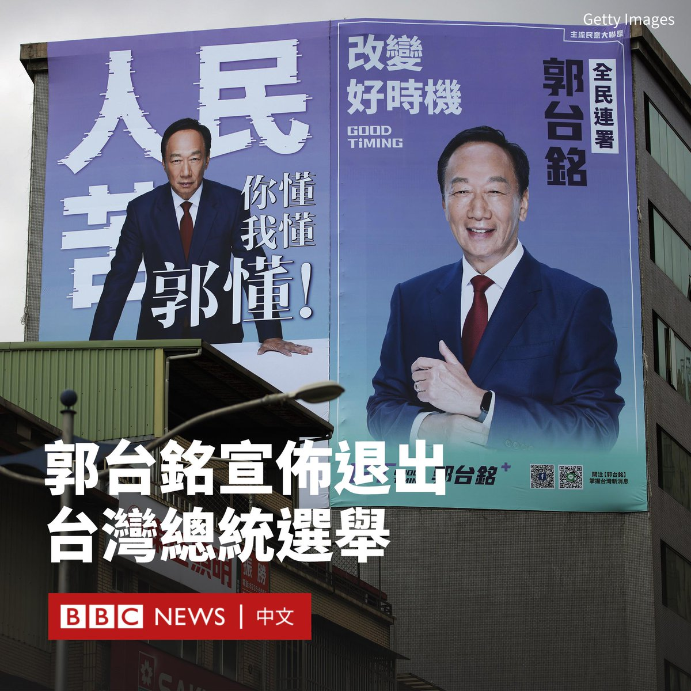
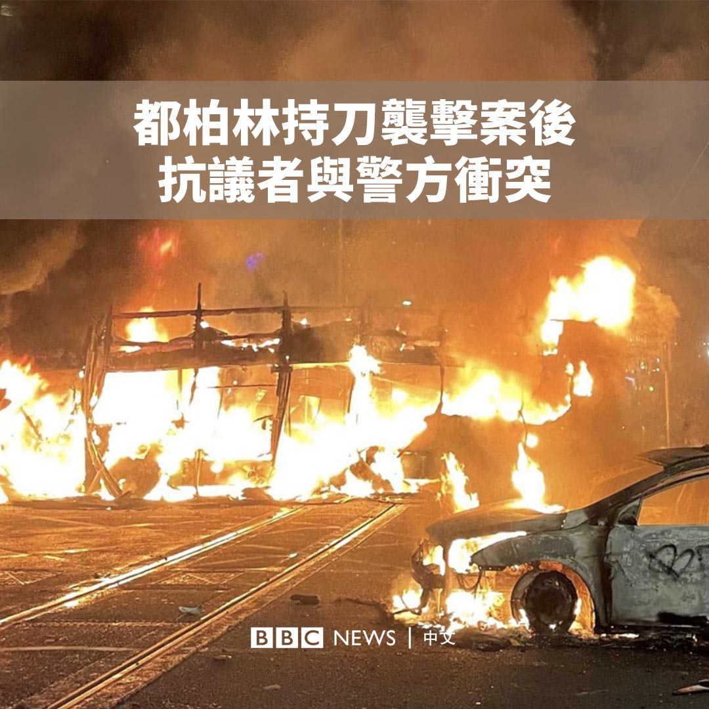

D英国广播公司BBC 北京时间 2023-11-24T16:12:10Z 1727963305032258026 此前誓言以独立身份参加2024台湾大选的鸿海集团创办人郭台铭发布声明，表示将退选。

这位电子大亨周五（11月24日）在声明中说：“人退，志不退”。他还呼吁民众能通过明年1月的大选“完成政党轮替”。

“郭台铭或许可以被人遗忘，但为中华民国的未来，选择成全，已是我能够奉献给故乡全部的爱。”他写道。

郭台铭的副手赖佩霞也在社交媒体发布声明，表示“这是一个艰难的决定”。

郭台铭在今年8月宣布投身台湾大选，后来获得逾90万有效连署，取得总统大选登记门票。但多份民调显示，他的支持度在四名主要参选人中位于末位。

周四（11月23日）下午，郭台铭与国民党和民众党候选人侯友宜、柯文哲会晤，但三方没有就在野阵营的合作达成任何共识，不欢而散。

国民党和民众党周五分别推出自己的总统候选人和副手人选。侯友宜将与知名媒体人赵少康搭档，柯文哲则将携手家世显赫的吴欣盈。

周五是台湾大选总统与副总统候选人登记的最后一天。但此前仅有执政的民进党参选人、现任副总统赖清德和副手萧美琴完成登记。   D英国广播公司BBC 北京时间 2023-11-24T13:19:22Z 1727919819385880787 在爱尔兰首都都柏林发生持刀伤人案后，抗议者与警方爆发冲突，包括警车在内的多辆汽车被点燃。 https://t.co/16WAxR5wWH   D英国广播公司BBC 北京时间 2023-11-24T11:34:03Z 1727893316006724047 【最新消息】在“蓝白合”谈判破裂后，台湾民众党党主席、总统参选人柯文哲携副手吴欣盈前往中央选举委员会，进行正副总统候选人登记。

吴欣盈是台湾民众党籍立法委员，出身企业世家，是新光集团创办人吴火狮的孙女，历任新光人寿副总经理、新光人寿慈善基金会执行长。 https://t.co/mQGbT09qml   D英国广播公司BBC 北京时间 2023-11-24T11:52:11Z 1727897875684962330 【最新消息】台湾反对党国民党召开中常会，总统参选人侯友宜宣布副总统候选人搭档为知名媒体人赵少康。

赵少康曾在1980至1990年代活跃于台湾政坛，曾以高得票纪录获选台湾立法委员。1993年，他离开国民党，参与创建新党。他后来投身媒体界，主持政论节目，并担任中国广播股份有限公司董事长。 https://t.co/gAkDv2KGSk   D英国广播公司BBC 北京时间 2023-11-24T08:50:07Z 1727852057489461759 很多年来，缅甸东北部臭名昭著的电信网络诈骗中心所在城镇是由华裔“四大家族”统治着。他们让果敢这片不毛之地变成了喧闹的赌城和艳俗骯脏的红灯区。

现在，这些如“教父”一般传奇的黑帮势力迅速陷落。https://t.co/6thLcLDIqF   