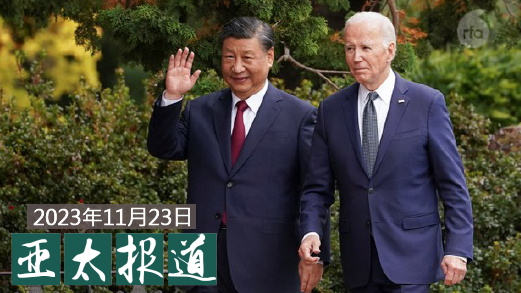
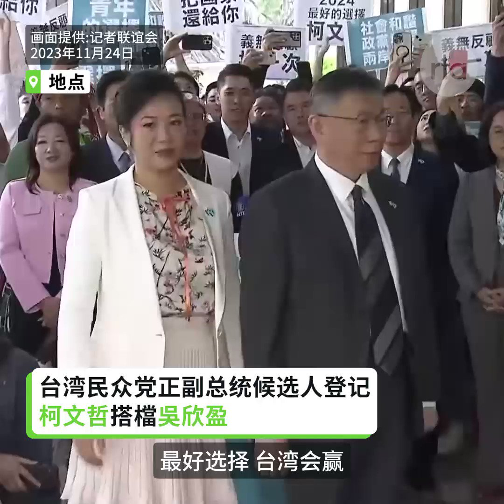
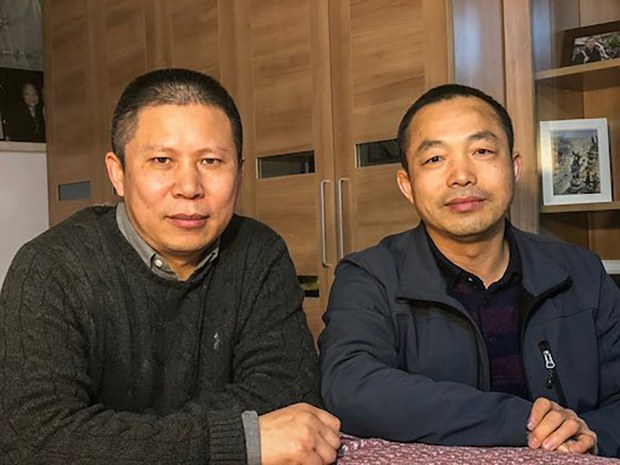

自由亚洲电台 北京时间 2023-11-24T10:53:23Z 1727883080227340524 欢迎收听和订阅播客【#亚太报道】 https://t.co/MjLNSvVMqc
《#人民日报》呼吁强化 #美中合作；首届 #国际供应链博览会 即将在京举行；一名 #新疆 哈萨克族伊玛目遭判刑；#台湾 “蓝百合”参选协商不欢而散；打击 #缅甸电诈 牵涉美中竞争 https://t.co/XdJCMqQVLa   自由亚洲电台 北京时间 2023-11-24T13:08:25Z 1727917063505949163 【柯文哲偕副手吴欣盈登记参选总统】
【柯文哲说蓝白协商场面是一场闹剧】
台湾民众党总统候选人柯文哲与副手、民众党立委吴欣盈24日赴中选会完成登记。柯文哲说，当执政党距离人民愈来愈远，身为在野势力领袖的他有责任挺身而出。他邀请台湾人民和他一起展开一场“属于我们的政治改革运动”。柯文哲说前一天的蓝白协商场面是一场“闹剧”，他为此抱歉，但也说对方来踢馆的态度并不健康。支持者喊口号:“最好选择，台湾会赢!”吴欣盈是新光集团第三代千金，被称为“新光公主”。
#柯文哲 #吴欣盈   自由亚洲电台 北京时间 2023-11-24T13:34:40Z 1727923669283037196 【许志永丁家喜获奖同日二审维持原判】
新公民运动发起人、中国知名法律学者 #许志永 和维权律师 #丁家喜 因颠覆国家政权罪成，分别被判14年和12年有期徒刑，他们的上诉案周五（11月24日）在山东省临沭县法院二审宣判，维持原判。https://t.co/9X1Qfkps75 https://t.co/SPXlljS1KR   自由亚洲电台 北京时间 2023-11-24T14:02:18Z 1727930621874610663 【国民党正副总统候选人登记】
【侯友宜搭档赵少康】
蓝白合破局，在柯文哲完成登记参选后，中国国民党正副总统候选人侯友宜和赵少康24日中午赴中选会登记。侯友宜说，不管如何国民党上下都是团结一条心，在登记前最后一刻，有再打电话给柯文哲，希望合作，可惜柯文哲没接电话。因此他会和赵少康并肩作战，赢得胜选。
#侯友宜 #赵少康 #侯康配   自由亚洲电台 北京时间 2023-11-24T10:43:30Z 1727880594603012373 加拿大华裔商人 #翁国宁 今年稍早访问中国，不仅获得中共领导人习近平的接见，还与新疆高级官员吐尼亚孜和马兴瑞等人会面。鉴于有新疆官员已被美国和加拿大列为制裁对象，#维吾尔团体 促请渥太华就此展开调查。 https://t.co/BpX9EgWokv   自由亚洲电台 北京时间 2023-11-24T10:44:01Z 1727880724735492328 专栏 | #绿色情报员：蚊子战争（下）登革热的暖化逆袭 https://t.co/buedM7N6Xx   自由亚洲电台 北京时间 2023-11-24T10:45:53Z 1727881191729377468 专栏 | #报导者时间：金马奖一甲子：华语电影的板块位移与台湾的新座标 https://t.co/kVek2cSWhl   自由亚洲电台 北京时间 2023-11-24T10:46:31Z 1727881351578489128 #中国 近期将举办首届 #国际供应链博览会 的消息，引发国际舆论关注。此举能否摆脱国际制裁，另创中国主导的供应链阵营呢？ https://t.co/3jAYi6MWis   自由亚洲电台 北京时间 2023-11-24T10:47:23Z 1727881570613412004 近日，#新疆 一位名叫库斯曼·热黑木的萨克族族穆斯林伊玛目因主持 #伊斯兰教婚礼 被法院判刑5年。被告人不服，就此提出上诉。 https://t.co/CTXXtwMXnm   自由亚洲电台 北京时间 2023-11-24T10:49:09Z 1727882016753094700 #台湾大选 日趋临近。11月24日，在野的国民党、民众党以及独立参选人郭台铭等在登记截止前一天举行三方会谈。三方各说各话，仍然没有达成参选共识。 https://t.co/5rub6lcrae   自由亚洲电台 北京时间 2023-11-24T10:49:57Z 1727882214615212350 据澎湃新闻网报道，中国北方儿童感染呼吸道疾病的高峰已致，一些儿科医院的医护人员已经24小时待命。 https://t.co/dBs1xC4OrD   自由亚洲电台 北京时间 2023-11-24T11:05:57Z 1727886241310691599 据法新社报道，香港的 #邹幸彤 与中国两位被囚禁的人权律师 #许志永 和 #丁家喜 近日获得欧洲律师协会委员会颁发的本年度 #人权 奖。 https://t.co/WCo0FnsrMM   自由亚洲电台 北京时间 2023-11-24T00:22:44Z 1727724369948848693 RT @RFA_Chinese: 【APEC峰会遭围殴的抗议者 #张开宇 遭遇了什么？】
APEC峰会日前落幕，多名反共抗议人士遭殴打。本台记者孙诚专访了其中伤势最为严重的张开宇，听他讲述了11月17日的遭遇。张开宇说他会追查下去，“我不能让美国再变成下一个中国。” https…   自由亚洲电台 北京时间 2023-11-24T00:23:06Z 1727724464702369948 RT @RFA_Chinese: #事实查核 | 朝鲜关闭了所有的外交机构吗？ https://t.co/r8EmaVWo4F   