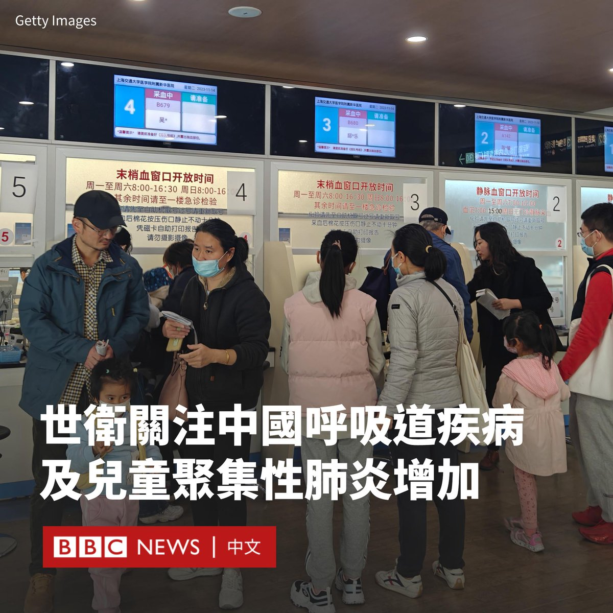
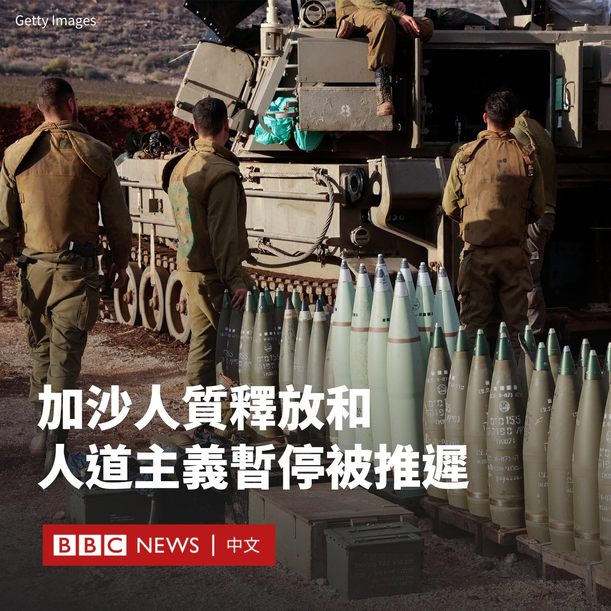

D英国广播公司BBC 北京时间 2023-11-23T13:42:07Z 1727563155579257219 世界卫生组织（WHO）周三（11月22日）表示，已要求中国提供更多有关该国呼吸道疾病和儿童肺炎聚集性病例增加的详细信息。

中国国家卫健委官员上周在新闻发布会上表示，中国呼吸道疾病进入高发季，要求地方当局加强疾病监测和防治。

中国官员还表示，尽管新冠病毒呈持续下降趋势，但冬季的多种呼吸道疾病出现了“交织叠加”。

“中国当局将这一增长归因于新冠疫情限制措施的解除以及已知病原体的传播，如流感、肺炎支原体（一种主要影响幼儿的常见细菌感染）、呼吸道合胞病毒（RSV）和SARS-CoV-2（导致新冠肺炎的病毒）。”

中国在新冠疫情爆发后采取了近三年的“清零”政策，以避免新冠病毒在该国大范围蔓延，去年12月当局解除了这些措施。

世卫组织表示，中国北部报告了未确诊的儿童肺炎病例，但尚不清楚这些病例是否与呼吸道感染有关。

世卫组织表示，其已要求中国提供流行病学和临床信息、病原体传播趋势和当前医疗保健系统负担的进一步信息。

世卫组织说，自10月中旬以来，中国北方通报类似流感疾病病例与过去三年同期相比出现增幅。中国已有系统搜集疾病发病率趋势信息，并将数据上传到全球流感监管和反应系统等平台上。

该组织还表示，它建议中国民众采取预防措施以降低患呼吸道疾病的风险，包括接种推荐的疫苗、生病时待在家中、佩戴口罩以及定期洗手。   D英国广播公司BBC 北京时间 2023-11-23T09:27:51Z 1727499167336219127 以色列一名高级官员表示，被哈马斯扣押在加沙的人质不会在周五（11月24日）之前获释。

“释放人质的谈判正在不断推进和继续。”以色列国家安全委员会主席查奇·哈内格比（Tzachi Hanegbi）表示。

此前，以色列和哈马斯据报已达成协议，以50名被扣押在加沙的人质换取为期四天的战斗暂停。

根据拟定的协议，以色列也将释放150名被关押在以色列监狱中的巴勒斯坦妇女和青少年。

战斗预计将于周四（11月23日）开始暂停，但一位以色列政府消息人士告诉BBC，这一计划也被推迟了。

以色列外交部长早些时候表示，他预计首批人质将于周四获释。

以色列继续在加沙进行地面和空中行动，总理内塔尼亚胡（Benjamin Netanyahu）誓言要对哈马斯取得“绝对胜利”。

自10月7日哈马斯武装分子越境袭击以色列，杀害约1200人，并劫持约240人后，以色列开始袭击加沙。

哈马斯管理的加沙卫生部表示，目前已有逾1.4万人在以色列的轰炸中丧生，其中包括5000多名儿童。   