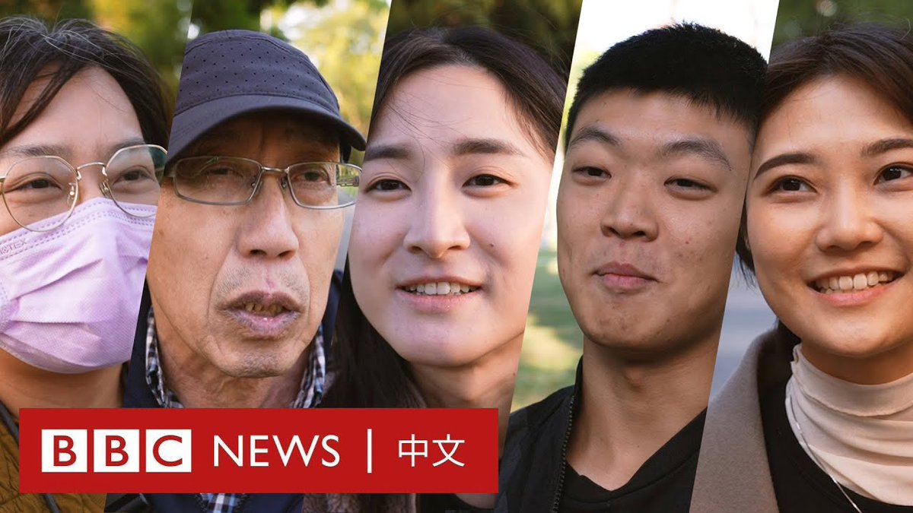
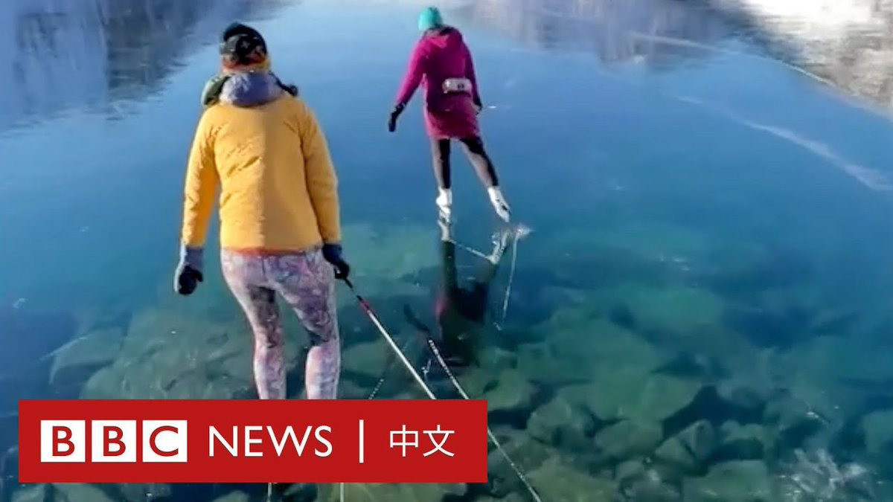
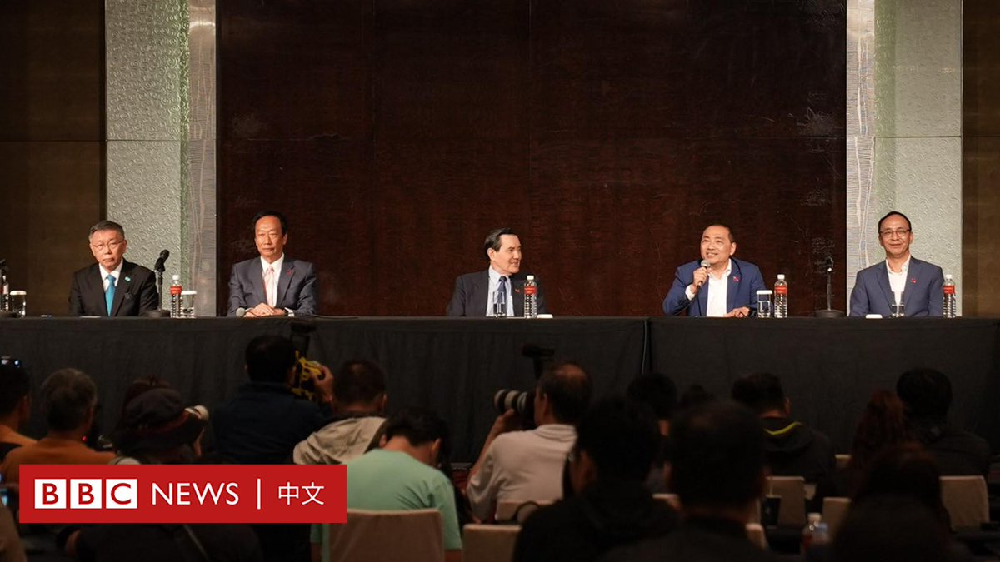
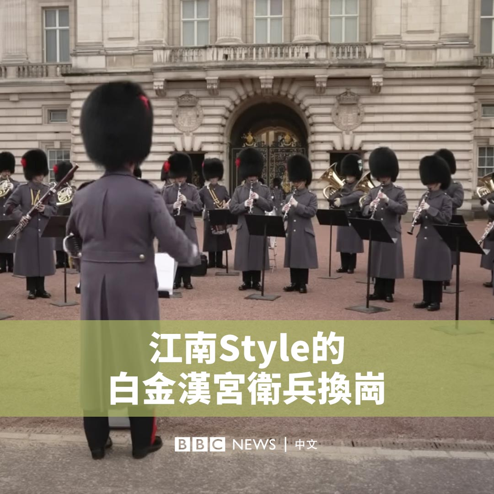

D英国广播公司BBC 北京时间 2023-11-23T20:47:22Z 1727670172041744872 即将获释的50名人质中，预计将分成四批、每批12人释放，他们是以色列国民或双重国籍者，而非外国人。https://t.co/uvvNDtn3Ob   D英国广播公司BBC 北京时间 2023-11-23T21:36:51Z 1727682628093190316 美国中情局（CIA）局长曾表示，有情报显示中国领导人习近平已指示中国军队“在2027年前”为“攻台”做好准备。但在习近平近期访美后，据报道有美国官员表示，习近平否认了有在2027年或2035年对台动武的计划。

2024台湾总统大选在即，BBC中文走访台北多地，询问民众对两岸是否可能爆发战争的看法。 https://t.co/RZ6d83J1Ch   D英国广播公司BBC 北京时间 2023-11-23T20:10:57Z 1727661009077440553 【最新消息】据台湾中央社报道，台湾反对党民众党总统参选人柯文哲、国民党总统参选人侯友宜与独立参选的鸿海集团创办人郭台铭在一场唇枪舌剑的谈判后，没有就在野阵营的合作达成任何共识，不欢而散。

周五（11月24日）是2024台湾大选总统与副总统候选人登记的最后期限，但目前仅有执政的民进党参选人、现任副总统赖清德和副手萧美琴完成登记。   D英国广播公司BBC 北京时间 2023-11-23T17:14:41Z 1727616647719227799 在美国阿拉斯加，湖水在严寒下完全冰封，如同透明的玻璃。有民众在湖面上溜冰，还能同时欣赏湖底下的绝美景色。 https://t.co/38ZUHs6H0e   D英国广播公司BBC 北京时间 2023-11-23T17:59:37Z 1727627958645653594 【最新消息】随着2024台湾总统大选登记即将截止，两个在野党国民党与民众党参选人侯友宜和柯文哲，以及独立参选的鸿海集团创办人郭台铭在台北一家饭店会面。

据台湾媒体报道，预计三方将就潜在的整合进行谈判。前总统马英九、国民党主席朱立伦也前往现场。

在拉锯数月后，国民党与民众党11月15日举行“蓝白合”协商会议，同意两党联合竞选以对抗执政的民进党，但在三天后，“蓝白合”因对正副总统的组合方案未达共识而陷入僵局。   D英国广播公司BBC 北京时间 2023-11-23T14:53:12Z 1727581045921657134 周三（11月22日），白金汉宫外的卫兵换岗仪式发生了意想不到的变化，军乐队改为演奏韩国流行乐。

为了致敬韩国总统的国事访问，军乐队演奏了Psy的《江南Style》（Gangnam Style）和“Blackpink”的《Ddu-Du Ddu-Du》的旋律，这让游客们惊讶不已。

在周二的国宴上，英国国王查尔斯三世点名了“Blackpink”和“防弹少年团”（BTS）等韩国音乐组合，并赞扬了韩国文化“引人入胜的魅力”。   D英国广播公司BBC 北京时间 2023-11-23T15:32:22Z 1727590899805245535 国际组织人权观察（Human Rights Watch）发布新报告指，中国政府在穆斯林聚居的省份以“并寺”为名，将部分清真寺关闭、拆除或改建为非宗教用途，许多清真寺还被除去圆顶、宣礼塔等结构。https://t.co/Rsu5h0QfJl   D英国广播公司BBC 北京时间 2023-11-23T13:42:07Z 1727563155579257219 世界卫生组织（WHO）周三（11月22日）表示，已要求中国提供更多有关该国呼吸道疾病和儿童肺炎聚集性病例增加的详细信息。

中国国家卫健委官员上周在新闻发布会上表示，中国呼吸道疾病进入高发季，要求地方当局加强疾病监测和防治。

中国官员还表示，尽管新冠病毒呈持续下降趋势，但冬季的多种呼吸道疾病出现了“交织叠加”。

“中国当局将这一增长归因于新冠疫情限制措施的解除以及已知病原体的传播，如流感、肺炎支原体（一种主要影响幼儿的常见细菌感染）、呼吸道合胞病毒（RSV）和SARS-CoV-2（导致新冠肺炎的病毒）。”

中国在新冠疫情爆发后采取了近三年的“清零”政策，以避免新冠病毒在该国大范围蔓延，去年12月当局解除了这些措施。

世卫组织表示，中国北部报告了未确诊的儿童肺炎病例，但尚不清楚这些病例是否与呼吸道感染有关。

世卫组织表示，其已要求中国提供流行病学和临床信息、病原体传播趋势和当前医疗保健系统负担的进一步信息。

世卫组织说，自10月中旬以来，中国北方通报类似流感疾病病例与过去三年同期相比出现增幅。中国已有系统搜集疾病发病率趋势信息，并将数据上传到全球流感监管和反应系统等平台上。

该组织还表示，它建议中国民众采取预防措施以降低患呼吸道疾病的风险，包括接种推荐的疫苗、生病时待在家中、佩戴口罩以及定期洗手。   D英国广播公司BBC 北京时间 2023-11-23T09:27:51Z 1727499167336219127 以色列一名高级官员表示，被哈马斯扣押在加沙的人质不会在周五（11月24日）之前获释。

“释放人质的谈判正在不断推进和继续。”以色列国家安全委员会主席查奇·哈内格比（Tzachi Hanegbi）表示。

此前，以色列和哈马斯据报已达成协议，以50名被扣押在加沙的人质换取为期四天的战斗暂停。

根据拟定的协议，以色列也将释放150名被关押在以色列监狱中的巴勒斯坦妇女和青少年。

战斗预计将于周四（11月23日）开始暂停，但一位以色列政府消息人士告诉BBC，这一计划也被推迟了。

以色列外交部长早些时候表示，他预计首批人质将于周四获释。

以色列继续在加沙进行地面和空中行动，总理内塔尼亚胡（Benjamin Netanyahu）誓言要对哈马斯取得“绝对胜利”。

自10月7日哈马斯武装分子越境袭击以色列，杀害约1200人，并劫持约240人后，以色列开始袭击加沙。

哈马斯管理的加沙卫生部表示，目前已有逾1.4万人在以色列的轰炸中丧生，其中包括5000多名儿童。   