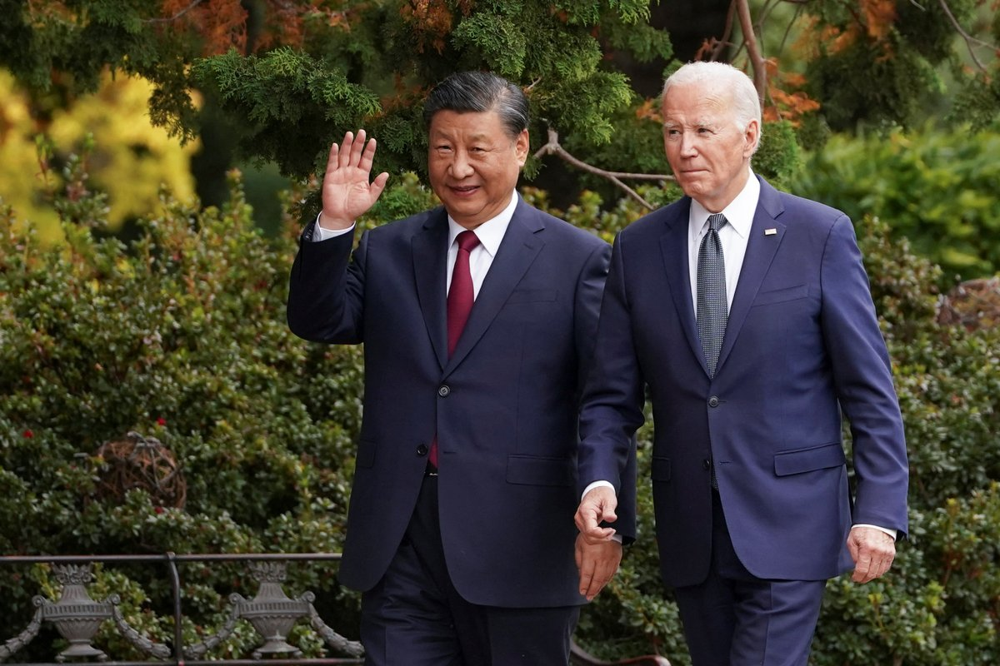
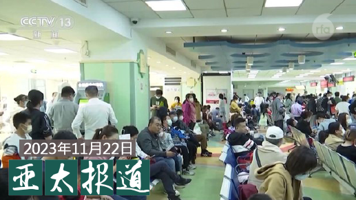

自由亚洲电台 北京时间 2023-11-23T15:10:01Z 1727585275600326712 【人民日报评论员连续发文促中美合作】
【各机构拆除限制特斯拉标志】
近期，《人民日报》连续发表多篇评论员文章，要与美国进行包括经贸、农业等传统领域，也包括气候变化、人工智能等新兴领域合作，加强双边关系。网民发现各大政府机构上周已拆除限制特斯拉入内的标志，但实际控制并未放松。详细报道：https://t.co/CqpYrML84X   自由亚洲电台 北京时间 2023-11-23T12:18:59Z 1727542235338604598 RT @RFA_Chinese: 近年来让不少中国民众损失惨重的 #缅甸北部电诈集团 近几周受到当地警方的严厉打压。上周末，电诈集团之一的 #明氏家族 三人被捕、一人自杀；本周中国媒体又报道，截至目前有3.1万名电诈嫌疑人被缅方移交给了中方。明氏这样的电诈家族是如何在缅北崛起的…   自由亚洲电台 北京时间 2023-11-23T12:19:13Z 1727542292154622021 RT @RFA_Chinese: 欢迎收听和订阅播客【#亚太报道】 https://t.co/MjLNSvVMqc
中国 #支原体肺炎 大爆发 #北京 #天津 医院要日夜排队
#人权团体 揭中国在全球组领事志愿者 进行长臂管辖
#阿根廷 一夜变天，中阿关系何去何从？
家属披露监…   自由亚洲电台 北京时间 2023-11-23T06:18:27Z 1727451504833929626 近年来让不少中国民众损失惨重的 #缅甸北部电诈集团 近几周受到当地警方的严厉打压。上周末，电诈集团之一的 #明氏家族 三人被捕、一人自杀；本周中国媒体又报道，截至目前有3.1万名电诈嫌疑人被缅方移交给了中方。明氏这样的电诈家族是如何在缅北崛起的？打击电诈背后牵涉的 #缅甸 复杂政治局势中，#中国 政府又充当了什么角色？https://t.co/OFFnz1kFlv   自由亚洲电台 北京时间 2023-11-23T03:43:49Z 1727412587028230324 最近阿根廷极右翼的米莱当选新的总统，在国际社会引发密切关注。中国是阿根廷的第二大贸易伙伴，而即将上台的阿根廷新政府却暗示可能与中国政府停止往来。 https://t.co/PGHUBIgPsS   自由亚洲电台 北京时间 2023-11-23T05:13:16Z 1727435099166417046 本周三，七国集团（G7）外长以及欧盟高级代表共同发表声明，谴责 #朝鲜 在11月21日的 #导弹 发射行动。声明指出，朝鲜的行为严重威胁了印太地区的和平稳定，任何的导弹发射，就算是发射军事侦察卫星，都算是违反联合国安理会的决议。 https://t.co/YQ3CvH1TwO   自由亚洲电台 北京时间 2023-11-23T05:13:46Z 1727435225901490540 专栏 | #周末茶馆：关于中国妇女代表大会，不同的声音怎样说 https://t.co/YUKBzMR6sS   自由亚洲电台 北京时间 2023-11-23T05:50:43Z 1727444524337869149 欢迎收听和订阅播客【#亚太报道】 https://t.co/MjLNSvVMqc
中国 #支原体肺炎 大爆发 #北京 #天津 医院要日夜排队
#人权团体 揭中国在全球组领事志愿者 进行长臂管辖
#阿根廷 一夜变天，中阿关系何去何从？
家属披露监狱情况后 #王藏 被剥夺探视通讯权利
广东省推 #粤港澳居民统一身份认证 https://t.co/Qtrgd4P7dq   自由亚洲电台 北京时间 2023-11-23T05:51:22Z 1727444685868986462 据财新网22日报道，数据显示，中国赴美留学生连续4年出现下降，过去一年，中国赴美留学生为28.9万人，占留学生总数的27%，相比去年降低了0.2%。 https://t.co/OUPOoiBJ7x   自由亚洲电台 北京时间 2023-11-23T03:40:10Z 1727411671529124008 专栏 | #军事无禁区：2027、2035没有攻台计划－看习近平的真实想法 https://t.co/Rw5P5IuExn   自由亚洲电台 北京时间 2023-11-23T03:44:31Z 1727412764636000415 国际非政府人权组织“#人权观察”（Human Rights Watch）22日发布最新报告指出，中国正在大幅减少宁夏和甘肃的清真寺，这两个省分是仅次于新疆后，居住最多穆斯林的地方，而这样的作法明显侵害了宗教自由。 https://t.co/R5eF6rE0FY   自由亚洲电台 北京时间 2023-11-23T03:46:16Z 1727413203620270162 #事实查核 | 朝鲜关闭了所有的外交机构吗？ https://t.co/r8EmaVWo4F   自由亚洲电台 北京时间 2023-11-23T02:11:23Z 1727389325179195863 #评论 | #程晓农：#习近平访美 学到了什么？ https://t.co/FShLNnFibA   自由亚洲电台 北京时间 2023-11-23T00:13:21Z 1727359620858143102 据台湾中央社22日报道，本周三，日本海上保安厅协助菲律宾海岸防卫队开展了海上演练，目的在于应对中国在南海越来越具侵略性的行为，协助菲律宾增进海上防务能力。 https://t.co/jEiuLBAyxS   自由亚洲电台 北京时间 2023-11-23T00:25:06Z 1727362581017637361 RT @RFA_Chinese: 【APEC峰会遭围殴的抗议者 #张开宇 遭遇了什么？】
APEC峰会日前落幕，多名反共抗议人士遭殴打。本台记者孙诚专访了其中伤势最为严重的张开宇，听他讲述了11月17日的遭遇。张开宇说他会追查下去，“我不能让美国再变成下一个中国。” https…   