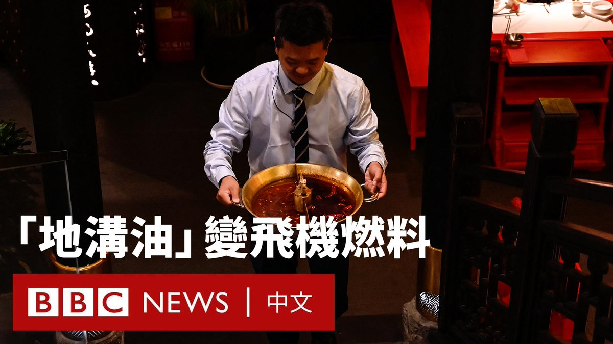
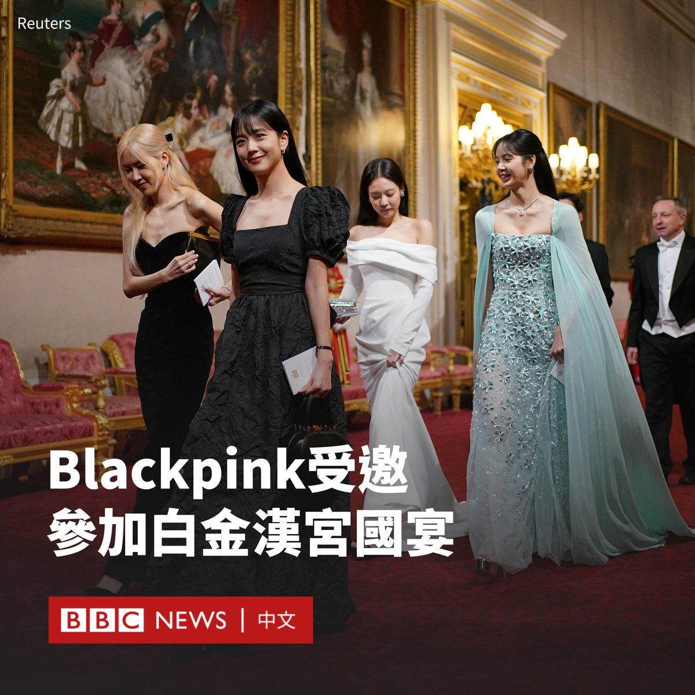
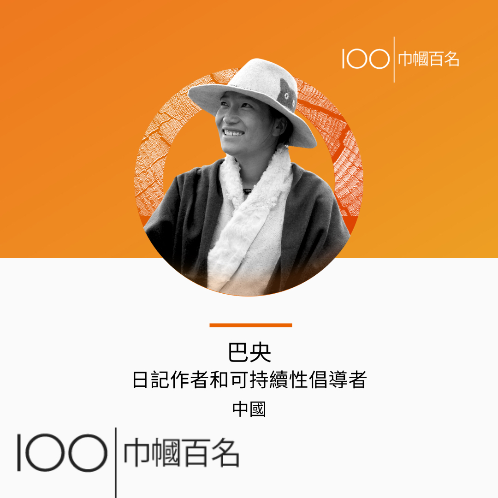
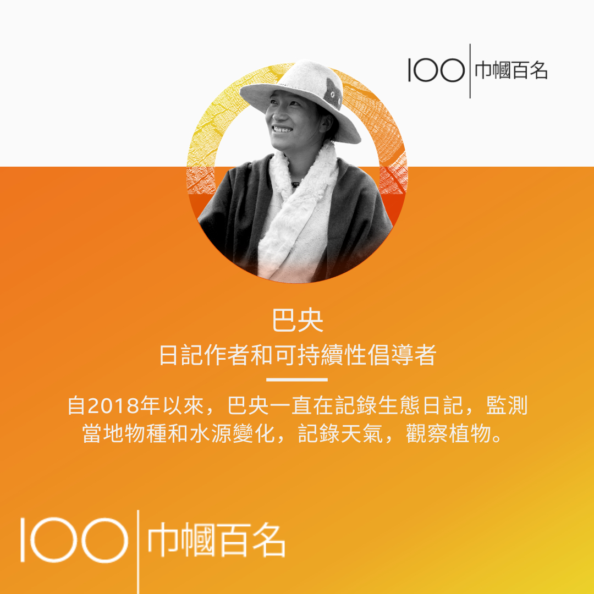
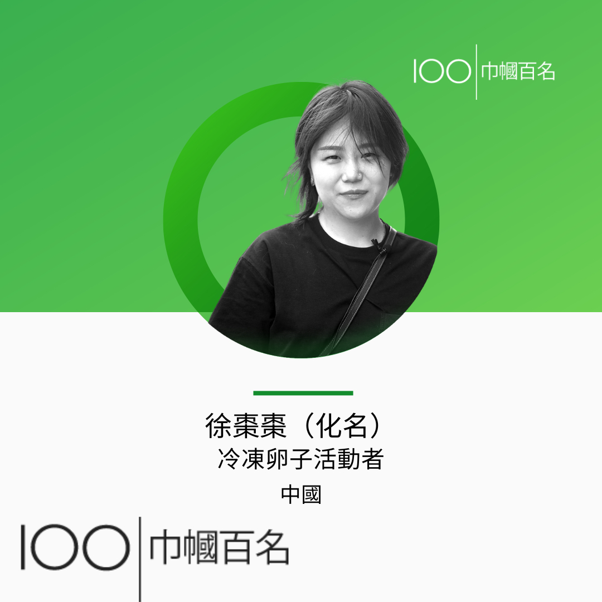
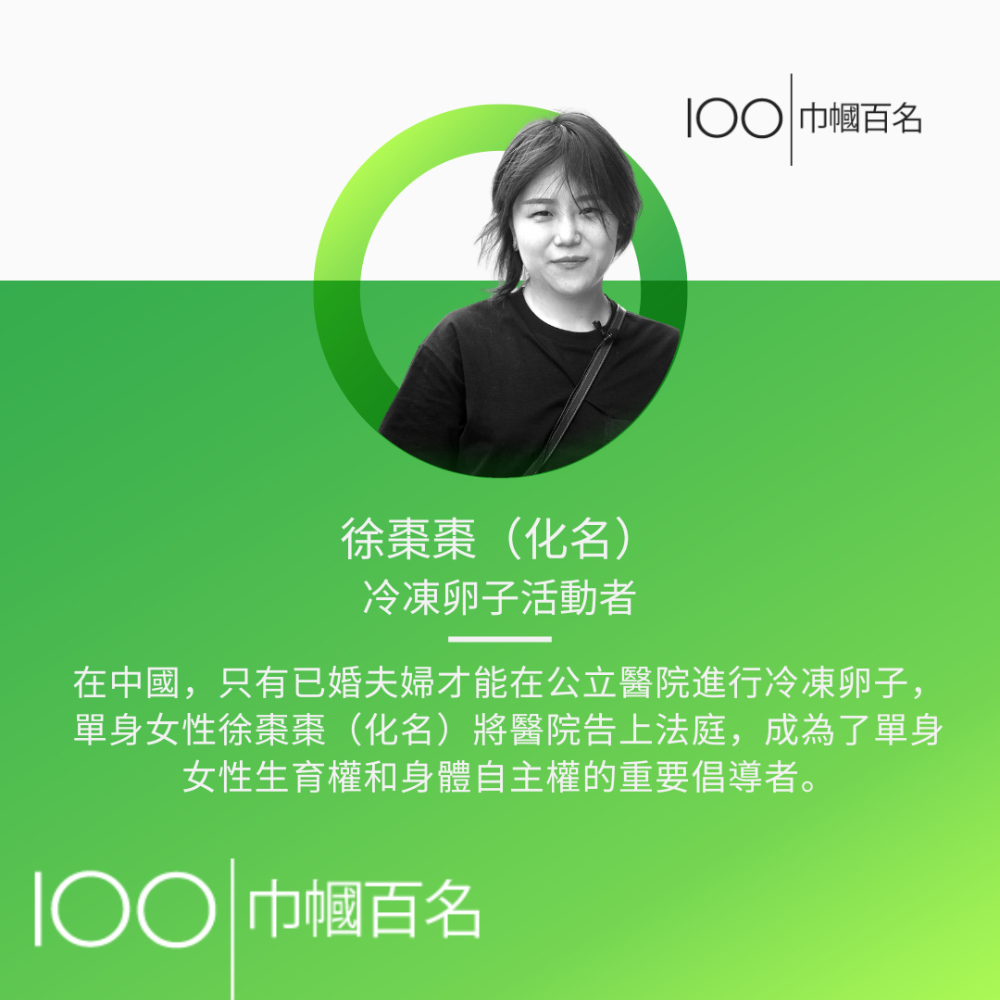
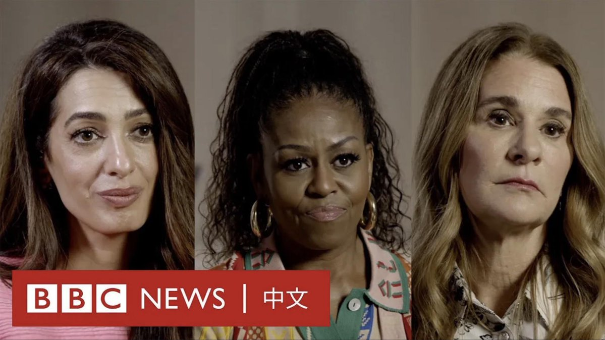

D英国广播公司BBC 北京时间 2023-11-22T16:44:22Z 1727246631559700595 火锅是许多中国人热爱的美食，但处理人们吃剩的大量火锅汤油曾一直是个难题。

但现在，这些废油已不再是垃圾，而在空中获得第二次生命，成为喷气式飞机的燃料。 https://t.co/Na1xEjYrse   D英国广播公司BBC 北京时间 2023-11-22T18:01:01Z 1727265920089993300 韩国流行音乐组合“Blackpink”罕见成为白金汉宫的座上客，并受到英国国王查尔斯三世（Charles III）的欢迎。

查尔斯周二（11月21日）为到访的韩国总统尹锡悦及夫人举行国宴，其间特别提及“Blackpink”和“防弹少年团”（BTS）。

他在致辞中赞扬了韩国文化“引人入胜的魅力”。不过，他也调侃自己并不太懂“江南Style”。

详细报导：https://t.co/EIpzvEDgEa   D英国广播公司BBC 北京时间 2023-11-22T13:35:48Z 1727199176205979775 2023年BBC全球最具启发性和影响力的100位女性名单揭晓，其中包括日记作者和可持续性倡导者巴央（Bayang），她生活在中国青海省，坚持记录生态日记，监测当地物种和水源变化。她还习得制作环保产品的技能，以保护当地水源并激励其他人加入环保事业。

冷冻卵子活动者徐枣枣（化名）亦是名单上其中一员，她试图通过法律战斗，为未婚女性争取冷冻卵子的权利。

BBC“巾帼百名”2023名单：https://t.co/j7WiDwn8ni   D英国广播公司BBC 北京时间 2023-11-22T12:03:01Z 1727175826959917278 这个世界将如何停止对加剧气候变化的石油的依赖？答案就在你的口袋里。

手机中使用的镍、锂和钴等关键矿物在应对气候变迁方面发挥着重要作用。太阳能电池板、电动车和风力涡轮机都需要这些元素。 因此，这些矿物质对各国履行气候承诺至关重要。https://t.co/7tWJTCxfw5   D英国广播公司BBC 北京时间 2023-11-22T08:59:59Z 1727129766237819136 前美国第一夫人米歇尔·奥巴马（Michelle Obama）、人权律师阿玛尔·克鲁尼（Amal Clooney）和慈善家梅琳达·弗伦奇·盖茨（Melinda French Gates）正在致力于解决世界上依然存在的童婚问题。

她们在对BBC“巾帼百名”（100 Women）栏目的采访中表示，如果各国领导人将童婚问题列入优先事项并做出努力，其在“不到一代人的时间内”就能获得解决。   