自由亚洲电台 北京时间 2023-11-22T05:07:27Z 1727071248256237633 #事实查核｜这些照片是“#APEC 结束、#习近平 刚离开的 #旧金山”？ https://t.co/XOzaVvADIf 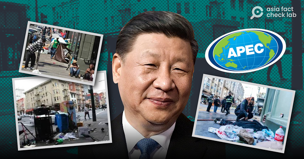  自由亚洲电台 北京时间 2023-11-22T05:45:28Z 1727080812871643488 在中国领导人 #习近平 乘飞机离开 #旧金山 回国的11月17日，有大批欢送者和抗议者在旧金山机场外展开对峙，#张开宇、李德龙、周伯 三人于下午一时许提前离场，在前往停车场的路上遭遇了一些身戴红布、头戴红帽的男子的围殴...
https://t.co/avpELSVCLO https://t.co/AY0oo7s8WF 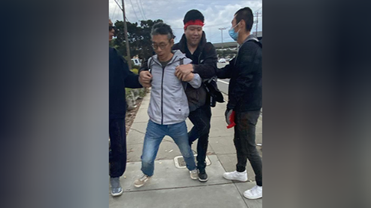  自由亚洲电台 北京时间 2023-11-22T06:00:09Z 1727084510683316341 2023年 #亚太经合组织峰会（#APEC）近日在美国 #旧金山 落幕。外界关注，来自二十一个亚太国家的政商界领袖究竟达成了哪些共识？而面对地缘政治紧张，各国在发展经济的同时又要如何应对分歧呢？

https://t.co/Pf3WPUcBFR https://t.co/Zmvt14xjGA 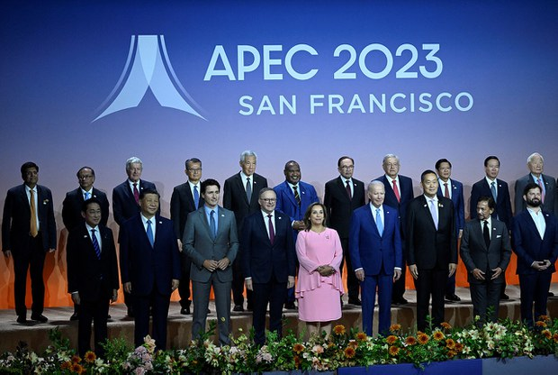  自由亚洲电台 北京时间 2023-11-22T06:30:01Z 1727092027375091877 尽管北京在努力提振外界对中国经济的信心，但据报道，今年前七个月流入中国股市的外资，已有四分之三以上撤离，全球投资者已抛售了价值超过 250 亿美元的中国股票 。

https://t.co/hRZrFqLiSI https://t.co/bYMKa40AX0 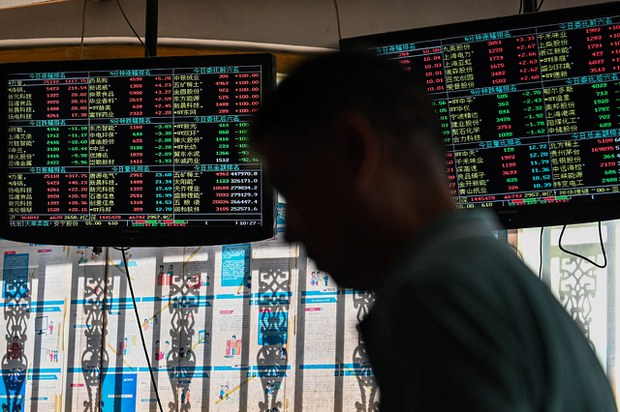  自由亚洲电台 北京时间 2023-11-22T07:30:02Z 1727107128455012392 专栏 | #中国透视：重整旗鼓七旬后 — "联合国军"七十年后聚会首尔
https://t.co/9q9s6RRNAA https://t.co/6C2LKrAoZV 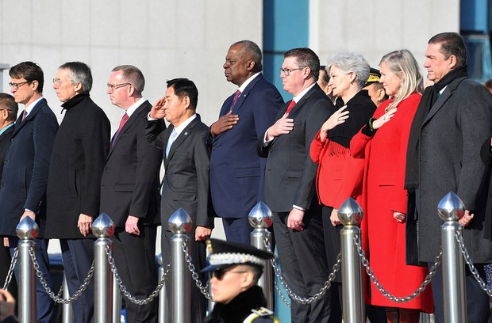  自由亚洲电台 北京时间 2023-11-22T08:00:09Z 1727114709940498683 欢迎收听和订阅播客【＃亚太报道】 https://t.co/MjLNSvVMqc
(2023-11-21)
南京异议人士 #孙林 死因持续发酵；人权律师 #唐吉田 遭羁押失联；年轻人为何不愿结婚？；一份救房企“白名单”曝光；#赖清德 与 #萧美琴 率先台湾大选登记 https://t.co/45PQpHuPAh 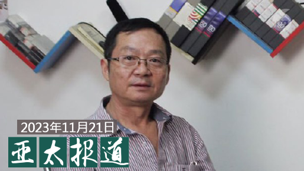  自由亚洲电台 北京时间 2023-11-22T08:30:02Z 1727122229266395331 评论 | #陈光诚：#APEC 会议中共的迅速反应透露出了什么？
https://t.co/kLPXNGxzpn https://t.co/u3Eb3j4GJz 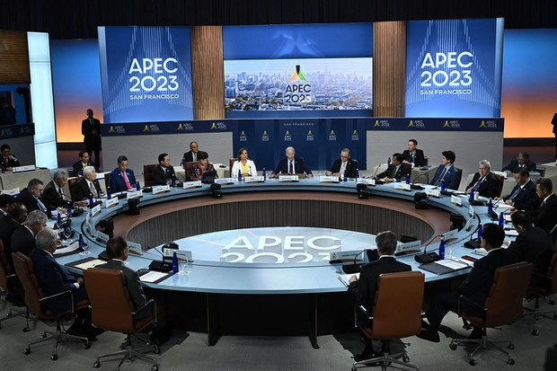  自由亚洲电台 北京时间 2023-11-22T04:52:03Z 1727067370378993822 中国国家统计局近日发布相关人口数据显示，截至去年，#中国初婚人数 已连续第九年下降，相比2013年甚至减少了大约一半。而在全国三十一个省份中，仅有约三分之一地区的新出生人数多于死亡人数。#中国人口结构 如此异动的症结何在？

https://t.co/650bHGHdLM https://t.co/yWMUu1RPVU   自由亚洲电台 北京时间 2023-11-22T05:17:45Z 1727073840944275605 面对房企频频爆雷引发的金融危机担忧， 中国官媒日前披露，国务院总理 #李强 已接掌中共 #中央金融委员会 主任一职。此外，一份据称涉及五十家有资格获得融资的房企"白名单"也被外界曝光。

https://t.co/ZQ7IapVwYj https://t.co/rbhqv8uzZj 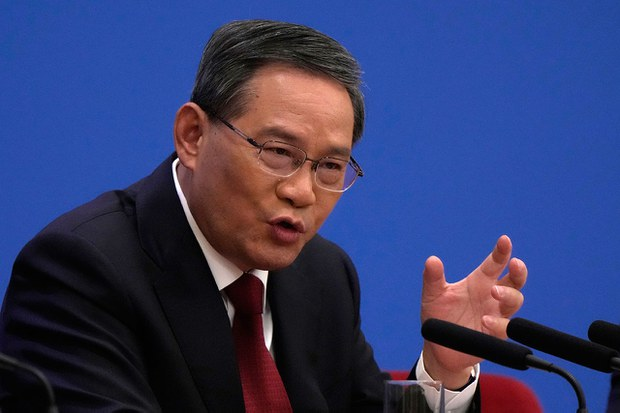  自由亚洲电台 北京时间 2023-11-22T06:11:11Z 1727087285827731495 本周二（21日）公布的一项调查显示，由于经济放缓、竞争加剧以及地缘政治局势紧张，导致计划在中国扩张的日本企业数量首次降至不到 30%。
https://t.co/AlSPkxZ4HB https://t.co/I1zRwqjcPG 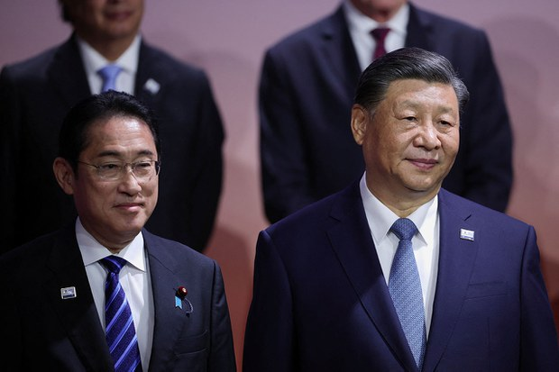  自由亚洲电台 北京时间 2023-11-22T06:15:29Z 1727088367370985728 评论 | #易富贤：从全球人口大变局下看 #习近平访美
https://t.co/L7ZpiCKCqa https://t.co/t46DZlg1L3 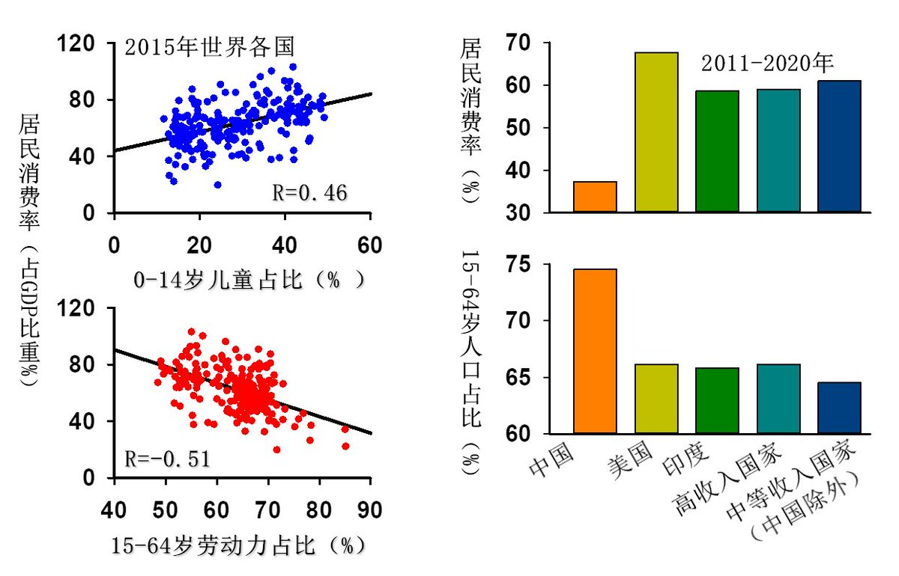  自由亚洲电台 北京时间 2023-11-22T02:30:13Z 1727031680354120064 #澳大利亚 当局日前表示，一艘澳大利亚护卫舰遭到一艘中国驱逐舰靠近并且使用 #声纳脉冲, 造成澳方一名潜水员受伤。
对此, 北京当局指澳方说法与事实不符。
该事件已让澳、中关系埋下变数。
https://t.co/AZtc1K5hjN https://t.co/Gm4T1fIb1w   自由亚洲电台 北京时间 2023-11-22T03:38:52Z 1727048953970163994 #加拿大 和 #台湾 关系多方面发展，上个月双方宣布完成"#投资促进及保障协定"（FIPA）谈判。本周一两国外交国防官员会面，共同就台海局势进行交流。
https://t.co/hPFSj8tSMU https://t.co/x7G3ZJit5B   自由亚洲电台 北京时间 2023-11-22T00:57:12Z 1727008270874018146 ＃北京地铁亏损 加剧，网民担心票价调涨，同时也质疑为何要花如此高成本做 ＃安检。
李法天：“你想想一个口光安检员至少有六名机器，还有可能经常需要维护的，一个站有好几个口，那北京的地铁有多少个站呢？所以这个费用是相当的庞大。” https://t.co/qekLs0jxDF 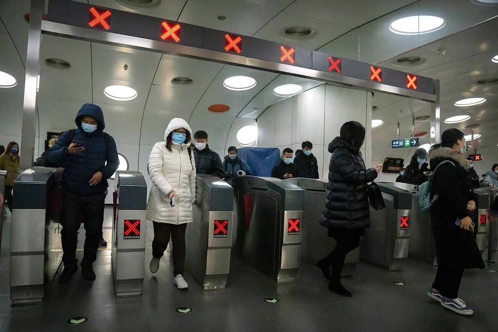  自由亚洲电台 北京时间 2023-11-22T01:28:25Z 1727016127837200715 台湾2024大选登记起跑，由民进党籍候选人 ＃赖清德、 ＃萧美琴 组成的"＃赖萧配"率先完成登记。赖清德表示，台湾人民不会走回亲中老路，他将持续在国际社会"上架台湾"。国民党总统参选人侯友宜则召开记者会强调，"＃蓝白合"只剩最后一里路。 https://t.co/onvB3aK6Ly   自由亚洲电台 北京时间 2023-11-22T00:18:31Z 1726998535139422421 曾被长期羁押，今年年初才获释的人权律师 ＃唐吉田 近期再度与外界失联。消息人士透露，目前唐吉田身处吉林延边一所宾馆，被公安严密监控。外界促请当局尽快放行唐吉田，让他到日本照顾病重的女儿。
https://t.co/re0mB25Ui6 https://t.co/JN7Qh1VwsT 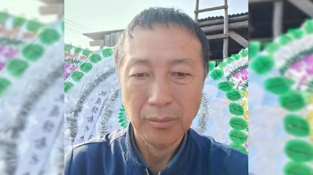  